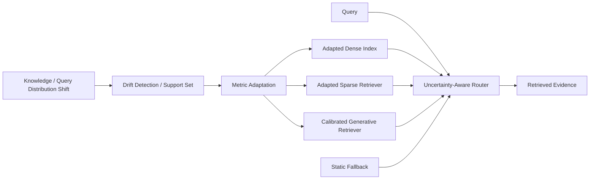

# AURORA: Neuro-Symbolic Continual Indexing for Evolving RAG Systems

## 一話摘要 (TL;DR)
AURORA 直接研究 **RAG index 在 knowledge / terminology distribution shift 下如何持續適應，而不必每次 full re-index**。方法把離散 index topology 與可調整的 metric representation 分離，對 dense / sparse / generative retrieval 做 lightweight adaptation，再用 uncertainty-aware router 在 adapted index 與 static fallback 間選擇。

## 研究背景與問題定義 (Problem Statement)

靜態 RAG 通常預設 index 建好後，query/document distribution 不會大幅漂移；但新增知識、新術語或 embedding-space shift 可能讓既有 index 的 quantization / metric alignment 失效。全文 Figure 1 的 stress test 顯示 static index 在 OOD queries 下 Recall@10 從 99.5% 降到 73.0%。論文因此把 **index maintenance under distribution shift** 定義成 few-shot continual learning problem。

## 核心方法與技術架構 (Methodology & Architecture)

AURORA 將 continual indexing 拆成兩個正交問題：

1. **Metric Adaptation**：保留離散 index topology / document IDs，更新較輕量的 metric-side parameters。
2. **Contextual Arbitration**：根據 query entropy、lexical rarity、generation confidence 等 uncertainty features，在 dense、SPLADE、DSI 與 static fallback 間 routing。

Dense branch 中，HNSW graph topology 保持固定；distribution shift 發生後只更新 neural codebook / residual quantizer，候選仍由原 graph 產生，再以 adapted metric rescoring。Sparse branch 以 LoRA 對 SPLADE 做 targeted lexical adaptation；generative branch 則使用 confidence-aware fallback 避免 DSI 在 tail queries 上失效。

## 主要實驗結果與證據 (Empirical Results & Evidence)

- **Figure 1, Page 1**：SIFT1M controlled shift 中 static retrieval 的 Recall@10 由約 **99.5% 降至 73.0%**，用來展示 distribution shift 對 static index 的影響。
- **Table 1, Page 2**：論文報告 adaptation time 為 **AURORA 28 ms vs full retraining 5149 ms**。
- **Abstract / main results**：跨 dense、SPLADE 與 DSI 設定，AURORA 在 novel topics 上相對 static baselines 最多恢復 **+26.9% Recall@10**。
- **Page 5 experimental setup**：使用 AG News / SQuAD 的 semantic drift、NFCorpus 的 controlled lexical drift，以及 SIFT1M 的 reliability stress test。

上述數字只屬論文的 controlled drift protocols；作者自己明確指出這些 stress tests **不是自然語言真實演化的完整模擬**。

## 優勢、限制及 Trade-offs (Strengths, Limitations & Trade-offs)

- **優勢**：不必每次 O(N) full rebuild；將 index topology 與 metric adaptation 分開，直接命中 D10 的 maintenance 問題。
- **適用邊界**：主要處理 semantic / lexical distribution shift 與 retrieval adaptation；不是完整的 source-level CRUD、document deletion propagation、graph-summary invalidation 系統。
- **Router complexity**：加入 uncertainty-aware multi-retriever routing，會增加系統狀態與 calibration requirements。
- **外部效度**：controlled synthetic / benchmark drift 能隔離機制，但 production knowledge evolution 還需要更真實的 update stream 評估。

## 對本專案研究領域的實際意義 (Implications for Research Domains)

- **D10 primary**：這是目前 repo 最直接的 continual index maintenance anchor。
- **D04 secondary**：涉及 index topology / codebook / representation adaptation。
- **D05 secondary**：router 在 query time 選擇 retrieval modality。
- **A05 adjacent**：方法借用 few-shot continual learning / meta-learning，但研究目標仍是 RAG index，而不是 parametric model editing。

## 原始來源及相關筆記連結 (Sources & Related Notes)

- **ACL Anthology**：https://aclanthology.org/2026.findings-acl.495/
- **官方 PDF**：https://aclanthology.org/2026.findings-acl.495.pdf
- **本地 PDF**：目前未存，使用 ACL Anthology 官方全文。
- **相關領域**：[[02 - 研究領域專題 (Research Domains)/Domain 10 - Dynamic Knowledge & Index Maintenance|D10 Dynamic Knowledge & Index Maintenance]]、[[02 - 研究領域專題 (Research Domains)/Domain 04 - Knowledge Representation & Indexing|D04 Knowledge Representation & Indexing]]
