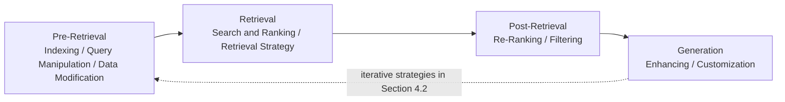

# A Survey on Retrieval-Augmented Text Generation for Large Language Models

> [!IMPORTANT] 已核版本與正式書目分開記錄
> **本筆記正文與本地 PDF 均基於 2024-08-23 的 arXiv v2，37 頁；2026 期刊全文尚未取得與比對。** `verified` 僅表示已核對上述 v2 全文及正式出版書目，不表示已讀正式版。正式書目為 ACM Computing Surveys 58(12), Article 300, pp. 1–38（2026），DOI `10.1145/3805774`；Crossref 登錄 online publication 2026-05-15、issue publication 2026-09-30。檔名採正式出版年月，**不代表內附 PDF 是期刊版**。
>
> 作者完整姓名採正式 Crossref 登錄：Yizheng Huang、Jimmy Xiangji Huang；v2 PDF 使用 Yizheng Huang、Jimmy X. Huang。v2 標題為 *The Survey of Retrieval-Augmented Text Generation in Large Language Models*，YAML `title` 採正式出版標題。v2 的 2018／XXXXXXX ACM 模板占位內容不能作出版證據。下文頁碼均指本地 v2 的 PDF 頁碼。[arXiv 版本紀錄](https://arxiv.org/abs/2404.10981)；[正式書目登錄](https://api.crossref.org/works/10.1145/3805774)。

## 1. 一話摘要 (TL;DR)

這篇以資訊檢索視角，將文字 RAG 整理為 Pre-Retrieval、Retrieval、Post-Retrieval、Generation 四階段，可作 broad survey anchor；與本 repo D01–D14 的對照是本專案的分析，並非作者原始 taxonomy。

## 2. 研究背景與問題定義 (Problem Statement)

作者希望統整 RAG 中分散的方法與命名，說明如何利用外部資訊補充模型知識，並整理檢索與生成的互動、評估及未來方向（v2 §1，pp. 1–3）。它是一份方法綜述，而非提出統一控制器並驗證其效果的 method paper。

本筆記的研究問題是：這個較粗的流程分類，如何支撐 repo 的細分研究問題，同時保留沒有被此 survey 充分整理的空缺？

## 3. 核心方法與技術架構 (Methodology & Architecture)

### 3.1 作者的分類與實際章節

四階段定義位於 v2 §2.2（pp. 4–5），**taxonomy tree 是 Figure 3（p. 6）**；Figure 1（p. 2）為使用例子，Figure 2（p. 3）為基本 workflow。

| 階段 | 原文主要章節 | 原文子題 |
|---|---|---|
| Pre-Retrieval | §3.1 Indexing；§3.2 Query Manipulation；§3.3 Data Modification | Graph / Product Quantization / Locality-sensitive Hashing；Query Expansion / Query Reformulation / Prompt-based Rewriting；Internal Data Augmentation / External Data Enrichment |
| Retrieval | §4.1 Search & Ranking；§4.2 Retrieval Strategy | Basic / Iterative / Recursive / Conditional / Adaptive Retrieval Strategy |
| Post-Retrieval | §5.1 Re-Ranking；§5.2 Filtering | Unsupervised / Supervised / Data Augmentation for Re-ranking；Filtering |
| Generation | §6.1 Enhancing；§6.2 Customization | Enhance with Query / Ensemble / Feedback；Customization |

以上定位核自 v2 pp. 6–19；各方法細節仍需回到原始 method paper。Embedding fine-tuning／retriever alignment 可作跨階段分析標籤，不應冒充這篇的正式 section 名稱。

### 3.2 簡化流程圖

下圖依作者四階段與 §4.2 的迭代討論重繪，**不是 Figure 3 的逐節點複製，也不是作者提出的新系統**。

**圖中節點對照**：

- `PRE`、`RET`、`POST`：[[00 - 導覽與心智圖 (Navigation & MOC)/Survey Papers Index|Survey Papers Index 的 Huang 章節與 D01–D06 對照]]。
- `GEN`：[[02 - 研究領域專題 (Research Domains)/Domain 09 - Grounded Generation Attribution & Long-form Synthesis|D09 Grounded Generation & Long-form Synthesis]]。

## 4. 主要實驗結果與證據 (Empirical Results & Evidence)

這篇是 survey，不應把其轉載的不同論文結果寫成同一實驗的技術排名。v2 中可追溯的證據定位如下：

| 證據 | v2 位置 | 可使用的範圍 |
|---|---|---|
| 評估框架對照 | Table 1，p. 20；§7，pp. 20–21 | 作為評估工件與研究問題的導覽；框架、資料集、指標分別管理 |
| 文獻與模型組件整理 | Table 2，p. 22；Table 3，p. 23 | 作為查找 primary paper 的入口 |
| MIRAGE 的條件化結果摘錄 | Table 4，p. 24 | 需連同其 corpus、retriever、generator 與任務條件回查原文 |
| eRAG／BERGEN 的實驗圖摘錄 | Figure 5，p. 25 | 已註明出自其他工作，不能當作本 survey 的獨立重現 |

**本筆記不轉錄未逐一回查 primary paper 的 benchmark 分數、模型尺寸、context 長度或硬體數字。** 相關效果核驗待驗證；§9 的研究建議也不構成經驗效果證明。空的 `benchmark_ids`／`dataset_ids`／`metrics` 表示尚未建立逐項核對的機讀清單，不表示原文沒有討論評測。

## 5. 優勢、限制及 Trade-offs (Strengths, Limitations & Trade-offs)

- **整理價值**：用少量流程階段提供閱讀入口，便於追蹤 query、retrieval、reranking 與 generation 的不同貢獻。
- **分類粒度的代價（本 repo 判斷）**：Pre-Retrieval 同時含 corpus 側與 query 側；Post-Retrieval 同時含 ranking 與 context 選擇。若把階段直接當成問題分類，就會把不同失效來源合併。
- **控制訊號的邊界（本 repo 判斷）**：Conditional／Adaptive retrieval 支撐 retrieval control 的存在，但 confidence／relevance 觸發不等於顯式驗證一整組 evidence 是否充分。
- **索引圖的邊界**：§3.1 的 Graph 主要討論向量鄰接／ANN 索引；它不能單獨支撐 semantic knowledge graph extraction 或 GraphRAG 的完整方法論。
- **版本限制**：只能對已核的 2024 v2 內容作上述判讀。正式版章節、增刪文獻與結果是否改變，仍待全文比對；不能將此 note 宣稱為 2026 全文 survey review。

## 6. 對本專案研究領域的實際意義 (Implications for Research Domains)

本篇使用 `taxonomy_home: CROSS`、`primary_domain: null`：它跨多個研究問題，而非單一 method 的 primary-domain 判定。`secondary_domains` 是本 repo 的導航關聯。

**唯一集中維護的 coverage 對照表**見 [[00 - 導覽與心智圖 (Navigation & MOC)/Survey Papers Index|Survey Papers Index]]。重點邊界是：query manipulation 和 relevance reranking 都可屬 D05，即使作者把前者放 Pre-Retrieval、後者放 Post-Retrieval；context packing／compression 屬 D07，retrieve／retry／stop 控制屬 D06。分類應依研究問題，不按發生時間逐階段搬移。

本篇可補 D04–D06 的 broad survey linkage；**D01 parsing 與 D03 extraction/consolidation 的專門 coverage gap 仍保留**。它也不能驗證 [[04 - 研究想法與待驗證提案 (Ideas & Hypotheses)/Idea 02 - Evidence Gap-Aware Adaptive Retrieval|Idea 02 的完整 Evidence Gap Controller]]。

## 7. 原始來源及相關筆記連結 (Sources & Related Notes)

- [[Papers/03 - RAG & Retrieval/(ACM CSUR 2026-09) A Survey on Retrieval-Augmented Text Generation for Large Language Models.pdf|開啟本地 PDF：2024 arXiv v2，非 2026 期刊全文]]。
- [arXiv 官方書目與版本紀錄](https://arxiv.org/abs/2404.10981)；[已核 v2 PDF](https://arxiv.org/pdf/2404.10981v2)；[v2 HTML 輔助閱讀](https://arxiv.org/html/2404.10981v2)。
- [正式期刊 DOI](https://doi.org/10.1145/3805774)；[Crossref 出版者登錄書目](https://api.crossref.org/works/10.1145/3805774)。正式全文待比對，不能以 DOI 存在代替全文核驗。
- [[00 - 導覽與心智圖 (Navigation & MOC)/Survey Papers Index|Survey Papers Index]]；[[00 - 導覽與心智圖 (Navigation & MOC)/RAG Research Taxonomy & Domain Map|Taxonomy & Domain Map]]。
- [[03 - 論文庫 (Literature Notes)/03 - RAG & Retrieval/(arXiv 2023-12) Retrieval-Augmented Generation for Large Language Models - A Survey|Gao et al.：另一種 broad RAG 整理方式]]。
- [[03 - 論文庫 (Literature Notes)/03 - RAG & Retrieval/(ACL 2023-07) Interleaving Retrieval with Chain-of-Thought Reasoning for Knowledge-Intensive Multi-Step Questions|IRCoT]]；[[03 - 論文庫 (Literature Notes)/03 - RAG & Retrieval/(EMNLP 2023-12) Active Retrieval Augmented Generation|FLARE]]；[[03 - 論文庫 (Literature Notes)/03 - RAG & Retrieval/(ICLR 2024-05) Self-RAG - Learning to Retrieve, Generate, and Critique through Self-Reflection|Self-RAG]]：retrieval 與 control 的 primary-paper 查驗入口。
