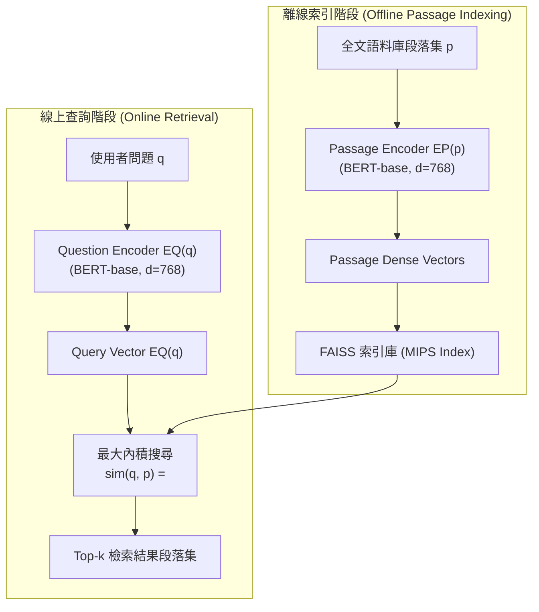

# Dense Passage Retrieval for Open-Domain Question Answering

> [!INFO] 論文元數據 (Metadata)
> - **Paper ID**：`Karpukhin2020_DPR`
> - **作者**：Vladimir Karpukhin, Barlas Oğuz, Sewon Min, Patrick Lewis, Ledell Wu, Sergey Edunov, Danqi Chen, Wen-tau Yih
> - **預印本初次發布年份 (Preprint)**：2020
> - **正式發表年份 / 會議或期刊 (Venue)**：2020 (EMNLP 2020)
> - **DOI**：無
> - **arXiv**：[2004.04906](https://arxiv.org/abs/2004.04906)
> - **驗證狀態**：`verified` (已比對原始文獻與 PDF 全文)
> - **本地 PDF 連結**：[[Papers/03 - RAG & Retrieval/(EMNLP 2020-11) Dense Passage Retrieval for Open-Domain Question Answering.pdf|開啟本地 PDF 檔案]]
---

## 一話摘要 (TL;DR)
**以雙塔 BERT 結構取代傳統 BM25 關鍵字檢索，奠定向量資料庫語意搜尋的黃金標準。**

---

## 研究背景與問題定義 (Problem Statement)
傳統 BM25 等詞頻匹配演算法嚴重受限於同義詞替換（Vocabulary Mismatch）與語意隱式表達，無法精準捕捉長句子背後的意圖。

---

## 核心方法與技術架構 (Methodology & Architecture)
DPR 採用雙編碼器（Dual-Encoder）架構，利用兩個獨立的預訓練模型分別映射查詢與段落：
1. **雙編碼器表示**：
   - Question Encoder $E_Q(q) \in \mathbb{R}^d$（以 BERT-base 為底座時 $d = 768$ 維）；
   - Passage Encoder $E_P(p) \in \mathbb{R}^d$（以 `[CLS]` 標記之隱層表示作為整段段落的密集向量）；
   - 相關度計算：$\text{sim}(q, p) = \langle E_Q(q), E_P(p) \rangle$（向量內積）。
2. **訓練機制**：
   - 採用對比學習目標（Negative Log-Likelihood of Positive Passage）；
   - In-batch Negatives：同一個 batch 內其他樣本的標註正例互為負例，顯著提高計算效率；
   - Hard Negative Mining：混入 BM25 檢索中排名高但不包含答案的困難負例（Hard Negatives）。
3. **推論機制**：
   - 全語料庫（如 2,100 萬篇維基百科段落）離線預計算為 768 維密集向量並建立 FAISS 索引；
   - 線上查詢僅需計算一次 $E_Q(q)$，透過最大內積搜尋（MIPS / FAISS）在毫秒級時間內傳回 Top-$k$ 候選段落。

---

## 主要實驗結果與證據 (Empirical Results & Evidence)
> [!NOTE] 關鍵實證數據與評估條件
> **出處與評估條件**：Table 2 (Page 5): 在 Top-20 檢索準確率上，DPR 在 Natural Questions 上達到 78.4%，大幅超越傳統強力 BM25 的 59.1% (提升近 20 個百分點)；確立了向量雙塔神經檢索作為開放域問答標準 retriever 的地位。

---

## 優勢、限制及 Trade-offs (Strengths, Limitations & Trade-offs)
- **優勢**：強大的語義同義詞泛化與抽象意圖捕捉能力；全語料離線向量化後線上搜尋延遲極低。
- **限制**：以單一 768 維向量壓縮整個長段落存在嚴重的資訊瓶頸；對罕見實體、產品型號代碼、精確數字匹配極為脆弱（在此類場景往往不如 BM25），且泛化到未見領域（Out-of-Domain）時效果常顯著衰減。

---

## 在長文件處理任務中的角色與啟發 (Implications for Long-Doc Processing)
確立了神經稠密檢索（Dense Retrieval）的基本範式，也是所有現代 Dense RAG、混合檢索（Hybrid Search）與多階段 Reranking 架構的起點。

---

## 原始來源及相關筆記連結 (Sources & Related Notes)
- **所屬研究領域**：
  - [[02 - 研究領域專題 (Research Domains)/Canonical RAG Domains/Domain 05 - Query Understanding & Retrieval|D05 Query Understanding & Retrieval]]
- **回主目錄**：[[00 - 導覽與心智圖 (Navigation & MOC)/Home (主目錄與知識庫導覽)|主目錄與知識庫導覽]]
- **全景心智圖**：[[00 - 導覽與心智圖 (Navigation & MOC)/LLM 超長文件處理心智圖 (MOC)|超長文件處理研究方向心智圖]]
