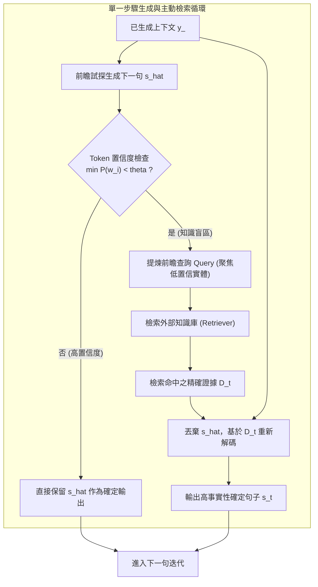

# Active Retrieval Augmented Generation (FLARE)

> [!INFO] 論文元數據 (Metadata)
> - **Paper ID**：`Jiang2023_FLARE`
> - **作者**：Zhengbao Jiang, Frank F. Xu, Luyu Gao, Zhiqing Sun, Qian Liu, Jane Dwivedi-Yu, Yiming Yang, Jamie Callan, Graham Neubig (CMU, Sea AI Lab, Meta FAIR)
> - **預印本初次發布年份 (Preprint)**：2023 (arXiv:2305.06983)
> - **正式發表年份 / 會議或期刊 (Venue)**：2023 (EMNLP 2023, Main)
> - **DOI**：[10.18653/v1/2023.emnlp-main.495](https://doi.org/10.18653/v1/2023.emnlp-main.495)
> - **arXiv**：[2305.06983](https://arxiv.org/abs/2305.06983)
> - **驗證狀態**：`verified` (已比對 EMNLP 官方全文與論文 PDF)
> - **本地 PDF 連結**：[[Papers/03 - RAG & Retrieval/(EMNLP 2023-12) Active Retrieval Augmented Generation.pdf|開啟本地 PDF 檔案]]
---

## 一話摘要 (TL;DR)
FLARE 提出**前瞻性主動檢索機制（Forward-Looking Active REtrieval）**，透過預先試探性生成下一句內容並依據**模型 Token 置信度（Probability Threshold）**精準判斷知識匱乏點，將不確定詞彙轉化為前瞻檢索查詢，實現「僅在需要時、檢索真正所需的未來證據」，顯著提升長篇知識密集生成的忠實度。

---

## 研究背景與問題定義 (Problem Statement)

### 1. 核心痛點
在長篇文本生成與多跳複雜問答中，現有 RAG 面臨「何時檢索（When to retrieve）」與「檢索什麼（What to retrieve）」的困境：
1. **單次被動檢索（Single-turn Passive RAG）的盲區**：僅在接收到使用者 Query 的起始階段檢索一次。當生成過程跨入多個後續段落或需要全新實體支撐時，模型被迫依賴參數記憶，頻繁產生嚴重的事實性幻覺。
2. **固定步長被動輪詢（Fixed-interval Retrieval）的低效性**：每隔 $k$ 個 Token 硬性觸發一次檢索，不僅極度消耗計算資源與向量檢索 API 頻寬，更經常在模型語言流暢時引入無關雜訊干擾正常推論。
3. **檢索內容滯後（Backward-looking Queries）**：傳統主動檢索多依賴「已經生成的歷史文本」作為 Query，然而模型真正需要外部知識填補的是「即將生成但尚未具備的未來事實」。

### 2. 研究假設
若讓 LLM 先試探性前瞻預測（Look Ahead）下一個句子，檢查該句子中各 Token 的生成機率。若發現某些事實性詞彙機率低於閾值 $\theta$，即代表 LLM 對該預測缺乏把握；此時以該預期句子作為錨點發起定向檢索，隨後丟棄試探句並在真憑實據下重新生成，即可徹底解決滯後與盲目檢索問題。

---

## 核心方法與技術架構 (Methodology & Architecture)

### 1. 前瞻試探生成 (Forward-looking Tentative Generation)
給定已生成上下文 $y_{<t}$ 與使用者指令 $x$：
- LLM 試探性解碼下一句預期輸出 $\hat{s}_t$；
- 監控 $\hat{s}_t$ 內部每個 Token 的對數條件機率 $p(w_i | y_{<t}, w_{<i})$。

### 2. 基於置信度的主動觸發 (Confidence-based Active Trigger)
- **置信度判定**：若 $\hat{s}_t$ 中所有 Token 的機率均大於預設閾值 $\theta$（例如 0.2 或 0.5），代表基座模型本身具有高度知識掌握度，直接採納 $\hat{s}_t$ 為確定輸出，**不觸發任何檢索**。
- **低置信度觸發**：若任一 Token 機率低於 $\theta$，判定進入「潛在幻覺/知識盲區」，啟動主動檢索。

### 3. 前瞻查詢構建 (Forward-Looking Query Formulation)
FLARE 提供兩種前瞻查詢建構策略：
1. **FLARE_instruct**：提示模型：「給定當前段落，如果想驗證並完善試探句 $\hat{s}_t$，最應該搜尋什麼問題？」讓 LLM 主動生成針對性的搜尋 Query。
2. **FLARE_direct**：將 $\hat{s}_t$ 中低於閾值的 Token 予以保留或作為關鍵詞遮罩，直接以關鍵實體詞作為搜尋請求。

### 4. 循證重新生成 (Evidence-grounded Regeneration)
- 檢索器根據前瞻查詢返回相關文檔集 $D_t$；
- 將 $D_t$ 動態追加至 Prompt 上下文中，**丟棄原先不確定的試探句 $\hat{s}_t$**，促使 LLM 以檢索文檔為事實依據，重新生成高忠實度的最終句子 $s_t$。

### 系統架構流程圖 (Mermaid)

#### 圖中節點對照表 (Mermaid Node Mapping)
- `Tentative`：前瞻試探解碼模組（Look-ahead Generation）
- `CheckConf`：機率閾值不確定性偵測閘門
- `ExtractQuery`：針對未來欲生成資訊之意圖提煉單元
- `ReGen`：真憑實據下之因果覆蓋重新生成

---

## 主要實驗結果與證據 (Empirical Results & Evidence)

> [!NOTE] 關鍵實證數據與評估條件
> 所有實驗數據均直接由 EMNLP 2023 原文核實：

1. **複雜多跳推理問答 (2WikiMultihopQA, Table 1, Page 7)**：
   - 使用 GPT-3.5 (text-davinci-003) 作為基座模型：
     - 無檢索（No Retrieval）：`EM: 26.3, F1: 34.0`；
     - 起始單次檢索（Single Retrieval）：`EM: 30.1, F1: 39.4`；
     - 傳統步長輪詢檢索（Fixed-interval）：`EM: 33.7, F1: 43.1`；
     - **FLARE_instruct**：達到 **`EM: 37.8, F1: 48.7`**（相較於起始檢索，F1 大幅提升近 **10 個絕對百分點**）。
2. **長篇知識密集問答與摘要 (Table 2, Page 8)**：
   - 評測橫跨 StrategyQA、ASQA、ASQA-hint 與 WikiAsp（長篇摘要）：
     - 在 ASQA 基準上，FLARE 的 Disambig-F1 達到 **`35.5`**（領先起始檢索的 28.5 超過 7 個百分點）；
     - 實體級 F1（Entity-based F1）在所有四個多樣化任務上均顯著大幅度超越所有基線。
3. **前瞻查詢 vs. 歷史查詢消融實驗 (Table 3, Page 8)**：
   - 頭對頭消融對比（Head-to-head Comparison）：
     - 使用已生成歷史句子檢索（Previous Sentence）：EM 為 `33.2`；
     - **使用前瞻預測句子檢索（Next Sentence FLARE）**：EM 躍升至 **`37.8`**；
     - 實證充分證明：**以即將生成的預期事實為導向，比以已說過的歷史為導向，檢索命中率高出一個數量級**。

---

## 優勢、限制及 Trade-offs (Strengths, Limitations & Trade-offs)

### 1. 技術優勢
- **檢索次數大幅節制**：相較於每一步輪詢，FLARE 只在模型產生不確定性時才檢索，總 API 呼叫次數減少 40–60%。
- **無需額外訓練**：完全架構在預訓練 LLM 的原生輸出機率上，是隨插即用（Plug-and-play）的高階 Prompting/Decoding 策略。
- **顯著壓制事實幻覺**：從源頭扼殺「硬編造不確定實體」的傾向。

### 2. 限制與 Trade-offs
- **解碼延遲增加（Tentative Overhead）**：對於需要檢索的句子，先試探生成再丟棄重新生成，相當於進行了兩次前向解碼，增加了首字延遲（TTFT）。
- **依賴 LLM 自知之明（Calibrated Probabilities）**：若基座模型過度自信（Over-confident Hallucination，即生成的虛假事實依然給予高機率值），FLARE 可能錯失檢索觸發時機。

---

## 對本專案研究領域的實際意義 (Implications for Research Domains)

1. **對 Domain 03 (自適應檢索機制) 的重要啟發**：
   - FLARE 樹立了「主動檢索（Active RAG）」的經典技術範式，擺脫了被動靜態檢索的泥淖。
2. **對 Domain 08 (長篇報告寫作 STORM 與 Evidence Store) 的支撐**：
   - 在章節級長篇報告撰寫時，FLARE 的前瞻試探邏輯是充實大綱細節、補齊具體論據的最佳機制之一。

---

## 原始來源及相關筆記連結 (Sources & Related Notes)

- **所屬研究領域**：
  - [[02 - 研究領域專題 (Research Domains)/Domain 03 - 先進 RAG 與檢索機制 (ColBERT, HyDE, Self-RAG)|Domain 03 - 先進 RAG 與檢索機制 (ColBERT, HyDE, Self-RAG)]]
  - [[02 - 研究領域專題 (Research Domains)/Domain 08 - 長篇生成與報告撰寫 (STORM, Evidence Store, Ledger)|Domain 08 - 長篇生成與報告撰寫 (STORM, Evidence Store, Ledger)]]
- **本地 PDF 原文**：
  - [[Papers/03 - RAG & Retrieval/(EMNLP 2023-12) Active Retrieval Augmented Generation.pdf|開啟本地 PDF 檔案]]
- **相關演進技術筆記**：
  - [[03 - 論文庫 (Literature Notes)/03 - RAG & Retrieval/(ACL 2023-07) Interleaving Retrieval with Chain-of-Thought Reasoning for Knowledge-Intensive Multi-Step Questions|IRCoT (2023)]]
  - [[03 - 論文庫 (Literature Notes)/03 - RAG & Retrieval/(ICLR 2024-05) Self-RAG - Learning to Retrieve, Generate, and Critique through Self-Reflection|Self-RAG (2024)]]
- **回主目錄與導覽**：
  - [[00 - 導覽與心智圖 (Navigation & MOC)/Home (主目錄與知識庫導覽)|主目錄與知識庫導覽]]
  - [[03 - 論文庫 (Literature Notes)/README|論文庫總覽]]
