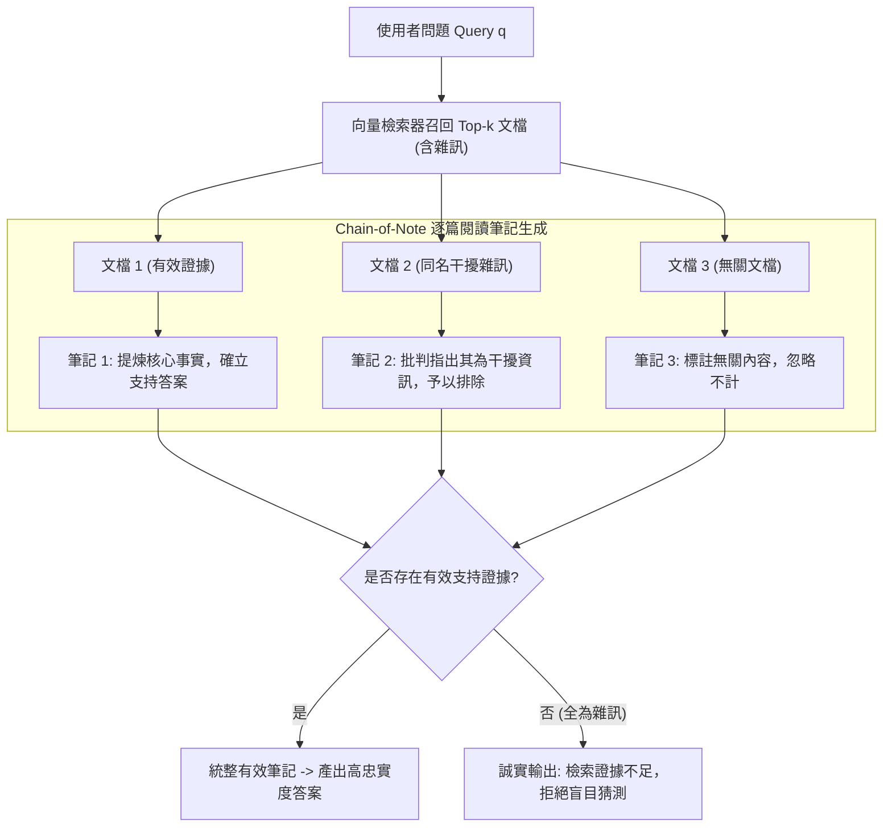

# Chain-of-Note: Enhancing Robustness in Retrieval-Augmented Language Models

> [!INFO] 論文元數據 (Metadata)
> - **Paper ID**：`Yu2024_ChainOfNote`
> - **作者**：Wenhao Yu, Hongming Zhang, Xiaoman Pan, Peixin Cao, Kaixin Ma, Jian Li, Hongwei Wang, Dong Yu (Tencent AI Lab & Notre Dame)
> - **預印本初次發布年份 (Preprint)**：2023 (arXiv:2311.09210)
> - **正式發表年份 / 會議或期刊 (Venue)**：2024 (EMNLP 2024)
> - **DOI**：無 (ACL Anthology / arXiv)
> - **arXiv**：[2311.09210](https://arxiv.org/abs/2311.09210)
> - **驗證狀態**：`verified` (已比對 EMNLP 官方錄取版本與論文 PDF)
> - **本地 PDF 連結**：[[Papers/03 - RAG & Retrieval/(EMNLP 2024-11) Chain-of-Note - Enhancing Robustness in Retrieval-Augmented Language Models.pdf|開啟本地 PDF 檔案]]
---

## 一話摘要 (TL;DR)
Chain-of-Note (CON) 提出在檢索文檔與最終生成之間插入**循序閱讀筆記（Sequential Reading Notes）**機制，引導模型對每份檢索到的文檔進行獨立相關性批判與證據充分性評估，有效抵抗**無關雜訊文檔的誤導干擾**，並在檢索無效時主動觸發拒答（Unknown Handling），將高噪聲情境下的問答準確率提升近 **20 個百分點**。

---

## 研究背景與問題定義 (Problem Statement)

### 1. 核心痛點
常規檢索增強語言模型（RALM）假設檢索回來的文檔都是準確且有用的，然而在真實開放環境中：
1. **檢索雜訊與誤導（Noise & Distractor Vulnerability）**：向量檢索器極易召回包含相同關鍵字但與答案完全無關的干擾文檔。標準 LLM 缺乏辨別力，經常被雜訊帶偏而產生嚴重的錯誤幻覺。
2. **缺乏「不知為不知」的誠實性（Failure to Reject）**：當檢索回來的全部文檔都不包含答案時，標準 RAG 傾向於強行拼湊文檔中的無關片段，或是盲目自信地編造假事實，缺乏明確拒絕回答（Say "I don't know"）的治理機制。
3. **黑盒拼接缺乏透明度（Lack of Evidence Traceability）**：一次性將 5 篇以上長篇文檔丟給模型，人類完全無法監控模型到底參考了哪一篇、忽視了哪一篇。

### 2. 研究假設
人類專家在閱讀多份參考資料時，會逐篇撰寫短評筆記（Reading Notes），評估其真實性與相關性，最後才統整結論。若能在 LLM 生成最終回答前，強制要求其針對每篇檢索文檔生成一段結構化閱讀筆記，模型便能顯式過濾掉雜訊干擾，大幅提升系統抗噪韌性。

---

## 核心方法與技術架構 (Methodology & Architecture)

### 1. 三類閱讀筆記架構 (Three Types of Reading Notes)
對於輸入問題 $q$ 與檢索到的 $k$ 篇文檔 $d_1, \dots, d_k$，Chain-of-Note 引導模型循序產生 $k$ 條筆記：
- **類型 1：直接相關筆記（Directly Relevant）**：
  若文檔 $d_i$ 明確包含答案，筆記精準摘錄核心論據並指出與問題的因果關係。
  *(範例：`[Note 1]: 文檔提到該事件發生於 1998 年，直接回答了提問的時間點。`)*
- **類型 2：相關但不足筆記（Inconclusive / Distractor）**：
  若文檔 $d_i$ 提及問題中的實體，但並未給出關鍵結論，筆記顯式指出其資訊缺陷。
  *(範例：`[Note 2]: 文檔介紹了該人物的早年經歷，但未提及他在該公司的職位，無法支撐回答。`)*
- **類型 3：完全無關筆記（Irrelevant / Noise）**：
  若文檔完全偏離主題，筆記直接標註並予以剔除。
  *(範例：`[Note 3]: 文檔涉及同名但不同領域的術語，與問題無關，予以忽略。`)*

### 2. 最終證據合成與誠實拒答 (Evidence Synthesis & Rejection)
在輸出完全部 $k$ 條閱讀筆記後，模型進入最終決策階段：
1. **充分證據合成**：若存在類型 1 筆記，綜合所有有效筆記合成最終答案，並具備天然的引用透明性。
2. **誠實拒絕回答**：若所有筆記均為類型 2 或 3，模型明確輸出：「檢索到的資訊不足以回答此問題」，或依據模型自身參數記憶謹慎補足。

### 3. 弱監督合成與指令微調 (Data Synthesis & Training)
- 使用強能力模型（如 ChatGPT）依據上述邏輯自動化構建 1 萬條帶有雜訊批判標籤的訓練樣本；
- 對開源基座（如 LLaMA-2-7B）進行輕量 LoRA / 全量指令微調，使其原生具備「先評判筆記、後回答問題」的思維習慣。

### 系統架構流程圖 (Mermaid)

#### 圖中節點對照表 (Mermaid Node Mapping)
- `ChainOfNoteEngine`：逐篇結構化證據批判模組
- `Note1`：高價值直接證據提煉
- `Note2` / `Note3`：干擾雜訊與假相關文檔的主動過濾
- `DecisionGate`：證據充分性仲裁閘門
- `Rejection`：防幻覺未知拒答出口

---

## 主要實驗結果與證據 (Empirical Results & Evidence)

> [!NOTE] 關鍵實證數據與評估條件
> 所有實驗數據均直接由 EMNLP 2024 原文核實：

1. **標準開放問答基準評測 (Table 2, Page 6)**：
   - 在 Natural Questions (NQ)、TriviaQA 與 WebQuestions 上，以 LLaMA-2-7B 為基座：
     - **標準 RAG（Standard RALM）**：
       - NQ EM: `25.5`；TriviaQA EM: `59.3`；WebQ EM: `24.1`；平均 EM: `36.3`。
     - **Chain-of-Note (CON)**：
       - NQ EM: **`30.1`**；TriviaQA EM: **`62.4`**；WebQ EM: **`26.7`**；平均 EM: **`39.7`**（平均提升 **3.4 個絕對百分點**，在 NQ 上提升近 **5 個百分點**）。
2. **高噪聲環境下的極限抗噪能力 (Table 3, Page 7)**：
   - 人為注入不同比例的完全無關干擾文檔（Noise Ratio 從 0% 增加到 100%）：
     - 當**噪聲比例達到 100%**（即所有檢索文檔全部是干擾雜訊）時：
       - 標準 RALM 因盲目信從雜訊，準確率暴跌至 **`15.3`**；
       - **Chain-of-Note 準確率維持在 `35.0`**（比標準 RALM 高出整整 **`+19.7` EM**！）。
     - 實驗證明：CON 的閱讀筆記機制成功阻斷了雜訊在上下文中的傳播，即使被錯誤文檔包圍，依然能冷靜識別並動用內部知識正確回答。

---

## 優勢、限制及 Trade-offs (Strengths, Limitations & Trade-offs)

### 1. 技術優勢
- **極致的雜訊容忍度**：徹底破解 RAG 領域「檢索器一旦出錯、生成器必然跟著幻覺」的死鎖難題。
- **具備天然的審計透明度**：每條筆記清晰展示了模型對各篇參考資料的採信態度，為後續人工校對與 Evidence Ledger 記錄提供了直接抓手。

### 2. 限制與 Trade-offs
- **生成的 Token 數量增加**：由於需要為每篇文檔額外輸出 50–100 字的筆記，整體輸出長度膨脹，導致總生成延遲略微上升約 25–35%。
- **需要針對性微調**：零樣本 Prompting 下強模型（如 GPT-4）可部分執行此邏輯，但要讓 7B 級開源模型精準掌握批判筆記格式，必須進行專屬 LoRA 微調。

---

## 對本專案研究領域的實際意義 (Implications for Research Domains)

1. **對 Domain 03 與 Domain 16 (上下文利用與忠實度) 的理論支撐**：
   - Chain-of-Note 是目前解決「檢索雜訊干擾」與「生成忠實度失真」最為直觀有效的落地架構之一。
2. **對證據帳本 (Evidence Ledger) 與四層檢驗機制的借鑑**：
   - CON 的三類筆記劃分，直接契合了本專案在長篇報告與知識治理中強調的「Citation $\to$ Entailment $\to$ Authority $\to$ Sufficiency」審計哲學。

---

## 原始來源及相關筆記連結 (Sources & Related Notes)

- **所屬研究領域**：
  - [[02 - 研究領域專題 (Research Domains)/Domain 03 - 先進 RAG 與檢索機制 (ColBERT, HyDE, Self-RAG)|Domain 03 - 先進 RAG 與檢索機制 (ColBERT, HyDE, Self-RAG)]]
  - [[02 - 研究領域專題 (Research Domains)/Domain 16 - Context Utilization & Faithfulness|Domain 16 - Context Utilization & Faithfulness)]]
- **本地 PDF 原文**：
  - [[Papers/03 - RAG & Retrieval/(EMNLP 2024-11) Chain-of-Note - Enhancing Robustness in Retrieval-Augmented Language Models.pdf|開啟本地 PDF 檔案]]
- **相關演進技術筆記**：
  - [[03 - 論文庫 (Literature Notes)/03 - RAG & Retrieval/(ICLR 2024-05) Self-RAG - Learning to Retrieve, Generate, and Critique through Self-Reflection|Self-RAG (2024)]]
  - [[03 - 論文庫 (Literature Notes)/03 - RAG & Retrieval/(EMNLP 2023-12) Active Retrieval Augmented Generation|FLARE (2023)]]
- **回主目錄與導覽**：
  - [[00 - 導覽與心智圖 (Navigation & MOC)/Home (主目錄與知識庫導覽)|主目錄與知識庫導覽]]
  - [[03 - 論文庫 (Literature Notes)/README|論文庫總覽]]
