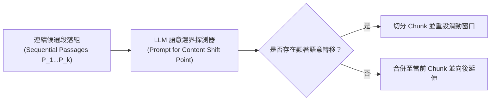

# LumberChunker: Long-Form Narrative Document Segmentation

> [!ABSTRACT] 一話摘要 (TL;DR)
> 本文提出 **LumberChunker**，利用長上下文 LLM 迭代探測連續段落之間的**語意轉移點（Semantic Shift Point）**，實作動態長度的語意自足切塊，並提出 **GutenQA** 基準證明結構與語意感知的動態切塊顯著優於固定長度切塊。

---

## 一、研究背景與問題定義 (Problem Statement)
- **核心痛點**：長文本 RAG 極度依賴前端切塊，但傳統切法多採用機械式固定字數（如 512 tokens + 10% overlap），導致完整的故事情節、論證邏輯在切塊邊界被生硬截斷，造成語意割裂並降低檢索召回率。
- **研究假設**：若切塊長度能依據文本內容動態彈性變化，僅在內容真正發生「語意漂移（Semantic Shift）」之處斷塊，則每個 Chunk 都能保有最高的語意獨立性（Semantic Independence），從而大幅改善下游 Dense Retrieval 效能。

---

## 二、核心方法與技術架構 (Methodology & Architecture)

1. **模組化動態切分 (Iterative Dynamic Segmentation)**：將連續的小段落逐步送入長上下文 LLM，提示模型判斷「從哪一個段落開始主題或內容發生了轉折」。
2. **語意獨立性最大化**：保證切出的每一個 Chunk 圍繞單一核心事件或主題展開，避免多個無關主題在同一個 Embedding 向量中互相干擾（Context Pollution）。
3. **GutenQA 評估基準**：構建包含 3,000 組從古騰堡長篇敘事文學中抽取的「大海撈針（Needle-in-a-Haystack）」QA 題目，評測不同切塊策略對跨章節精確檢索的影響。

---

## 三、主要實驗結果與證據 (Empirical Results & Evidence)
- **出處**：Table 1, Page 4.
- **評估基準與數據**：
  - 在 **GutenQA** 基準上，評估不同切塊粒度下的檢索表現（DCG@k 與 Recall@k）：
  - **檢索指標優勢**：在相同 dense retriever（Contriever / BGE）條件下，LumberChunker 動態切塊在 **Recall@5** 與 **DCG@5** 上顯著超越固定字數切塊（Fixed-size Chunking）與純句子級切塊（Sentence Chunking）。
  - **問答準確率 (QA Accuracy)**：在自傳體小說測試集（Autobiographies Test Set，Figure 3, Page 4）中，下游生成答案的準確度提升超過 4.8%。

---

## 四、優勢、限制及 Trade-offs (Strengths, Limitations & Trade-offs)
- **優勢**：
  - 切割點符合人類對故事與章節的語意認知，顯著降低代名詞懸空率；
  - 適用於小說、傳記與非結構化長篇敘事文檔。
- **限制與工程代價**：
  - **前置索引成本高昂**：切塊過程需多次呼叫 LLM 進行轉折點判斷，在數百萬字超大規模文庫中會造成顯著的預處理延遲與 Token 成本；
  - **對結構化文件（表格/工程規範）適應力不足**：更適合線性敘事文本，對包含多層級標題的工程規格書不如結構感知型啟發式切塊有效。

---

## 五、對本專案研究領域的實際意義 (Implications for Research Domains)
- **支撐「尊重結構與語意邊界」的理論依據**：本專案在切塊設計中主張「依據 `heading_path` 與 block boundary 斷塊，而非機械式切分 512 字」，LumberChunker 提供了直接的學術文獻支撐（證明語意邊界切分對 RAG 具有顯著收益）。
- **啟發啟發式工程近似**：在實務中可用確定性的 `heading_path change` 替代高昂的 LLM 呼叫，達到類似的語意保護效果。

---

## 六、原始來源及相關筆記連結 (Sources & Related Notes)
- **本地原始文獻**：[[Papers/03 - RAG & Retrieval/(EMNLP 2024-11) LumberChunker - Long-Context LLMs as Modular Chunkers for Long-Document RAG.pdf|開啟本地 PDF 檔案]]
- **關聯專題**：[[02 - 研究領域專題 (Research Domains)/Domain 04 - Chunking 策略與知識擷取 (Proposition, Cross-chunk)|Domain 04: Chunking 策略與知識擷取]]
- **關聯對照**：[[03 - 論文庫 (Literature Notes)/04 - Knowledge & Graph RAG/(EMNLP 2024-11) Dense X - Exploring the Limit of Proposition Retrieval for Open-Domain QA|Dense X 命題檢索]]
