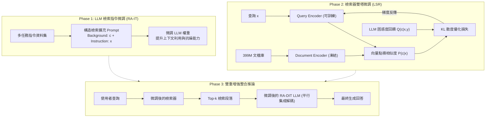

# RA-DIT: Retrieval-Augmented Dual Instruction Tuning

> [!INFO] 論文元數據 (Metadata)
> - **Paper ID**：`Lin2024_RADIT`
> - **作者**：Xi Victoria Lin, Xilun Chen, Mingda Chen, Weijia Shi, Maria Lomeli, Rich James, Pedro Rodriguez, Jacob Kahn, Gergely Szilvasy, Mike Lewis, Luke Zettlemoyer, Scott Yih (FAIR at Meta)
> - **預印本初次發布年份 (Preprint)**：2023 (arXiv:2310.01352)
> - **正式發表年份 / 會議或期刊 (Venue)**：2024 (ICLR 2024 Conference)
> - **OpenReview / 官方連結**：[https://openreview.net/forum?id=ycv4lp90wQ](https://openreview.net/forum?id=ycv4lp90wQ)
> - **arXiv**：[2310.01352](https://arxiv.org/abs/2310.01352)
> - **驗證狀態**：`verified` (已比對 ICLR 2024 官方全文與論文 PDF)
> - **本地 PDF 連結**：[[Papers/03 - RAG & Retrieval/(ICLR 2024-05) RA-DIT - Retrieval-Augmented Dual Instruction Tuning.pdf|開啟本地 PDF 檔案]]

---

## 一話摘要 (TL;DR)
RA-DIT 提出**檢索增強雙重指令微調（Dual Instruction Tuning）**框架，將檢索增強 LLM 分解為兩個輕量級獨立微調階段：(1) 對預訓練 LLM 進行檢索感知指令微調以提升檢索背景利用率與抗噪能力；(2) 利用 LLM 的似然度回饋微調檢索器的 Query Encoder 使其對齊 LLM 偏好；在 LLaMA-65B 上達成多項知識密集基準 SOTA，平均超越 Atlas 4.1 分。

---

## 研究背景與問題定義 (Problem Statement)

### 1. 核心痛點
現有的檢索增強語言模型（Retrieval-Augmented Language Models, RALMs）面臨兩難困局：
1. **聯合端到端預訓練成本過於高昂**：如 REALM、RETRO、Atlas 等架構需要對模型架構進行客製化改動（如加入跨注意力層）並從頭或大規模預訓練，資源門檻極高且無法靈活適配現成開源的大型基礎模型。
2. **開箱即用拼接的非最優性（Sub-optimality of Off-the-shelf RALMs）**：直接將通用開源檢索器（如 BM25、Contriever、DRAGON+）與凍結的 LLM 進行提示拼接（如 REPLUG），效果往往受限。原因在於通用檢索器檢索出的文檔符合「人類檢索意圖」，但不一定是「LLM 生成時最偏好且最能降低困惑度」的資訊；同時未經微調的 LLM 難以在嘈雜的檢索內容中保持上下文感知並有效提取正確事實。

### 2. 研究假設
若將 RALM 系統解耦為「語言模型」與「檢索器」兩個模組，並透過**雙重指令微調（Dual Instruction Tuning）**分別針對多任務指令資料集進行輕量級適配：
- 讓 LLM 學會「閱讀檢索背景並作答，同時忽略不相關干擾」；
- 讓檢索器學會「檢索使 LLM 生成目標答案機率最大化」的段落；
兩者結合即可在不需要昂貴預訓練的前提下，將任意既有 LLM 改造為高效的 RALM。

---

## 核心方法與技術架構 (Methodology & Architecture)

### 1. 語言模型微調 (LLM Fine-Tuning: RA-IT)
- **指令格式構造**：在多任務指令輸入前插入檢索到的背景文本，格式為 `Background: [Chunk]\n\n[Instruction]`。
- **混合監督任務**：涵蓋 20 個資料集（5 大類別：QA、閱讀理解、對話、摘要、通用指令）。同時包含提供正確背景、提供嘈雜背景、以及無背景的三重條件，促使 LLM 具備雙重能力：
  1. **背景利用能力**：當背景包含答案時，優先依據背景資訊作答；
  2. **強健抗噪能力**：當背景無關或錯誤時，依賴自身參數化知識或判斷衝突，避免被幻覺誤導。

### 2. 檢索器微調 (Retriever Fine-Tuning: LSR)
- 以 DRAGON+（基於雙塔 Dense Retriever 架構）為基礎骨幹。
- **凍結 Document Encoder，僅微調 Query Encoder**：文檔庫預先建立的向量索引無需重建，節省海量重構索引（re-indexing）開銷。
- **LM 監督信號（LM-Supervised Retrieval, LSR）**：
  給定輸入問題 $x$ 與候選段落 $c_i$，計算 LLM 在拼接 $c_i$ 後生成正確目標文本 $y$ 的負對數似然（PPL 回饋），形成金色軟機率分佈 $Q(c_i | x, y)$。
  檢索器根據查詢 $q$ 計算檢索機率分佈 $P(c_i | q)$，以 KL 散度損失函數訓練 Query Encoder：
  $$\mathcal{L}_{\text{Retriever}} = D_{\text{KL}}(Q(c | x, y) \parallel P(c | x))$$

### 3. 平行推論解碼 (Parallel Decoding / REPLUG Inference)
推論階段採用 REPLUG 式集成解碼，將檢索到的 $k$ 個段落平行餵入 LLM 計算下一 Token 機率並依檢索分數進行邊際化加權求和，避免長文檔拼接引發的上下文窗口爆炸與干擾。

### 系統架構流程圖 (Mermaid)

#### 圖中節點對照
- `D_train`: 多任務指令微調資料集 (Table 1, Page 3)
- `LLM_tune`: 語言模型指令微調模組 (RA-IT)
- `Q_enc`: 稠密檢索器查詢編碼器 (Query Encoder)
- `D_enc`: 稠密檢索器文檔編碼器 (Document Encoder, Frozen)
- `Parallel_LM`: 支援平行集成邊際化機率的微調 LLM

---

## 主要實驗結果與證據 (Empirical Results & Evidence)

### 1. 知識密集基準核心表現 (Table 2, Page 6)
在 10 個知識密集型基準（MMLU, NQ, TriviaQA, ELI5, HotpotQA, FEVER, AIDA, zsRE, T-REx, WoW）評估：

| 設定與模型 | MMLU | NQ | TriviaQA | ELI5 | HotpotQA | FEVER | AIDA | zsRE | T-REx | WoW | Avg (10) | Avg (4-core) |
| :--- | :---: | :---: | :---: | :---: | :---: | :---: | :---: | :---: | :---: | :---: | :---: | :---: |
| **0-shot** | | | | | | | | | | | | |
| LLaMA 65B | 51.2 | 5.2 | 55.8 | 19.5 | 12.5 | 59.3 | 0.6 | 6.7 | 1.3 | 15.6 | 22.8 | 32.9 |
| LLaMA 65B + REPLUG | 59.7 | 28.8 | 72.6 | 19.1 | 32.0 | 73.3 | 41.8 | 50.8 | 36.3 | 16.1 | 43.1 | 45.1 |
| **RA-DIT 65B** | **64.6** | **35.2** | **75.4** | **21.2** | **39.7** | **80.7** | **45.1** | **73.7** | **53.1** | **16.4** | **50.5** | **49.1** |
| **5-shot in-context** | | | | | | | | | | | | |
| LLaMA 65B | 63.4 | 31.6 | 71.8 | 22.1 | 22.6 | 81.5 | 48.2 | 39.4 | 52.1 | 17.4 | 45.0 | 47.2 |
| LLaMA 65B + REPLUG | 64.4 | 42.3 | 74.9 | 22.8 | 41.1 | 89.4 | 46.4 | 60.4 | 68.9 | 16.8 | 52.7 | 51.1 |
| **RA-DIT 65B** | **64.9** | **43.9** | **75.1** | **23.2** | **40.7** | **90.7** | **55.8** | **72.4** | **68.4** | **17.3** | **55.2** | **51.8** |
| **64-shot fine-tuned** | | | | | | | | | | | | |
| ATLAS (11B, Per-task FT) | - | 42.4 | 74.5 | - | 34.7 | 87.1 | 66.5 | 74.9 | 58.9 | 15.5 | 56.8 | - |
| **RA-DIT 65B (Unified)** | - | **43.5** | 72.8 | - | **36.6** | 86.9 | **80.5** | **78.1** | **72.8** | **15.7** | **60.9** | - |

*(出處：Table 2, Page 6)*

### 2. 雙重微調各模組貢獻度消融 (Table 6, Page 8)
在 5-shot dev 測試集上評估各模組的獨立貢獻度（以 DRAGON+ 為檢索器）：
- **LLaMA 65B + DRAGON+ (無微調)**：平均分 53.8
- **LLaMA 65B + 微調後 DRAGON+ (僅微調檢索器)**：平均分 54.4 (+0.6)
- **RA-IT 65B + DRAGON+ (僅微調 LLM)**：平均分 53.9 (+0.1)
- **RA-DIT 65B (雙重微調整合)**：平均分 **54.6** (+0.8，在 TriviaQA 達 75.0, HotpotQA 達 42.0)

### 3. 常識推理與通用能力不退化 (Table 3, Page 6)
在 8 個常識推理基準（BoolQ, PIQA, SIQA, HellaSwag, WinoGrande, ARC-E, ARC-C, OBQA）且**不啟用檢索增強**的條件下評估：
- **LLaMA 65B**：平均分 72.1
- **RA-DIT 65B**：平均分 **74.5** (+2.4)
這證明檢索指令微調並未破壞模型固有的常識推理與參數化常識，反而提升了模型遵循指令的能力。

---

## 優勢、限制及 Trade-offs (Strengths, Limitations & Trade-offs)

### 1. 優勢 (Strengths)
1. **極佳的解耦性與適配性**：無需對 LLM 內部架構植入額外模組，能將既有任意開源 LLM（如 LLaMA、Mistral）輕量升級為頂級 RALM。
2. **無需重建向量資料庫索引**：透過僅微調 Query Encoder 而凍結 Document Encoder，在 399M Common Crawl + Wikipedia 文檔庫上免除了昂貴的索引重建成本。
3. **消除檢索噪聲干擾**：雙向微調使檢索器更準確、LLM 抗干擾能力顯著增強，大幅縮小 0-shot 與 Few-shot 之間的表現差距。

### 2. 限制與代價 (Limitations & Trade-offs)
1. **反向傳播回饋計算開銷大**：微調檢索器（LSR）時需調用 LLM 計算各候選段落拼接後的困惑度，若文檔庫候選集過大，離線採樣與計算 PPL 的算力負擔顯著。
2. **多輪迭代微調無額外增益**：作者在 Page 8 註明，嘗試進行多輪迭代（以微調後的檢索器回傳段落再次微調 LLM，或以微調後的 LLM 再次評分微調檢索器），並未觀察到進一步提升。
3. **推論時的平行解碼算力需求**：採用 REPLUG 式平行集成推論需要對 $k$ 個段落分別進行前向傳播，顯存與計算複雜度隨 $k$ 線性增加。

---

## 對本專案研究領域的實際意義 (Implications for Research Domains)

1. **Domain 03 (先進 RAG 機制)**：
   確立了「檢索器」與「生成器」雙向對齊的標準範式。打破了以往「僅微調 LLM」或「僅訓練語意檢索器」的單向局限，證明了「LM-Supervised Retrieval」與「Context-Aware Instruction Tuning」的互補性。
2. **長文件與知識庫系統構建**：
   在工業實踐中，企業通常已經建立了大規模的向量索引。RA-DIT「僅更新 Query 編碼器」的策略為現有向量系統的低成本增強提供了極具工程落地價值的借鑑路徑。

---

## 原始來源及相關筆記連結 (Sources & Related Notes)

- **本地 PDF 連結**：[[Papers/03 - RAG & Retrieval/(ICLR 2024-05) RA-DIT - Retrieval-Augmented Dual Instruction Tuning.pdf|開啟本地 PDF 檔案]]
- **前驅文獻**：
  - [[03 - 論文庫 (Literature Notes)/03 - RAG & Retrieval/(NAACL 2024-06) REPLUG - Retrieval-Augmented Black-Box Language Models|REPLUG: Retrieval-Augmented Black-Box Language Models]]
  - [[03 - 論文庫 (Literature Notes)/03 - RAG & Retrieval/(ICML 2020-07) REALM - Retrieval-Augmented Language Model Pre-Training|REALM: Retrieval-Augmented Language Model Pre-Training]]
- **相關評測與領域專題**：
  - [[02 - 研究領域專題 (Research Domains)/Domain 03 - 先進 RAG 與檢索機制 (ColBERT, HyDE, Self-RAG)|Domain 03 - 先進 RAG 與檢索機制]]
