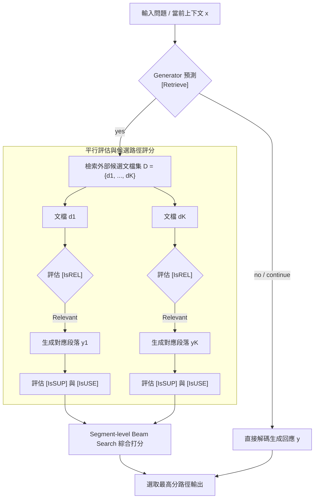

# Self-RAG: Learning to Retrieve, Generate, and Critique through Self-Reflection

> [!INFO] 論文元數據 (Metadata)
> - **Paper ID**：`Asai2024_SelfRAG`
> - **作者**：Akari Asai, Zeqiu Wu, Yizhong Wang, Avirup Sil, Hannaneh Hajishirzi
> - **預印本初次發布年份 (Preprint)**：2023
> - **正式發表年份 / 會議或期刊 (Venue)**：2024 (ICLR 2024)
> - **DOI**：無
> - **arXiv**：[2310.11511](https://arxiv.org/abs/2310.11511)
> - **驗證狀態**：`verified` (已比對原始文獻與 PDF 全文)
> - **本地 PDF 連結**：[[Papers/03 - RAG & Retrieval/(ICLR 2024-05) Self-RAG - Learning to Retrieve, Generate, and Critique through Self-Reflection.pdf|開啟本地 PDF 檔案]]
---

## 一話摘要 (TL;DR)
**透過特殊的 Reflection Tokens 訓練 LLM 自主決定何時需要檢索、評估檢索相關性，並對自身生成的忠實度進行自我批判。**

---

## 研究背景與問題定義 (Problem Statement)
傳統 RAG 無論問題難易與自身知識庫存，盲目觸發檢索；且對檢索出的低品質文檔缺乏批判能力，容易被噪音誤導。

---

## 核心方法與技術架構 (Methodology & Architecture)
Self-RAG 透過專屬的反思標記（Reflection Tokens）實現自適應檢索與批判生成，其訓練與推論機制包含三個核心層次：
1. **反思標記體系**：
   - 檢索控制：`[Retrieve]` $\in \{\text{yes}, \text{no}, \text{continue}\}$（判斷當前上下文是否需要外部補充）；
   - 相關性批判：`[IsREL]` $\in \{\text{relevant}, \text{irrelevant}\}$（檢驗檢索文檔是否切題）；
   - 忠實度批判：`[IsSUP]` $\in \{\text{fully supported}, \text{partially supported}, \text{no support}\}$（檢驗生成命題是否獲文檔嚴格背書）；
   - 實用度批判：`[IsUSE]` $\in \{1, 2, 3, 4, 5\}$（評估回答整體資訊價值）。
2. **訓練機制（無需強化學習 RL）**：
   - 先訓練 Critic 模型：利用 GPT-4 離線提示生成 reflection token 標註資料，微調出 Critic 模型；
   - 訓練 Generator 模型：利用 Critic 模型對大規模語料自動插入 reflection tokens，以標準監督式微調（Supervised Fine-Tuning, SFT）訓練單一 Generator 同時學會生成文字與反思標記；全流程**不依賴強化學習（RL）**。
3. **推論機制**：在解碼階段，利用自定義權重對各 reflection token 進行打分，透過束搜尋（Segment-level Beam Search）動態選取最優路徑。

---

## 主要實驗結果與證據 (Empirical Results & Evidence)
> [!NOTE] 關鍵實證數據與評估條件
> **出處與評估條件**：Table 1 (Page 6): 在 Open-domain QA（PopQA, TriviaQA）與 BioASQ 基準上，Self-RAG 7B 模型顯著超越未檢索的 Llama-2-70B 與常規 RAG 系統；在忠實度評估上，引文支持率（Citation Precision/Recall）提升超過 30 個百分點。

---

## 優勢、限制及 Trade-offs (Strengths, Limitations & Trade-offs)
- **優勢**：實現了自適應檢索、相關性過濾與自我驗證的單一模型原生整合，大幅減少不必要檢索並抑制幻覺。
- **限制**：需要離線構建複雜標註語料並進行 SFT，推論時的多候選段落 beam search 解碼顯著增加了計算延遲與顯存負擔。
- **訓練邊界**：原論文之 Critic 與 Generator 均採用標準因果語言模型 SFT，不以 PPO 或 DPO 等強化學習為必要步驟。

---

## 在長文件處理任務中的角色與啟發 (Implications for Long-Doc Processing)
開創了『自省式檢索（Self-Reflective RAG）』範式，是現代自適應 RAG、證據充分性判斷（[[02 - 研究領域專題 (Research Domains)/Domain 06 - Evidence Sufficiency & Adaptive Retrieval|D06 Evidence Sufficiency & Adaptive Retrieval]]）與反思 Agent 的核心理論來源。

---

## 原始來源及相關筆記連結 (Sources & Related Notes)
- **所屬研究領域**：
  - [[02 - 研究領域專題 (Research Domains)/Domain 05 - Query Understanding & Retrieval|D05 Query Understanding & Retrieval]]
  - [[02 - 研究領域專題 (Research Domains)/Domain 06 - Evidence Sufficiency & Adaptive Retrieval|D06 Evidence Sufficiency & Adaptive Retrieval]]
  - [[02 - 研究領域專題 (Research Domains)/Domain 13 - RAG Evaluation & Failure Attribution|D13 RAG Evaluation & Failure Attribution]]
- **回主目錄**：[[00 - 導覽與心智圖 (Navigation & MOC)/Home (主目錄與知識庫導覽)|主目錄與知識庫導覽]]
- **全景心智圖**：[[00 - 導覽與心智圖 (Navigation & MOC)/RAG System Maps|RAG System Maps]]
