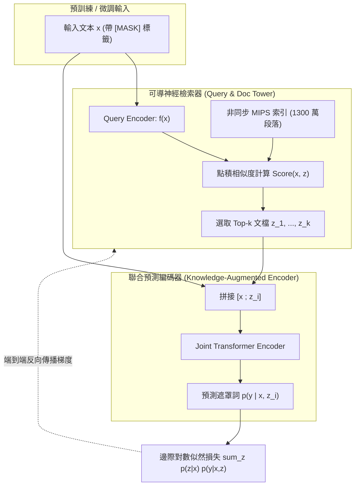

# REALM: Retrieval-Augmented Language Model Pre-Training

> [!INFO] 論文元數據 (Metadata)
> - **Paper ID**：`Guu2020_REALM`
> - **作者**：Kelvin Guu, Kenton Lee, Zora Tung, Panupong Pasupat, Ming-Wei Chang (Google Research)
> - **預印本初次發布年份 (Preprint)**：2020 (arXiv:2002.08909)
> - **正式發表年份 / 會議或期刊 (Venue)**：2020 (ICML 2020, PMLR vol 119)
> - **DOI**：無 (PMLR)
> - **arXiv**：[2002.08909](https://arxiv.org/abs/2002.08909)
> - **驗證狀態**：`verified` (已比對 ICML 官方全文與論文 PDF)
> - **本地 PDF 連結**：[[Papers/03 - RAG & Retrieval/(ICML 2020-07) REALM - Retrieval-Augmented Language Model Pre-Training.pdf|開啟本地 PDF 檔案]]
---

## 一話摘要 (TL;DR)
REALM 首次提出將**神經檢索器（Neural Knowledge Retriever）**與**預訓練語言模型（Knowledge-Augmented Encoder）**進行端到端聯合無監督預訓練，藉由最大化遮罩語言建模的邊際似然度（Marginal Log-Likelihood），並利用**非同步最大內積搜尋（Asynchronous MIPS Index Refresh）**解決千萬級維度檢索梯度的端到端反傳問題，奠定了現代 RAG 預訓練架構的基石。

---

## 研究背景與問題定義 (Problem Statement)

### 1. 核心痛點
在標準 BERT 等遮罩語言模型（MLM）預訓練中：
1. **事實性知識強行儲存在神經權重中（Parametric Memory Overhead）**：模型必須將世界所有事實性知識（如「X 出生於 Y」）死記硬背在神經網路權重參數中，導致為了記憶罕見實體與長尾事實，模型參數必須指數級擴增。
2. **知識無法動態更新與審計（Black-box & Stale Knowledge）**：一旦預訓練結束，模型內部知識便凍結，無法即時修正錯誤或擴充新知識，且無法溯源預測結果來自哪份原始文獻。
3. **檢索與語言建模脫節（Disjoint Pipeline）**：先前的問答系統多採用啟發式檢索（如 BM25）或分開訓練的檢索器，檢索器無法感知下游語言生成的需求，且離散檢索過程不可導，無法直接透過端到端梯度更新。

### 2. 研究假設
若將文字檢索視為一個**潛在變數（Latent Variable $z$）**，在預訓練時要求模型：給定帶遮罩的輸入 $x$，先從未標註的 Wikipedia 百萬文檔庫中檢索出相關文本 $z$，再基於 $z$ 與 $x$ 聯合預測被遮罩的 Token $y$。透過邊際似然度公式反向傳播梯度，即可無監督自發學會「何時該檢索」與「該檢索什麼文獻」。

---

## 核心方法與技術架構 (Methodology & Architecture)

### 1. 檢索增強生成機率公式 (Probabilistic Formulation)
REALM 將預測機率分解為檢索與預測兩階段的邊際分佈求和：

$$p(y|x) = \sum_{z \in \mathcal{Z}} p(z|x) p(y|x, z)$$

1. **神經知識檢索器（Neural Knowledge Retriever）**：
   $$p(z|x) = \frac{\exp(\text{Score}(x, z))}{\sum_{z'} \exp(\text{Score}(x, z'))}$$
   其中檢索分數由雙塔 BERT 內積計算：
   $$\text{Score}(x, z) = f(x)^\top g(z) = (\mathbf{W}_q \text{BERT}_Q(x))^\top (\mathbf{W}_d \text{BERT}_D(z))$$
2. **知識增強編碼器（Knowledge-Augmented Encoder）**：
   將輸入 $x$ 與檢索文檔 $z$ 拼接後輸入 Transformer，預測被遮罩的原始 Token：
   $$p(y|x, z) = \prod_{j \in J} p(y_j | x, z)$$

### 2. 非同步 MIPS 索引更新 (Asynchronous MIPS Refresh)
在包含 1,300 萬個維基百科段落的語料庫中，對所有文檔計算 $p(z|x)$ 的分母是不可行的，且文檔嵌入向量 $g(z)$ 會隨訓練更新。
REALM 提出工程創舉：
1. **Top-$k$ 近似採樣**：僅針對檢索分數最高的 Top-$k$（如 $k=30$）文檔計算邊際機率；
2. **雙進程非同步更新**：主訓練 Worker 在 GPU 上進行梯度反傳與模型參數更新；背景 Worker 平行使用 16 塊 TPU 定期重新編碼全部 1300 萬篇文檔，並重建 ScaNN/Faiss MIPS 索引（每隔數百步非同步刷新一次），在梯度穩定性與系統吞吐量間達成最優平衡。

### 系統架構流程圖 (Mermaid)

#### 圖中節點對照表 (Mermaid Node Mapping)
- `NeuralRetriever`：可導神經檢索模組
- `MIPS`：非同步更新的百萬級最大內積檢索索引庫
- `JointEncoder`：拼接上下文與候選文本之聯合遮罩預測模組
- `MarginalLoss`：邊際對數似然端到端優化目標

---

## 主要實驗結果與證據 (Empirical Results & Evidence)

> [!NOTE] 關鍵實證數據與評估條件
> 所有實驗數據均直接由 ICML 2020 原文核實：

1. **開放領域問答基準 (Open-Domain QA, Table 1, Page 7)**：
   - 評測指標為 Exact Match (EM)，在完全不給定黃金段落（Open-domain）情境下：
     - **NaturalQuestions-Open**：
       - T5-11B (純參數模型，110 億參數)：EM 為 `34.5`；
       - **REALM (僅 3.3 億參數，相當於 BERT-Large)**：達到 **EM `40.4`**（參數僅為 T5-11B 的 1/30，EM 領先近 6 個百分點）。
     - **WebQuestions**：
       - T5-11B：EM 為 `37.4`；
       - REALM：達到 **EM `40.7`**。
     - **CuratedTREC**：
       - T5-11B：EM 為 `56.6`；
       - REALM：達到 **EM `57.0`**。
2. **消融實驗：MIPS 索引更新頻率的影響 (Table 2, Page 7 & Page 8)**：
   - 在 NQ 開發集上評測過期 MIPS 索引對效能的影響：
     - 使用過期 30 倍的 MIPS 索引（30x stale）：EM 驟降至 `28.7`；
     - 保持非同步高頻刷新 MIPS 索引：EM 穩定在 **`39.2`**；
     - 證明端到端檢索器在訓練時，保持索引表徵即時性對梯度指引至關重要。

---

## 優勢、限制及 Trade-offs (Strengths, Limitations & Trade-offs)

### 1. 技術優勢
- **無監督端到端檢索導航**：完全無需人工標註的檢索相關性資料，僅靠 MLM 遮罩自回歸信號即可學會高精度檢索。
- **參數效率極高**：以 330M 參數的模型在事實問答上徹底擊敗 11B 規模的純參數神經網路。
- **可解釋性與可溯源性**：回答可直接追溯至具體的維基百科段落 $z$。

### 2. 限制與工程代價
- **預訓練工程複雜度極高**：需要 16 塊 TPU 持續非同步編碼千萬級文檔庫並重建 MIPS 索引，普通學術機構難以復現其預訓練流程。
- **僅支援 Encoder 掩碼架構**：REALM 本質是 BERT 形式的 Masked LM，難以直接應用於現代 Decoder-only（如 GPT-4、LLaMA）的自回歸生成式長文本寫作。

---

## 對本專案研究領域的實際意義 (Implications for Research Domains)

1. **對 Domain 03 (Advanced RAG) 的開創性定位**：
   - REALM 是 NLP 歷史上第一個證明「檢索可以作為語言模型預訓練的一等公民（First-Class Citizen）」的經典工作，啟發了後續的 RETRO、Atlas 與 Self-RAG。
2. **對證據治理與溯源機制的意義**：
   - 其潛在變數邊際化公式 $p(y|x) = \sum_z p(z|x)p(y|x,z)$ 成為評估證據充分性（Evidence Sufficiency）與來源權威仲裁的最早數學框架。

---

## 原始來源及相關筆記連結 (Sources & Related Notes)

- **所屬研究領域**：
  - [[02 - 研究領域專題 (Research Domains)/Domain 03 - 先進 RAG 與檢索機制 (ColBERT, HyDE, Self-RAG)|Domain 03 - 先進 RAG 與檢索機制 (ColBERT, HyDE, Self-RAG)]]
- **本地 PDF 原文**：
  - [[Papers/03 - RAG & Retrieval/(ICML 2020-07) REALM - Retrieval-Augmented Language Model Pre-Training.pdf|開啟本地 PDF 檔案]]
- **相關演進技術筆記**：
  - [[03 - 論文庫 (Literature Notes)/03 - RAG & Retrieval/(NeurIPS 2020-12) Retrieval-Augmented Generation for Knowledge-Intensive NLP Tasks|Lewis et al. RAG (2020)]]
  - [[03 - 論文庫 (Literature Notes)/03 - RAG & Retrieval/(EMNLP 2020-11) Dense Passage Retrieval for Open-Domain Question Answering|DPR (2020)]]
  - [[03 - 論文庫 (Literature Notes)/03 - RAG & Retrieval/(ICLR 2024-05) Self-RAG - Learning to Retrieve, Generate, and Critique through Self-Reflection|Self-RAG (2024)]]
- **回主目錄與導覽**：
  - [[00 - 導覽與心智圖 (Navigation & MOC)/Home (主目錄與知識庫導覽)|主目錄與知識庫導覽]]
  - [[03 - 論文庫 (Literature Notes)/README|論文庫總覽]]
