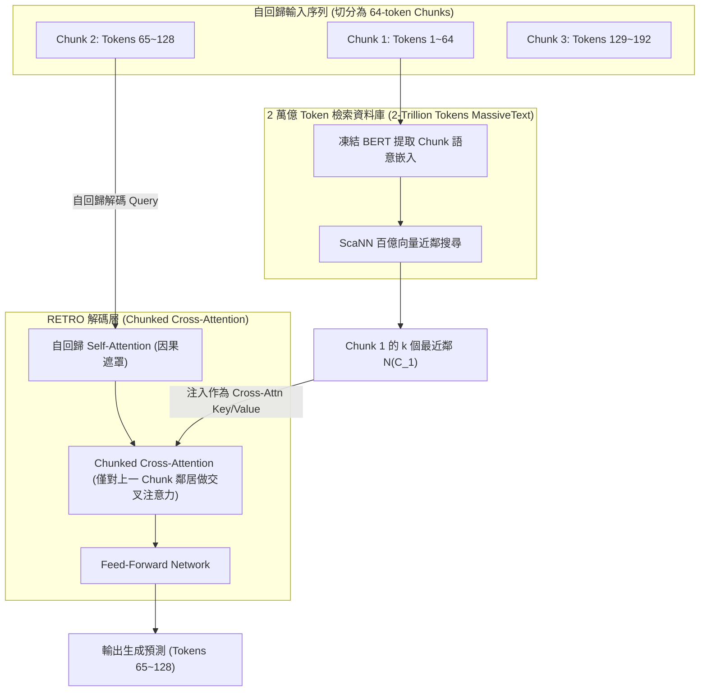

# Improving Language Models by Retrieving from Trillions of Tokens (RETRO)

> [!INFO] 論文元數據 (Metadata)
> - **Paper ID**：`Borgeaud2022_RETRO`
> - **作者**：Sebastian Borgeaud, Arthur Mensch, Jordan Hoffmann et al. (DeepMind)
> - **預印本初次發布年份 (Preprint)**：2021 (arXiv:2112.04426)
> - **正式發表年份 / 會議或期刊 (Venue)**：2022 (ICML 2022, PMLR vol 162)
> - **DOI**：無 (PMLR)
> - **arXiv**：[2112.04426](https://arxiv.org/abs/2112.04426)
> - **驗證狀態**：`verified` (已比對 ICML 官方全文與論文 PDF)
> - **本地 PDF 連結**：[[Papers/03 - RAG & Retrieval/(ICML 2022-07) Improving Language Models by Retrieving from Trillions of Tokens.pdf|開啟本地 PDF 檔案]]
---

## 一話摘要 (TL;DR)
DeepMind 提出的 **RETRO（Retrieval-Enhanced Transformer）** 首次將檢索資料庫規模推向**數萬億 Token（2 Trillion Tokens）**級別，透過**分塊交叉注意力（Chunked Cross-Attention, CCA）**在自回歸生成中無縫注入細粒度檢索資訊，使 **7.5B 參數的 RETRO 在多項基準上匹敵參數量大 25 倍的 175B GPT-3**。

---

## 研究背景與問題定義 (Problem Statement)

### 1. 核心痛點
現代語言模型（如 GPT-3、PaLM）主要依賴參數量 Scaling（如 175B、540B）來記憶世界知識，引發嚴重代價：
1. **龐大的訓練與推論算力浪費**：為了記住極少被存取的長尾事實，整個模型都需要擴增數倍參數，推論顯存開銷巨大。
2. **缺乏因果嚴謹的分塊檢索機制**：傳統 RAG（如 Lewis et al. 2020）主要在 Prompt 前端拼接檢索到的完整文檔，無法支援超長篇自回歸生成時的動態知識更新，且自回歸因果遮罩容易被外部輸入破壞。
3. **資料庫規模受限**：以往檢索增強多局限於數百萬篇維基百科段落，從未在數萬億 Token（Trillions of Tokens）規模的多樣化網路語料上進行過預訓練驗證。

### 2. 研究假設
若將輸入序列切割為固定的細粒度區塊（64-token Chunks），自回歸生成過程中依據歷史 Chunk 動態檢索 2 萬億 Token 資料庫中的 $k$ 個最近鄰，並透過精巧的**分塊交叉注意力（Chunked Cross-Attention）**局部注入，即可在嚴格遵守時間因果順序的前提下，以小模型規模超越百億級巨型模型。

---

## 核心方法與技術架構 (Methodology & Architecture)

### 1. 分塊檢索機制 (Chunked Retrieval)
- 輸入序列 $X = (x_1, \dots, x_n)$ 被劃分為長度為 $m=64$ 的連續區塊：$C_u = (x_{(u-1)m+1}, \dots, x_{um})$。
- 對於第 $u$ 個區塊 $C_u$，使用凍結的 BERT 取得句子級嵌入，並從包含 2 萬億 Token 的 MassiveText 語料庫中檢索出 $k$ 個最近鄰區塊集合 $\mathcal{N}(C_u) = \{N^1, \dots, N^k\}$。
- 每個鄰居包含原始命中區塊及其後續延伸區塊，總長度為 $2m=128$ tokens。

### 2. 分塊交叉注意力 (Chunked Cross-Attention, CCA)
為了確保自回歸生成不發生「未來資訊洩漏」：
- 在自回歸解碼時，預測第 $u$ 個區塊 $C_u$ 內部 Token 的條件機率，**只能依賴第 $u-1$ 個區塊所檢索到的鄰居 $\mathcal{N}(C_{u-1})$**。
- 將鄰居經過小型鄰居編碼器（Neighbor Encoder）提取特徵後，在 RETRO 專屬的 CCA 層中，以當前解碼器激活值作為 Query，對鄰居特徵進行 Cross-Attention。這使得檢索知識的融入完全與自回歸生成同步。

### 系統架構流程圖 (Mermaid)

#### 圖中節點對照表 (Mermaid Node Mapping)
- `InputSeq`：64-token 細粒度切割序列
- `ScaNN_DB`：2 萬億 Token 規模之百億級近似近鄰檢索系統
- `CCA`：防未來資訊洩漏的分塊交叉注意力核心層
- `Neighbors1`：前一片段檢索之精確知識錨點

---

## 主要實驗結果與證據 (Empirical Results & Evidence)

> [!NOTE] 關鍵實證數據與評估條件
> 所有實驗數據均直接由 ICML 2022 原文核實：

1. **語言建模困惑度與參數量 Scaling (Figure 1, Page 2 & Table 3, Page 8)**：
   - 在包含 22 個領域的 The Pile 基準與 C4 語料庫上評測位元組壓縮率（Bits Per Byte, bpb）：
     - **RETRO 7.5B 模型（75 億參數）**在幾乎所有評測子集上，其困惑度與 bpb 均**超越了 175B 參數的標準 GPT-3 基準**（參數效率提升超過 **23 倍**）。
     - 與同等參數量（7.5B）未搭載檢索的 Baseline Transformer 相比，RETRO 在所有領域實現一致性的顯著困惑度下降。
2. **開放問答事實性評測 (Natural Questions, Page 8)**：
   - 在零樣本與微調開放問答中：
     - Jurassic-1 (178B 參數)：準確率為 `25.9%`；
     - GPT-3 (175B 參數)：準確率為 `29.9%`；
     - **RETRO 7.5B**：達到 **`36.8%`**，以極小參數量大幅壓制百億參數巨獸。
3. **模型毒性與偏見降低 (Toxicity & Factuality)**：
   - 藉由將外部知識與可審計的外部庫分離，RETRO 生成的不實幻覺顯著降低，且可精確指出答案取自 2 萬億庫中的哪一個 Chunk。

---

## 優勢、限制及 Trade-offs (Strengths, Limitations & Trade-offs)

### 1. 技術優勢
- **參數與算力效率天花板**：首次證明在萬億 Token 檢索支持下，中型模型（7B）能跨級挑戰 175B 巨型稠密模型。
- **無損長篇生成**：Chunked Cross-Attention 完美維持自回歸生成的時間連貫性，避免上下文超載。

### 2. 限制與工程複雜度
- **巨型索引的維護成本**：2 萬億 Token 的向量索引需佔用數個 TB 的儲存與高昂的 ScaNN 叢集資源。
- **架構特化限制**：RETRO 需在模型預訓練時就插入 CCA 專屬層，無法直接將其機制「零成本」套用至現成開源的 LLaMA 等基座模型中。

---

## 對本專案研究領域的實際意義 (Implications for Research Domains)

1. **對 Domain 03 (Advanced RAG) 的歷史定位**：
   - RETRO 是檢索增強進入「超大預訓練時代」的劃時代標竿，奠定了當前「用外部檢索庫替代模型參數記憶」的 Scaling 新範式。
2. **對細粒度檢索切分（Chunking）的借鑑**：
   - 證明了「64-token 細粒度 Chunk 搭配因果 Cross-Attention」在連續語言建模中優於粗粒度篇章拼接。

---

## 原始來源及相關筆記連結 (Sources & Related Notes)

- **所屬研究領域**：
  - [[02 - 研究領域專題 (Research Domains)/Domain 03 - 先進 RAG 與檢索機制 (ColBERT, HyDE, Self-RAG)|Domain 03 - 先進 RAG 與檢索機制 (ColBERT, HyDE, Self-RAG)]]
- **本地 PDF 原文**：
  - [[Papers/03 - RAG & Retrieval/(ICML 2022-07) Improving Language Models by Retrieving from Trillions of Tokens.pdf|開啟本地 PDF 檔案]]
- **相關演進技術筆記**：
  - [[03 - 論文庫 (Literature Notes)/03 - RAG & Retrieval/(ICML 2020-07) REALM - Retrieval-Augmented Language Model Pre-Training|REALM]]
  - [[03 - 論文庫 (Literature Notes)/03 - RAG & Retrieval/(SIGIR 2020-07) ColBERT - Efficient and Effective Passage Search via Contextualized Late Interaction over BERT|ColBERT]]
- **回主目錄與導覽**：
  - [[00 - 導覽與心智圖 (Navigation & MOC)/Home (主目錄與知識庫導覽)|主目錄與知識庫導覽]]
  - [[03 - 論文庫 (Literature Notes)/README|論文庫總覽]]
