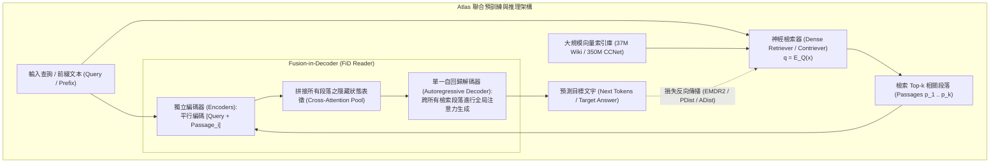

# Atlas: Few-shot Learning with Retrieval Augmented Language Models

## 一話摘要 (TL;DR)
Meta AI 提出的 Atlas 將密集檢索器（Dense Retriever）與 Fusion-in-Decoder（FiD）生成器進行端到端聯合預訓練（Joint Pre-training），使僅具備 11B 參數的模型在 MMLU、Natural Questions 等知識密集型小樣本評測中，達到並超越 540B PaLM 與 175B GPT-3 等超大稠密模型的水準。

---

## 研究背景與問題定義 (Problem Statement)

1. **純參數化大模型的知識容量與效率極限**：
   - 傳統 LLM（如 GPT-3 175B、PaLM 540B）透過將海量世界知識死記硬背在神經網路權重中，帶來了高昂的訓練成本、更新停滯與嚴重的事實幻覺；
   - 先前的檢索增強模型（如 REALM、RAG、RETRO）多數採用「凍結的檢索器（Frozen DPR）」或僅在微調階段加入檢索，檢索器與語言模型生成器之間缺乏深層的預訓練協同，導致在小樣本（Few-shot）遷移時效果遠遜於超大參數模型。
2. **核心研究目標**：
   - 如何在大規模無標註語料的預訓練階段（Pre-training），同時聯合優化檢索器（Retriever）與跨文檔解碼器（Reader），使小尺寸模型具備卓越的小樣本知識泛化力？

---

## 核心方法與技術架構 (Methodology & Architecture)

Atlas 採用雙塔雙向編碼器檢索器（Contriever）與 Fusion-in-Decoder（T5 序列架構）深度聯合優化架構：

### 圖中節點對照
- `DENSE_RET`：雙塔架構密集檢索器，其權重與生成解碼器共同更新。
- `ENC`：$k$ 個候選段落各自與 Query 拼接後獨立過 Encoder，時間複雜度為 $O(k \cdot L^2)$ 而非 $O((kL)^2)$。
- `DEC`：在 Decoder 的 Cross-Attention 中同時看見所有 $k$ 個段落的 Token 表徵，進行資訊聚合。
- `反向傳播`：利用解碼器對段落的注意力權重或困惑度反饋，計算梯度更新檢索器（以注意力蒸餾 ADist 或邊緣似然期望最大化 EMDR2 進行端到端優化）。

---

## 主要實驗結果與證據 (Empirical Results & Evidence)

論文在大規模基準（KILT, Natural Questions, TriviaQA, MMLU）上進行了全方位小樣本（64-shot, 1024-shot, Few-shot）對比：

1. **檢索器損失消融與小樣本提升 (Table 1, Page 10)**：
   - 在 64-shot 小樣本設定下（NQ, WoW, FEVER 綜合平均分）：
     - 封閉式語言模型（Closed-book baseline）: 平均分僅 26.5；
     - 未經聯合預訓練（No joint pre-training）: 30.0；
     - 固定檢索器（Fixed retriever）: 42.2；
     - **Atlas (PDist 聯合預訓練)**: 達到 **45.7** 平均分（NQ 45.0, WoW 15.0, FEVER 77.0），顯著證明聯合預訓練的強大遷移力。
2. **MMLU 跨領域綜合評測 (Table 6, Page 13 & Table 7, Page 14)**：
   - 在 MMLU 評測中，Atlas-11B 搭配去偏置推論（De-biased Inference）：
     - Zero-shot MMLU 由 36.8 提升至 **47.1**（+10.3 點）；
     - 5-shot MMLU 達到 **47.9**，在小樣本設定下超越了參數規模大其 15 倍的 GPT-3 175B；
     - 充分證明外掛高品質檢索庫能讓 11B 規模模型具備媲美超大模型的專業常識水準。
3. **開放領域問答 SOTA (Table 8, Page 15)**：
   - 在 Natural Questions 測試集上，Atlas-11B 在 64-shot 下取得 **42.4% EM**，在全量資料下取得 **60.4% EM**，刷新當時業界開卷問答紀錄。

---

## 優勢、限制及 Trade-offs (Strengths, Limitations & Trade-offs)

1. **適用任務與資料集**：對事實性問答、維基百科類實體推理、專業領域小樣本冷啟動極度強大；
2. **硬體資源與推論成本**：
   - 優點：參數僅 11B，單張 A100 (80GB) 即可載入並執行推論，部署成本遠低於 175B+ 叢集；
   - 缺點：推論時需要檢索 $k=20\sim 50$ 個段落並拼接，Decoder 的 KV Cache 與 Cross-attention 計算量較高。
3. **失效情境**：
   - **檢索索引陳舊**：如果預構建的 37M/350M 向量索引未即時重建，模型無法回答即時新聞。

---

## 對本專案研究領域的實際意義 (Implications for Research Domains)

1. **確立端到端預訓練 RAG 的最高基準**：Atlas 是神經檢索與生成式閱讀器深度融合的集大成者，證明了「檢索器不應只是第三方的黑盒子工具，而應成為語言模型預訓練架構的一部分」。
2. **啟發長文本與報告生成的底層架構**：Atlas 的 Fusion-in-Decoder 機制在不破壞自注意力局限的前提下，優雅地解決了同時讀取多篇文檔的瓶頸，是構建大規模循證知識庫的核心參照。

---

## 原始來源及相關筆記連結 (Sources & Related Notes)

- **本地 PDF 原文**：[[Papers/03 - RAG & Retrieval/(JMLR 2023-01) Atlas - Few-shot Learning with Retrieval Augmented Language Models.pdf|開啟本地 PDF 檔案]]
- **相關領域專題**：
  - [[02 - 研究領域專題 (Research Domains)/Canonical RAG Domains/Domain 05 - Query Understanding & Retrieval|D05 Query Understanding & Retrieval]]
  - [[02 - 研究領域專題 (Research Domains)/Canonical RAG Domains/Domain 09 - Grounded Generation Attribution & Long-form Synthesis|D09 Grounded Generation & Long-form Synthesis]]
- **相關核心文獻**：
  - [[03 - 論文庫 (Literature Notes)/03 - RAG & Retrieval/(ICML 2020-07) REALM - Retrieval-Augmented Language Model Pre-Training|REALM (Guu et al., ICML 2020)]]
  - [[03 - 論文庫 (Literature Notes)/03 - RAG & Retrieval/(NeurIPS 2020-12) Retrieval-Augmented Generation for Knowledge-Intensive NLP Tasks|RAG (Lewis et al., NeurIPS 2020)]]
  - [[03 - 論文庫 (Literature Notes)/03 - RAG & Retrieval/(ICML 2022-07) Improving Language Models by Retrieving from Trillions of Tokens|RETRO (Borgeaud et al., ICML 2022)]]
