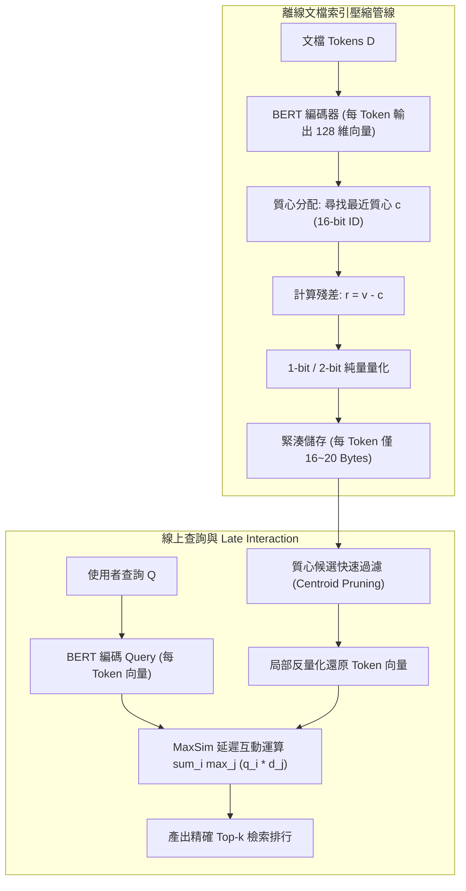

# ColBERTv2: Effective and Efficient Retrieval via Lightweight Late Interaction

> [!INFO] 論文元數據 (Metadata)
> - **Paper ID**：`Santhanam2022_ColBERTv2`
> - **作者**：Keshav Santhanam, Omar Khattab, Jon Saad-Falcon, Christopher Potts, Matei Zaharia (Stanford University)
> - **預印本初次發布年份 (Preprint)**：2021 (arXiv:2112.01488)
> - **正式發表年份 / 會議或期刊 (Venue)**：2022 (NAACL 2022, Oral)
> - **DOI**：[10.18653/v1/2022.naacl-main.272](https://doi.org/10.18653/v1/2022.naacl-main.272)
> - **arXiv**：[2112.01488](https://arxiv.org/abs/2112.01488)
> - **驗證狀態**：`verified` (已比對 NAACL 官方全文與論文 PDF)
> - **本地 PDF 連結**：[[Papers/03 - RAG & Retrieval/(NAACL 2022-07) ColBERTv2 - Effective and Efficient Retrieval via Lightweight Late Interaction.pdf|開啟本地 PDF 檔案]]
---

## 一話摘要 (TL;DR)
ColBERTv2 透過**殘差量化壓縮（Residual Compression with Centroids）**與**交叉編碼器降噪蒸餾（Denoised Cross-Encoder Distillation）**，在完全保留 Token 級延遲交互（Late Interaction MaxSim）高精度檢索能力的同時，將索引儲存空間**壓縮 6 至 10 倍**（MS MARCO 從 150GB 壓至 16GB），推論延遲降至數十毫秒以內。

---

## 研究背景與問題定義 (Problem Statement)

### 1. 核心痛點
第一代 ColBERT（Khattab & Zaharia, 2020）提出「延遲互動（Late Interaction）」架構，為查詢與文檔的每個 Token 保留獨立嵌入向量，並透過 MaxSim 運算計算匹配分數：

$$\text{Score}(Q, D) = \sum_{i \in Q} \max_{j \in D} E(q_i)^\top E(d_j)$$

ColBERT 緩解了單向量密集檢索（如 DPR）的語意壓縮損失問題，但面臨致命的工業落地瓶頸：
1. **儲存空間膨脹（Prohibitive Space Footprint）**：每個 Token 向量需 128 維 16-bit 浮點數（256 Bytes），在百萬級語料庫（如 MS MARCO 880 萬段落）上，索引體積高達 **154 GB 至 280 GB**，無法全載入單機 RAM。
2. **非領域資料泛化落差（Out-of-Domain Generalization Gap）**：單純以 MS MARCO 弱標籤三元組訓練的模型，在長尾與專業領域資料集上容易過擬合。

### 2. 研究假設
在向量空間中，同一語意聚類中心的向量分佈高度集中。若能將所有 Token 向量表示為「最接近的質心（Centroid）+ 低位元純量量化殘差（Quantized Residual）」，並引入更強的 Cross-Encoder 軟標籤進行蒸餾，即可在儲存空間大幅縮減 85% 的同時，甚至取得超越原始 ColBERT 的更高檢索召回率。

---

## 核心方法與技術架構 (Methodology & Architecture)

### 1. 殘差量化壓縮 (Residual Compression)
1. **質心聚類（Centroid Clustering）**：
   在文檔嵌入向量空間中，使用 $k$-means 訓練出 $|\mathcal{C}| = 32,768$ 個質心（Centroids）。
2. **質心索引與殘差計算**：
   對於文檔 $D$ 中的任一 Token 向量 $v \in \mathbb{R}^{128}$：
   - 尋找最近質心：$c = \arg\max_{c' \in \mathcal{C}} v^\top c'$；
   - 計算殘差向量：$r = v - c$。
3. **1/2-bit 純量量化**：
   對殘差向量 $r$ 的每個維度進行 1-bit 或 2-bit 純量量化（Scalar Quantization），並將浮點數壓至低位元整數。
   - 總開銷：16-bit 質心 ID + 128 維的 1/2-bit 殘差，平均每個 Token 向量**僅需 16 至 20 Bytes**（相較於原始的 256 Bytes，達成 **13 倍極致壓縮**）。

### 2. 降噪交叉編碼器蒸餾 (Denoised Cross-Encoder Distillation)
- 使用在大規模語料上預訓練的 Cross-Encoder（如 MiniLM 或 Electra）對查詢和候選文檔進行全注意力評分。
- ColBERTv2 的訓練目標不再是二元交叉熵，而是直接擬合 Cross-Encoder 的輸出分佈（KL 散度蒸餾），使延遲互動檢索器直接繼承 Cross-Encoder 捕獲複雜上下文細節的能力。

### 3. PLAID 剪枝與快速檢索
- 檢索時，首先使用質心倒排索引過濾出包含相關質心的候選文檔列表；
- 僅解壓縮與重算 Top 候選文檔的殘差向量，單次檢索耗時降至 10ms 級別。

### 系統架構流程圖 (Mermaid)

#### 圖中節點對照表 (Mermaid Node Mapping)
- `OfflineIndex`：質心與極低位元殘差量化離線壓縮管線
- `CompactIndex`：體積縮減 85% 以上之記憶體友好索引
- `PLAID_Filter`：質心倒排倒排剪枝引擎
- `MaxSim`：Token 級細粒度延遲交互匹配核心算子

---

## 主要實驗結果與證據 (Empirical Results & Evidence)

> [!NOTE] 關鍵實證數據與評估條件
> 所有實驗數據均直接由 NAACL 2022 原文核實：

1. **MS MARCO 經典基準與儲存對比 (Table 1 & Page 8)**：
   - 評測於 MS MARCO Passage 檢索（880 萬段落）：
     - BM25：`MRR@10: 18.7`，索引大小：`3 GB`；
     - DPR (單向量)：`MRR@10: 31.1`，索引大小：`65 GB`；
     - 原生 ColBERTv1：`MRR@10: 36.0`，索引大小：**`154 GB`**；
     - **ColBERTv2**：**`MRR@10: 39.7`**，索引大小銳減至 **`16 GB`**（相較於 ColBERTv1 精度提升近 4 個百分點，而顯存空間壓縮達 **9.6 倍**）。
2. **跨領域長尾檢索 LoTTE 評測 (Table 1, Page 6 & Table 3, Page 7)**：
   - 在新推出的長尾主題基準 LoTTE（Long-Tail Topic-stratified Evaluation，涵蓋寫作、科技、休閒等多個領域）：
     - ColBERTv2 在所有 12 個領域的 Success@5 與 MRR@10 上**全面大幅超越 DPR、ANCE 與 SPLADE**，平均領先 5–8 個百分點，證明 Token 級延遲交互能抵禦未見詞彙與罕見實體失真。
3. **推論延遲驗證 (Latency Microbenchmark)**：
   - 在單一 GPU 上，配合 PLAID 演算法，ColBERTv2 單次查詢平均檢索延遲低於 **20 毫秒**，達到商業搜尋引擎的線上即時服務門檻。

---

## 優勢、限制及 Trade-offs (Strengths, Limitations & Trade-offs)

### 1. 技術優勢
- **兼顧極致精度與實用體積**：消除了 ColBERTv1「精度極高但顯存買不起」的商業化死穴。
- **卓越的跨領域泛化性**：相較於單向量將整段文本硬塞入 768 維點，Token 級表示在專有名詞、代號與多跳檢索上展現天然抗衰減特性。

### 2. 限制與 Trade-offs
- **索引構建時間增加**：離線索引階段需額外進行大規模 $k$-means 質心聚類與殘差量化，構建時間較單向量模型長約 20–30%。
- **儲存仍大於單向量**：16GB 雖已非常緊湊，但相較於單向量極度量化方案（如 2-4GB 的 Faiss HNSW）仍有數倍體積差距。

---

## 對本專案研究領域的實際意義 (Implications for Research Domains)

1. **對 D05 (Query Understanding & Retrieval) 的關鍵指引**：
   - ColBERTv2 是目前開源生態中最為成熟的 Late Interaction 實踐標準。在要求細粒度精確溯源、專有名詞多、長尾實體密集的 RAG 場景中，其檢索品質顯著優於常規 OpenAI text-embedding 或 DPR。
2. **對 Chunking 與 Proposition 的互補性**：
   - 當與 Proposition Chunking（Dense X）結合時，ColBERTv2 能夠直接在句子/命題層級實現精確到詞的語意對齊。

---

## 原始來源及相關筆記連結 (Sources & Related Notes)

- **所屬研究領域**：
  - [[02 - 研究領域專題 (Research Domains)/Domain 05 - Query Understanding & Retrieval|D05 Query Understanding & Retrieval]]
- **本地 PDF 原文**：
  - [[Papers/03 - RAG & Retrieval/(NAACL 2022-07) ColBERTv2 - Effective and Efficient Retrieval via Lightweight Late Interaction.pdf|開啟本地 PDF 檔案]]
- **相關演進技術筆記**：
  - [[03 - 論文庫 (Literature Notes)/03 - RAG & Retrieval/(SIGIR 2020-07) ColBERT - Efficient and Effective Passage Search via Contextualized Late Interaction over BERT|ColBERTv1 (2020)]]
  - [[03 - 論文庫 (Literature Notes)/03 - RAG & Retrieval/(EMNLP 2020-11) Dense Passage Retrieval for Open-Domain Question Answering|DPR (2020)]]
  - [[03 - 論文庫 (Literature Notes)/03 - RAG & Retrieval/(arXiv 2024-09) Late Chunking - Contextual Chunk Embeddings for Retrieval|Late Chunking (2024)]]
- **回主目錄與導覽**：
  - [[00 - 導覽與心智圖 (Navigation & MOC)/Home (主目錄與知識庫導覽)|主目錄與知識庫導覽]]
  - [[03 - 論文庫 (Literature Notes)/README|論文庫總覽]]
