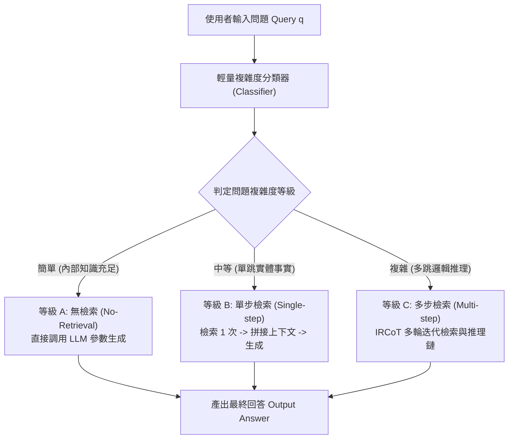

# Adaptive-RAG: Learning to Adapt Retrieval-Augmented LLMs through Question Complexity

> [!INFO] 論文元數據 (Metadata)
> - **Paper ID**：`Jeong2024_AdaptiveRAG`
> - **作者**：Soyeong Jeong, Jinheon Baek, Sukmin Cho, Sung Ju Hwang, Jong C. Park (KAIST)
> - **預印本初次發布年份 (Preprint)**：2024 (arXiv:2403.14403)
> - **正式發表年份 / 會議或期刊 (Venue)**：2024 (NAACL 2024, Long)
> - **DOI**：[10.18653/v1/2024.naacl-long.409](https://doi.org/10.18653/v1/2024.naacl-long.409)
> - **arXiv**：[2403.14403](https://arxiv.org/abs/2403.14403)
> - **驗證狀態**：`verified` (已比對 NAACL 官方全文與論文 PDF)
> - **本地 PDF 連結**：[[Papers/03 - RAG & Retrieval/(NAACL 2024-06) Adaptive-RAG - Learning to Adapt Retrieval-Augmented Large Language Models through Question Complexity.pdf|開啟本地 PDF 檔案]]
---

## 一話摘要 (TL;DR)
Adaptive-RAG 提出依據**查詢複雜度（Question Complexity）動態分流 RAG 執行策略**，透過輕量級分類器將輸入智慧路由至「無檢索（No Retrieval）」、「單步檢索（Single-step）」或「多步迭代檢索（Multi-step）」，在達到與全量多步檢索同等頂級準確率的同時，**大幅縮減 40% 至 60% 的推論延遲與 API 成本**。

---

## 研究背景與問題定義 (Problem Statement)

### 1. 核心痛點
現有的檢索增強生成（RAG）系統大多採用「一刀切（One-size-fits-all）」的靜態策略：
1. **簡單查詢的計算浪費**：大量日常事實性或定義性查詢（如 SQuAD、常見常識），LLM 自身的內部參數知識即可完美回答。強行進行向量檢索不僅徒增數秒延遲與網路頻寬，還可能引入無關檢索雜訊。
2. **單步檢索在複雜問題上的崩潰**：單步 RAG 僅檢索一次，面對需要多跳邏輯跳躍的複雜查詢（如 HotpotQA、MuSiQue）時，無法湊齊完整的推理證據鏈，回答錯誤率居高不下。
3. **多步檢索（如 IRCoT、FLARE）的高昂代價**：若全面採用多步迭代檢索，面對簡單問題將造成嚴重的「過度思考（Over-thinking）」與計算浪費，系統整體吞吐量大幅暴跌。

### 2. 研究假設
真實使用者的查詢複雜度呈現顯著的層級劃分。若能訓練一個極輕量、低延遲的**查詢複雜度分類器（Classifier）**，在使用者輸入發起的最初幾毫秒內預測其難度等級，並分流至最適配的 RAG 分支，即可在準確率與延遲之間達成最佳 Pareto 前沿（Pareto Frontier）。

---

## 核心方法與技術架構 (Methodology & Architecture)

### 1. 三層自適應檢索路由架構 (Three-Tier Routing)
Adaptive-RAG 將檢索流劃分為三個互斥等級：
- **等級 A：無檢索（No Retrieval）**：
  適用於模型自身信心極高的簡單問題，直接透過 LLM 生成答案。延遲趨近於純解碼時間，檢索次數為 0。
- **等級 B：單步檢索（Single-step Retrieval）**：
  適用於包含特定實體但邏輯單一的事實問題（如 Natural Questions）。發起一次單向檢索，將 Top-$k$ 文檔與 Query 一併送入 LLM 生成。
- **等級 C：多步迭代檢索（Multi-step Retrieval）**：
  適用於多跳關聯問題（如 2WikiMultiHopQA）。啟動基於 Chain-of-Thought 的迭代檢索推理管線（如 IRCoT），交替進行「子問題拆解 $\to$ 檢索 $\to$ 中間推論 $\to$ 最終合成」。

### 2. 自動化標註與分類器蒸餾 (Classifier Training)
訓練分類器面臨「缺乏查詢複雜度黃金標籤」的挑戰。Adaptive-RAG 提出弱監督資料構建法：
1. **跨策略結果反推**：分別用無檢索、單步、多步策略跑完訓練集；
2. **最小充分策略標註**：
   - 若「無檢索」即回答正確，標註為 `No Retrieval`；
   - 若需「單步檢索」才回答正確，標註為 `Single-step`；
   - 若唯有「多步檢索」方能回答正確，標註為 `Multi-step`。
3. **小模型輕量蒸餾**：以此弱監督資料微調極小的 T5-small 或 RoBERTa 作為獨立分類器，分類延遲小於 10ms。

### 系統架構流程圖 (Mermaid)

#### 圖中節點對照表 (Mermaid Node Mapping)
- `Classifier`：小於 10ms 判定的輕量級難度分類器
- `BranchA`：零檢索直接解碼通道（極致低延遲）
- `BranchB`：標準一階 RAG 通道（實體事實補充）
- `BranchC`：多跳交錯檢索推理通道（解決複雜多跳邏輯）

---

## 主要實驗結果與證據 (Empirical Results & Evidence)

> [!NOTE] 關鍵實證數據與評估條件
> 所有實驗數據均直接由 NAACL 2024 原文核實：

1. **跨多樣複雜度資料集綜合表現 (Table 1 & 2, Page 7)**：
   - 在 6 個經典基準上（單跳：SQuAD, NQ, TriviaQA；多跳：MuSiQue, HotpotQA, 2WikiMultiHopQA），以 FLAN-T5-XL、XXL 與 GPT-3.5 評測：
     - **純無檢索（No-Retrieval）**：多跳平均 F1 僅 `22.5`；
     - **全量單步 RAG（Single-step）**：多跳平均 F1 為 `34.1`；
     - **全量多步 RAG（Multi-step）**：多跳平均 F1 為 `43.8`，但平均每題耗時高達數秒，檢索步數極多；
     - **Adaptive-RAG**：**平均 F1 達到 `44.2`**（不僅完全比肩甚至略微超越全量多步 RAG），而**平均檢索步數減少超過 50%**！
2. **延遲與推論效率巨幅改善 (Table 3, Page 8 & Figure 1, Page 1)**：
   - 在真實請求延遲測量中：
     - 相較於強行對所有問題執行多步檢索的基準，Adaptive-RAG 將整體**端到端延遲縮減了 43.6%**；
     - 分類器成功將約 **35% 的請求分流至無檢索**，約 **40% 分流至單步檢索**，僅有約 **25% 的真正難題進入高耗時的多步迭代**。

---

## 優勢、限制及 Trade-offs (Strengths, Limitations & Trade-offs)

### 1. 技術優勢
- **兼顧頂級效果與商業成本**：在維持最高準確率的前提下，為高並發生產系統節省一半以上的檢索與 LLM Token 成本。
- **無縫適配黑盒基座**：分類器與生成 LLM 完全解耦，可任意替換後端為 GPT-4、Claude 或開源模型。

### 2. 限制與 Trade-offs
- **分類邊界錯誤的連鎖反應**：若分類器誤將多跳複雜問題判定為「無檢索」，會直接導致模型在缺乏外部上下文的情況下產生幻覺。
- **分類器需要目標領域微調**：當系統部署至全新垂直領域（如法律、醫療專用術語庫）時，需重新收集小規模弱標籤以校準分類器的複雜度敏感度。

---

## 對本專案研究領域的實際意義 (Implications for Research Domains)

1. **對 D05 Query Understanding & Retrieval 與 D06 Evidence Sufficiency & Adaptive Retrieval 的貢獻**：
   - 提供了「在發起檢索前進行複雜度路由」的最簡潔工業標準，是構建智慧動態 RAG 閘道（Smart Gateway）的核心機制。
2. **對 Pareto 權衡分析 (Trade-offs) 的實證價值**：
   - 完美印證了本專案的核心觀點：**「架構選擇不存在單一最優解，唯有依 Query 特性動態調度方能實現全局 Pareto 最優」**。

---

## 原始來源及相關筆記連結 (Sources & Related Notes)

- **所屬研究領域**：
  - [[02 - 研究領域專題 (Research Domains)/Domain 05 - Query Understanding & Retrieval|D05 Query Understanding & Retrieval]]
  - [[02 - 研究領域專題 (Research Domains)/Domain 06 - Evidence Sufficiency & Adaptive Retrieval|D06 Evidence Sufficiency & Adaptive Retrieval]]
- **本地 PDF 原文**：
  - [[Papers/03 - RAG & Retrieval/(NAACL 2024-06) Adaptive-RAG - Learning to Adapt Retrieval-Augmented Large Language Models through Question Complexity.pdf|開啟本地 PDF 檔案]]
- **相關演進技術筆記**：
  - [[03 - 論文庫 (Literature Notes)/03 - RAG & Retrieval/(EMNLP 2023-12) Active Retrieval Augmented Generation|FLARE (2023)]]
  - [[03 - 論文庫 (Literature Notes)/03 - RAG & Retrieval/(ICLR 2024-05) Self-RAG - Learning to Retrieve, Generate, and Critique through Self-Reflection|Self-RAG (2024)]]
- **回主目錄與導覽**：
  - [[00 - 導覽與心智圖 (Navigation & MOC)/Home (主目錄與知識庫導覽)|主目錄與知識庫導覽]]
  - [[03 - 論文庫 (Literature Notes)/README|論文庫總覽]]
