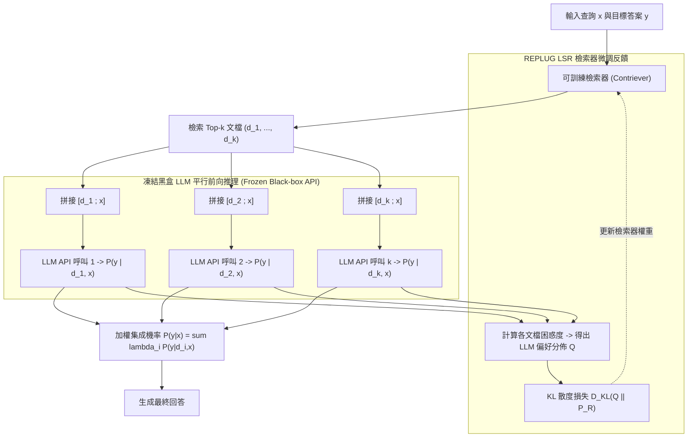

# REPLUG: Retrieval-Augmented Black-Box Language Models

> [!INFO] 論文元數據 (Metadata)
> - **Paper ID**：`Shi2024_REPLUG`
> - **作者**：Weijia Shi, Sewon Min, Michihiro Yasunaga, Minjoon Seo, Rich James, Mike Lewis, Luke Zettlemoyer, Wen-tau Yih (Univ of Washington, Stanford, KAIST, Meta FAIR)
> - **預印本初次發布年份 (Preprint)**：2023 (arXiv:2301.12652)
> - **正式發表年份 / 會議或期刊 (Venue)**：2024 (NAACL 2024, Long)
> - **DOI**：[10.18653/v1/2024.naacl-long.408](https://doi.org/10.18653/v1/2024.naacl-long.408)
> - **arXiv**：[2301.12652](https://arxiv.org/abs/2301.12652)
> - **驗證狀態**：`verified` (已比對 NAACL 官方全文與論文 PDF)
> - **本地 PDF 連結**：[[Papers/03 - RAG & Retrieval/(NAACL 2024-06) REPLUG - Retrieval-Augmented Black-Box Language Models.pdf|開啟本地 PDF 檔案]]
---

## 一話摘要 (TL;DR)
REPLUG 將大型語言模型視為**純黑盒（Frozen Black-Box LLM）**，透過將多篇檢索文檔平行前置輸入並進行**集成輸出機率邊際化（Ensemble Generation）**，並提出 **REPLUG LSR** 利用黑盒 LLM 的困惑度回饋作為監督信號微調稠密檢索器，使凍結的大模型在 MMLU 與開放問答基準上取得大幅準確率躍升。

---

## 研究背景與問題定義 (Problem Statement)

### 1. 核心痛點
先前的檢索增強方法（如 REALM、RETRO、Atlas）需要對 LLM 的底層架構進行修改（例如插入專屬 Cross-Attention 層）或進行全量端到端預訓練。然而在現代 AI 生態中：
1. **黑盒商業 API 的興起**：最頂尖的模型（如 GPT-4、Claude）僅提供黑盒 API 存取，無法獲取內部權重或反向傳播梯度。
2. **上下文拼接長度限制**：傳統做法將 Top-$k$ 篇文檔全部拼接到單一 Prompt 中，極易超出上下文窗口，且隨著文檔增多，LLM 注意力分散引發嚴重干擾。
3. **檢索器與黑盒 LLM 喜好不一致**：通用向量檢索器（如 DPR、Contriever）僅按語意相關性排序，但檢索出來的文檔不一定能幫助黑盒 LLM 準確解題。

### 2. 研究假設
若將各篇檢索文檔分別與輸入拼接、平行送入黑盒 LLM 取得輸出機率並加權集成；同時以黑盒 LLM 在目標答案上的似然度（Likelihood）作為軟標籤（Soft Labels），透過 KL 散度微調外部可訓練的檢索器（REPLUG LSR），即可在「完全不碰 LLM 權重」的前提下大幅超越傳統白盒 RAG。

---

## 核心方法與技術架構 (Methodology & Architecture)

### 1. 平行集成解碼 (Ensemble Generation)
給定輸入上下文 $x$ 與檢索到的 $k$ 篇文檔 $d_1, \dots, d_k$：
- 不將所有文檔塞入同一個 Prompt，而是構建 $k$ 個獨立輸入：$[d_i \circ x]$；
- 將這 $k$ 個輸入平行餵入凍結的黑盒 LLM，獲取下一 Token 的輸出機率分佈 $P_{\text{LM}}(y | d_i, x)$；
- 依據檢索相似度分數進行加權邊際化求和：

$$P(y | x) = \sum_{i=1}^k \lambda_i P_{\text{LM}}(y | d_i, x), \quad \lambda_i = \frac{\exp(\text{Score}(x, d_i) / \tau)}{\sum_{j} \exp(\text{Score}(x, d_j) / \tau)}$$

這使得上下文長度開銷從 $O(k \cdot |d|)$ 降為單篇文檔的長度，完美規避長上下文瓶頸。

### 2. REPLUG LSR：語言模型監督的檢索器微調 (LM-Supervised Retrieval)
為讓檢索器學會檢索「LLM 最容易答對」的文檔：
1. **計算 LLM 偏好金標準分佈**：
   將目標標籤 $y$ 拼接在文檔 $d$ 後，計算黑盒 LLM 的條件似然度：
   $$Q(d | x, y) = \frac{\exp(-PPL(y | d, x) / \beta)}{\sum_{d'} \exp(-PPL(y | d', x) / \beta)}$$
   困惑度越低，代表文檔 $d$ 對 LLM 解題越有實質幫助。
2. **KL 散度梯度反傳**：
   凍結 LLM，將檢索器的檢索機率分佈 $P_R(d | x)$ 逼近 $Q(d | x, y)$，最小化其 KL 散度：
   $$\mathcal{L} = D_{\text{KL}}(Q(d | x, y) \parallel P_R(d | x))$$
   透過純文字 API 呼叫的困惑度數值，成功為外部稠密檢索器（Contriever）提供精準的訓練梯度！

### 系統架構流程圖 (Mermaid)

#### 圖中節點對照表 (Mermaid Node Mapping)
- `DenseRetriever`：可獨立梯度更新之稠密檢索模組
- `ParallelLLM`：無參數權重存取權限的凍結黑盒語言模型
- `Ensemble`：輸出層平行機率邊際化融合
- `LSR_Training`：以黑盒困惑度為引導的檢索器反饋微調管線

---

## 主要實驗結果與證據 (Empirical Results & Evidence)

> [!NOTE] 關鍵實證數據與評估條件
> 所有實驗數據均直接由 NAACL 2024 原文核實：

1. **語言建模困惑度降低 (Language Modeling Perplexity, Table 1, Page 5)**：
   - 在 GPT-3 (Curie 6.7B 與 Davinci 175B) 上評測 WikiText-103 與 The Pile：
     - GPT-3 Davinci 原生 PPL：`11.66`；
     - 搭配標準 Contriever 檢索：PPL 降至 `10.22`；
     - **搭配 REPLUG LSR 微調檢索器**：PPL 進一步顯著下降至 **`9.25`**（在黑盒模型上實現超過 20% 的困惑度改善）。
2. **開放領域問答問答能力 (Table 2, Page 6)**：
   - 在 Natural Questions (NQ)、TriviaQA 上評測：
     - 在 NQ 上，Codex (code-davinci-002) 原生零樣本 EM 僅為 `18.1`；
     - REPLUG (Contriever) 提升至 `29.2`；
     - **REPLUG LSR** 達到 **`34.0`**（相較於原始黑盒模型，準確率幾乎翻倍）。
3. **MMLU 綜合學科基準 (Section 4.3, Page 7)**：
   - 在大規模多任務語言理解基準 MMLU 上：
     - REPLUG LSR 讓凍結的黑盒 GPT-3 Davinci 準確率整體淨增 **6.3%**，在人文、STEM 與社會科學中均展現出比通用檢索器高出許多的知識命中率。

---

## 優勢、限制及 Trade-offs (Strengths, Limitations & Trade-offs)

### 1. 技術優勢
- **極致的工程普適性**：適用於任何 OpenAI、Anthropic、Google 等閉源 API，無需存取底層權重即可構建 SOTA 級別 RAG。
- **化解長文截斷風險**：平行獨立輸入架構徹底擺脫了「單一 Prompt 塞滿多篇文檔」導致的 Context 溢出與注意力稀釋。

### 2. 限制與 Trade-offs
- **API 呼叫成本倍增**：若檢索 $k=10$ 篇文檔，每一步需平行呼叫 10 次黑盒 API，API 成本與網路傳輸延遲線性增加。
- **缺乏跨文檔交叉推理**：由於各文檔獨立前向輸入，在需要多篇文檔互相參照拼接才能推導答案的複雜多跳任務上，性能劣於全交互架構。

---

## 對本專案研究領域的實際意義 (Implications for Research Domains)

1. **對 Domain 03 (黑盒 RAG 工業實踐) 的基石意義**：
   - REPLUG 為廣大無法自建巨型模型訓練叢集的企業與團隊，提供了「僅訓練小檢索器、調度頂級商業黑盒」的最優演算法路徑。
2. **對檢索器回饋機制 (Feedback-driven Retrieval) 的借鑑**：
   - LSR 機制證明了：以生成端的 PPL 反向指導檢索端，是拉齊 Retriever 與 Generator 語意鴻溝的高效手段。

---

## 原始來源及相關筆記連結 (Sources & Related Notes)

- **所屬研究領域**：
  - [[02 - 研究領域專題 (Research Domains)/Canonical RAG Domains/Domain 05 - Query Understanding & Retrieval|D05 Query Understanding & Retrieval]]
- **本地 PDF 原文**：
  - [[Papers/03 - RAG & Retrieval/(NAACL 2024-06) REPLUG - Retrieval-Augmented Black-Box Language Models.pdf|開啟本地 PDF 檔案]]
- **相關演進技術筆記**：
  - [[03 - 論文庫 (Literature Notes)/03 - RAG & Retrieval/(ICML 2020-07) REALM - Retrieval-Augmented Language Model Pre-Training|REALM (2020)]]
  - [[03 - 論文庫 (Literature Notes)/03 - RAG & Retrieval/(ICLR 2024-05) Self-RAG - Learning to Retrieve, Generate, and Critique through Self-Reflection|Self-RAG (2024)]]
- **回主目錄與導覽**：
  - [[00 - 導覽與心智圖 (Navigation & MOC)/Home (主目錄與知識庫導覽)|主目錄與知識庫導覽]]
  - [[03 - 論文庫 (Literature Notes)/README|論文庫總覽]]
