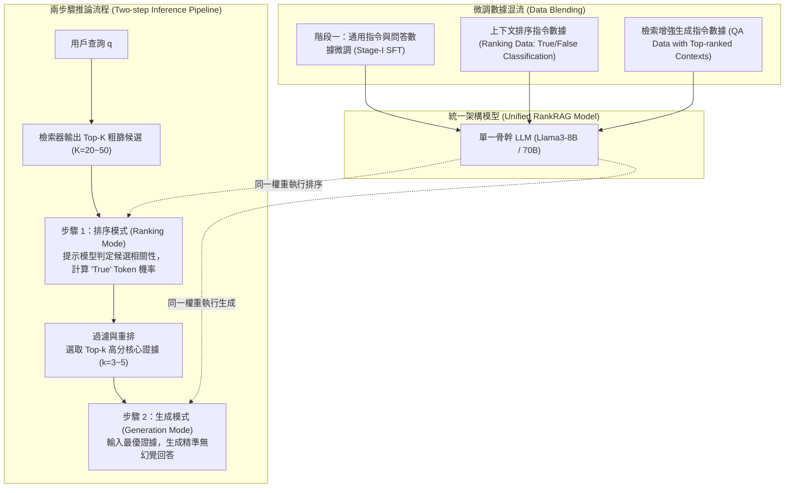

# RankRAG: Unifying Context Ranking with Retrieval-Augmented Generation in LLMs

## 1. 一話摘要 (TL;DR)
RankRAG 提出了一種將「上下文排序（Context Ranking）」與「答案生成（Answer Generation）」統整至單一大語言模型的指令微調框架；透過讓同一 LLM 兼具相關性打分與生成能力，僅具備 8B 參數的 Llama3-RankRAG 在 9 個知識密集型基準測試上取得 52.6 的平均分，全面超越未排序基準（40.8）、70B 大模型（47.1）乃至 GPT-4（42.0）。

---

## 2. 研究背景與問題定義 (Problem Statement)

### 2.1 傳統 RAG 管線中重排器與生成器的分離脫節
典型的 RAG 系統通常採用「檢索器 (Retriever) $\to$ 專用重排器 (Cross-Encoder Reranker) $\to$ 大語言模型生成器 (LLM Generator)」的三階段瀑布流架構：
1. **模組目標不對齊**：重排器通常基於小型 BERT 架構（如 MiniLM 或 BGE-reranker）訓練，其排序標準僅基於字面與淺層語義相關性，無法理解後續 LLM 生成回答時真正需要的邏輯證據（Evidence）。
2. **部署維護複雜度倍增**：線上服務需同時常駐檢索索引、重排模型顯存與 LLM 實例，通信延遲與工程維護成本高昂。
3. **長上下文雜訊干擾 (Lost-in-the-Middle)**：若直接跳過重排將檢索出的 Top-$k$（如 $k=20$ 或 $50$）文本全部塞入 LLM，無關雜訊會嚴重誘發模型幻覺或注意力稀釋。

### 2.2 核心研究假設
- 單一 LLM 是否可以直接透過指令微調（Instruction Tuning），同時掌握高精度的「相關性判定」與「上下文整合生成」兩種異質能力？
- 讓 LLM 自己挑選最適合其回答的文檔（Self-Ranking），其品質將顯著優於第三方獨立重排模型。

---

## 3. 核心方法與技術架構 (Methodology & Architecture)

RankRAG 提出了兩階段指令微調框架與整合推論管線：

### 圖中節點對照
- `RAR (Retrieval-Augmented Ranking)`：提示詞要求模型對 (Query, Document) 對進行二元判定，以輸出 `True` 的 Logits 概率作為相關性分數。
- `RQA (Retrieval-Augmented QA)`：將精選的高相關證據輸入模型生成答案。
- `Unified RankRAG Model`：在推論時無需切換權重，同一實例透過不同的 Prompt 模板先執行批次並行排序，再執行單次答案生成。

---

## 4. 主要實驗結果與證據 (Empirical Results & Evidence)

RankRAG 在 NeurIPS 2024 原文（Pages 6–8）中對 9 個跨領域數據集進行了嚴格的零樣本評估：

### 4.1 核心基準對比 (Table 2, Page 7 & Table 3, Page 8)
評估在開放域問答（NQ, TriviaQA, PopQA）、多跳問答（HotpotQA, 2WikiMultiHopQA）、事實驗證（FEVER）與對話式問答（Doc2Dial, TopiOCQA, INSCIT）上的表現：

| 評測模型 (Model) | 參數量 | NQ (EM) | TriviaQA (EM) | PopQA (Acc) | HotpotQA (F1) | 2WikimQA (F1) | FEVER (Acc) | 平均分 (Avg. 9 tasks) |
|---|---|---|---|---|---|---|---|---|
| **GPT-3.5-turbo** (w/o RAG) | Proprietary | 38.6 | 82.9 | 32.2 | 42.0 | 30.4 | 82.7 | 38.5 |
| **GPT-4-0613** (w/o RAG) | Proprietary | 40.3 | 84.8 | 34.8 | 46.9 | 36.6 | 87.7 | 42.0 |
| **Atlas** (Retriever+Gen) | 11B | 26.7 | 56.9 | – | 34.7 | – | 77.0 | – |
| **RA-DIT** | 65B | 35.2 | 75.4 | – | 39.7 | – | 80.7 | – |
| **Llama3-Instruct** | 8B | 30.9 | 70.7 | 55.8 | 35.8 | 25.2 | 88.9 | 40.8 |
| **Llama3-Instruct** | 70B | 42.7 | 82.4 | 56.4 | 43.3 | 27.9 | 91.4 | 47.1 |
| **Llama3-RankRAG (Ours)** | **8B** | **50.6** | **82.9** | **64.1** | **46.7** | **36.9** | **92.0** | **52.6** |

*註：Llama3-RankRAG 8B 的零樣本平均得分達 52.6，相比 Llama3-Instruct 8B 基準（40.8）提升近 12 個百分點，且超越 70B 參數的 Llama3（47.1）與 GPT-4（42.0）。出處：Table 2, Page 7 & Table 3, Page 8。*

### 4.2 消融實驗分析 (Table 3, Page 8)
- **移除推論期重排 (w/o reranking)**：平均得分由 52.6 驟降至 49.8（NQ EM 從 50.6 跌至 48.0，PopQA Acc 從 64.1 跌至 59.0），證明動態精選上下文對消除噪聲至關重要。
- **僅用第一階段微調 (Stage-I SFT Only)**：平均得分僅 42.2，證實 Ranking 與 QA 聯合指令微調（Stage-II）是引發能力突變的核心因素。

---

## 5. 優勢、限制及 Trade-offs (Strengths, Limitations & Trade-offs)

### 5.1 優勢
1. **極致統一與簡約**：消除了對外部獨立 Cross-Encoder 的依賴，以單一模型完成全流程自給自足（Self-contained）。
2. **小模型超越大模型 (Parameter Efficiency)**：透過精準排序，8B 模型在知識密集型任務上直接碾壓未經排序的 70B 級別模型。
3. **長文本抗噪能力強**：即使初始檢索器輸入大量不相關干擾項，LLM 自身的相關性排序機制能有效將關鍵證據提升至 Prompt 最前段。

### 5.2 限制與 Trade-offs
1. **首字延遲增加 (TTFT)**：在推論期模型需要先對 Top-K 候選進行打分（雖然可並行 Forward Pass），相比直接生成會增加額外的排隊延遲。
2. **對極端長篇生成覆蓋有限**：本研究主要針對 Short-answer QA 與 Fact Verification，對於長達數千字的深度研究報告生成，重排後的上下文窗口整合仍面臨分塊挑戰。

---

## 6. 對本專案研究領域的實際意義 (Implications for Research Domains)

1. **Domain 03 (Advanced RAG 與檢索技術)**：確立了「端到端一體化 Rerank-Generate」的演進趨勢，證明現代 LLM 本身就是最強大的相關性打分器。
2. **Domain 16 (Context 應用與 Faithfulness)**：為對抗「Lost-in-the-Middle」提供了一種主動過濾雜訊的標準解決方案。

---

## 7. 原始來源及相關筆記連結 (Sources & Related Notes)

### 原始文獻
- **arXiv ID**：`2407.02485`
- **NeurIPS 2024 正式出版**：[https://arxiv.org/abs/2407.02485](https://arxiv.org/abs/2407.02485)
- **本地 PDF**：`[[Papers/03 - RAG & Retrieval/(NeurIPS 2024-12) RankRAG - Unifying Context Ranking with Retrieval-Augmented Generation in LLMs.pdf|開啟本地 PDF 檔案]]`

### 關聯專題與論文筆記
- **專題報告**：
  - `[[02 - 研究領域專題 (Research Domains)/Domain 03 - Advanced RAG 與檢索技術 (Dense, Late Interaction, Graph)|Domain 03 - Advanced RAG 與檢索技術]]`
  - `[[02 - 研究領域專題 (Research Domains)/Domain 16 - Context 應用與 Faithfulness 監控 (Lost in the Middle, Attribution)|Domain 16 - Context 應用與真實性]]`
- **同領域代表性論文**：
  - `[[03 - 論文庫 (Literature Notes)/03 - RAG & Retrieval/(ICLR 2024-05) RA-DIT - Retrieval-Augmented Dual Instruction Tuning|(ICLR 2024-05) RA-DIT]]`
  - `[[03 - 論文庫 (Literature Notes)/03 - RAG & Retrieval/(NAACL 2024-06) REPLUG - Retrieval-Augmented Black-Box Language Models|(NAACL 2024-06) REPLUG]]`
  - `[[03 - 論文庫 (Literature Notes)/03 - RAG & Retrieval/(EMNLP 2024-11) Chain-of-Note - Enhancing Robustness in Retrieval-Augmented Language Models|(EMNLP 2024-11) Chain-of-Note]]`
