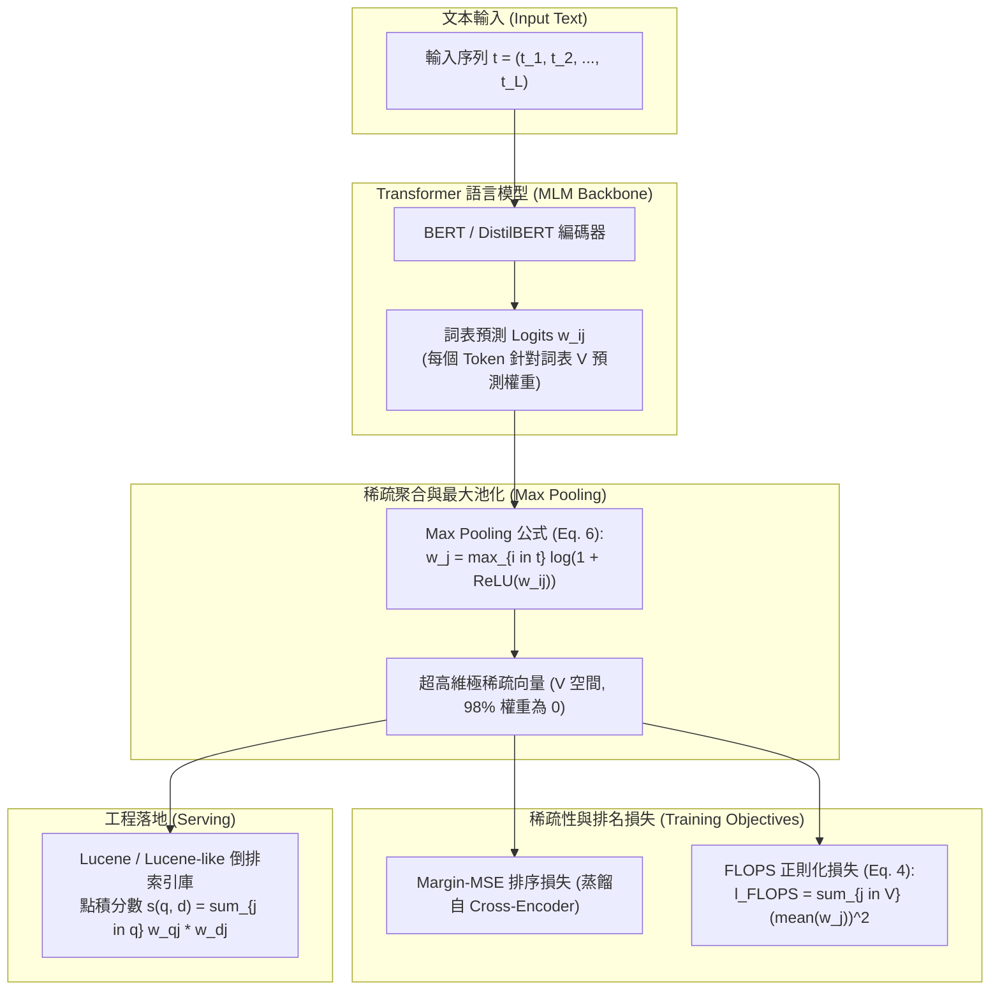

# SPLADE v2: Sparse Lexical and Expansion Model for Information Retrieval

## 1. 一話摘要 (TL;DR)
SPLADE v2 透過引入詞彙維度的最大池化（Max-pooling）、稀疏性正則化（FLOPS Regularization）與 Cross-Encoder 蒸餾機制（DistilSPLADE-max），實現了端到端可學的神經稀疏檢索（Sparse Retrieval）；在完全相容傳統倒排索引（Inverted Index）的高效架構下，MS MARCO 開發集 MRR@10 達到 0.368，TREC DL 2019 NDCG@10 達 0.729，全面匹敵甚至超越頂級稠密檢索器。

---

## 2. 研究背景與問題定義 (Problem Statement)

### 2.1 稠密檢索 vs. 傳統稀疏檢索的根本矛盾
在神經資訊檢索領域，兩大主流範式各有顯著痛點：
1. **稠密雙塔檢索（Dense Dual-Encoders）的代價**：
   - 依賴百萬維高維向量空間（768 或 1024 維浮點數），無法直接使用經典搜索引擎（如 Lucene、Elasticsearch）成熟的倒排索引。
   - 向量索引（HNSW、IVF-PQ）需要佔用極大內存與顯存，且面對專業詞彙（Out-of-Vocabulary / 專有名詞）的字面匹配能力脆弱。
2. **傳統稀疏檢索（BM25 / doc2query）的局限**：
   - BM25 無法克服「詞彙失配（Vocabulary Mismatch）」問題，同義詞或上位詞無法自然對齊。
   - 傳統擴充方法（如 doc2query-T5）是管道分離的，生成階段與後續倒排索引評分缺乏端到端梯度優化。

### 2.2 核心研究假設
- 能否利用預訓練 Masked Language Model (MLM) 的整個詞表（如 30,522 維），將文本映射為極度稀疏的高維詞權重向量？
- 透過適當的稀疏性正則約束與詞級 Max-pooling，模型能自發學會「隱式查詢擴充（Query Expansion）」與「精準權重分配」，兼顧倒排索引的高效性與神經表徵的泛化力。

---

## 3. 核心方法與技術架構 (Methodology & Architecture)

SPLADE v2 將 Transformer 輸出的 Token 級隱藏狀態投射至整個詞表空間，並以 Max-pooling 聚合成全域稀疏權重：

### 圖中節點對照
- `MaxPool (Equation 6)`：改進初代 SPLADE 的求和池化（Sum-pooling），採用 $w_j = \max_{i \in t} \log(1 + \text{ReLU}(w_{ij}))$，有效抑制高頻常見詞的過度累積，顯著增強語義突出度。
- `FLOPS Regularization (Equation 4 & 5)`：$\ell_{FLOPS} = \sum_{j \in V} \bar{a}_j^2$，分別對查詢 $\lambda_q$ 與文檔 $\lambda_d$ 施加正則約束，迫使向量在倒排索引中的平均長度嚴格受限。
- `DistilSPLADE-max`：採用 Cross-Encoder (MiniLM) 生成的難負例（Hard Negatives）與軟標籤（Margin-MSE Loss）進行知識蒸餾。

---

## 4. 主要實驗結果與證據 (Empirical Results & Evidence)

SPLADE v2 在 SIGIR 2022 原文（Pages 2353–2358）中展示了頂級檢索性能：

### 4.1 MS MARCO 與 TREC DL 2019 主榜單 (Table 1, Page 4)
對比經典稀疏方案、稠密雙塔與 SPLADE v2：

| 檢索方法 (Method) | 模型類型 | MS MARCO dev MRR@10 | MS MARCO dev R@1000 | TREC DL 2019 NDCG@10 | TREC DL 2019 R@1000 |
|---|---|---|---|---|---|
| **BM25** | 稀疏 (Lexical) | 0.184 | 0.853 | 0.506 | 0.745 |
| **DeepCT** | 稀疏 (Term-weight) | 0.243 | 0.913 | 0.551 | 0.756 |
| **doc2query-T5** | 稀疏 (Expansion) | 0.277 | 0.947 | 0.642 | 0.827 |
| **COIL-tok** | 稀疏 (Lexical) | 0.341 | 0.949 | 0.660 | – |
| **DeepImpact** | 稀疏 (Lexical) | 0.326 | 0.948 | 0.695 | – |
| **SPLADE (初代)** | 稀疏 (Neural) | 0.322 | 0.955 | 0.665 | 0.813 |
| **ANCE** | 稠密 (Dense) | 0.330 | 0.959 | 0.648 | – |
| **TAS-B** | 稠密 (Dense) | 0.347 | 0.978 | 0.717 | 0.843 |
| **RocketQA** | 稠密 (Dense) | 0.370 | 0.979 | – | – |
| **SPLADE-max (Ours)** | 稀疏 (Neural) | 0.340 | 0.965 | 0.684 | 0.851 |
| **SPLADE-doc (Ours)** | 稀疏 (無查詢擴充) | 0.322 | 0.946 | 0.667 | 0.747 |
| **DistilSPLADE-max (Ours)** | 稀疏 (蒸餾增強) | **0.368** | **0.979** | **0.729** | **0.865** |

*註：DistilSPLADE-max 在 MS MARCO dev 上達到 0.368 MRR@10，完全超越 TAS-B 稠密模型（0.347），並在 TREC DL 2019 上取得 0.729 NDCG@10 與 0.865 Recall@1000，樹立了神經稀疏檢索的新高標。出處：Table 1, Page 4。*

### 4.2 模組消融與推論效率分析 (Section 4.1 & 4.2, Page 4)
- **Max Pooling 收益**：相比初代表現，Max-pooling 在 MS MARCO 與 TREC 上平均直接提升近 **2 個百分點** 的 MRR@10 與 NDCG@10。
- **SPLADE-doc 免查詢編碼**：文檔僅在離線端擴充並建立索引，在查詢端完全不需 GPU 前向計算（Query latency 近似於 BM25），依然能達到 0.322 MRR@10，兼顧極致吞吐與精確度。

---

## 5. 優勢、限制及 Trade-offs (Strengths, Limitations & Trade-offs)

### 5.1 優勢
1. **天然相容工業級倒排索引**：可以直接輸出為 Lucene / Elasticsearch 可解析的 Term-Frequency 格式，無需重構底層向量資料庫。
2. **高可解釋性**：每個維度嚴格對應詞表中的單詞，工程師可直接檢視文檔或查詢被擴充了哪些關鍵詞（如查詢「python」擴充出「programming, code, syntax」）。
3. **字面精確與語義泛化兼備**：既保有 BM25 精確命中關鍵代碼、專有名詞的特性，又具備 BERT 級的同義擴展能力。

### 5.2 限制與 Trade-offs
1. **倒排索引體積膨脹**：由於詞擴充機制，每個文檔的非零項顯著多於原始文本（平均由 50–100 個詞增加至數百個），使倒排索引磁碟空間增加 2–4 倍。
2. **FLOPS 正則化超參數敏感**：若 $\lambda_q, \lambda_d$ 設置過小，檢索延遲會因索引過密而顯著增加；若設置過大，則語義擴充能力被過度壓制。

---

## 6. 對本專案研究領域的實際意義 (Implications for Research Domains)

1. **D05 (Query Understanding & Retrieval)**：在 Dense Retrieval 與 Sparse BM25 之間建立了最強大的橋樑，是構建 Hybrid Search（混合檢索）系統不可或缺的核心組件。
2. **Domain 02 (脈絡壓縮與效率)**：展現了如何透過正則化約束控制推論 FLOPs，對長文本檢索管線中的成本與延遲平衡具有極佳借鑑價值。

---

## 7. 原始來源及相關筆記連結 (Sources & Related Notes)

### 原始文獻
- **ACM Digital Library**：[https://dl.acm.org/doi/10.1145/3477495.3531857](https://dl.acm.org/doi/10.1145/3477495.3531857)
- **arXiv ID**：`2109.10086`
- **DOI**：`10.1145/3477495.3531857`
- **本地 PDF**：`[[Papers/03 - RAG & Retrieval/(SIGIR 2022-07) SPLADE v2 - Sparse Lexical and Expansion Model for Information Retrieval.pdf|開啟本地 PDF 檔案]]`

### 關聯專題與論文筆記
- **專題報告**：
  - `[[02 - 研究領域專題 (Research Domains)/Domain 05 - Query Understanding & Retrieval|D05 Query Understanding & Retrieval]]`
  - `[[02 - 研究領域專題 (Research Domains)/Domain 05 - Query Understanding & Retrieval|D05 Query Understanding & Retrieval]]`
- **同領域代表性論文**：
  - `[[03 - 論文庫 (Literature Notes)/03 - RAG & Retrieval/(TMLR 2022-08) Unsupervised Dense Information Retrieval with Contrastive Learning|(TMLR 2022-08) Contriever]]`
  - `[[03 - 論文庫 (Literature Notes)/03 - RAG & Retrieval/(NAACL 2022-07) ColBERTv2 - Effective and Efficient Retrieval via Lightweight Late Interaction|(NAACL 2022-07) ColBERTv2]]`
  - `[[03 - 論文庫 (Literature Notes)/06 - Benchmarks & Evaluation/(NeurIPS 2021-12) BEIR - A Heterogeneous Benchmark for Zero-shot Evaluation of Information Retrieval Models|(NeurIPS 2021-12) BEIR]]`
