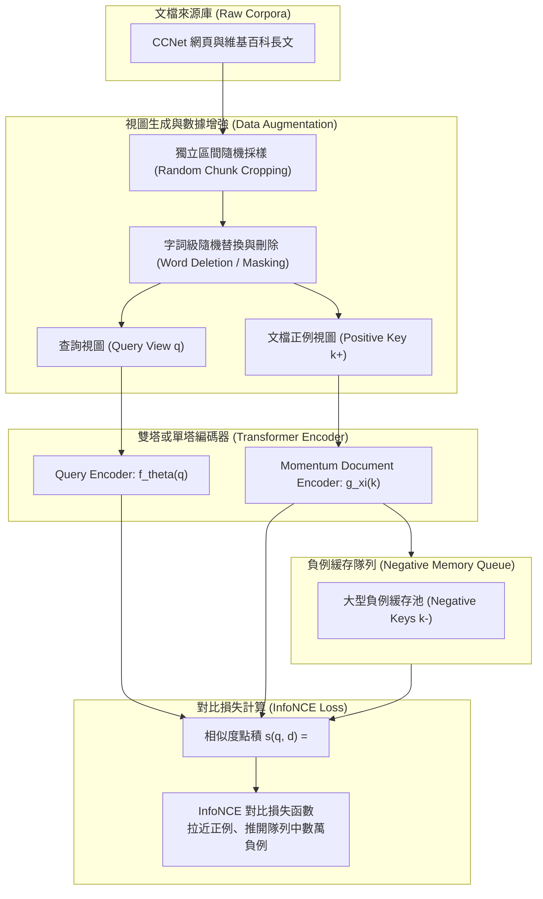

# Unsupervised Dense Information Retrieval with Contrastive Learning (Contriever)

## 1. 一話摘要 (TL;DR)
Contriever 證明了無需任何人工標註的問答對或檢索相關性標籤，僅依靠文檔隨機裁切與字詞替換的無監督對比學習（Contrastive Learning），即可預訓練出超越 BM25 的通用稠密檢索器（Dense Retriever），在 BEIR 基準 15 個數據集中的 11 個上超越 BM25，並在後續監督微調與 Few-shot 場景下取得 SOTA 表現。

---

## 2. 研究背景與問題定義 (Problem Statement)

### 2.1 稠密檢索 (Dense Retrieval) 對監督數據的過度依賴
傳統稠密雙編碼器（如 DPR、ANCE 等）的高度成功主要建立在海量標註數據（如 MS MARCO、Natural Questions）之上：
1. **監督標註依賴嚴重**：在沒有大規模標註數據的新領域或低資源語言中，雙編碼器表現往往斷崖式暴跌，甚至顯著落後於基於詞頻統計的經典 BM25。
2. **早期無監督方案（如 ICT）效果受限**：Inverse Cloze Task (ICT) 通過挖掉一個句子作為虛擬查詢來訓練，但語義上下文受限，且在零樣本轉移評測（如 BEIR）中全面落後於 BM25。
3. **語義崩塌難題**：純自監督 BERT 向量存在各向異性（Anisotropy）與聚攏效應，若不施加嚴格的對比約束，向量點積難以反映真正的檢索相關性。

### 2.2 核心研究假設
- 資訊檢索中的「正負例關聯」本質上可以被視為視覺領域的「同一圖像的不同視圖（Views）」。
- 透過在連續長文檔中抽取兩個重疊或相鄰的文本片段，並結合數據增強（詞替換、隨機刪除），即可模擬真實查詢與候選文檔的相關性。

---

## 3. 核心方法與技術架構 (Methodology & Architecture)

Contriever 採用動量隊列（Momentum Queue）與對比學習目標構建無監督檢索器：

### 圖中節點對照
- `Crop / Perturb`：正例採樣自同一文檔的不同連續片段，並輔以隨機刪除以避免模型走「子字完全重合」的快捷方式（Shortcuts）。
- `Momentum Document Encoder / Memory Queue`：借鑑 MoCo 機制，維護大小達數萬的負例向量緩存隊列，使單步優化覆蓋大批次負例。
- `InfoNCE`：溫度係數 $\tau$ 縮放下的對比損失，驅使編碼器自發學習跨詞面表達的深層語義關聯。

---

## 4. 主要實驗結果與證據 (Empirical Results & Evidence)

Contriever 在 TMLR 2022 原文（Pages 6–9）中提供了詳盡的實驗對比：

### 4.1 BEIR 基準測試結果 (Table 2, Page 8)
在不使用任何重新排序器（Re-ranker）的條件下，對比多種主流雙編碼器在 BEIR 14 個公開數據集上的 nDCG@10 分數：

| 模型方案 (Model) | MS MARCO | NQ | HotpotQA | Quora | FEVER | SciFact | BEIR 平均 (Avg. 14 datasets) |
|---|---|---|---|---|---|---|---|
| **BM25** | 22.8 | 32.9 | 60.3 | 78.9 | 75.3 | 66.5 | 43.0 |
| **BM25 + Cross-Encoder** | 41.3 | 53.3 | 70.7 | 82.5 | 81.9 | 68.8 | 48.6 |
| **DPR** | 17.7 | 47.4 | 39.1 | 24.8 | 56.2 | 31.8 | 25.5 |
| **ANCE** | 38.8 | 44.6 | 45.6 | 85.2 | 66.9 | 50.7 | 40.5 |
| **TAS-B** | 40.8 | 46.3 | 58.4 | 83.5 | 70.0 | 64.3 | 42.8 |
| **ColBERT** | 40.1 | 52.4 | 59.3 | 85.4 | 77.1 | 67.1 | 44.4 |
| **Contriever (Ours)** | **40.7** | **49.8** | **63.8** | **86.5** | **75.8** | **67.7** | **46.6** |
| **Contriever + Cross-Encoder** | **47.0** | **57.7** | **71.5** | 82.4 | **81.9** | **69.2** | **50.2** |

*註：Contriever 在無監督預訓練下，微調後的平均 nDCG@10 達到 46.6，超越所有密集雙塔基準（包括 TAS-B 的 42.8 與 ColBERT 的 44.4），結合 Cross-Encoder 後達到 50.2。出處：Table 2, Page 8。*

### 4.2 Few-shot 小樣本遷移表現 (Table 3, Page 8)
在極度缺乏標註查詢的場景下，測試各模型在領域內微調後的 nDCG@10：

| 評測模型 (Model) | SciFact (729 查詢) | NFCorpus (2,590 查詢) | FiQA (5,500 查詢) |
|---|---|---|---|
| **BM25** (無法利用標註調整權重) | 66.5 | 32.5 | 23.6 |
| **BERT (從頭微調)** | 75.2 | 29.9 | 26.1 |
| **Contriever (僅自監督預訓練)** | 84.0 | 33.6 | 36.4 |
| **Contriever (先 MS MARCO 微調)** | **84.8** | **35.8** | **38.1** |

*註：在僅有 729 條查詢的 SciFact 上，Contriever 取得 84.0 nDCG@10，大幅超越 BM25 的 66.5，展現出極強的 Few-shot 適應性。出處：Table 3, Page 8。*

---

## 5. 優勢、限制及 Trade-offs (Strengths, Limitations & Trade-offs)

### 5.1 優勢
1. **擺脫標註瓶頸**：證明無監督數據增強足以構建強大的檢索特徵表徵空間。
2. **領域泛化極強**：在 BEIR 上徹底解決了早期 DPR「只在訓練集同分佈數據上表現好、跨領域不如 BM25」的嚴重複現性問題。
3. **推論架構輕量**：標準單向量雙塔架構，推論時可直接依賴 FAISS / HNSW 向量索引，延遲遠低於 ColBERT 或 Cross-Encoder。

### 5.2 限制與 Trade-offs
1. **罕見專有名詞與精確字符匹配短板**：面對代碼變數、生僻藥品編號或特定產品型號時，純語義稠密向量仍不及 BM25 的字面精確命中。
2. **預訓練計算量龐大**：為了獲得高質量的負例空間，需要極大的批次大小或長維度隊列緩存，預訓練需要多卡 GPU 集群支持。

---

## 6. 對本專案研究領域的實際意義 (Implications for Research Domains)

1. **D05 (Query Understanding & Retrieval)**：奠定了現代稠密檢索預訓練的核心技術標準，後續的 BGE、E5 等模型均廣泛繼承了 Contriever 的對比學習架構。
2. **D13 (RAG Evaluation & Failure Attribution)**：作為 BEIR 基準測試中密集成型方案的核心對照基線（Strong Baseline），是檢驗任何新檢索器是否具備真實泛化能力的試金石。

---

## 7. 原始來源及相關筆記連結 (Sources & Related Notes)

### 原始文獻
- **TMLR 正式出版**：[https://openreview.net/forum?id=jKN1pXi7b0](https://openreview.net/forum?id=jKN1pXi7b0)
- **arXiv ID**：`2112.09118`
- **本地 PDF**：`[[Papers/03 - RAG & Retrieval/(TMLR 2022-08) Unsupervised Dense Information Retrieval with Contrastive Learning.pdf|開啟本地 PDF 檔案]]`

### 關聯專題與論文筆記
- **專題報告**：
  - `[[02 - 研究領域專題 (Research Domains)/Canonical RAG Domains/Domain 05 - Query Understanding & Retrieval|D05 Query Understanding & Retrieval]]`
  - `[[02 - 研究領域專題 (Research Domains)/Canonical RAG Domains/Domain 13 - RAG Evaluation & Failure Attribution|D13 RAG Evaluation & Failure Attribution]]`
- **同領域代表性論文**：
  - `[[03 - 論文庫 (Literature Notes)/03 - RAG & Retrieval/(NAACL 2022-07) ColBERTv2 - Effective and Efficient Retrieval via Lightweight Late Interaction|(NAACL 2022-07) ColBERTv2]]`
  - `[[03 - 論文庫 (Literature Notes)/03 - RAG & Retrieval/(SIGIR 2022-07) SPLADE v2 - Sparse Lexical and Expansion Model for Information Retrieval|(SIGIR 2022-07) SPLADE v2]]`
  - `[[03 - 論文庫 (Literature Notes)/06 - Benchmarks & Evaluation/(NeurIPS 2021-12) BEIR - A Heterogeneous Benchmark for Zero-shot Evaluation of Information Retrieval Models|(NeurIPS 2021-12) BEIR]]`
