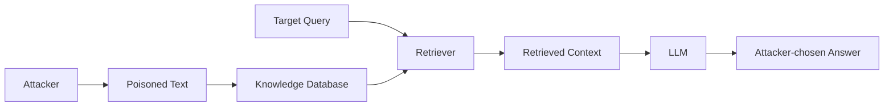

# PoisonedRAG: Knowledge Corruption Attacks to Retrieval-Augmented Generation of Large Language Models

## 一話摘要 (TL;DR)
PoisonedRAG 把 **RAG knowledge database 本身**視為新的攻擊面：攻擊者只要注入少量特製文本，就可能讓 retriever 把惡意內容送進 LLM，進而誘導模型對指定問題輸出攻擊者指定答案。

## Threat Model

攻擊者：
- 可向 RAG knowledge database 注入少量 malicious texts；
- 不需要讀取整個 knowledge database；
- 不需要存取或 query generator LLM；
- 依是否知道 retriever parameters 分成 white-box / black-box。

攻擊目標是讓指定 target question 產生指定 target answer。

## 核心方法

有效 malicious text 必須同時滿足兩件事：

1. **Retrieval condition**：它要能被 target query 檢索到；
2. **Generation condition**：進入 context 後要能誘導 LLM 產生 target answer。

PoisonedRAG 因此把攻擊文字拆成對應這兩個目標的子內容，再組合成可被 retrieval + generation pipeline 利用的 poisoned document。



## 主要實驗結果

論文在 Natural Questions、HotpotQA、MS MARCO、多個 LLM 與多種 RAG settings 上評估。

- 論文摘要報告：對每個 target question 注入 **5 個 malicious texts** 時，可在百萬級 knowledge database 上達到約 **90% attack success rate**。
- 論文正文在 NQ black-box setting 報告最高約 **97% ASR**（5 malicious texts / target question）。
- 作者測試的若干防禦仍不足以完全抵抗此攻擊。

這些結果描述特定 threat model 與 experimental setup，不能直接外推成所有 production RAG 都有相同攻擊成功率。

## 為何是 D14，而不是一般 LLM Safety

攻擊成功的關鍵不是單純 jailbreak，而是利用：

```text
external corpus
→ retrieval ranking
→ retrieved context
→ downstream generation
```

因此 attack surface 由 **RAG knowledge database + retriever + generator interaction** 產生，是 RAG-specific security 問題。

## Scope / Trade-offs

- 主要是 knowledge corruption / corpus poisoning；不等同 prompt injection、privacy leakage、ACL/tenant isolation 的完整 security coverage。
- 論文證明「retrieved document 不應被當成 trusted instruction / trusted truth」，但不是完整 deployment-security framework。
- D14 還需要獨立的 systems/serving 文獻；security paper 不能替代 latency / scheduling / observability research。

## Sources

- USENIX Security 2025: https://www.usenix.org/conference/usenixsecurity25/presentation/zou-poisonedrag
- arXiv: https://arxiv.org/abs/2402.07867
- [[02 - 研究領域專題 (Research Domains)/Domain 14 - RAG Systems, Robustness & Security|D14 RAG Systems, Robustness & Security]]
