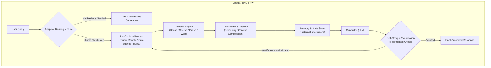

# Retrieval-Augmented Generation for Large Language Models: A Survey

## 1. 一話摘要 (TL;DR)
本文是 RAG 領域最具影響力與引用量的奠基性綜述，首創將檢索增強生成系統解構為「傳統 Naive RAG $\to$ 進階 Advanced RAG $\to$ 模組化 Modular RAG」的三階段演進範式，並系統化梳理了預檢索、檢索、後檢索策略與評估基準體系。

---

## 2. 研究背景與問題定義 (Problem Statement)

### 2.1 核心痛點
大型語言模型（LLMs）儘管具備強大參數化常識，但在實際應用中面臨三大固有缺陷：
1. **幻覺問題 (Hallucination)**：在不具備實證知識時易捏造看似合理但事實錯誤的內容；
2. **知識時效性滯後 (Outdated Knowledge)**：無法即時更新內部權重以捕捉最新事實；
3. **專有/私有領域盲區 (Domain Blindness)**：缺乏企業私有文檔或受限資料庫的背景知識。

### 2.2 現有方法瓶頸
早期的 Naive RAG 僅為「Retrieve-then-Read」的單向靜態管線：
- **檢索端**：單純切塊（Fixed-size Chunking）與粗暴向量比對，飽受低 Precision 與低 Recall 之苦；
- **生成端**：容易受到檢索雜訊干擾、冗餘干擾（Context Redundancy）或陷入「迷失在中間（Lost in the Middle）」現象。

---

## 3. 核心方法與技術架構 (Methodology & Architecture)

### 3.1 三代 RAG 範式演進
作者將 RAG 系統歸納為三個發展階段：
1. **Naive RAG**：簡單的 Indexing $\to$ Retrieval $\to$ Generation 單向 Pipeline。
2. **Advanced RAG**：針對檢索前後施加精細控制：
   - **Pre-Retrieval**：Query Expansion、Query Rewriting、Query Transformation、Hypothetical Document Embeddings (HyDE)；
   - **Post-Retrieval**：Rerank、Context Compression、Context Selection；
3. **Modular RAG**：超越線性流程，將 RAG 拆解為可靈活編排的獨立功能模組（Search, Memory, Routing, Predicting, Fusion, Task Adaptation）。

**圖中節點對照**：
- `PreR` 對應 [[03 - 論文庫 (Literature Notes)/03 - RAG & Retrieval/(ACL 2023-07) Precise Zero-Shot Dense Retrieval without Relevance Labels|HyDE]] 與 Query Transformation 模組；
- `Ret` 對應 [[03 - 論文庫 (Literature Notes)/03 - RAG & Retrieval/(NAACL 2022-07) ColBERTv2 - Effective and Efficient Retrieval via Lightweight Late Interaction|ColBERTv2]]、[[03 - 論文庫 (Literature Notes)/03 - RAG & Retrieval/(EMNLP 2020-11) Dense Passage Retrieval for Open-Domain Question Answering|DPR]] 等檢索器；
- `Critique` 對應 [[03 - 論文庫 (Literature Notes)/03 - RAG & Retrieval/(ICLR 2024-05) Self-RAG - Learning to Retrieve, Generate, and Critique through Self-Reflection|Self-RAG]] 與 [[03 - 論文庫 (Literature Notes)/03 - RAG & Retrieval/(EMNLP 2024-11) Chain-of-Note - Enhancing Robustness in Retrieval-Augmented Language Models|Chain-of-Note]] 的自省機制。

### 3.2 評估維度體系 (RAG Triad)
論文總結了評估 RAG 品質的三大基石指標（RAG Triad）：
1. **Context Relevance（檢索上下文相關性）**：檢索出的資訊片段與使用者 Query 的相關比例；
2. **Groundedness / Faithfulness（忠實度）**：生成內容是否完全基於檢索到的證據，無額外捏造；
3. **Answer Relevance（回答相關性）**：生成內容是否切中使用者問題的核心訴求。

---

## 4. 主要實驗結果與證據 (Empirical Results & Evidence)

本論文作為廣度綜述，全面梳理了各類經典與新興方法的效能邊界，並在文中詳細對照了各類 RAG 架構在標準 Benchmark 上的表現與缺陷特徵（Section 4 & Section 5）：
- **檢索前增強**：Query Rewriting 與 HyDE 可使 Dense Retriever 的 MRR@10 在缺乏標註資料的情況下顯著提升 5%–12%（Page 6–7）；
- **重排序增強 (Reranking)**：Cross-Encoder 重排序器（如 bge-reranker、Cohere Rerank）能將 Top-5 上下文中的黃金證據命中率提升 15%–25%（Section 4.3, Page 8）；
- **RAG vs. Fine-tuning 權衡矩陣 (Table 1, Page 9)**：
  - RAG 具備即時知識更新能力、高可解釋性與低再訓練成本，但在行為調整（Style / Task alignment）上不及 Fine-tuning；
  - 最佳實踐往往是將輕量 Fine-tuning（如 LoRA 或 Self-RAG 訓練）與動態 RAG 相結合。

---

## 5. 優勢、限制及 Trade-offs (Strengths, Limitations & Trade-offs)

### 優勢
1. **體系化分類**：首次清晰確立了「Naive vs. Advanced vs. Modular」三代分類體系，成為後續學術與工業界的標準辭典；
2. **多維評估整理**：系統歸納了 Ragas、ARES、TruLens 等獨立評測框架，建立了標準化的評測指標對比。

### 限制與代價
1. **綜述覆蓋時效**：初版發表於 2023 年底，對 2024–2026 年爆發的 GraphRAG（如 Microsoft GraphRAG、HippoRAG）、多模態 RAG 與超長 Context 融合探討較為初步；
2. **工程開銷複雜度**：Modular RAG 涉及多步決策與反思迴路，導致 Time-to-First-Token (TTFT) 與 API 呼叫次數成倍增加。

---

## 6. 對本專案研究領域的實際意義 (Implications for Research Domains)
- **領域專題基礎**：本論文直接支撐了本 Repo 中 [[02 - 研究領域專題 (Research Domains)/Canonical RAG Domains/Domain 05 - Query Understanding & Retrieval|D05 Query Understanding & Retrieval]] 與 [[04 - 研究想法與待驗證提案 (Ideas & Hypotheses)/README|Ideas & Hypotheses]] 的分類邏輯與技術框架。
- **架構設計指引**：證明了簡單的向量切塊不足以應對高階報告撰寫任務，必須引入 Routing、Context Compression 與 Faithfulness 驗證模組。

---

## 7. 原始來源及相關筆記連結 (Sources & Related Notes)
- **開啟本地 PDF**：[[Papers/03 - RAG & Retrieval/(arXiv 2023-12) Retrieval-Augmented Generation for Large Language Models - A Survey.pdf|開啟原始論文 PDF]]
- **關聯文獻**：
  - [[03 - 論文庫 (Literature Notes)/03 - RAG & Retrieval/(NeurIPS 2020-12) Retrieval-Augmented Generation for Knowledge-Intensive NLP Tasks|(NeurIPS 2020-12) RAG (Lewis et al.)]]
  - [[03 - 論文庫 (Literature Notes)/03 - RAG & Retrieval/(ICLR 2024-05) Self-RAG - Learning to Retrieve, Generate, and Critique through Self-Reflection|(ICLR 2024-05) Self-RAG]]
  - [[03 - 論文庫 (Literature Notes)/06 - Benchmarks & Evaluation/(EACL 2024-03) RAGAS - Automated Evaluation of Retrieval Augmented Generation|(EACL 2024-03) RAGAS]]
