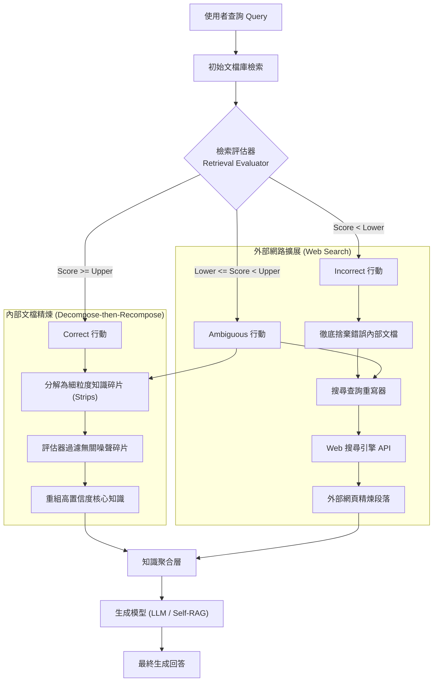

# Corrective Retrieval Augmented Generation (CRAG)

> [!INFO] 論文元數據 (Metadata)
> - **Paper ID**：`Yan2024_CRAG`
> - **作者**：Shi-Qi Yan, Jia-Chen Gu, Yun Zhu, Zhen-Hua Ling (USTC, UCLA, Google DeepMind)
> - **預印本初次發布年份 (Preprint)**：2024 (arXiv:2401.15884)
> - **正式發表年份 / 會議或期刊 (Venue)**：arXiv (Preprint)
> - **DOI**：[10.48550/arXiv.2401.15884](https://doi.org/10.48550/arXiv.2401.15884)
> - **arXiv**：[2401.15884](https://arxiv.org/abs/2401.15884)
> - **驗證狀態**：`verified` (已比對原文全文與論文 PDF)
> - **本地 PDF 連結**：[[Papers/03 - RAG & Retrieval/(arXiv 2024-01) Corrective Retrieval Augmented Generation.pdf|開啟本地 PDF 檔案]]

---

## 一話摘要 (TL;DR)
CRAG 提出**校正性檢索增強生成（Corrective RAG）**架構，透過輕量級檢索評估器評定文檔品質並動態觸發三重校正動作（Correct: 文檔精煉、Incorrect: 捨棄並調用網路搜尋、Ambiguous: 兩者結合），搭配「分解-重組（Decompose-then-Recompose）」算法消除內部噪聲，在短文本、長篇生成與推理任務中顯著提升生成忠實度與抗噪性。

---

## 研究背景與問題定義 (Problem Statement)

### 1. 核心痛點
常規 RAG 系統存在一個根本性假設：**檢索器總是能檢索到對回答問題有幫助的正確文檔**。然而在實際環境中：
1. **檢索錯誤引發的連鎖幻覺**：當檢索器傳回完全錯誤或誤導性的文檔時，LLM 往往會被錯誤上下文「帶偏」，產生比純閉卷生成更嚴重的幻覺。
2. **靜態文庫的涵蓋範圍有限**：本地向量資料庫或靜態索引資料庫無法涵蓋所有長尾事實或即時動態資訊。
3. **粗粒度文檔中的高冗餘噪聲**：常規檢索返回的段落（如 200–500 tokens）中，真正相關的核心事實往往僅有 1–2 句話，其餘大量無關資訊會稀釋模型注意力，干擾推論邏輯。

### 2. 研究假設
若在檢索器與生成器之間引入一個**輕量級檢索評估器（Retrieval Evaluator）**，對檢索結果進行品質打分，並根據置信度閾值實施條件路由與主動校正（包括調用外部 Web 搜尋與細粒度碎片重組），即可有效防禦無效檢索引發的毒化效應。

---

## 核心方法與技術架構 (Methodology & Architecture)

### 1. 輕量級檢索評估器 (Retrieval Evaluator)
- 使用輕量微調模型（以 T5-large 為骨幹）作為二元分類評估器，計算檢索文檔 $d_i$ 與查詢 $q$ 之間的語意置信度分數：
  $$S(q, d_i) \in [-1, 1]$$
- 根據整體段落的平均置信度分數，設定上界閾值 $\theta_{\text{upper}}$ 與下界閾值 $\theta_{\text{lower}}$，觸發三種校正策略：
  1. **Correct (置信度 $\ge \theta_{\text{upper}}$)**：檢索結果品質良好，進行內部文檔精煉；
  2. **Incorrect (置信度 $< \theta_{\text{lower}}$)**：檢索結果完全不相關，徹底丟棄檢索文檔，觸發大規模外部網路搜尋（Web Search）；
  3. **Ambiguous ($\theta_{\text{lower}} \le$ 置信度 $< \theta_{\text{upper}}$)**：檢索結果不確定或部分相關，同時保留精煉後的內部文檔與網路搜尋補充文檔，進行多源知識融合。

### 2. 文檔精煉：分解與重組 (Decompose-then-Recompose)
針對評估通過的文檔：
- **分解 (Decompose)**：將文檔拆解為句子級或細粒度知識碎片（Knowledge Strips，通常由 1 至數個句子組成）；
- **過濾 (Filter)**：評估器對各個 Strip 獨立評分，剔除置信度低於閾值的無關噪聲碎片；
- **重組 (Recompose)**：將通過篩選的高置信度 Strip 重新拼接為緊湊的檢索上下文，顯著提高信噪比。

### 3. 搜尋查詢重寫 (Search Query Rewriter)
在觸發 Incorrect 或 Ambiguous 時，不直接使用使用者原始長難句或多輪對話歷史搜尋，而是透過 Query Rewriter 抽取關鍵實體與意圖關鍵字，透過商用搜尋引擎 API 檢索最新外部網頁。

### 系統架構流程圖 (Mermaid)

#### 圖中節點對照
- `UserQ`: 使用者原始提問
- `Evaluator`: 輕量級 T5-large 檢索評估器
- `Action_Correct`: 高信心觸發內部精煉
- `Action_Incorrect`: 低信心觸發捨棄並搜尋 Web
- `Action_Ambiguous`: 中信心觸發雙源融合
- `Generator`: 下游生成大模型 (LLaMA2-7B / Self-RAG-7B)

---

## 主要實驗結果與證據 (Empirical Results & Evidence)

### 1. 全局評測基準表現 (Table 1, Page 7)
在 4 項具代表性的資料集上評估：PopQA（短文本問答/準確率）、Biography（長篇生成/FactScore）、PubHealth（事實驗證/準確率）、ARC-Challenge（多步推理問答/準確率）：

| 生成模型骨幹 | 檢索增強方法 | PopQA (Acc) | Biography (FactScore) | PubHealth (Acc) | ARC-Challenge (Acc) |
| :--- | :--- | :---: | :---: | :---: | :---: |
| **無檢索基準** | LLaMA2-7B | 14.7 | 44.5 | 34.2 | 21.8 |
| | LLaMA2-13B | 14.7 | 53.4 | 29.4 | 29.4 |
| **商用黑盒基準** | ChatGPT (w/o Ret) | 29.3 | 71.8 | 70.1 | 75.3 |
| | Perplexity.ai | - | 71.2 | - | - |
| **標準 RAG** | LLaMA2-hf-7B + RAG | 50.5 | 44.9 | 48.9 | 43.4 |
| **CRAG (本文)** | **LLaMA2-hf-7B + CRAG** | **54.9** (+4.4) | **47.7** (+2.8) | **59.5** (+10.6) | **53.7** (+10.3) |
| **Self-RAG 基準** | SelfRAG-LLaMA2-7B + Self-RAG | 54.9 | 81.2 | 72.4 | 67.3 |
| **Self-CRAG (本文)**| **SelfRAG-LLaMA2-7B + Self-CRAG**| **61.8** (+6.9) | **86.2** (+5.0) | **74.8** (+2.4) | **67.2** |

*(出處：Table 1, Page 7)*

- **關鍵發現**：
  - 在標準 LLaMA2-7B 上，CRAG 在 PubHealth 與 ARC-Challenge 分別帶來 **+10.6%** 與 **+10.3%** 的大幅準確率躍升；
  - 結合先進反思架構的 **Self-CRAG** 在長篇人物傳記生成中 FactScore 達到 **86.2%**，大幅超越商用系統 Perplexity.ai (71.2%)。

### 2. 各模組消融實驗分析 (Table 2 & Table 3, Page 8)
- 在 PopQA 上移除單項行動（Table 2）：
  - 移除 Correct 行動：準確率從 54.9% 跌至 52.1% (CRAG)；
  - 移除 Incorrect 行動（不進行 Web 搜尋糾錯）：準確率跌至 47.9%（**損失達 7.0 個百分點**，證實糾錯搜尋至關重要）；
  - 移除 Ambiguous 行動：準確率跌至 53.2%。
- 移除各知識處理模組（Table 3）：
  - 移除文檔精煉（Decompose-then-Recompose）：準確率從 54.9% 降至 51.3%（證明去噪碎片重組之有效性）；
  - 移除搜尋 Query 重寫：準確率降至 52.8%。

---

## 優勢、限制及 Trade-offs (Strengths, Limitations & Trade-offs)

### 1. 優勢 (Strengths)
1. **即插即用（Plug-and-Play）**：無需對底層生成 LLM 重新微調，可無縫嵌入任意標準 RAG 或 Self-RAG 工作流。
2. **多重安全屏障防禦毒化檢索**：透過 Incorrect 動作阻斷錯誤檢索文檔進入 Prompt，避免 LLM 被誤導。
3. **細粒度去噪能力**：Decompose-then-recompose 機制顯著提升了輸入上下文的信噪比，減少了無關 tokens 的浪費。

### 2. 限制與代價 (Limitations & Trade-offs)
1. **推論延遲顯著增加**：
   - 增加了一次輕量級 Evaluator 的前向推理；
   - 當觸發 Incorrect 或 Ambiguous 時，需發起外部 Web 搜尋 API 呼叫，帶來數百毫秒至秒級的額外網路 I/O 延遲。
2. **對外部搜尋依賴度高**：在受限局域網或無外網訪問權限的企業私有環境下，Incorrect 動作若無法訪問網際網路，系統將退化為僅能依賴閉卷生成或內部降級回答。
3. **評估器二元判斷閾值敏感**：$\theta_{\text{upper}}$ 與 $\theta_{\text{lower}}$ 的切分需要針對不同領域資料集進行校準，切分不當可能導致過度調用 Web 或錯誤保留噪聲。

---

## 對本專案研究領域的實際意義 (Implications for Research Domains)

1. **Domain 03 (先進 RAG 與檢索機制)**：
   確立了「檢索前置驗證與自適應路由」的核心地位。與 FLARE、Self-RAG、Adaptive-RAG 共同構築了現代 Agentic RAG 的動態決策控制層。
2. **Domain 10 (衝突消解與時效性更新)**：
   CRAG 中利用外部即時 Web 搜尋覆蓋過期靜態知識庫的策略，是處理知識時效性（Temporal Conflict）的經典工業解決方案。
3. **架構分流界線提醒**：
   嚴格區分本篇 **Corrective RAG (CRAG, Yan et al., 2024)** 與 Meta 主導發布的 **Comprehensive RAG Benchmark (CRAG Benchmark, Yang et al., 2024)**，避免混淆方法論與評測框架。

---

## 原始來源及相關筆記連結 (Sources & Related Notes)

- **本地 PDF 連結**：[[Papers/03 - RAG & Retrieval/(arXiv 2024-01) Corrective Retrieval Augmented Generation.pdf|開啟本地 PDF 檔案]]
- **相關先進 RAG 筆記**：
  - [[03 - 論文庫 (Literature Notes)/03 - RAG & Retrieval/(EMNLP 2023-12) Active Retrieval Augmented Generation|FLARE: Active Retrieval Augmented Generation]]
  - [[03 - 論文庫 (Literature Notes)/03 - RAG & Retrieval/(NAACL 2024-06) Adaptive-RAG - Learning to Adapt Retrieval-Augmented Large Language Models through Question Complexity|Adaptive-RAG: Learning to Adapt Retrieval-Augmented LLMs]]
  - [[03 - 論文庫 (Literature Notes)/03 - RAG & Retrieval/(EMNLP 2024-11) Chain-of-Note - Enhancing Robustness in Retrieval-Augmented Language Models|Chain-of-Note: Enhancing Robustness in RALMs]]
- **所屬研究領域**：
  - [[02 - 研究領域專題 (Research Domains)/Domain 03 - 先進 RAG 與檢索機制 (ColBERT, HyDE, Self-RAG)|Domain 03 - 先進 RAG 與檢索機制]]
