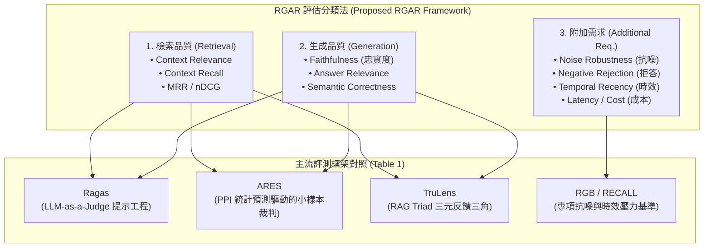

# Evaluation of Retrieval-Augmented Generation: A Survey

## 一話摘要 (TL;DR)
騰訊與中科大提出的 **RAG 評測全景綜述** 系統性梳理了檢索增強生成系統的評估挑戰，提出 **RGAR（Retrieval, Generation, Additional Requirement）** 分析框架，將評估維度嚴格解耦為檢索品質（相關性、召回率）、生成品質（真實性、忠實度、答案相關性）與附加系統需求（強健性、時效性、安全性、效率），並對主流開源自動評測框架與基準資料集進行了標準化橫向對比。

---

## 研究背景與問題定義 (Problem Statement)

1. **RAG 系統的複合黑箱性**：
   - RAG 結合了資訊檢索（IR）與自然語言生成（NLG）兩大異質組件；當端到端答案發生錯誤時，極難分辨究竟是「檢索器未找回支撐段落（Retrieval Failure）」、「生成器忽略檢索上下文產生幻覺（Generation Hallucination）」、還是「被檢索結果中的衝突/噪音干擾（Robustness Failure）」。
2. **評測框架指標命名與定義的混亂**：
   - 市面上湧現了 Ragas、ARES、TruLens 等多個評測工具，但各框架對「Faithfulness」、「Groundedness」、「Relevance」的數學定義與計算方式差異巨大，缺乏統一的系統性分類學（Taxonomy）。
3. **缺乏對非功能性需求的統籌評估**：
   - 傳統評測多局限於事實正確性，忽略了檢索時效性（Temporal Recency）、雜訊抵抗力（Noise Robustness）、隱私洩漏防護（Privacy）與推論時延吞吐量等真實系統落地需求。

---

## 核心方法與技術架構 (Methodology & Architecture)

綜述提出了 **RGAR（Retrieval, Generation, Additional Requirement）** 標準三層評估分類法：

### 1. RGAR 評估三維度解析
1. **檢索維度評估（Retrieval Target）**：
   - **Context Relevance（上下文相關性）**：檢索回來的文本塊是否精準回應使用者查詢；
   - **Context Recall / Coverage（上下文召回率/覆蓋率）**：是否完整包含了回答問題所需的所有關鍵事實金標；
   - **傳統 IR 指標**：Hit Rate@k、MRR、nDCG、Precision@k。
2. **生成維度評估（Generation Target）**：
   - **Faithfulness / Groundedness（忠實度）**：生成的每一句陳述是否能由檢索到的上下文直接推導（無外源幻覺）；
   - **Answer Relevance（答案相關性）**：生成的回答是否切題；
   - **Answer Correctness / Accuracy（答案正確性）**：與 Ground Truth 的事實吻合程度（ROUGE, BLEU, F1, Semantic Similarity）。
3. **附加需求維度評估（Additional Requirements）**：
   - **Noise & Distractor Robustness（雜訊抗性）**：當檢索混入無關甚至誤導性段落時，系統能否保持正確；
   - **Negative Rejection / Abstention（無效拒答）**：當檢索庫無答案時，能否明確承認「無法回答」而非胡編亂造；
   - **Temporal Recency（時效性）**：能否準確處理隨時間動態變化的事實；
   - **Efficiency & Cost（推論成本）**：TTFT、端到端延遲、Token 消耗量。

### 圖中節點對照
- `R`, `G`, `A`：綜述確立的檢索、生成與附加需求評估柱石。
- `RAGAS`, `ARES_TOOL`, `TRULENS`, `RGB_BM`：代表性評測工具與基準。

---

## 主流評測框架與基準對照 (Frameworks Comparison & Evidence)

綜述在第 6–9 頁對代表性開源評測框架進行了深入剖析（Table 1 & 2）：

1. **主流框架橫向對照（Table 1, Page 6）**：
   - **Ragas (Shahul et al., 2023)**：專注於無參考答案（Reference-free）評估，核心定義 Context Relevance、Faithfulness、Answer Relevance，依賴強大 LLM（GPT-4）直接提示評分；
   - **ARES (Saad-Falcon et al., 2024)**：結合合成資料生成微調小型裁判模型，並使用 Prediction-Powered Inference（PPI）統計抽樣，大幅降低對昂貴 API 的依賴並給出嚴格信賴區間；
   - **TruLens (TruEra)**：提出「RAG Triad（真實度、上下文相關性、答案相關性）」的閉環三元監控；
   - **RGB (Chen et al., 2023)**：專注評測雜訊抵抗力（Noise Robustness）、反事實抵抗力（Counterfactual Robustness）與負向拒答（Negative Rejection）；
   - **RECALL (Liu et al., 2023)**：針對知識衝突與參數記憶偏差進行對抗評估。
2. **評測資料集生態（Table 2, Page 8）**：
   - 百科常識類：HotpotQA, Natural Questions, TriviaQA；
   - 多跳關聯類：2WikiMultiHopQA, MuSiQue；
   - 專項對抗類：RGB 生成新聞語料、EventKG 時效語料。

---

## 優勢、限制及 Trade-offs (Strengths, Limitations & Trade-offs)

### 優勢
1. **概念邊界劃定清晰**：有效終結了各評測框架指標術語混亂的局面，確立了「檢索、生成、附加」三維標準。
2. **覆蓋全生命週期**：將傳統離線 Benchmark 評測與線上生產環境（Production Monitoring）的即時指標打通。

### 限制與 Trade-offs
1. **對長篇報告生成（Long-form Reports）探討偏弱**：綜述主要聚焦於單輪、短答案 QA 的評測機制，對多章節長篇調研報告的章節宏觀邏輯評審覆蓋有限。
2. **LLM-as-a-Judge 的自身偏置問題**：綜述指出目前多數框架依賴大模型作為裁判，其自身的長度偏置、位置偏置與自我偏好尚未獲得完全解決。

---

## 對本專案研究領域的實際意義 (Implications for Research Domains)

1. **對 Domain 10（評估基準與系統工程）的關鍵支撐**：
   - RGAR 框架為本專案提供了現成的架構藍圖，可以直接指導本知識庫評測管線的設計（包含檢索率、忠實度與拒答率三項硬性指標）。
2. **對 Domain 11（Research Roadmap）的支撐**：
   - 明確指出了目前 RAG 評測界最欠缺的研究方向：動態知識衝突仲裁、低成本小模型評審以及多模態文檔解析評估。

---

## 原始來源及相關筆記連結 (Sources & Related Notes)

- **本地 PDF**：`[[Papers/03 - RAG & Retrieval/(arXiv 2024-05) Evaluation of Retrieval-Augmented Generation - A Survey.pdf|開啟本地 PDF 檔案]]`
- **官方開源連結**：[arXiv:2405.07437](https://arxiv.org/abs/2405.07437)
- **關聯領域筆記**：
  - [[02 - 研究領域專題 (Research Domains)/Domain 10 - 評估基準、系統工程與安全 (Benchmarks & Safety)|Domain 10 - 評估基準、系統工程與安全 (Benchmarks & Safety)]]
  - [[02 - 研究領域專題 (Research Domains)/Domain 11 - 最具價值的研究方向與實驗設計 (Research Roadmap)|Domain 11 - 最具價值的研究方向與實驗設計 (Research Roadmap)]]
  - [[02 - 研究領域專題 (Research Domains)/Domain 17 - RAG Benchmarks & Evaluation Protocols|Domain 17 - RAG Benchmarks & Evaluation Protocols]]
- **同類/相關論文筆記**：
  - [[03 - 論文庫 (Literature Notes)/06 - Benchmarks & Evaluation/(NAACL 2024-06) ARES - An Automated Evaluation Framework for Retrieval-Augmented Generation Systems|(NAACL 2024-06) ARES]]
  - [[03 - 論文庫 (Literature Notes)/06 - Benchmarks & Evaluation/(arXiv 2024-06) RAGBench - Explainable Benchmark for Retrieval-Augmented Generation Systems|(arXiv 2024-06) RAGBench]]
  - [[03 - 論文庫 (Literature Notes)/06 - Benchmarks & Evaluation/(ACL 2024-08) RAGTruth - A Hallucination Corpus for Developing Trustworthy Retrieval-Augmented Language Models|(ACL 2024-08) RAGTruth]]
