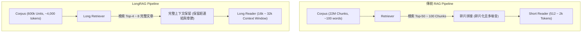

# LongRAG: Enhancing Retrieval-Augmented Generation with Long-context LLMs

## 1. 一話摘要 (TL;DR)
LongRAG 將傳統 RAG 的檢索單元從 100 字短 Chunk 大幅擴大為 4,000 字長文本單位（如完整維基百科頁面），將檢索空間壓縮 30 倍，結合長上下文 LLM Reader 在 NQ (62.7% EM) 與 HotpotQA (64.3% EM) 上創下零微調的頂尖效能。

---

## 2. 研究背景與問題定義 (Problem Statement)

### 2.1 傳統 RAG 的「短 Chunk 負擔」
傳統 RAG 架構（如 DPR、ColBERT）普遍將語料庫切割為 100–200 字的小區塊（Passage/Chunk）。這種設計源於早期語言模型（如 BERT, T5）的短上下文限制（512–1024 Tokens），但帶來了沉重代價：
1. **語意割裂（Information Fragmentation）**：跨段落的長程推理線索被硬性切斷，檢索器必須在海量碎片中找全所有片段；
2. **檢索器負擔過重**：整個 Wikipedia 被切成 2200 萬個區塊，檢索候選池過大，且需要檢索 $k=50 \sim 100$ 個區塊才能覆蓋答案，引入大量不相干噪音；
3. **資訊邊界遺失**：實體與指代關係在切塊邊界丟失，造成跨區塊推理失敗。

### 2.2 核心研究假設
隨著現代 LLM 上下文長度拓展至 32k–128k+，**RAG 應當「重構責任邊界」**：將粗篩的重擔交給檢索器，將跨段整合與細緻推理的重擔轉移給長上下文 Reader。

---

## 3. 核心方法與技術架構 (Methodology & Architecture)

### 3.1 核心模組設計
LongRAG 提出由兩大核心組件構成的「粗粒度檢索 + 長文本閱讀」架構：
1. **Long Retriever（長文本檢索器）**：
   - 構建「長檢索單元（Long Retrieval Unit）」：將關聯段落或整篇維基百科文章（包含超連結與章節結構）聚合成約 4,000 字（4K tokens）的大區塊；
   - 整個語料庫的單元數從 22M 驟降至約 60 萬（壓縮 30 倍以上）；
   - 只需檢索極少數量的單元（$k=4 \sim 8$）即可達成高覆蓋率。
2. **Long Reader（長上下文閱讀器）**：
   - 將檢索到的數個長單元（總計 16k–32k tokens）直接餵入現代長上下文模型（如 Gemini 1.5 Pro, GPT-4o, Command R+）進行單步或 Few-shot 推理生成。

**圖中節點對照**：
- `Ret2` 採用支援長輸入的密集檢索模型（如 E5-Mistral-7B、BGE-Large）；
- `Read2` 對應長窗口生成主幹（如 GPT-4-Turbo、Gemini 1.5 等）。

---

## 4. 主要實驗結果與證據 (Empirical Results & Evidence)

論文在多個代表性開放問答與長文評測基準上進行了系統實驗（Table 1, Page 5）：

### 4.1 檢索端表現 (Table 2 & Table 3, Page 6–7)
- **Answer Recall (AR) 大幅躍升**：
  - 在 NQ 資料集上，當檢索單元為 4K tokens 時，僅需 $k=2$ 即可達到 **81.3% AR**，而傳統 100-token 單位在 $k=2$ 時 AR 僅為 42.6%（Table 2, Page 6）；
  - 在 HotpotQA 多跳推理資料集上，長單元在 $k=4$ 時召回率即逼近飽和（Table 3, Page 7），完全解決了多跳資訊散落不同短段落而難以同時檢索到的痛點。

### 4.2 端到端問答效能 (Table 5, Page 8)
- 在 Natural Questions (NQ) 測試集上，LongRAG 取得 **62.7% Exact Match (EM)**，顯著超越強大的微調基準（Atlas-11B 的 42.4% EM、Self-RAG-7B 的 40.0% EM、傳統 BM25+GPT-4 的 44.5% EM）；
- 在 HotpotQA dev 集上，LongRAG 取得 **64.3% EM**，創造了無需昂貴檢索微調的全新 SOTA。

---

## 5. 優勢、限制及 Trade-offs (Strengths, Limitations & Trade-offs)

### 優勢
1. **消弭跨塊切割損耗**：完整保留文檔內部章節結構、表格與超連結引用，消除跨區塊邊界斷裂；
2. **檢索延遲顯著降低**：語料庫索引規模縮小 30 倍，向量搜尋與 HNSW 圖搜尋的時間與顯存消耗急劇下降。

### 限制與 Trade-offs
1. **Reader 推論成本升高**：雖然檢索變快，但 LLM Reader 每次必須處理 16k–32k tokens，增加 Pre-fill 運算量與 API Token 費用；
2. **長程注意力稀釋風險**：當檢索到的 4K 區塊包含大量非必要細節時，弱模型仍可能出現「大海撈針失效」或注意力分散。

---

## 6. 對本專案研究領域的實際意義 (Implications for Research Domains)
- **支持 Domain 13（跨塊整合）**：LongRAG 提供了「與其費盡心思在後處理做 Cross-chunk 拼接，不如直接前移增大檢索粒度」的重要路徑。
- **Long Context 與 RAG 融合實踐**：確立了「Long Context 不是取代 RAG，而是重構 RAG 粒度」的核心結論，直擊 Domain 01 與 Domain 03 的關鍵權衡。

---

## 7. 原始來源及相關筆記連結 (Sources & Related Notes)
- **開啟本地 PDF**：[[Papers/03 - RAG & Retrieval/(arXiv 2024-06) LongRAG - Enhancing Retrieval-Augmented Generation with Long-context LLMs.pdf|開啟原始論文 PDF]]
- **關聯筆記**：
  - [[03 - 論文庫 (Literature Notes)/03 - RAG & Retrieval/(JMLR 2023-01) Atlas - Few-shot Learning with Retrieval Augmented Language Models|(JMLR 2023-01) Atlas]]
  - [[03 - 論文庫 (Literature Notes)/04 - Knowledge & Graph RAG/(EMNLP 2024-11) Dense X - Exploring the Limit of Proposition Retrieval for Open-Domain QA|(EMNLP 2024-11) Dense X (Proposition Retrieval)]]
  - [[03 - 論文庫 (Literature Notes)/06 - Benchmarks & Evaluation/(EMNLP 2018-10) HotpotQA - A Dataset for Diverse, Explainable Multi-hop Question Answering|(EMNLP 2018-10) HotpotQA]]
