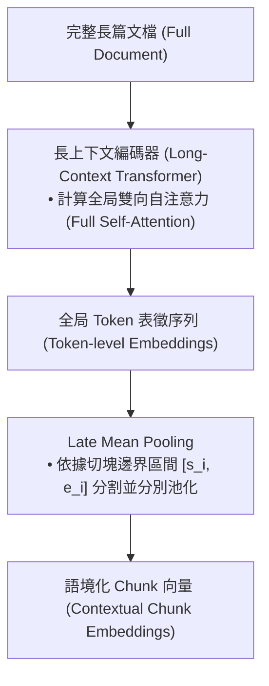

# Late Chunking: Contextual Chunk Embeddings Using Long-Context Embedding Models

> [!ABSTRACT] 一話摘要 (TL;DR)
> 本文提出 **Late Chunking**：先以 long-context embedding model 編碼較長文本，再於 transformer 之後、mean pooling 之前依 chunk boundary 聚合 token representations，使 chunk embeddings 能利用周邊上下文；它可減輕 early chunking 的 context loss，但不能保證消除所有跨段資訊遺失。

---

## 一、研究背景與問題定義 (Problem Statement)
- **核心痛點**：傳統 RAG 流程採取「早切塊（Early Chunking）」——先將文本按固定長度切分為小段落，再獨立送入 Embedding 模型生成向量。這種作法導致各 Chunk 喪失了來自前文與周圍段落的語義脈絡（Context Loss）。例如第二段若僅寫著「這座城市的首都是...」，獨立編碼時完全無法得知指的是哪一座城市。
- **研究假設**：若能讓 Transformer 模型先在包含 8k/32k 的全文長度上計算自注意力（Self-Attention），使每個 Token 的隱層狀態充分融入全局雙向語境，最後再依邊界對特定區間進行池化，即可在維持小粒度檢索單元的同時保有全局語境感知。

---

## 二、核心方法與技術架構 (Methodology & Architecture)

1. **全文編碼 (Full-Context Encoding)**：整份長文件直接輸入長序列 Embedding 模型（如 `jina-embeddings-v2/v3`）。
2. **延遲池化 (Late Pooling)**：
   \[
   v_i = \frac{1}{e_i - s_i + 1} \sum_{t=s_i}^{e_i} h_t
   \]
   其中 $h_t$ 為在全文注意力下計算得到的第 $t$ 個 Token 的向量狀態，$s_i, e_i$ 為切塊的起始與結束位置。
3. **無損檢索相容性**：生成的 Chunk 向量維度與傳統向量完全一致，可直接存入現有向量資料庫（如 Qdrant, Milvus, Chroma），無需更改下游檢索與 Cosine Similarity 計算邏輯。

---

## 三、主要實驗結果與證據 (Empirical Results & Evidence)
- **出處**：Table 1 (Page 2) & Table 2 (Page 8).
- **評估基準與數據**：
  - **跨段語境感知驗證 (Table 1, Page 2)**：在柏林（Berlin）相關文章的測試中，傳統切塊在不含關鍵字「Berlin」的子句上與查詢「Berlin」的相似度僅有 0.35 左右；而 Late Chunking 能將相似度提升至 0.68 以上，證明其成功吸收了前文主題。
  - **檢索基準表現 (Table 2, Page 8)**：在 BEIR 與長文檢索評測中，Late Chunking 相較於 Naive Early Chunking 在 nDCG@10 與 Recall@k 上均取得一致且顯著的性能提升（最高提升達 3~5 個百分點）。

---

## 四、優勢、限制及 Trade-offs (Strengths, Limitations & Trade-offs)
- **優勢**：
  - 可降低 chunk 獨立編碼造成的部分上下文遺失，特別是需要前文語境的 retrieval cases；
  - 對向量資料庫索引結構完全透明，無需重新訓練專屬架構。
- **限制與工程代價**：
  - **受限於 Embedding 模型的最大上下文**：超過模型可編碼長度時仍需分段；實際上限取決於所用 embedding model。
  - **運算成本隨全文二次方上升**：對超長文檔計算 Dense Attention 的顯存消耗顯著高於分別編碼小 Chunk。

---

## 五、對本專案研究領域的實際意義 (Implications for Research Domains)
- **深刻揭示「切塊邊界上下文遺失」之本質**：Late Chunking 的實驗為本專案在 `SourceChunkRecord` 中必須保存 `heading_path`、`previous_chunk_id` 與 `next_chunk_id` 提供了最強力的問題意識背書。
- **明確方法論邊界**：本專案目前採用的架構是「在結構元資料中保存階層標題與前後參照」，**並未實作 Late Chunking 的 Transformer 延遲池化**；在文獻綜述中必須明確區分兩者的機制差異。

---

## 六、原始來源及相關筆記連結 (Sources & Related Notes)
- **本地原始文獻**：[[Papers/03 - RAG & Retrieval/(arXiv 2024-09) Late Chunking - Contextual Chunk Embeddings for Retrieval.pdf|開啟本地 PDF 檔案]]
- **關聯專題**：[[02 - 研究領域專題 (Research Domains)/Domain 02 - Segmentation & Contextualization|D02 Segmentation & Contextualization]]
- **關聯對照**：[[03 - 論文庫 (Literature Notes)/03 - RAG & Retrieval/(EMNLP 2024-11) LumberChunker - Long-Context LLMs as Modular Chunkers for Long-Document RAG|LumberChunker 動態切塊]]
