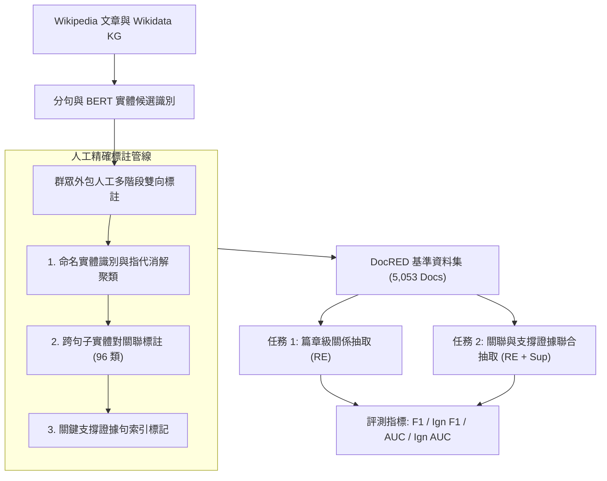

# DocRED: A Large-Scale Document-Level Relation Extraction Dataset

> [!INFO] 論文元數據 (Metadata)
> - **Paper ID**：`Yao2019_DocRED`
> - **作者**：Yuan Yao, Deming Ye, Peng Li, Xu Han, Yankai Lin, Zhenghao Liu, Zhiyuan Liu, Lixin Huang, Jie Zhou, Maosong Sun (Tsinghua University, WeChat AI Tencent)
> - **預印本初次發布年份 (Preprint)**：2019 (arXiv:1906.06127)
> - **正式發表年份 / 會議或期刊 (Venue)**：2019 (ACL 2019, Long Paper)
> - **DOI**：[10.18653/v1/P19-1074](https://doi.org/10.18653/v1/P19-1074)
> - **ACL Anthology**：[https://aclanthology.org/P19-1074/](https://aclanthology.org/P19-1074/)
> - **驗證狀態**：`verified` (已比對 ACL 2019 官方全文與論文 PDF)
> - **本地 PDF 連結**：[[Papers/04 - Knowledge & Graph RAG/(ACL 2019-07) DocRED - A Large-Scale Document-Level Relation Extraction Dataset.pdf|開啟本地 PDF 檔案]]

---

## 一話摘要 (TL;DR)
DocRED 構建了自然語言處理領域首個**大規模篇章級關聯抽取（Document-Level Relation Extraction）**人工標註基準資料集（包含 5,053 篇人工精標文檔、13.2 萬命名實體、96 種關係類型與 5.6 萬關係事實，並附帶 10.1 萬遠程監督文檔），揭示了超過 40.7% 的實體關聯必須依賴跨句子推理，徹底打破了傳統句子級 RE 的局部假設。

---

## 研究背景與問題定義 (Problem Statement)

### 1. 核心痛點
在 DocRED 發表之前，絕大多數關係抽取（Relation Extraction, RE）資料集與算法（如 SemEval-2010 Task 8、ACE 2004、TACRED、FewRel）均將任務簡化為**單句內（Intra-sentence）**的實體對關聯分類：
1. **跨句實體關聯被割裂**：真實文檔中，大量實體提及（Mentions）分散在不同句子、段落甚至章節中，傳統句子級模型無法抽取跨句關係。
2. **缺乏篇章級推理鏈支撐**：跨句關聯往往無法單純依賴局部句法依存樹，而是需要多跳邏輯推理、指代消解（Coreference Resolution）與常識推理。
3. **缺乏可解釋的證據標註**：現有資料集僅標註三元組是否存在，不提供模型做此推斷的「支撐句（Supporting Evidence）」索引，導致模型無法進行可解釋性驗證。

### 2. 研究假設與設計目標
構建一個覆蓋多種複雜推理類型、規模大、標註嚴謹的篇章級 RE 基準。同時標註：(1) 篇章中所有命名實體提及及其共指鏈；(2) 實體間的 96 種語意關係；(3) 每一條關係事實對應的完整篇章支撐句集合（Supporting Evidence Sentences）。

---

## 核心方法與技術架構 (Methodology & Architecture)

### 1. 資料集構建與規模統計 (Table 1, Page 4)
- **語料來源**：以 Wikipedia 英文條目與 Wikidata 知識圖譜為基礎。
- **人工精標數據 (Human-annotated)**：
  - 5,053 篇完整文檔（包含 40,276 句子、100.2 萬詞）；
  - 132,375 個命名實體提及（對應 96 種 Wikidata 關聯類型）；
  - 63,427 個關係實例（共計 56,354 個獨立關係事實）；
  - 每個關係實例平均由 1.6 個支撐句支撐，46.4% 的實例由多個句子共同佐證。
- **大規模弱監督數據 (Distantly Supervised)**：
  - 101,873 篇文檔，包含 2,558,350 個實體、1,508,320 個遠程監督關係實例，供模型進行大規模預訓練。

### 2. 篇章級推理分類體系 (Table 2, Page 5)
DocRED 首次對篇章級關係抽取所需的推理類型進行量化分解：
1. **模式識別 (Pattern Recognition, 38.9%)**：實體關係可由單句或明顯文字特徵直接判斷；
2. **邏輯推理 (Logical Reasoning, 26.6%)**：需要結合 2 句以上的語義進行多跳傳遞推導（如 A 屬於 B，B 位於 C $\to$ A 位於 C）；
3. **共指消解推理 (Coreference Reasoning, 17.6%)**：需要跨越代詞（He, It, The company）追蹤實體身分後推斷關係；
4. **常識推理 (Common-sense Reasoning, 16.6%)**：必須將文檔內部分事實與外部常識相結合才能確認關係；
5. **時序與其他推理 (0.3%)**。

### 系統架構流程圖 (Mermaid)

#### 圖中節點對照
- `RawWiki`: 原始維基百科全文與知識圖譜項目
- `EntCorefer`: 實體提及識別與篇章內共指鏈聚類
- `RelAnnotate`: 跨句實體對的 96 種關聯標註
- `EvidenceLink`: 關係推導的支撐證據句索引標註
- `Eval`: 排除訓練集重疊實體的 Ign F1 / Ign AUC 評估體系

---

## 主要實驗結果與證據 (Empirical Results & Evidence)

### 1. 基準神經模型評測表現 (Table 4, Page 7)
在 DocRED 測試集（Test Set）上評估監督與弱監督設置下的 Baseline 表現：

| 設定與模型 | 測試集 Ign F1 (%) | 測試集 Ign AUC | 測試集 F1 (%) | 測試集 AUC |
| :--- | :---: | :---: | :---: | :---: |
| **Supervised Setting (人工標註)** | | | | |
| CNN | 36.44 | 30.44 | 42.33 | 38.98 |
| LSTM | 43.60 | 39.02 | 50.12 | 49.31 |
| **BiLSTM** | **44.73** | **40.40** | **51.06** | **50.43** |
| Context-Aware | 43.93 | 39.30 | 50.64 | 49.70 |
| **Weakly Supervised (遠程監督)** | | | | |
| CNN | 25.40 | 13.46 | 42.02 | 36.86 |
| BiLSTM | 29.96 | 15.50 | 49.82 | 42.90 |
| Context-Aware | 30.27 | 15.11 | 50.14 | 41.52 |

*(出處：Table 4, Page 7)*

- **關鍵結論**：
  - 傳統經典神經模型在篇章級 RE 上的測試集 F1 僅有 **51.06%**（Ign F1 僅 44.73%），遠低於句子級 RE 在 TACRED 上普遍 70%+ 的分數；
  - 遠程監督中由於噪聲標註問題，Ign F1 暴跌至 29.96%，凸顯篇章級去噪的極高難度。

### 2. 人機表現巨大鴻溝 (Table 5, Page 7)
對隨機抽樣的 100 篇文檔進行人機對比：
- **關係抽取 (RE)**：模型 F1 為 **54.1%**，人類專家 F1 達 **88.0%**（相差 33.9 個百分點）；
- **關係與支撐證據聯合抽取 (RE + Sup)**：模型 F1 為 **44.7%**，人類專家 F1 達 **73.4%**（相差 28.7 個百分點）。
這證實篇章級推理對現有模型而言存在巨大的認知與推理瓶頸。

---

## 優勢、限制及 Trade-offs (Strengths, Limitations & Trade-offs)

### 1. 優勢 (Strengths)
1. **開拓篇章級關聯抽取研究方向**：將 NLP 關係抽取從單句推向篇章級全文理解，成為後續無數圖神經網路、跨塊關聯與 UIE 模型的核心驗證平台。
2. **具備可解釋證據鏈**：強制標註支撐句（Supporting Evidence），為事實驗證、證據溯源與抗幻覺評估提供了黃金標準。
3. **引入 Ign F1 評估防範過擬合**：嚴格過濾訓練集與測試集重疊的實體對，避免模型單純依靠記憶知識庫偏見得分。

### 2. 限制與代價 (Limitations & Trade-offs)
1. **長度局限於維基百科摘要段落**：DocRED 文本長度多在 8 句話、200 詞左右，屬於「短篇章（Paragraph-level to Short Document）」，尚未達到數千詞的長篇技術報告規模。
2. **關係模式集中於維基百科語域**：96 種關係類型均源自 Wikidata（如出生地、受教育地、配偶），對專業垂直領域（如金融、法律、生醫）的複雜因果關係覆蓋不足。

---

## 對本專案研究領域的實際意義 (Implications for Research Domains)

1. **D03 Knowledge Extraction & Information Preservation**：
   DocRED 證明了 40.7% 的事實無法在單句甚至單個固定 Chunk 內抽齊。這為本專案強調的「跨塊關聯整合（Cross-chunk Consolidation）」與「超越單句的結構化知識圖譜構建」提供了最權威的實驗數據支撐。
2. **GraphRAG 實體與關聯抽取評估**：
   在 GraphRAG 系統中，如何從切碎的文本塊精確重建全域實體關係網，DocRED 是評估抽取器是否具備多跳推理能力的第一標竿。

---

## 原始來源及相關筆記連結 (Sources & Related Notes)

- **本地 PDF 連結**：[[Papers/04 - Knowledge & Graph RAG/(ACL 2019-07) DocRED - A Large-Scale Document-Level Relation Extraction Dataset.pdf|開啟本地 PDF 檔案]]
- **關聯之知識抽取與結構化筆記**：
  - [[03 - 論文庫 (Literature Notes)/04 - Knowledge & Graph RAG/(ACL 2022-05) Unified Structure Generation for Universal Information Extraction|UIE: Unified Structure Generation for Universal Information Extraction]]
  - [[03 - 論文庫 (Literature Notes)/04 - Knowledge & Graph RAG/(EMNLP 2024-11) Dense X - Exploring the Limit of Proposition Retrieval for Open-Domain QA|Dense X: Exploring the Limit of Proposition Retrieval]]
- **所屬研究領域**：
  - [[02 - 研究領域專題 (Research Domains)/Domain 02 - Segmentation & Contextualization|D02 Segmentation & Contextualization]]
  - [[02 - 研究領域專題 (Research Domains)/Domain 03 - Knowledge Extraction & Information Preservation|D03 Knowledge Extraction & Information Preservation]]
