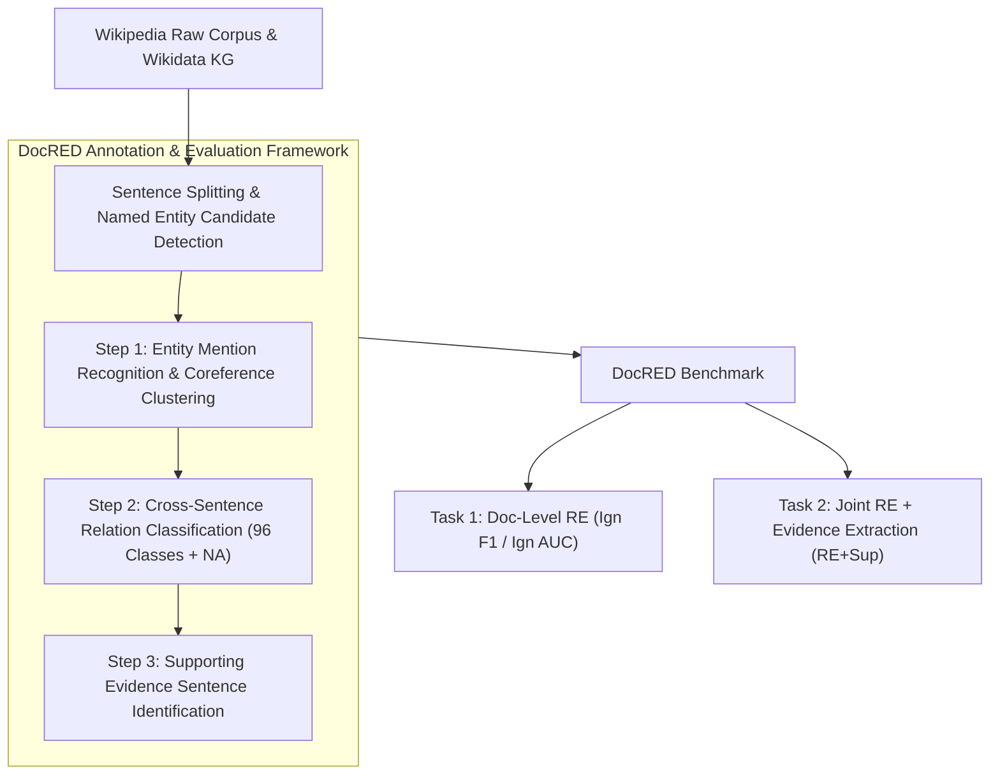

# DocRED: A Large-Scale Document-Level Relation Extraction Dataset

> [!INFO] 論文元數據 (Metadata)
> - **Paper ID**：`Yao2019_DocRED`
> - **作者**：Yuan Yao, Deming Ye, Peng Li, Xu Han, Yankai Lin, Zhenghao Liu, Zhiyuan Liu, Lixin Huang, Jie Zhou, Maosong Sun (Tsinghua University, WeChat AI Tencent)
> - **預印本初次發布年份 (Preprint)**：2019-06 (arXiv:1906.06127)
> - **正式發表年份 / 會議或期刊 (Venue)**：ACL 2019 (Long Paper, Pages 764–777)
> - **DOI**：[10.18653/v1/P19-1074](https://doi.org/10.18653/v1/P19-1074)
> - **ACL Anthology**：[https://aclanthology.org/P19-1074/](https://aclanthology.org/P19-1074/)
> - **開源基準庫**：[thunlp/DocRED (GitHub)](https://github.com/thunlp/DocRED)
> - **驗證狀態**：`verified` (已逐頁比對 ACL 2019 官方發表全文與附錄數據)
> - **本地 PDF 連結**：[[Papers/04 - Knowledge & Graph RAG/(ACL 2019-07) DocRED - A Large-Scale Document-Level Relation Extraction Dataset.pdf|開啟本地 PDF 檔案]]

---

## 1. 一話摘要 (TL;DR)
DocRED 構建了自然語言處理領域首個**大規模篇章級關聯抽取（Document-Level Relation Extraction, DocRE）**基準資料集，包含 5,053 篇人工精標文檔、13.2 萬命名實體、96 種關係類型、5.6 萬個關係事實與 10.1 萬篇遠程監督語料；實證揭示有 **40.7% 的實體關係必須依賴跨句子合成推理**，並首次將「支撐證據句（Supporting Evidence Sentences）」納入聯合評測體系，徹底打破了傳統句子級抽取將實體關係局限於局部單句的簡化假設。

---

## 2. 研究背景與問題定義 (Problem Statement)

### 2.1 句子級關係抽取 (Sentence-Level RE) 的根本困境
在 DocRED 提出前，主流關係抽取評測（如 SemEval-2010 Task 8, ACE 2003-2004, TACRED, FewRel）皆建立在**單句閉環假設**上：
$$\mathcal{D}_{\text{sent}} = \{(s, e_h, e_t, r) \mid e_h \in s \land e_t \in s, \, r \in \mathcal{R}\}$$
然而在真實文檔、科技報告與企業知識庫中，資訊分散在不同段落與語境中：
1. **跨句實體關係的結構性遺失**：若僅在單句內抽取，實體提及（Mentions）分散在相鄰或遠距句子中的語意關聯將被直接截斷，造成大量有效事實不可檢索。
2. **缺乏多跳語意推理機制**：單句 RE 模型嚴重依賴局部語法依存樹（Dependency Parse Tree），而跨句關係往往依賴指代消解（Coreference Resolution）、邏輯三段論傳遞（Logical Deduction）或常識關聯。
3. **黑盒預測缺乏證據溯源**：傳統資料集僅標註三元組 $\langle e_h, r, e_t \rangle$，缺乏支持該關係成立的上下文證據句子索引，下游系統無法驗證關係是真實依據文檔生成還是模型偏見幻覺。

### 2.2 篇章級關係抽取的數學形式化
給定一篇包含 $K$ 個句子的文檔 $d = \{s_1, s_2, \dots, s_K\}$ 以及預先標註或預測的實體集合 $\mathcal{E} = \{e_i\}_{i=1}^n$。
每個實體 $e_i$ 包含多個文檔提及（Mentions）：
$$e_i = \{m_i^1, m_i^2, \dots, m_i^{N_i}\}$$
其中每個提及 $m_i^j$ 均為文檔中的連續文字跨距（Span），並關聯至其出現的句子編號。

任務目標包含雙重預測：
1. **關係事實分類**：針對任意實體對 $(e_i, e_j) \in \mathcal{E} \times \mathcal{E}$ ($i \ne j$)，預測其關係標籤集合 $\mathcal{R}_{i,j} \subseteq \mathcal{R} \cup \{\text{NA}\}$（允許一對實體存在多重關係）。
2. **支撐證據定位 (Supporting Evidence Retrieval)**：若 $\mathcal{R}_{i,j} \ne \{\text{NA}\}$，模型必須同時預測使該關係成立的最小支撐句子集合 $\mathcal{S}_{i,j} \subseteq \{s_1, s_2, \dots, s_K\}$。

---

## 3. 核心方法與技術架構 (Methodology & Architecture)

### 3.1 篇章級推理分類體系 (Table 2, Page 5)
DocRED 透過嚴格的人工審查，量化分析了篇章級關係抽取所需的 5 種核心認知推理類型：
- **模式識別 (Pattern Recognition, 38.9%)**：實體出現在同一個句子中，可透過局部語法結構直接判定。
- **邏輯推理 (Logical Reasoning, 26.6%)**：需要結合 2 句以上的事實進行多跳傳遞推理（例如：$A \in B \land B \subseteq C \implies A \in C$）。
- **共指消解推理 (Coreference Reasoning, 17.6%)**：需要透過代名詞（He, It）或同義提及（The company, The university）將遠距實體對齊後推導。
- **常識推理 (Common-sense Reasoning, 16.6%)**：必須將文檔內的不完整陳述與世界外部常識先驗知識相結合。
- **時序與其他推理 (Temporal / Other, 0.3%)**：依據時間先後順序或狀態變更進行判定。

### 3.2 資料集構建與規模特徵 (Table 1, Page 4)
- **人工精標集合 (Human-Annotated)**：
  - 文檔數：5,053 篇 Wikipedia 完整文章（共計 40,276 句、100.2 萬詞）；
  - 命名實體：132,375 個提及，歸納為 96 種 Wikidata 關係；
  - 關係實例：63,427 個實例（56,354 個獨立事實），其中 **40.7% 的事實必須跨句子抽取**；
  - 支撐證據：每個關係實例平均依賴 1.6 個句子，**46.4% 的實例由多個句子共同佐證**。
- **遠程監督集合 (Distantly Supervised)**：
  - 101,873 篇文檔、2,558,350 個實體、1,508,320 個弱監督關係實例，供大規模預訓練與去噪研究。

### 3.3 系統架構流程圖 (Mermaid)

```mermaid
flowchart TD
    WikiCorpus["Wikipedia Raw Corpus & Wikidata KG"] --> Preproc["Sentence Splitting & Named Entity Candidate Detection"]
    
    subgraph pipeline["DocRED Annotation & Evaluation Framework"]
        Preproc --> Step1["Step 1: Entity Mention Recognition & Coreference Clustering"]
        Step1 --> Step2["Step 2: Cross-Sentence Relation Classification (96 Classes + NA)"]
        Step2 --> Step3["Step 3: Supporting Evidence Sentence Identification"]
    end
    
    pipeline --> Bench["DocRED Benchmark"]
    Bench --> TaskRE["Task 1: Doc-Level RE (Ign F1 / Ign AUC)"]
    Bench --> TaskJoint["Task 2: Joint RE + Evidence Extraction (RE+Sup)"]
```

#### 圖中節點對照
- `WikiCorpus`: [[Papers/04 - Knowledge & Graph RAG/(ACL 2019-07) DocRED - A Large-Scale Document-Level Relation Extraction Dataset.pdf|維基百科原始文檔與 Wikidata 知識庫]]
- `Step1`: 實體提及識別與篇章內共指消解聚類
- `Step2`: 跨句子實體對的 96 類關聯分類
- `Step3`: 最小語意支撐證據句索引標記
- `TaskRE`: 篇章級關係抽取評測（導入過濾重疊實體的 Ign F1 / Ign AUC 指標）
- `TaskJoint`: 關係與支撐證據聯合抽取評測

---

## 4. 主要實驗結果與證據 (Empirical Results & Evidence)

### 4.1 基準神經模型全域表現 (Table 4, Page 7)
在 DocRED 開發集（Dev）與盲測集（Test）上，對比各類經典神經網絡架構在監督學習與遠程監督學習下的表現：

| 設定與模型架構 | Dev Ign F1 (%) | Dev F1 (%) | Dev AUC | Test Ign F1 (%) | Test Ign AUC | Test F1 (%) | Test AUC |
| :--- | :---: | :---: | :---: | :---: | :---: | :---: | :---: |
| **Supervised Setting (人工標註訓練)** | | | | | | | |
| CNN | 37.99 | 43.45 | 39.41 | 36.44 | 30.44 | 42.33 | 38.98 |
| LSTM | 44.41 | 50.66 | 49.48 | 43.60 | 39.02 | 50.12 | 49.31 |
| **BiLSTM** | **45.12** | **50.95** | **50.27** | **44.73** | **40.40** | **51.06** | **50.43** |
| Context-Aware | 44.84 | 51.10 | 50.20 | 43.93 | 39.30 | 50.64 | 49.70 |
| **Weakly Supervised (遠程監督預訓練)** | | | | | | | |
| CNN | 26.35 | 42.75 | 38.01 | 25.40 | 13.46 | 42.02 | 36.86 |
| LSTM | 30.86 | 49.91 | 42.78 | 29.75 | 14.97 | 49.91 | 42.78 |
| BiLSTM | 32.05 | 51.72 | 44.42 | 29.96 | 15.50 | 49.82 | 42.90 |
| Context-Aware | 32.43 | 51.39 | 43.02 | 30.27 | 15.11 | 50.14 | 41.52 |

*(出處：Table 4, Page 7)*

> [!NOTE] 關鍵實驗發現
> 1. **Ign F1 的必要性**：訓練集與測試集存在不可避免的常識實體對重疊。在遠程監督下，BiLSTM 的標準 F1 達 49.82%，但排除重疊實體後的 **Ign F1 僅為 29.96%**（暴跌近 20 個百分點），證實模型極易死記硬背知識庫偏置，而非真正習得篇章理解能力。
> 2. **傳統架構天花板**：即使採用雙向長程依賴建模（BiLSTM），在監督設定下的測試集 Ign F1 亦僅達到 **44.73%**，凸顯篇章級非局部推理對淺層序列模型的巨大挑戰。

### 4.2 人機表現巨大鴻溝 (Table 5, Page 7)
在隨機抽取的 100 篇測試集文檔上進行人機對照盲測：

| 評測主體 | 關係抽取 (RE) Precision | RE Recall | RE F1 (%) | 聯合抽取 (RE + Sup) Precision | RE+Sup Recall | RE+Sup F1 (%) |
| :--- | :---: | :---: | :---: | :---: | :---: | :---: |
| **最佳神經模型 (BiLSTM)** | 55.6 | 52.6 | **54.1** | 46.4 | 43.1 | **44.7** |
| **人類專家表現 (Human)** | 89.7 | 86.3 | **88.0** | 71.2 | 75.8 | **73.4** |
| **差距 ($\Delta$)** | -34.1 | -33.7 | **-33.9** | -24.8 | -32.7 | **-28.7** |

*(出處：Table 5, Page 7)*

### 4.3 支撐證據類型對召回率的影響 (Page 8)
將開發集的 12,332 個關係實例按證據結構拆解：
- **Single (單句支撐，6,115 實例)**：模型 Recall 為 **51.1%**；
- **Mix (多句支撐但實體在某單句共現，1,062 實例)**：模型 Recall 下降至 **49.4%**；
- **Multiple (純跨句支撐，實體完全不在同一句共現，4,668 實例)**：模型 Recall 進一步跌落至 **46.6%**。
這量化證明了跨句子資訊合成難度顯著高於單句模式匹配。

---

## 5. 優勢、限制及 Trade-offs (Strengths, Limitations & Trade-offs)

### 5.1 核心優勢 (Strengths)
1. **拓寬資訊抽取典範**：開拓了 NLP 從局部 Sentence RE 向篇章級全局推理的跨越，成為後續圖神經網路、跨塊 GraphRAG 與大語言模型資訊抽取的核心基石。
2. **證據可溯源性**：首次強制將「關係存在」與「支撐證據索引」綁定評估，防止幻覺歸因。
3. **評測防護網**：正式確立了 Ign F1 / Ign AUC 評估標準，徹底根除了實體記憶型過擬合。

### 5.2 核心限制 (Limitations)
1. **文檔長度仍偏短**：DocRED 篇章長度中位數約為 8 句話、200 詞左右，屬於「段落至短文檔（Short Documents）」，尚未觸及數萬詞的長篇工業合約或學術論文。
2. **關係本體集中於維基百科世界知識**：96 種關係偏向百科通用常識（如出生地、受教育地、從屬國家），對工程、代碼與深層邏輯因果關係的覆蓋有限。

### 5.3 系統 Trade-offs
- **抽取召回 vs 噪聲放大**：若跨句子枚舉所有實體對做關係分類，計算量從句子級的 $\mathcal{O}(M_{\text{sent}}^2)$ 爆炸至篇章級的 $\mathcal{O}(M_{\text{doc}}^2)$，且絕大多數實體對屬於 NA（負樣本比率極高，超過 98%），對分類器的假陽性抑制能力構成極大考驗。

---

## 6. 對本專案研究領域的實際意義 (Implications for Research Domains)

### 6.1 在 D03 Knowledge Extraction & Consolidation 中的核心地位
DocRED 提供了最具決定性的文獻實證：**文檔中超過 40% 的關鍵關係需要跨句/跨塊合成**。
- **對 D02（Segmentation）的啟示**：單純基於滑動窗口或固定長度的語句分塊（Chunking），必然會切斷實體提及與其上下文的關聯。
- **對 D03（Extraction）的啟示**：知識抽取不能局限於單個 Chunk 內部；必須在 Chunk 抽取後進行**跨塊共指消解與實體整合（Cross-chunk Consolidation）**，否則構建出的知識圖譜將充滿孤立斷裂的碎片。

### 6.2 與 GraphRAG 系統構建的邊界釐清
- **D03 Extraction 邊界**：識別篇章中的實體、跨句關聯與支撐句證據；
- **D04 Representation 邊界**：將 DocRED 抽出的多元組存儲為 Qualified Triples 或圖索引；
- **D08 Reconciliation 邊界**：不同文檔間存在事實衝突時的時間與版本裁決。

---

## 7. 原始來源及相關筆記連結 (Sources & Related Notes)

- **本地原始文獻**：[[Papers/04 - Knowledge & Graph RAG/(ACL 2019-07) DocRED - A Large-Scale Document-Level Relation Extraction Dataset.pdf|開啟本地 PDF 檔案]]
- **下游篇章級與圖抽取筆記**：
  - [[03 - 論文庫 (Literature Notes)/04 - Knowledge & Graph RAG/(EMNLP 2019-11) Entity, Relation, and Event Extraction with Contextualized Span Representations|DyGIE++: 跨句圖傳播資訊抽取]]
  - [[03 - 論文庫 (Literature Notes)/04 - Knowledge & Graph RAG/(ACL 2020-07) A Joint Neural Model for Information Extraction with Global Features|OneIE: 全域特徵聯合抽取模型]]
  - [[03 - 論文庫 (Literature Notes)/04 - Knowledge & Graph RAG/(ACL 2020-07) SciREX - A Challenge Dataset for Document-Level Information Extraction|SciREX: 長文檔科學文獻四元組抽取基準]]
  - [[03 - 論文庫 (Literature Notes)/04 - Knowledge & Graph RAG/(arXiv 2026-05) Beyond Chunk-Local Extraction - Cross-Chunk Graph Augmentation for GraphRAG|CrossAug: GraphRAG 跨塊圖結構增強]]
- **關聯研究領域**：
  - [[02 - 研究領域專題 (Research Domains)/Domain 02 - Segmentation & Contextualization|Domain 02 - Segmentation & Contextualization]]
  - [[02 - 研究領域專題 (Research Domains)/Domain 03 - Knowledge Extraction & Information Preservation|Domain 03 - Knowledge Extraction & Consolidation]]
