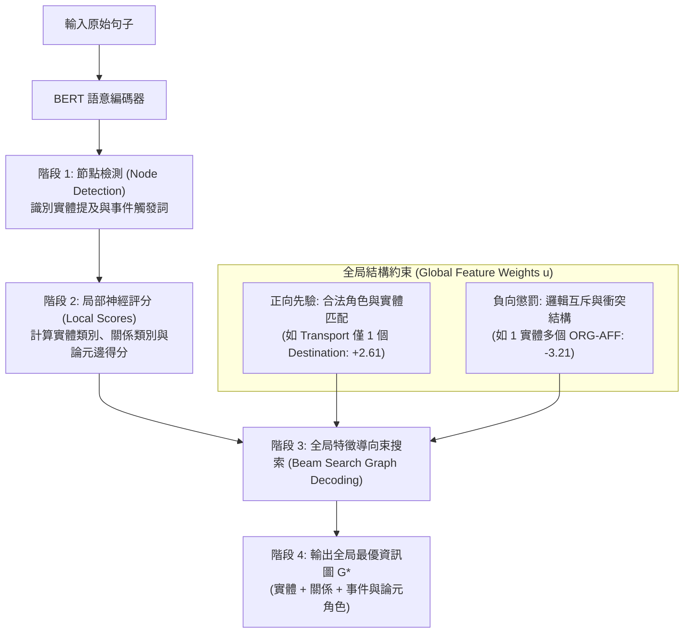

# A Joint Neural Model for Information Extraction with Global Features (OneIE)

> [!INFO] 論文元數據 (Metadata)
> - **Paper ID**：`Lin2020_OneIE`
> - **作者**：Ying Lin, Heng Ji, Fei Huang, Lingfei Wu (UIUC, Alibaba DAMO Academy, IBM Research)
> - **預印本初次發布年份 (Preprint)**：2020 (arXiv:2005.14324)
> - **正式發表年份 / 會議或期刊 (Venue)**：2020 (ACL 2020, Main Conference)
> - **DOI**：[10.18653/v1/2020.acl-main.713](https://doi.org/10.18653/v1/2020.acl-main.713)
> - **ACL Anthology**：[https://aclanthology.org/2020.acl-main.713/](https://aclanthology.org/2020.acl-main.713/)
> - **驗證狀態**：`verified` (已比對 ACL 2020 官方全文與論文 PDF)
> - **本地 PDF 連結**：[[Papers/04 - Knowledge & Graph RAG/(ACL 2020-07) A Joint Neural Model for Information Extraction with Global Features.pdf|開啟本地 PDF 檔案]]

---

## 一話摘要 (TL;DR)
OneIE 提出將資訊抽取端到端形式化為**全局最優資訊圖（Information Graph）解碼任務**，在神經網路局部得分之上引入**跨子任務與跨實例的全局特徵約束（Global Features）**與束搜索（Beam Search）圖解碼，在 ACE05 關係抽取 F1 上大幅超越 DyGIE++ 4.1 個百分點、事件論元分類超越 8.0 個百分點。

---

## 研究背景與問題定義 (Problem Statement)

### 1. 核心痛點
既有的聯合神經資訊抽取模型（如 DyGIE++、Joint Transition-based IE）大多使用**局部任務分類器（Local Task-Specific Classifiers）**獨立預測每個節點（實體、觸發詞）與每條邊（關係、論元角色）：
1. **無視跨子任務先驗約束（Cross-subtask Constraints）**：例如在句子「*A civilian aid worker from San Francisco was killed in an attack...*」中，局部分類器極易將 "San Francisco" 誤判為 `DIE` 事件的 `VICTIM`，因為它緊鄰 "was killed"；但從全局來看，地名（GPE）作為受害者是不符合常理的（DIE-VICTIM-PERSON 才是合法模式）。
2. **缺乏跨實例全局相容性（Cross-instance Inter-dependencies）**：在同一個事件中，通常只有一個 `DESTINATION`，或者一個實體不可能同時與多個組織具備不可兼容的從屬關係。局部神經模型無法在全域圖維度對這些互斥結構進行懲罰。

### 2. 研究假設
若將實體、事件觸發詞視為圖節點，將實體關係、論元角色視為圖邊，構建一個統一的目標函數：
$$S(G) = S_{\text{local}}(G) + u^T f(G)$$
將神經網絡預測的局部得分 $S_{\text{local}}$ 與全局符號特徵評分 $u^T f(G)$ 結合，並利用束搜索（Beam Search）求解全局最優圖，即可大幅消解局部預測的邏輯衝突。

---

## 核心方法與技術架構 (Methodology & Architecture)

### 1. 端到端圖抽取四階段管線
OneIE 分為四個連續階段：
1. **Sentence Encoding**：利用預訓練 BERT 產生上下文 Token 向量；
2. **Node Identification**：利用前向分類器識別所有候選實體提及（Entity Mentions）與事件觸發詞（Event Triggers）作為圖頂點 $V$；
3. **Local Scoring**：
   - 計算每個節點標籤的局部得分；
   - 計算所有節點對之間關係邊（Relation）與論元邊（Argument）的局部邊得分；
4. **Global Features & Graph Decoding**：
   設計束搜索演算法，逐步擴展並剪枝候選圖，動態計算圖候選的全局特徵向量 $f(G)$。

### 2. 全局特徵體系 (Global Features) (Table 1, Page 4)
定義了三大類全局特徵模式（權重向量 $u$ 透過感知器損失與反向傳播端到端學習）：
- **角色特徵 (Role Features)**：如單一事件中特定論元數量的先驗（例如 `TRANSPORT` 事件通常僅有 1 個 `DESTINATION`，特徵權重達 +2.61）；
- **關係特徵 (Relation Features)**：如實體類型與關係類型的相容性（`PER-SOC` 必須存在於兩個 `PER` 實體之間，權重 +1.08）；
- **互斥懲罰特徵 (Negative Constraints)**：如單一實體與多個實體存在衝突從屬關係（`ORG-AFF` 衝突權重為 -3.21，Table 6, Page 7）。

### 系統架構流程圖 (Mermaid)

#### 圖中節點對照
- `BERT`: 提供基礎上下文語意嵌入
- `NodeDetect`: 提取實體與事件 Trigger 作為圖頂點
- `LocalScores`: 局部純神經分類概率
- `GraphSearch`: 結合符號規則與神經打分的束搜索圖構建引擎
- `OptimalGraph`: 最終輸出的全互聯結構化知識圖

---

## 主要實驗結果與證據 (Empirical Results & Evidence)

### 1. ACE2005 基準核心表現 (Table 3 & Table 4, Page 7)
在 ACE05-R（關係抽取）與 ACE05-E（事件抽取）測試集上對比 DyGIE++：

| 資料集 | 任務 | DyGIE++ (F1 %) | Baseline (純局部無全局特徵) | OneIE (本文全量模型) | 增益 ($\Delta$) |
| :--- | :--- | :---: | :---: | :---: | :---: |
| **ACE05-R** | 實體 (Entity) | 88.6 | - | **88.8** | +0.2 |
| | **關係 (Relation)** | 63.4 | - | **67.5** | **+4.1** |
| **ACE05-E** | 實體 (Entity) | 89.7 | 90.2 | **90.2** | +0.5 |
| | 觸發詞識別 (Trig-I) | - | 76.6 | **78.2** | +1.6 |
| | 觸發詞分類 (Trig-C) | 69.7 | 73.5 | **74.7** | **+5.0** |
| | 論元識別 (Arg-I) | 53.0 | 56.4 | **59.2** | **+6.2** |
| | **論元分類 (Arg-C)** | 48.8 | 53.9 | **56.8** | **+8.0** |

*(出處：Table 3, Page 7)*

- **關鍵突破**：
  - 相較於純神經局部模型（Baseline），全局特徵的引入在關係抽取上提升了 4.1 個百分點；
  - 在難度極高的事件論元分類（Arg-C）上，OneIE 達到了 **56.8%**，相較於 DyGIE++ (48.8%) 帶來了 **整整 8.0 個百分點的巨大飛躍**！

### 2. 多語言零修改泛化能力 (Table 7, Page 7)
在未對模型結構做任何專屬語言修改的前提下：
- 在中文基準 **ACE05-CN** 上：實體 F1 達 89.8%，關係 F1 達 62.9%，論元分類 F1 達 53.2%；
- 在西班牙語基準 **ERE-ES** 上：實體 F1 達 81.3%，論元分類 F1 達 40.3%。
這證明圖結構與全局模式具備跨語言的通用本質。

---

## 優勢、限制及 Trade-offs (Strengths, Limitations & Trade-offs)

### 1. 優勢 (Strengths)
1. **打破神經黑盒、注入符號約束**：完美結合了深度神經網路的強泛化特徵與符號 AI 的常識邏輯約束，徹底消除了不合邏輯的結構性預測錯誤。
2. **全局圖解碼大幅領先局部分類**：論元分類與關係抽取的大幅提升證明了全圖結構對局部判斷的強大校正作用。
3. **優異的架構泛化性**：一套框架通吃實體、關係與事件三大 IE 任務，並能自然跨語言遷移。

### 2. 限制與代價 (Limitations & Trade-offs)
1. **全局特徵依賴專家定義 Schema**：特徵模板（Table 1）需要針對特定領域的本體論（Ontology）進行人工定義，面對未見過的開放式 Schema（Open IE）時難以直接套用。
2. **束搜索解碼增加推論延遲**：相比單純的前向分類，維護圖束搜索隊列需要更多的 CPU/GPU 交互時間。

---

## 對本專案研究領域的實際意義 (Implications for Research Domains)

1. **Domain 12 (Typed Knowledge 表示) & Domain 04 (知識擷取)**：
   OneIE 展示了「類型化知識（Typed Knowledge）」與「Schema 圖約束」如何顯式防禦神經模型的幻覺。這為本專案的知識抽取管線提供了不可或缺的「結構化約束驗證」工程範式。
2. **GraphRAG 的知識圖譜質量保證**：
   在從非結構化文檔自動建構圖譜時，未經校驗的神經抽取會產生大量髒數據（如把城市當成法人代表）。引入 OneIE 式的全局互斥檢查是確保 GraphRAG 實體關係圖具備工業可用性的關鍵技術保證。

---

## 原始來源及相關筆記連結 (Sources & Related Notes)

- **本地 PDF 連結**：[[Papers/04 - Knowledge & Graph RAG/(ACL 2020-07) A Joint Neural Model for Information Extraction with Global Features.pdf|開啟本地 PDF 檔案]]
- **前驅與對比筆記**：
  - [[03 - 論文庫 (Literature Notes)/04 - Knowledge & Graph RAG/(EMNLP 2019-11) Entity, Relation, and Event Extraction with Contextualized Span Representations|DyGIE++: Entity, Relation, and Event Extraction with Contextualized Span Representations]]
  - [[03 - 論文庫 (Literature Notes)/04 - Knowledge & Graph RAG/(ACL 2022-05) Unified Structure Generation for Universal Information Extraction|UIE: Unified Structure Generation for Universal Information Extraction]]
- **所屬研究領域**：
  - [[02 - 研究領域專題 (Research Domains)/Domain 04 - Chunking 策略與知識擷取 (Proposition, Cross-chunk)|Domain 04 - Chunking 策略與知識擷取]]
  - [[02 - 研究領域專題 (Research Domains)/Domain 12 - Knowledge Extraction & Typed Knowledge|Domain 12 - Knowledge Extraction & Typed Knowledge]]
