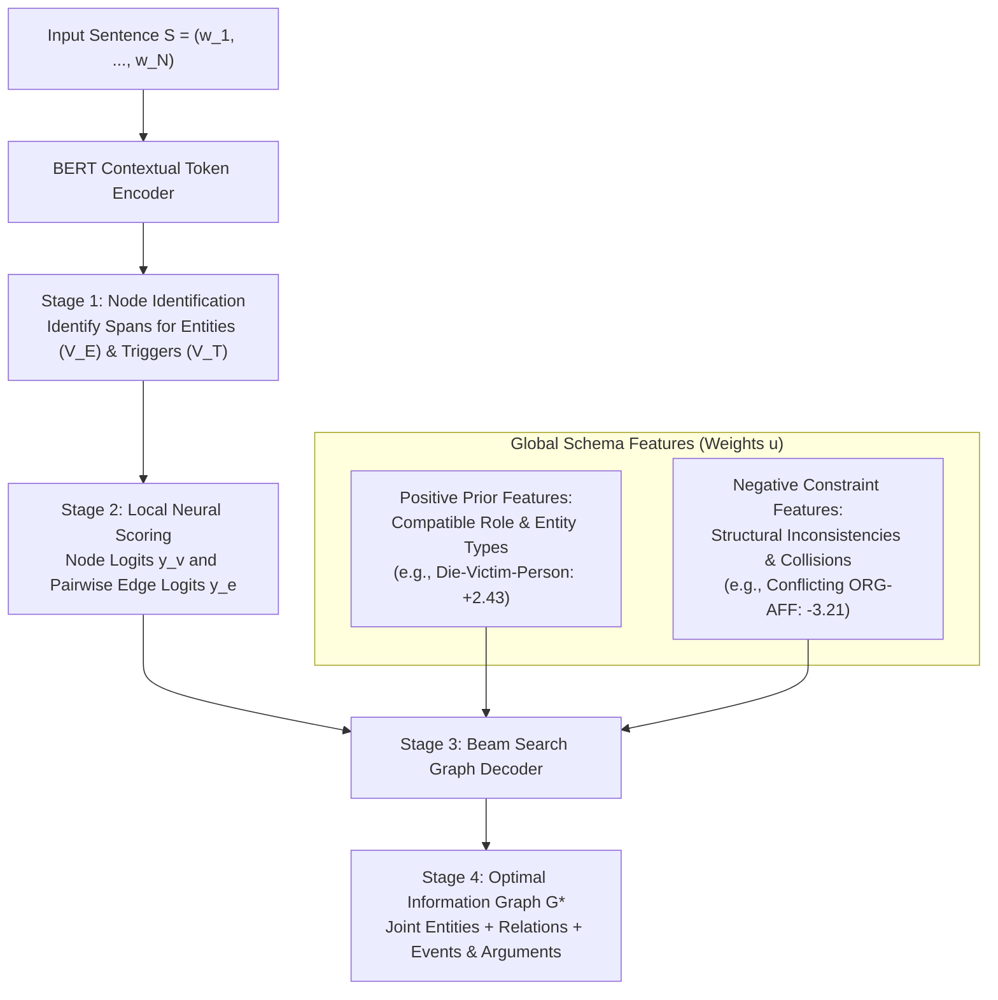

# A Joint Neural Model for Information Extraction with Global Features (OneIE)

> [!INFO] 論文元數據 (Metadata)
> - **Paper ID**：`Lin2020_OneIE`
> - **作者**：Ying Lin, Heng Ji, Fei Huang, Lingfei Wu (UIUC, Alibaba DAMO Academy, IBM Research)
> - **預印本初次發布年份 (Preprint)**：2020-05 (arXiv:2005.14324)
> - **正式發表年份 / 會議或期刊 (Venue)**：ACL 2020 (Long Paper, Pages 7999–8009)
> - **DOI**：[10.18653/v1/2020.acl-main.713](https://doi.org/10.18653/v1/2020.acl-main.713)
> - **ACL Anthology**：[https://aclanthology.org/2020.acl-main.713/](https://aclanthology.org/2020.acl-main.713/)
> - **開源專案**：[blender-nlp/OneIE (GitHub)](http://blender.cs.illinois.edu/software/oneie/)
> - **驗證狀態**：`verified` (已逐頁比對 ACL 2020 官方發表版本 PDF 全文與附錄實驗數據)
> - **本地 PDF 連結**：[[Papers/04 - Knowledge & Graph RAG/(ACL 2020-07) A Joint Neural Model for Information Extraction with Global Features.pdf|開啟本地 PDF 檔案]]

---

## 1. 一話摘要 (TL;DR)
OneIE 提出了一種將實體識別、關聯抽取與事件抽取完全統一起來的**端到端全域資訊圖解碼框架（Information Graph Decoding）**；在神經網路產生的局部節點與邊評分之上，顯式引入**跨子任務先驗與跨實例拓撲約束的全域特徵（Global Features）**，並設計束搜索圖解碼器（Beam Search Graph Decoder）求解全局最優圖，在 ACE05 關係抽取 F1 上超越 DyGIE++ 4.1 個百分點、事件論元分類超越 8.0 個百分點，並自然具備跨語言（中/英/西）零結構修改的遷移能力。

---

## 2. 研究背景與問題定義 (Problem Statement)

### 2.1 局部判別模型 (Local Discriminative IE) 的一致性盲區
現有的聯合資訊抽取模型（如 DyGIE++、Multi-turn QA IE）在解碼時大多仰賴**局部分類器（Local Task Classifiers）**獨立做決策：
$$P(y_i \mid X) = \text{softmax}(W h_i)$$
這種局部獨立假設導致系統預測出的結構極易出現嚴重的語義與邏輯矛盾：
1. **跨子任務約束缺失（Cross-subtask Violation）**：例如在句子「*A civilian aid worker from San Francisco was killed in an ambush...*」中，局部分類器常將緊鄰 "was killed" 的地名 "San Francisco" 誤判為 `DIE` 事件的 `VICTIM` 論元。但依照常識本體規範，`DIE-VICTIM` 必須為 `PERSON` 實體，地名（GPE）絕不能擔任受害者角色。
2. **跨實例全局衝突（Cross-instance Inconsistency）**：在同一個事件抽取實例中，某些論元具備單一性先驗（如單一 `TRANSPORT` 事件通常僅有 1 個 `DESTINATION`；單一實體極罕見同時隸屬於多個互斥的母機構 `ORG-AFF`）。局部分類器無法在整圖尺度上對這種過度預測施加懲罰。

### 2.2 資訊網絡圖形式化 (Information Network Formulation)
OneIE 將輸入句子 $S = (w_1, \dots, w_N)$ 的結構化抽取目標定義為有向有標記資訊圖 $G = (V, E)$：
- **頂點集合 $V$**：
  $$V = V_E \cup V_T$$
  其中 $V_E$ 為實體提及節點（Entity Mentions），$V_T$ 為事件觸發詞節點（Event Triggers）。每個節點 $v_i \in V$ 帶有文本跨距 $(b_i, e_i)$ 與類型標籤 $l_{v_i} \in \mathcal{L}_E \cup \mathcal{L}_T$。
- **邊集合 $E$**：
  $$E = E_R \cup E_A$$
  其中 $E_R$ 為實體對之間的關係邊（$u, v \in V_E$），標籤為 $l_{uv} \in \mathcal{L}_R$；$E_A$ 為事件論元邊（$u \in V_T, v \in V_E$），標籤為論元角色 $l_{uv} \in \mathcal{L}_A$。

目標是在所有候選圖空間 $\mathcal{G}$ 中尋找全域評分最高的合法圖 $G^* = \arg\max_{G \in \mathcal{G}} S(G)$。

---

## 3. 核心方法與技術架構 (Methodology & Architecture)

### 3.1 全局圖評分函數 (Global Scoring Objective)
OneIE 定義候選圖 $G$ 的綜合評分為**局部神經評分**與**全域符號特徵評分**的線性組合：
$$S(G) = S_{\text{local}}(G) + S_{\text{global}}(G) = \sum_{v \in V} \hat{y}_{v}(l_v) + \sum_{e \in E} \hat{y}_{e}(l_e) + \mathbf{u}^\top \mathbf{f}(G)$$
其中：
- $\hat{y}_v(l_v)$ 為神經網路預測節點 $v$ 標籤為 $l_v$ 的局部 Logit 得分；
- $\hat{y}_e(l_e)$ 為神經網路預測節點對邊 $e$ 標籤為 $l_e$ 的局部 Logit 得分；
- $\mathbf{f}(G) \in \mathbb{R}^K$ 為定義在候選圖 $G$ 上的全域結構特徵向量（計數各類跨子任務/跨實例子圖模式在 $G$ 中出現的次數）；
- $\mathbf{u} \in \mathbb{R}^K$ 為可學習的全域特徵權重向量。

### 3.2 束搜索圖解碼演算法 (Beam Search Graph Decoding)
由於全圖枚舉空間隨節點數呈超指數級增長，OneIE 設計了兩階段展開的束搜索解碼器（Beam Size = $\theta$）：
- **初始化**：束隊列 $\mathcal{B}_0 = \{K_0\}$，其中 $K_0$ 為空圖。
- **節點步驟 (Node Step)**：選取第 $i$ 個候選節點 $v_i$，展開其可能的實體或觸發詞標籤候選，更新節點評分。
- **邊步驟 (Edge Step)**：對新加入的節點 $v_i$，建立其與當前圖中所有已存在節點 $\{v_1, \dots, v_{i-1}\}$ 之間的所有候選關係邊與論元邊，評估局部邊得分。
- **排序與剪枝 (Sort & Prune)**：計算每個候選擴展圖的全域特徵 $\mathbf{f}(G)$ 與總分 $S(G)$，依總分降序排序，僅保留 Top-$\theta$ 個最優候選圖進入下一步。

### 3.3 全局損失函數 (Training Objective)
模型透過多任務感知器損失聯合訓練神經網路參數與特徵權重 $\mathbf{u}$：
$$\mathcal{L} = \mathcal{L}_I + \sum_{t \in \{E, T, R, A\}} \mathcal{L}_t + \mathcal{L}_G$$
其中全域圖損失 $\mathcal{L}_G$ 定義為 Margin 邊界損失：
$$\mathcal{L}_G = \max\left(0, \, S(\hat{G}) - S(G^*) + \Delta(\hat{G}, G^*)\right)$$
其中 $\hat{G}$ 為當前模型解碼出的預測圖，$G^*$ 為真實黃金標準圖，$\Delta$ 為圖編輯結構距離。

### 3.4 系統架構流程圖 (Mermaid)

```mermaid
flowchart TD
    Sentence["Input Sentence S = (w_1, ..., w_N)"] --> BERT["BERT Contextual Token Encoder"]
    
    BERT --> NodeIdent["Stage 1: Node Identification<br/>Identify Spans for Entities (V_E) & Triggers (V_T)"]
    NodeIdent --> LocalScoring["Stage 2: Local Neural Scoring<br/>Node Logits y_v and Pairwise Edge Logits y_e"]
    
    LocalScoring --> BeamSearch["Stage 3: Beam Search Graph Decoder"]
    
    subgraph GlobalConstraints["Global Schema Features (Weights u)"]
        PosPrior["Positive Prior Features:<br/>Compatible Role & Entity Types<br/>(e.g., Die-Victim-Person: +2.43)"]
        NegPrior["Negative Constraint Features:<br/>Structural Inconsistencies & Collisions<br/>(e.g., Conflicting ORG-AFF: -3.21)"]
    end
    
    PosPrior --> BeamSearch
    NegPrior --> BeamSearch
    
    BeamSearch --> OptimalGraph["Stage 4: Optimal Information Graph G*<br/>Joint Entities + Relations + Events & Arguments"]
```

#### 圖中節點對照
- `BERT`: [[Papers/04 - Knowledge & Graph RAG/(ACL 2020-07) A Joint Neural Model for Information Extraction with Global Features.pdf|預訓練雙向語言模型編碼器]]
- `NodeIdent`: 實體跨距與事件觸發詞候選頂點識別層
- `LocalScoring`: 局部純神經分類打分前饋網路
- `GlobalConstraints`: 全域拓撲特徵與本體互斥權重向量 $\mathbf{u}$
- `BeamSearch`: 兩步式（Node-Step + Edge-Step）剪枝搜索解碼器
- `OptimalGraph`: 最終輸出的全互聯全域一致性知識結構圖

---

## 4. 主要實驗結果與證據 (Empirical Results & Evidence)

### 4.1 ACE2005 基準核心評測表現 (Table 3 & 4, Page 8005)
在 ACE05-R（實體與關係）與 ACE05-E（實體與事件）測試集上對比前人最強基準 DyGIE++：

| 資料集 | 評測子任務 | DyGIE++ (F1 %) | Baseline (純神經無全域特徵) | OneIE (全量模型) | 增益 ($\Delta$) |
| :--- | :--- | :---: | :---: | :---: | :---: |
| **ACE05-R** | 實體 (Entity) | 88.6 | - | **88.8** | +0.2 |
| | **關係 (Relation)** | 63.4 | - | **67.5** | **+4.1** |
| **ACE05-E** | 實體 (Entity) | 89.7 | 90.2 | **90.2** | +0.5 |
| | 觸發詞識別 (Trig-I) | - | 76.6 | **78.2** | +1.6 |
| | 觸發詞分類 (Trig-C) | 69.7 | 73.5 | **74.7** | **+5.0** |
| | 論元識別 (Arg-I) | 53.0 | 56.4 | **59.2** | **+6.2** |
| | **論元分類 (Arg-C)** | 48.8 | 53.9 | **56.8** | **+8.0** |

*(出處：Table 3, Page 8005)*

> [!NOTE] 關鍵突破解讀
> - 在難度最高的**事件論元角色分類 (Arg-C)** 上，OneIE 達到了 **56.8%**，相較於 DyGIE++ 的 48.8% 取得了 **整整 8.0 個百分點的巨大飛躍**。
> - 在關係抽取（Relation）上，全域特徵的引入將 F1 從 63.4% 拉昇至 **67.5%**，證實全圖拓撲約束可有效消除不合邏輯的孤立局部預測。

### 4.2 顯著全域特徵權重分析 (Table 6, Page 8005)
論文透過端到端訓練習得了極具可解釋性的符號權重向量 $\mathbf{u}$：
- **高分正向特徵 (Positive Features)**：
  - 單一 `TRANSPORT` 事件通常僅有 1 個 `DESTINATION` 論元（權重 **+2.61**）；
  - `PER-SOC` 關係必須建立在兩個 `PERSON` 實體之間（權重 **+1.08**）；
  - `MARRY` 事件的兩個論元均必須為 `PERSON`（權重 **+2.15**）。
- **強力負向懲罰特徵 (Negative Features)**：
  - 單一實體與多個實體存在衝突從屬關係 `ORG-AFF`（權重 **-3.21**）；
  - 單一實體同時具有相互矛盾的關係邊（權重 **-2.02**）；
  - 單一 `ATTACK` 事件出現多個衝突的 `PLACE` 論元（權重 **-1.86**）。

### 4.3 跨語言遷移能力評測 (Table 7, Page 8005)
在不改變任何網絡結構的前提下直接遷移至中文與西班牙文：

| 資料集與語言 | 訓練語言設定 | 實體 (Entity) F1 | 關係 (Relation) F1 | 觸發詞分類 (Trig-C) F1 | 論元分類 (Arg-C) F1 |
| :--- | :--- | :---: | :---: | :---: | :---: |
| **ACE05-CN (中文)** | 僅單語 (CN) | 88.5 | 62.4 | 65.6 | 52.0 |
| | 跨語言聯調 (CN + EN) | **89.8** | **62.9** | **67.7** | **+53.2** |
| **ERE-ES (西班牙文)** | 僅單語 (ES) | 81.3 | 48.1 | 56.8 | 40.3 |
| | 跨語言聯調 (ES + EN) | **81.8** | **52.9** | **59.1** | **+42.3** |

*(出處：Table 7, Page 8005)*

---

## 5. 優勢、限制及 Trade-offs (Strengths, Limitations & Trade-offs)

### 5.1 核心優勢 (Strengths)
1. **結合符號邏輯先驗與深度神經表徵**：透過顯式的全域特徵打分向量 $\mathbf{u}^\top \mathbf{f}(G)$，成功將本體常識約束注入黑盒神經網路。
2. **全局圖解碼杜絕不相容結構**：在束搜索過程中動態修剪違反本體定義的非法子圖，保證最終輸出的知識圖譜具備高度邏輯自洽性。
3. **出色的跨語言一致性**：特徵模板定義於圖結構層面，天然獨立於具體語言的表層語法，多語言聯合微調可帶來穩健提升。

### 5.2 核心限制 (Limitations)
1. **Schema 封閉性與依賴人工模板**：全域特徵集合依賴領域專家的 Schema 定義（如 ACE 的 7 種實體、44 種關係與 33 種事件）。在開放領域（Open IE）或未知本體場景下，構造全域特徵模板具有較高的先驗門檻。
2. **束搜索的推論開銷**：每個解碼步驟需排序評估所有候選擴展圖，推論延遲顯著高於非自回歸的局部單向預測。

### 5.3 系統 Trade-offs
- **解碼搜索寬度 (Beam Size $\theta$) vs 吞吐量**：增大 $\theta$ 可顯著提升論元分類的召回率，但會線性增加顯存與計算時間。實驗顯示 $\theta = 10$ 在精度與推論速度間達到最佳平衡。

---

## 6. 對本專案研究領域的實際意義 (Implications for Research Domains)

### 6.1 在 D03 Knowledge Extraction & Consolidation 中的核心角色
OneIE 為 D03 提供了「高品質結構化約束抽取（Constraint-Driven Extraction）」的黃金範式：
- **證明了「抽取正確性不等於單字預測正確」**：真正的資訊抽取必須保證實體-關係-事件在圖維度上的自洽性（Self-consistency）。
- **為 GraphRAG 實體建構提供防護網**：在將非結構化文本轉化為 GraphRAG 實體網絡時，直接使用無約束神經抽取會產生大量語義荒謬的三元組（如將地名作為受害者或將公司作為出生地）。OneIE 的全域互斥檢查機制是過濾此類雜訊的標竿技術。

### 6.2 與相鄰領域的邊界劃分
- **D03 Extraction vs D04 Representation**：OneIE 在句子層面構建最優資訊圖 $G^*$ 屬於 D03 抽取範疇；將抽取出的圖融入跨文檔全局向量檢索或圖譜儲存則屬於 D04。
- **D03 vs D08 Reconciliation**：OneIE 處理單文檔內結構的一致性與互斥性；跨文檔的時序或事實衝突（如兩篇文檔報導不同死亡人數）則屬於 D08。

---

## 7. 原始來源及相關筆記連結 (Sources & Related Notes)

- **本地原始文獻**：[[Papers/04 - Knowledge & Graph RAG/(ACL 2020-07) A Joint Neural Model for Information Extraction with Global Features.pdf|開啟本地 PDF 檔案]]
- **關聯抽取論文筆記**：
  - [[03 - 論文庫 (Literature Notes)/04 - Knowledge & Graph RAG/(EMNLP 2019-11) Entity, Relation, and Event Extraction with Contextualized Span Representations|DyGIE++: 跨句圖傳播資訊抽取]]
  - [[03 - 論文庫 (Literature Notes)/04 - Knowledge & Graph RAG/(ACL 2020-07) SciREX - A Challenge Dataset for Document-Level Information Extraction|SciREX: 長文檔科學文獻多層次抽取]]
  - [[03 - 論文庫 (Literature Notes)/04 - Knowledge & Graph RAG/(NAACL 2021-06) A Frustratingly Easy Approach for Entity and Relation Extraction|PURE: 解耦管線實體與關係抽取]]
  - [[03 - 論文庫 (Literature Notes)/04 - Knowledge & Graph RAG/(ACL 2022-05) Unified Structure Generation for Universal Information Extraction|UIE: 統一結構生成資訊抽取]]
- **關聯研究領域**：
  - [[02 - 研究領域專題 (Research Domains)/Domain 02 - Segmentation & Contextualization|Domain 02 - Segmentation & Contextualization]]
  - [[02 - 研究領域專題 (Research Domains)/Domain 03 - Knowledge Extraction & Information Preservation|Domain 03 - Knowledge Extraction & Consolidation]]
