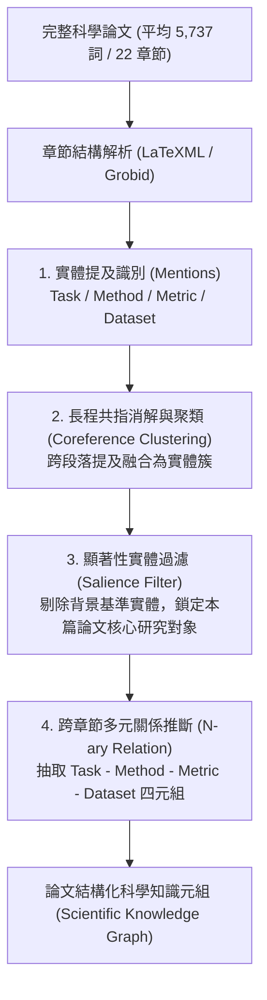

# SciREX: A Challenge Dataset for Document-Level Information Extraction

> [!INFO] 論文元數據 (Metadata)
> - **Paper ID**：`Jain2020_SciREX`
> - **作者**：Sarthak Jain, Madeleine van Zuylen, Hannaneh Hajishirzi, Iz Beltagy (Allen Institute for AI, Northeastern University, University of Washington)
> - **預印本初次發布年份 (Preprint)**：2020 (arXiv:2005.08295)
> - **正式發表年份 / 會議或期刊 (Venue)**：2020 (ACL 2020, Main Conference)
> - **DOI**：[10.18653/v1/2020.acl-main.670](https://doi.org/10.18653/v1/2020.acl-main.670)
> - **ACL Anthology**：[https://aclanthology.org/2020.acl-main.670/](https://aclanthology.org/2020.acl-main.670/)
> - **驗證狀態**：`verified` (已比對 ACL 2020 官方全文與論文 PDF)
> - **本地 PDF 連結**：[[Papers/04 - Knowledge & Graph RAG/(ACL 2020-07) SciREX - A Challenge Dataset for Document-Level Information Extraction.pdf|開啟本地 PDF 檔案]]

---

## 一話摘要 (TL;DR)
SciREX 構建了首個針對**完整科研論文全文（平均 5,737 詞、22 個章節）**的篇章級資訊抽取基準，涵蓋實體識別、共指消解、顯著實體（Salient Entity）過濾及**跨章節 4 元關聯抽取（Dataset, Metric, Task, Method）**；實驗揭示 99% 的 4 元關係跨越句子、55% 跨越章節，現有端到端模型在預測輸入下的 4 元關係 F1 僅為 0.008，凸顯長篇全文結構化抽取的極限挑戰。

---

## 研究背景與問題定義 (Problem Statement)

### 1. 核心痛點
先前的科學文獻資訊抽取（如 SciERC）與通用 IE 基準絕大多數僅侷限於**論文摘要（Abstracts，約 100–200 詞）**或孤立單句：
1. **關鍵細節深埋正文**：論文的核心貢獻、實驗基準數據集、評估指標與具體模型超參數大量分佈在實驗設定、正文章節與附錄中，僅讀摘要無法獲取完整科學事實。
2. **極度分散的跨章節實體關聯**：科學文獻中一個完整的實驗結論通常包含 4 元複合關係（$N$-ary Tuple）：`[Task, Dataset, Method, Metric]`。這些實體往往分散在「引言」、「相關工作」、「方法」與「實驗」等多個不同章節中。
3. **顯著性實體與背景實體混雜**：全文中提及了數百個模型與資料集（如作為 baseline 提及），如何識別哪些是本文的核心研究對象（Salient Entities），傳統局部分類器無能為力。

### 2. 研究假設
需要一個全篇章、多子任務聯合的科學資訊抽取基準，評估模型在完整長文檔（5k+ tokens）中識別實體、建立長程共指鏈、過濾核心顯著實體、並跨章節抽取多元複合關係的端到端能力。

---

## 核心方法與技術架構 (Methodology & Architecture)

### 1. 資料集規模與跨章節特徵 (Table 1, Page 4)
SciREX 包含 438 篇人工標註與遠程監督結合的機器學習領域頂會論文全文：
- **篇幅平均統計**：每篇文檔平均 **5,737 詞**、**22 個章節**、**360 個實體提及**；
- **實體類型**：涵蓋 4 大科學實體類型（Method, Metric, Task, Dataset）；
- **跨句與跨章節分佈**：
  - **57% 的二元關係** 與 **99% 的 4 元關係** 發生在**不同句子**之間；
  - **20% 的二元關係** 與 **55% 的 4 元關係** 發生在**不同章節（Across Sections）**之間！

### 2. 多階段篇章級抽取管線 (Multi-Stage Pipeline)
論文設計了階層式神經抽取架構：
1. **Mention Identification & Classification**：利用 SciBERT + BiLSTM-CRF 識別文本中所有候選實體提及；
2. **Pairwise Coreference & Clustering**：將分散在各段落的提及進行共指聚類，形成完整實體簇（Entity Clusters）；
3. **Salient Entity Identification**：判定該實體是否為論文主要研究的焦點對象（二元分類器，利用實體頻率、位置與章節權重）；
4. **Binary & 4-ary Relation Extraction**：對顯著實體簇進行笛卡兒積組合，構建圖注意力或分類器，預測四元組合 `(Task, Method, Metric, Dataset)` 是否成立。

### 系統架構流程圖 (Mermaid)

#### 圖中節點對照
- `RawPaper`: 5,000+ 詞的長文檔全文輸入
- `MentionStep`: Token/Span 級實體識別
- `CorefStep`: 跨章節提及對齊為統一實體
- `SaliencyStep`: 全文顯著性二元篩選模組
- `RelationStep`: 跨章節多實體聯合分類器

---

## 主要實驗結果與證據 (Empirical Results & Evidence)

### 1. 跨階段端到端錯誤傳播雪崩 (Table 5, Page 8)
在完整端到端測試集上評估各步驟獨立與串聯表現：

| 評估階段 | 任務類型 | Precision | Recall | F1 Score |
| :--- | :--- | :---: | :---: | :---: |
| **Component-wise (使用 Gold 輸入)** | 提及識別 (Mention ID) | 0.707 | 0.717 | 0.712 |
| | 實體共指消解 (Coreference) | 0.861 | 0.852 | 0.856 |
| | 顯著實體簇 (Salient Entity Clusters) | 1.000 | 0.984 | 0.987 |
| | 二元關係 (Binary Relations) | 0.820 | 0.440 | 0.570 |
| | **4 元關係 (4-ary Relations)** | 0.531 | 0.718 | **0.611** |
| **End-to-end (全流程預測輸入)** | 顯著實體簇 | 0.223 | 0.600 | 0.307 |
| | 二元關係 | 0.065 | 0.411 | 0.096 |
| | **4 元關係** | 0.007 | 0.173 | **0.008** |

*(出處：Table 5, Page 8)*

- **震撼發現**：
  - 當各模組給定 Gold 輸入時，4 元關係抽取 F1 可達 **0.611**；
  - 但一旦採用前置模組的預測結果執行真正的端到端抽取，由於提及識別錯誤、共指消解偏差與顯著性過濾失誤的逐層累積放大，4 元關係 F1 發生災難性崩塌，直接跌至 **0.008 (不足 1%)**！

### 2. 對比經典模型 DyGIE++ (Table 3, Page 8)
- 在全文章節上測試 DyGIE++：
  - DyGIE++ 依賴局部滑動窗口，在全文二元關係上得分全部為 **0.000**；
  - 僅在摘要（Abstracts Only）上評估時 F1 僅為 **0.002**；
  - 這證明針對短文本設計的局部聯合抽取模型在面對真實全文時徹底失效。

---

## 優勢、限制及 Trade-offs (Strengths, Limitations & Trade-offs)

### 1. 優勢 (Strengths)
1. **極度逼近真實科研文獻分析場景**：擺脫了摘要玩具資料集，是首個將全文 20+ 章節、5k+ 詞彙納入統一資訊抽取考量的開創性基準。
2. **複合多元關係（$N$-ary Relation）探索**：打破了傳統非 A 即 B 的二元三元組思維，精準對齊科研文獻 Leaderboard 自動構建需求。
3. **揭示端到端抽取極限瓶頸**：清晰指出了長文本流水線中「錯誤級聯（Error Propagation）」的致命弱點。

### 2. 限制與代價 (Limitations & Trade-offs)
1. **資料集樣本規模相對有限**：全人工深入標註 5k 詞全文成本極高，最終標註規模為 438 篇論文，規模難以支撐大型神經網路的深層端到端預訓練。
2. **跨章節長程依賴超出當時 Transformer 窗口**：在 2020 年 BERT/SciBERT 512 token 限制下，必須依賴啟發式分段與流水線拼接，無法實現真正的全注意力端到端反向傳播。

---

## 對本專案研究領域的實際意義 (Implications for Research Domains)

1. **D02 (Segmentation & Contextualization) & Domain 13 (資訊保真與跨塊整合)**：
   SciREX 提供了最強有力的實驗證據：在真實科研文檔中，**55% 的複合事實跨越了章節**。如果 RAG 系統單純按 200–500 token 盲目切塊，必然會徹底割裂超過半數的核心科學命題！
2. **專業級學術報告與 Deep Research Agent (Domain 08 & 09)**：
   對於想要構建「自動閱讀數十篇文獻並總結 SOTA 比較表格」的 Agent 系統而言，SciREX 所定義的 Task-Dataset-Method-Metric 四元組是知識圖譜與表格抽取的根本架構。

---

## 原始來源及相關筆記連結 (Sources & Related Notes)

- **本地 PDF 連結**：[[Papers/04 - Knowledge & Graph RAG/(ACL 2020-07) SciREX - A Challenge Dataset for Document-Level Information Extraction.pdf|開啟本地 PDF 檔案]]
- **關聯之篇章級抽取與知識圖譜筆記**：
  - [[03 - 論文庫 (Literature Notes)/04 - Knowledge & Graph RAG/(ACL 2019-07) DocRED - A Large-Scale Document-Level Relation Extraction Dataset|DocRED: A Large-Scale Document-Level Relation Extraction Dataset]]
  - [[03 - 論文庫 (Literature Notes)/04 - Knowledge & Graph RAG/(ACL 2022-05) Unified Structure Generation for Universal Information Extraction|UIE: Unified Structure Generation for Universal Information Extraction]]
- **所屬研究領域**：
  - [[02 - 研究領域專題 (Research Domains)/Domain 02 - Segmentation & Contextualization|D02 Segmentation & Contextualization]]
  - [[02 - 研究領域專題 (Research Domains)/Domain 03 - Knowledge Extraction & Information Preservation|D03 Knowledge Extraction & Information Preservation]]
