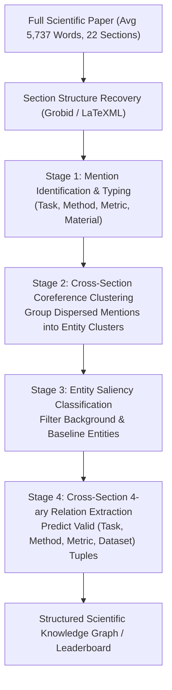

# SciREX: A Challenge Dataset for Document-Level Information Extraction

> [!INFO] 論文元數據 (Metadata)
> - **Paper ID**：`Jain2020_SciREX`
> - **作者**：Sarthak Jain, Madeleine van Zuylen, Hannaneh Hajishirzi, Iz Beltagy (Allen Institute for AI, Northeastern University, University of Washington)
> - **預印本初次發布年份 (Preprint)**：2020-05 (arXiv:2005.08295)
> - **正式發表年份 / 會議或期刊 (Venue)**：ACL 2020 (Long Paper, Pages 7506–7516)
> - **DOI**：[10.18653/v1/2020.acl-main.670](https://doi.org/10.18653/v1/2020.acl-main.670)
> - **ACL Anthology**：[https://aclanthology.org/2020.acl-main.670/](https://aclanthology.org/2020.acl-main.670/)
> - **開源專案**：[allenai/scirex (GitHub)](https://github.com/allenai/scirex)
> - **驗證狀態**：`verified` (已逐頁比對 ACL 2020 官方發表版本 PDF 全文與附錄實驗數據)
> - **本地 PDF 連結**：[[Papers/04 - Knowledge & Graph RAG/(ACL 2020-07) SciREX - A Challenge Dataset for Document-Level Information Extraction.pdf|開啟本地 PDF 檔案]]

---

## 1. 一話摘要 (TL;DR)
SciREX 構建了自然語言處理領域首個針對**完整科研論文全文（平均 5,737 詞、22 個章節）**的端到端篇章級資訊抽取基準，涵蓋實體提及識別、跨段落共指聚類、顯著實體（Salient Entity）過濾以及**跨章節 4 元複合關係抽取（Task, Method, Metric, Material/Dataset）**；實證揭示有 **99% 的 4 元關係跨越句子、55% 跨越章節**，且在真實端到端級聯管線中，累積誤差導致 4 元關係 F1 由單元隔離時的 **61.1% 暴跌至 0.8%**，以確鑿實驗量化了長篇全文結構化抽取的極限挑戰與瓶頸所在。

---

## 2. 研究背景與問題定義 (Problem Statement)

### 2.1 摘要級資訊抽取 (Abstract-level IE) 與真實文獻的脫節
在 SciREX 提出前，科學文獻資訊抽取（如 SciERC）絕大多數僅限於**論文摘要（Abstracts，平均僅約 130 詞、單一章節）**：
1. **關鍵事實深埋正文長程語境中**：論文的核心技術貢獻、實驗基準、消融設定與評測指標大量分佈在 Method、Experiments、Discussion 與附錄中，僅依賴摘要無法構建完整的科研知識圖譜（如自動更新 PapersWithCode 排行榜）。
2. **多實體複合關聯（$N$-ary Relations）的普遍存在**：科學事實並非孤立的二元主謂賓三元組，而通常是由多個實體共同約束的多元關係：
   $$\mathcal{R}_{4\text{-ary}} = \langle \text{Task}, \, \text{Method}, \, \text{Metric}, \, \text{Material/Dataset} \rangle$$
   這些實體往往分散在「引言」、「相關工作」、「方法」與「結果」等多個相隔數千詞的獨立章節中。
3. **顯著性實體與背景雜訊的混雜**：一篇論文中可能提及數十甚至上百個演算法與基準（如作為被對比的 Baseline、前人發明或歷史借鑑），如何精確過濾出「本文真正提出/主要研究」的顯著實體（Salient Entities），是局部句法模型無法企及的難題。

### 2.2 篇章級多元關係抽取的數學形式化
給定長篇文檔 $D$（由多個章節組成，長度遠超一般預訓練上下文窗口）：
1. **Mention Identification**：對 Token 序列預測實體跨距 $m_i = (w_{\text{start}}, \dots, w_{\text{end}})$ 及其科學類別 $t \in \{\text{Task}, \text{Method}, \text{Metric}, \text{Material}\}$；
2. **Coreference Resolution & Clustering**：將全文中指向同一概念的多個提及聚類為實體簇 $C_j = \{m_j^1, m_j^2, \dots\}$；
3. **Entity Saliency Classification**：預測實體簇 $C_j$ 是否為文檔核心焦點 $y_{\text{salient}}(C_j) \in \{0, 1\}$；
4. **$N$-ary Relation Classification**：給定 4 個顯著實體簇 $(C_T, C_M, C_E, C_D)$，預測該四元組合是否構成論文證實的完整實驗結論：
   $$P\left(R(C_T, C_M, C_E, C_D) = 1 \mid D\right)$$

---

## 3. 核心方法與技術架構 (Methodology & Architecture)

### 3.1 資料集規模與跨章節特徵 (Table 1, Page 7509)
SciREX 包含 438 篇經過深度審查標註的機器學習頂會論文全文（整合 PapersWithCode 的 Leaderboard 標註）：

| 特徵指標 (每篇文檔平均) | SciREX (本文基準) | SciERC (先前最大科學 IE 基準) |
| :--- | :---: | :---: |
| **詞數規模 (Words)** | **5,737** | 130 |
| **章節數量 (Sections)** | **22** | 1 |
| **實體提及數 (Mentions)** | **360** | 16 |
| **顯著實體數 (Salient Entities)** | **8** | — (未標註) |
| **二元關係數 (Binary Relations)** | **16** | 9.4 |
| **四元關係數 (4-ary Relations)** | **5** | — (未支援) |
| **跨句子二元關係比例** | **57%** | 0% |
| **跨句子四元關係比例** | **99%** | — |
| **跨章節二元關係比例** | **20%** | 0% |
| **跨章節四元關係比例** | **55%** | — |

*(出處：Table 1, Page 7509)*

### 3.2 階層式神經抽取管線與聯合損失
模型設計包含四個串聯組件：
1. **Mention Identification & Classification**：利用 SciBERT + BiLSTM 輸出各 Token 向量，接接 CRF 層預測 BIO 標籤；
2. **Pairwise Coreference & Clustering**：基於提及邊界向量計算成對共指概率，利用圖聚類算法將提及融合為實體簇；
3. **Salience Classification**：以實體簇內提及的出現頻率、首次出現位置、章節分佈特徵拼接為向量，透過二元分類器預測顯著性；
4. **Relation Classification**：對候選四元組節點進行注意力池化，輸入多層感知機計算關係有效性。

聯合訓練目標函數：
$$\mathcal{L} = \mathcal{L}_{\text{mention}} + \mathcal{L}_{\text{salience}} + \mathcal{L}_{\text{relation}}$$

### 3.3 系統架構流程圖 (Mermaid)

```mermaid
flowchart TD
    RawDoc["Full Scientific Paper (Avg 5,737 Words, 22 Sections)"] --> SectionParser["Section Structure Recovery (Grobid / LaTeXML)"]
    
    SectionParser --> MentionStep["Stage 1: Mention Identification & Typing<br/>(Task, Method, Metric, Material)"]
    
    MentionStep --> CorefStep["Stage 2: Cross-Section Coreference Clustering<br/>Group Dispersed Mentions into Entity Clusters"]
    
    CorefStep --> SaliencyStep["Stage 3: Entity Saliency Classification<br/>Filter Background & Baseline Entities"]
    
    SaliencyStep --> RelationStep["Stage 4: Cross-Section 4-ary Relation Extraction<br/>Predict Valid (Task, Method, Metric, Dataset) Tuples"]
    
    RelationStep --> KnowledgeOutput["Structured Scientific Knowledge Graph / Leaderboard"]
```

#### 圖中節點對照
- `RawDoc`: [[Papers/04 - Knowledge & Graph RAG/(ACL 2020-07) SciREX - A Challenge Dataset for Document-Level Information Extraction.pdf|長篇科研論文全文輸入]]
- `SectionParser`: 章節結構解析與文本線性化前處理模組
- `MentionStep`: Token/Span 級實體識別層
- `CorefStep`: 跨章節共指消解與聚類模組
- `SaliencyStep`: 核心研究對象顯著性二元分類器
- `RelationStep`: 四元複合關係笛卡兒積驗證器
- `KnowledgeOutput`: 結構化文獻知識庫元組

---

## 4. 主要實驗結果與證據 (Empirical Results & Evidence)

### 4.1 端到端錯誤級聯與崩塌分析 (Table 5, Page 7513)
在完整測試集上評估各步驟在獨立隔離（Gold Input）與真實端到端（Predicted Input）下的極限表現：

| 評估配置與輸入條件 | 評測子任務 | Precision | Recall | F1 Score |
| :--- | :--- | :---: | :---: | :---: |
| **Component-wise (給定前置步驟 Gold 標準輸入)** | 提及識別 (Mention ID) | 0.707 | 0.717 | 0.712 |
| | 實體共指消解 (Coreference) | 0.861 | 0.852 | 0.856 |
| | 顯著實體簇 (Salient Entity Clusters) | 1.000 | 0.984 | **0.987** |
| | 二元關係 (Binary Relations) | 0.820 | 0.440 | **0.570** |
| | **四元關係 (4-ary Relations)** | 0.531 | 0.718 | **0.611** |
| **End-to-end (全自動串聯預測輸入，真實級聯)** | 顯著實體簇 (Salient Entity Clusters) | 0.223 | 0.600 | **0.307** |
| | 二元關係 (Binary Relations) | 0.065 | 0.411 | **0.096** |
| | **四元關係 (4-ary Relations)** | 0.007 | 0.173 | **0.008** |
| **Diagnostic: End-to-end + Gold Salient Clustering** | 顯著實體簇 | 0.776 | 0.614 | 0.668 |
| | 二元關係 | 0.372 | 0.328 | 0.334 |
| | **四元關係 (4-ary Relations)** | 0.310 | 0.281 | **0.268** |

*(出處：Table 5, Page 7513)*

> [!WARNING] 關鍵發現：端到端錯誤雪崩 (Error Cascade Avalanche)
> - **單元隔離 vs 真實串聯**：在輸入完全正確的隔離設定下，4 元關係抽取的 F1 達到了具備實用價值的 **0.611**；然而在真實端到端流程中，由於提及識別的微小偏差（Recall 71.7%）經由共指與顯著性過濾放大，**四元關係 F1 發生災難性崩潰，跌至 0.008（不足 1%）**！
> - **核心瓶頸定位**：當為端到端系統注入 Gold 顯著實體簇標籤時，四元關係 F1 瞬間由 0.008 飆升至 **0.268（提升超過 33 倍）**；這證明「長文獻顯著實體精確識別與指代聚類」是制約篇章級知識抽取的最大死穴。

### 4.2 經典模型 DyGIE++ 在全文長文檔上的徹底失效 (Table 3, Page 7513)
在 SciREX 全文上測試專為短文檔設計的 SOTA 模型 DyGIE++：
- **全文端到端二元關係抽取**：DyGIE++ 在全文章節（All sections）上的 Precision、Recall、F1 全部為 **0.000**；
- **僅在摘要章節上運行**：DyGIE++ 的 F1 亦僅為 **0.002**；
- 相比之下，SciREX 基準模型在二元關係端到端上取得 **0.096 F1**。
這確鑿證明了局部滑動窗口模型根本無法應對長篇全文的跨章節實體關聯。

---

## 5. 優勢、限制及 Trade-offs (Strengths, Limitations & Trade-offs)

### 5.1 核心優勢 (Strengths)
1. **確立長文檔全景抽取新範式**：徹底打破「論文抽取 = 摘要抽取」的掩耳盜鈴假象，首次面對 5,000+ 詞全文與 20+ 章節的真實挑戰。
2. **引入多元複合關係（$N$-ary Tuples）**：精準刻畫科學知識體系的複合命題結構，超越了簡單二元三元組的表現力極限。
3. **量化揭露錯誤級聯的破壞力**：Table 5 的消融實驗成為 NLP 領域批判管線式抽取、推動後續端到端生成式架構（如 UIE、InstructUIE）最重要的文獻證據。

### 5.2 核心限制 (Limitations)
1. **人工標註成本極高導致樣本量受限**：全文標註 438 篇長篇論文耗費巨大人力，資料集規模難以直接用於從頭訓練超大規模神經網路。
2. **章節解析工具的先驗依賴**：依賴 PDF 解析器（Grobid / LaTeXML）提取章節結構，在遇到排版複雜或掃描版文檔時，結構丟失會進一步惡化抽取質量。

### 5.3 系統 Trade-offs
- **管線式可控性 vs 生成式端到端**：管線式模型（如 SciREX 基準）模組邊界清晰、可單獨診斷，但承受著毀滅性的錯誤級聯；而端到端生成式模型（如大語言模型直接輸出 JSON）可避免級聯，但極易產生幻覺與實體漏檢。

---

## 6. 對本專案研究領域的實際意義 (Implications for Research Domains)

### 6.1 在 D03 Knowledge Extraction & Consolidation 中的核心地位
SciREX 為本專案的 D03 領域提供了兩條至關重要的鐵律：
1. **「長文本分塊抽取」存在不可逆的資訊截斷**：
   在真實科研文檔中，**55% 的複合結論跨越章節**。如果 RAG 系統僅在單個 Chunk（如 512 token）內獨立抽取實體與關係，必然會直接丟失超過半數的核心事實。因此，必須在分塊抽取後實施全域**跨段落共指整合（Cross-chunk Consolidation）**。
2. **嚴防抽取錯誤在下游 RAG 檢索中雪崩傳播**：
   從 0.611 跌至 0.008 的雪崩效應警示我們：在構建知識圖譜與結構化索引時，低質量的自動抽取非但不能增強 RAG，反而會引入海量虛假邊與孤立實體，徹底污染 D04 的索引表徵。

### 6.2 與相鄰領域的邊界劃分
- **D01 Ingestion vs D03 Extraction**：D01 負責將 PDF 解析為帶有章節標籤的乾淨文字流；D03（SciREX）在此基礎上抽取多章節複合四元組。
- **D03 Extraction vs D06 Evidence Sufficiency**：D03 識別文檔中已被完整支持的事實元組；若四元組中缺失 Metric 或 Method，下游如何發起補充檢索屬於 D06 檢索控制範疇。

---

## 7. 原始來源及相關筆記連結 (Sources & Related Notes)

- **本地原始文獻**：[[Papers/04 - Knowledge & Graph RAG/(ACL 2020-07) SciREX - A Challenge Dataset for Document-Level Information Extraction.pdf|開啟本地 PDF 檔案]]
- **關聯抽取論文筆記**：
  - [[03 - 論文庫 (Literature Notes)/04 - Knowledge & Graph RAG/(ACL 2019-07) DocRED - A Large-Scale Document-Level Relation Extraction Dataset|DocRED: 大規模篇章級關聯抽取基準]]
  - [[03 - 論文庫 (Literature Notes)/04 - Knowledge & Graph RAG/(EMNLP 2019-11) Entity, Relation, and Event Extraction with Contextualized Span Representations|DyGIE++: 跨句圖傳播資訊抽取]]
  - [[03 - 論文庫 (Literature Notes)/04 - Knowledge & Graph RAG/(ACL 2020-07) A Joint Neural Model for Information Extraction with Global Features|OneIE: 基於全域特徵的聯合資訊抽取模型]]
  - [[03 - 論文庫 (Literature Notes)/04 - Knowledge & Graph RAG/(arXiv 2026-05) Beyond Chunk-Local Extraction - Cross-Chunk Graph Augmentation for GraphRAG|CrossAug: GraphRAG 跨塊圖結構增強]]
- **關聯研究領域**：
  - [[02 - 研究領域專題 (Research Domains)/Domain 01 - Document Ingestion & Structure|Domain 01 - Document Ingestion & Structure]]
  - [[02 - 研究領域專題 (Research Domains)/Domain 02 - Segmentation & Contextualization|Domain 02 - Segmentation & Contextualization]]
  - [[02 - 研究領域專題 (Research Domains)/Domain 03 - Knowledge Extraction & Information Preservation|Domain 03 - Knowledge Extraction & Consolidation]]
