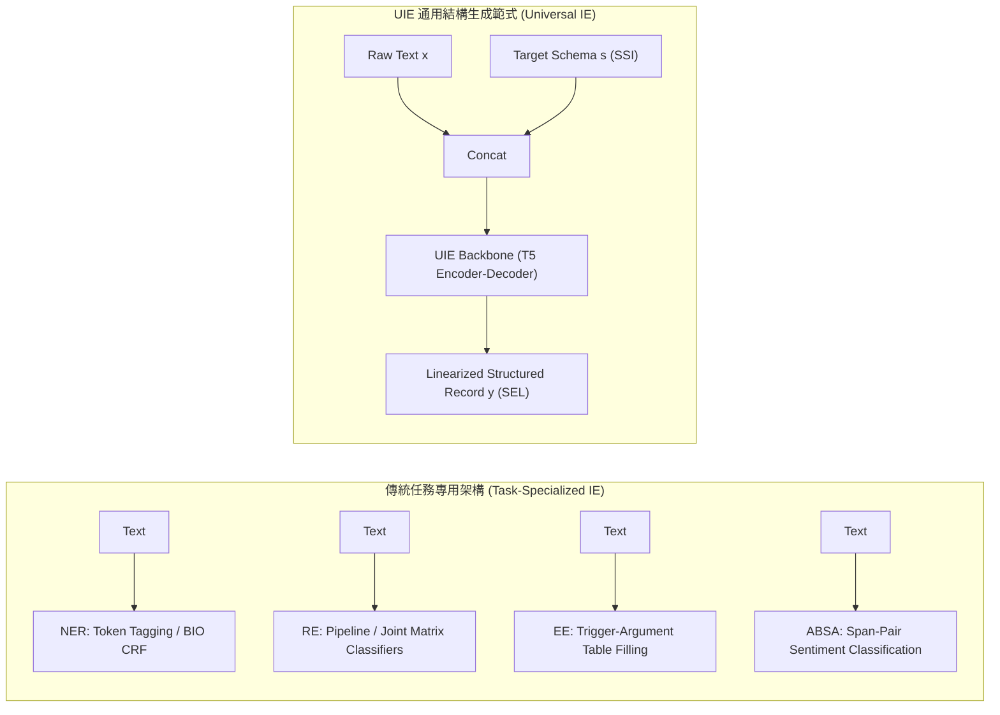
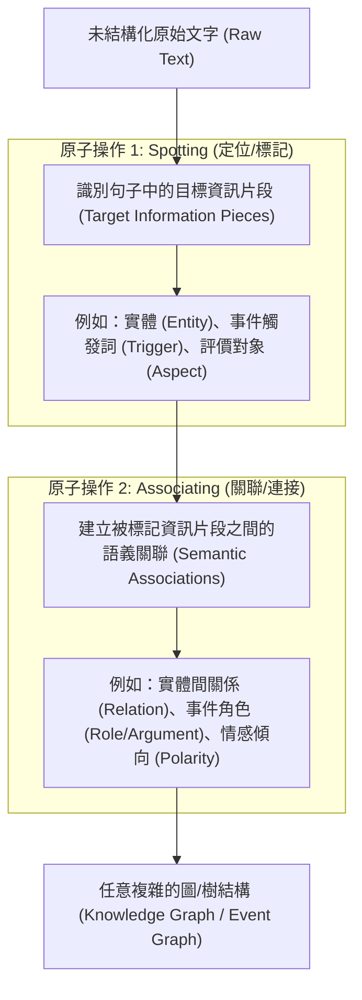
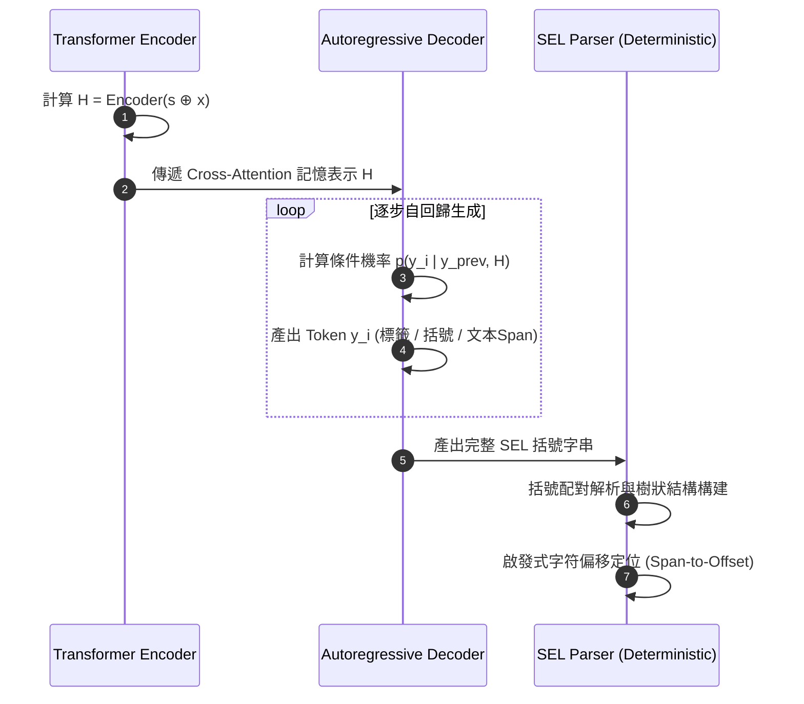
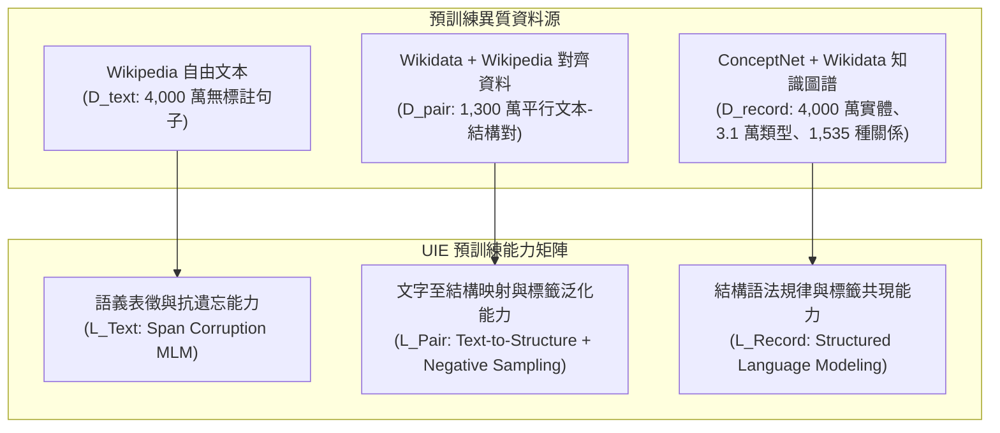
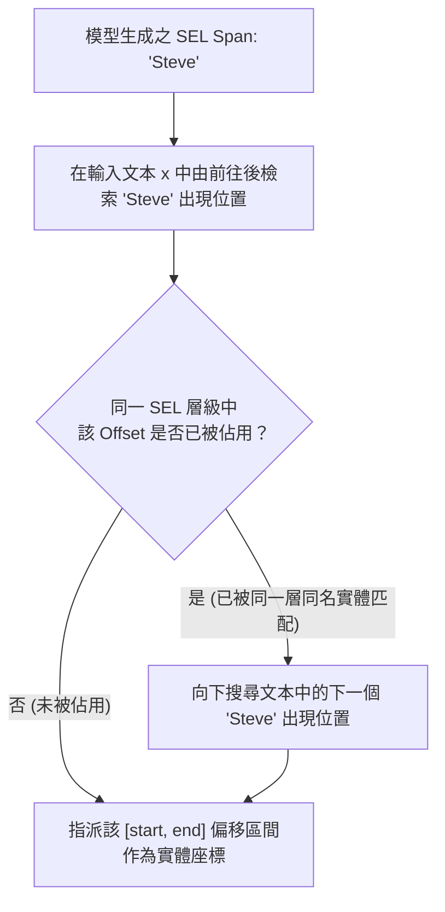
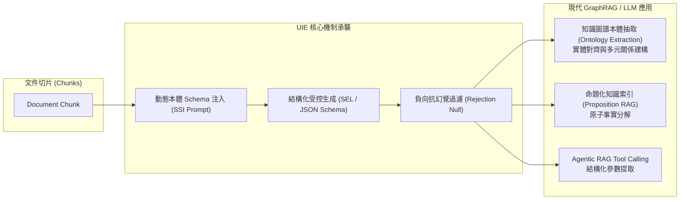

# Unified Structure Generation for Universal Information Extraction (UIE)

### 論文深度技術簡報：架構設計、形式化語法、預訓練目標與數學推導全景剖析

**論文出處**：ACL 2022 (Long Paper), pp. 1075–1086  
**作者團隊**：Yaojie Lu, Qing Liu, Dai Dai, Xinyan Xiao, Hongyu Lin, Xianpei Han, Le Sun, Hua Wu  
**機構**：中國科學院軟體研究所 (ISCAS) 中文資訊處理實驗室 / 百度 (Baidu Inc.)  
**論文識別**：DOI: `10.18653/v1/2022.acl-long.395` | arXiv: `2203.12277`  
**開源專案**：`https://universal-ie.github.io`

---

## 簡報目錄 (Agenda)

1. **研究動機與範式轉移**：傳統 IE 碎片化架構 vs. 通用生成式 IE
2. **核心抽象概念**：IE 兩大原子操作 —— 定位 (Spotting) 與關聯 (Associating)
3. **結構化提取語言 (SEL)**：形式化語法、符號定義與四大多任務統一編碼
4. **結構化模式指導符 (SSI)**：可動態適配的 Schema Prompt 引導機制
5. **模型架構與數學建模**：Encoder-Decoder 序列生成與條件概率分解 (式 1 ~ 式 4)
6. **多源弱監督預訓練體系**：$\mathcal{D}_{\text{pair}}, \mathcal{D}_{\text{record}}, \mathcal{D}_{\text{text}}$ 與三大損失函數推導 (式 5 ~ 式 8)
7. **負向模式採樣與拒絕機制 (RM)**：緩解自回歸暴露偏差與幻覺 (式 9)
8. **字串到字符偏移解碼演算法**：跨層級無衝突啟發式對齊
9. **實驗評測與消融驗證**：13 個 Benchmark、跨領域 Few-shot 與模組消融
10. **技術權衡、工程邊界與對 GraphRAG 的啟示**

---

## 1. 傳統資訊抽取 (IE) 的困境與碎片化瓶頸

### 傳統 IE 的「三大異質性」挑戰
- **目標多樣性 (Varying Targets)**：實體 (Entities)、關係 (Relations)、事件 (Events)、細粒度情緒 (Sentiments)。
- **結構異質性 (Heterogeneous Structures)**：連續/非連續文字片段 (Spans)、三元組 (Triplets)、多元觸發詞-論元樹 (Records / Trees)。
- **領域模式專用性 (Demand-Specific Schemas)**：不同領域本體 (Ontology) 的標籤集高度特異且相互孤立。

### 傳統架構的技術代價
- **架構碎片化**：序列標註 (BIO/CRF)、分類器 (Span Classification)、機器閱讀理解 (MRC/QA)、表格填充 (Table-filling) 各立門戶。
- **Pipeline 誤差傳播**：多階段「先實體後關係」或「先觸發詞後論元」造成級聯錯誤。
- **知識遷移極度困難**：專用分類頭 (Task-specific Classification Head) 的參數位址被死鎖，新任務/小樣本時無法共享先驗知識。

> [!NOTE] 核心痛點
> 傳統資訊抽取缺乏統一的抽象語法與通用計算架構，導致每個新任務都必須「重造輪子」，無法將巨量預訓練模型的泛化力直接釋放到跨領域結構抽取中。

---

## 2. 範式轉移：Universal Text-to-Structure



### UIE 的核心突破
- **輸入端統一**：將「文字」與「目標模式 (Schema)」拼接為單一文本序列。
- **輸出端統一**：將「實體、關係、事件、情緒」轉化為統一的結構生成語言。
- **學習目標統一**：全部轉換為自回歸條件機率生成 $p(y \mid x, s)$。

---

## 3. 核心理論抽象：IE 的兩大原子操作

論文深刻洞察到：**無論多麼複雜的 IE 結構，本質上都可精確分解為兩種基本操作的遞迴組合**：



- **Spotting (點)**：從連續語流中鎖定語義錨點（$v \in V$）。
- **Associating (邊)**：在已定位的錨點之間指派有向語義關係（$e = (v_i, r, v_j) \in E$）。

---

## 4. 結構化提取語言：Structured Extraction Language (SEL)

### SEL 的形式化語法定義
SEL 是一種輕量級、階層式的 S-expression 括號語言，由三種語義單元與兩種語法符號構成：

1. **`SPOTNAME`**：表示原始文本中存在特定類型的被定位資訊片（Spotting 類型，如 `person`, `start position`）。
2. **`ASSO NAME`**：表示存在與其上一層（Upper-level）被定位資訊具有特定關聯的資訊片（Associating 類型，如 `work for`, `employee`）。
3. **`INFO SPAN`**：對應於原始輸入文本中的精確表面字串片段（Surface Text Span）。
4. **語法冒號 `:`**：標明從抽取標籤 (`SPOTNAME` 或 `ASSO NAME`) 到表面片段 (`INFO SPAN`) 的對照映射。
5. **括號對 `(...)`**：定義層級歸屬與嵌套範圍，外層括號代表頂層 Spot，內層括號代表掛載的 Association。

### SEL 語法表達式 BNF 範式
$$
\begin{aligned}
\langle \text{SEL} \rangle &::= \text{"(" } \langle \text{SpotExpr} \rangle^+ \text{ ")"} \\
\langle \text{SpotExpr} \rangle &::= \text{"(" } \text{SPOTNAME} \text{":" } \text{INFO SPAN } (\langle \text{AssoExpr} \rangle)^* \text{ ")"} \\
\langle \text{AssoExpr} \rangle &::= \text{"(" } \text{ASSO NAME} \text{":" } \text{INFO SPAN } (\langle \text{AssoExpr} \rangle)^* \text{ ")"}
\end{aligned}
$$

---

## 5. SEL 對四大多任務的統一編碼實例

```
原始句子："In 1997, Steve was excited to become the CEO of Apple."
```

| 任務型態 | 抽取目標與結構定義 | 對應的標準 SEL 表達式 |
| :--- | :--- | :--- |
| **命名實體識別 (NER)**<br>*(Flat / Nested Entities)* | 識別實體類型及其文字邊界 | `((person: Steve) (organization: Apple) (time: 1997))` |
| **關係抽取 (RE)**<br>*(Entity-Relation Triplets)* | 主體實體作為 Spot，關聯關係與客體作為 Asso | `((person: Steve (work for: Apple)))` |
| **事件抽取 (EE)**<br>*(Trigger & Role Arguments)* | 事件觸發詞作為 Spot，多元論元與角色作為 Asso | `((start position: become (employee: Steve) (employer: Apple) (time: 1997)))` |
| **屬性級情緒分析 (ABSA)**<br>*(Aspect-Opinion-Sentiment)* | 評價方面 (Aspect) 作為 Spot，情感極性與觀點作為 Asso | `((aspect: CEO (positive: excited)))` |

### SEL 的三大設計優勢
1. **極度精簡 (Compactness)**：省略冗餘符號，解碼序列長度最短化，大幅降低自回歸解碼延遲。
2. **多任務天然聯合抽取 (Joint Extraction)**：實體與關係、觸發詞與論元共享同一生成括號，徹底消除 Pipeline 誤差。
3. **巢狀結構天然支援**：透過括號遞迴，天然支援 Nested NER 與高階多重關聯。

---

## 6. 結構化模式指導符：Structural Schema Instructor (SSI)

### 為什麼需要 SSI？
純文字生成模型面臨**模式失控**問題：面對同一句話，使用者在 NER 任務時只想要抽取人名與機構名，但在 EE 任務時則需要抽取就職事件。若無約束，模型將無法得知抽取的業務邊界。

### SSI 的前綴提示機制 (Prefix Prompt)
SSI 在原始文本輸入前注入目標 Schema 定義，包含三類標記區段：
- `[spot]`：引導詞，後接目標定位類型標籤名稱（如 `[spot] person`）。
- `[asso]`：引導詞，後接目標關聯類型標籤名稱（如 `[asso] work for`）。
- `[text]`：分隔引導符，宣告 Schema 定義結束，後續為原始待抽取文本。

```
SSI 結構形式：
s = [[spot], Spot_1, ..., [spot], Spot_m, [asso], Asso_1, ..., [asso], Asso_k, [text]]
```

### 標籤語義化 (Label Verbalization)
- **捨棄隨機標籤 ID**：傳統模型將標籤對映為獨立整數索引（如 `Label_14`），標籤間語義完全隔絕。
- **自然語言單詞映射**：SSI 直接使用自然語言單詞（如 `work for`, `start position`），直接啟動預訓練語言模型中沉澱的通用常識與跨任務語義（例如：`location` 與 `place` 語義自動打通）。

---

## 7. 端到端架構與數學建模 (式 1 ~ 式 4)

### 輸入序列拼接 (式 2)
設目標模式為 $s = [s_1, s_2, \dots, s_{|s|}]$, 輸入文本為 $x = [x_1, x_2, \dots, x_{|x|}]$，完整輸入序列定義為兩者的前綴拼接：
$$
s \oplus x = [s_1, s_2, \dots, s_{|s|}, x_1, x_2, \dots, x_{|x|}] \tag{2}
$$
其中 $s_1 \dots s_{|s|}$ 包含特殊符號 `[spot]`, `[asso]`, `[text]` 及自然語言標籤名。

### 總體生成映射關係 (式 1)
UIE 透過端到端參數量化函數直接輸出線性化 SEL 序列 $y = [y_1, y_2, \dots, y_{|y|}]$：
$$
y = \text{UIE}(s \oplus x) \tag{1}
$$

### Transformer 編碼器隱層表示 (式 3)
雙向 Transformer 編碼器對模式提示與原始文本進行全局交叉注意力編碼：
$$
H = \text{Encoder}(s_1, \dots, s_{|s|}, x_1, \dots, x_{|x|}) \in \mathbb{R}^{(|s| + |x|) \times d_{\text{model}}} \tag{3}
$$
$H$ 中的每個 token 向量已深度融合了 Schema 標籤與上下文的交互資訊。

---

## 8. 自回歸結構解碼機制 (式 4)

### 逐步條件解碼與狀態轉移 (式 4)
Transformer 解碼器在時間步 $i$ 接收編碼器記憶矩陣 $H$ 與前 $i-1$ 步已生成的解碼隱層狀態 $h_{1}^d, \dots, h_{i-1}^d$：
$$
y_i, h_i^d = \text{Decoder}([H; h_1^d, \dots, h_{i-1}^d]) \tag{4}
$$

### 次 token 條件機率分佈
解碼器線性投射層輸出字表上的 Softmax 分佈：
$$
p(y_i \mid y_{<i}, x, s) = \text{Softmax}\left( W_v h_i^d + b_v \right)
$$
- $y_i$ 可以是 SEL 語法字符 (`(`, `)`, `:`, 空格)，或是原始文本中的字詞 (Span)，或是 Schema 中的標籤名。
- 解碼過程持續推進，直到模型自發生成終止標記 `</s>` (`<eos>`) 為止。



---

## 9. 預訓練語料體系：異質資料的三重構建

UIE 需要掌握三種核心能力：**文字語義理解**、**文字到結構的映射**、**合法結構的解碼能力**。為此，論文採集三大預訓練語料集：



- $\mathcal{D}_{\text{pair}} = \{(x, y)\}$：平行資料，經由遠程監督對齊 Wikidata 三元組與 Wikipedia 原句。
- $\mathcal{D}_{\text{record}} = \{y\}$：非平行純結構記錄，直接由圖譜知識抽取轉換為合法 SEL 表達式。
- $\mathcal{D}_{\text{text}} = \{x\}$：Wikipedia 純文字資料。

---

## 10. 預訓練任務 1：$\mathcal{L}_{\text{Pair}}$ 與負向模式採樣 (式 5)

### 正向模式的致命缺陷：單純記憶 (Memorization)
若預訓練時僅將樣本真實包含的 Schema $s^+ = s_s^+ \cup s_a^+$ 提供給模型，模型會學到偷懶策略：**只要 Schema 裡出現某標籤，句子裡就必定存在對應結構**。這會摧毀模型在真實場景下的甄別能力。

### 元模式構建 (Meta-Schema Construction)
為了迫使模型學會真實的**識別與過濾能力**，預訓練中引入負向模式採樣 (Negative Schema Sampling)：
1. 提取樣本中的正向類型標籤：$s^+ = s_s^+ \cup s_a^+$。
2. 從全局標籤字典中隨機採樣負向實體類型 $s_s^-$ 與負向關聯類型 $s_a^-$ (各最多 10 個)。
3. 組裝為元模式 (Meta-Schema)：
   $$
   s_{\text{meta}} = s^+ \cup s_s^- \cup s_a^-
   $$

### 文字至結構預訓練目標函數 (式 5)
$$
\mathcal{L}_{\text{Pair}} = \sum_{(x, y) \in \mathcal{D}_{\text{pair}}} - \log p(y \mid x, s_{\text{meta}}; \theta_e, \theta_d) \tag{5}
$$
- 模型必須在同時面對正向與負向 Schema 提示的情境下，僅抽取出與文本匹配的正向結構 $y$，學會「有則提取，無則忽略」。

---

## 11. 預訓練任務 2 & 3 與總體目標 (式 6 ~ 式 8)

### 結構生成預訓練：$\mathcal{L}_{\text{Record}}$ (式 6)
利用純結構記錄語料 $\mathcal{D}_{\text{record}}$，將解碼器作為結構化語言模型（Structured LM）進行單獨自回歸訓練：
$$
\mathcal{L}_{\text{Record}} = \sum_{y \in \mathcal{D}_{\text{record}}} \sum_{i=1}^{|y|} - \log p(y_i \mid y_{<i}; \theta_d) \tag{6}
$$
- **作用**：解碼器在無文本輸入下自主學習 SEL 的閉合括號約束、語法合法性，以及實體類型與關係類型的先驗共現機率。

### 語義表徵微調：$\mathcal{L}_{\text{Text}}$ (式 7)
在純文本語料 $\mathcal{D}_{\text{text}}$ 上執行基於 Span 掩碼的遮蔽語言模型 (T5 Span Corruption MLM)：
$$
\mathcal{L}_{\text{Text}} = \sum_{x \in \mathcal{D}_{\text{text}}} - \log p(x'' \mid x'; \theta_e, \theta_d) \tag{7}
$$
- $x'$ 為帶有破壞性掩碼標記的輸入句子， $x''$ 為被掩蓋的片段目標。
- **作用**：極大程度緩解在結構訓練過程中對自然語言語義特徵的災難性遺忘 (Catastrophic Forgetting)。

### 最終多任務統一預訓練目標 (式 8)
$$
\mathcal{L} = \mathcal{L}_{\text{Pair}} + \mathcal{L}_{\text{Record}} + \mathcal{L}_{\text{Text}} \tag{8}
$$
工程實作中將三種資料統一打包為三元組格式，按比例交錯混洗進同一個 Batch：
- 對於 $\mathcal{D}_{\text{pair}}$：輸入為 $(s_{\text{meta}}, x, y)$
- 對於 $\mathcal{D}_{\text{record}}$：輸入為 $(\text{None}, \text{None}, y)$
- 對於 $\mathcal{D}_{\text{text}}$：輸入為 $(\text{None}, x', x'')$

---

## 12. 任務自適應微調與拒絕機制 (RM) (式 9)

### 下游微調損失函數 (式 9)
在特定下游任務標註資料集 $\mathcal{D}_{\text{Task}} = \{(s, x, y)\}$ 上，使用 Teacher-forcing 交叉熵損失微調：
$$
\mathcal{L}_{\text{FT}} = \sum_{(s, x, y) \in \mathcal{D}_{\text{Task}}} - \log p(y \mid x, s; \theta_e, \theta_d) \tag{9}
$$

### 自回歸生成的致命隱患：暴露偏差與幻覺
當下游任務提示中包含文本中不存在的負向標籤時，自回歸解碼極易誘發過度生成 (Over-generation)，強行拼湊出錯誤的 Span。

### 拒絕機制 (Rejection Mechanism, RM)
- **雜訊注入訓練 (Noise Injection)**：在微調階段，以機率 $p_\epsilon$ ($p_\epsilon \in \{0.1, 0.2\}$) 向目標真實 SEL 中隨機注入負向標籤的拒絕單元：
  $$
  (\text{SpotName}_{\text{neg}}: \text{[NULL]}) \quad \text{或} \quad (\text{AssoName}_{\text{neg}}: \text{[NULL]})
  $$
- **範例展示**：
  - 輸入 Schema 包含負向標籤 `facility`（原句中無建築設施）。
  - 目標 SEL 注入雜訊：`((person: Steve (work for: Apple)) (facility: [NULL]))`
- **推論時解析規則**：
  - 模型若判斷該標籤無對應內容，將主動輸出 `[NULL]`。
  - 後處理解析器直接丟棄所有取值為 `[NULL]` 的鍵值對。
- **實驗證明**：此機制使模型在 10-shot 評測中的精確率 (Precision) 飆升 **+13.16%**！

---

## 13. 後處理：字串生成到字符偏移映射演算法

### 評測標準的客觀要求
生成式模型輸出的是字符文字（如 `"Steve"`），但學界標準 IE Benchmark (如 ACE04/05, CoNLL) 採用基於原始文本字符索引的評測協議（Character-level Offset Micro-F1，要求精確匹配 `[start_offset, end_offset]`）。

### 跨層級無衝突啟發式對齊 (Span-to-Offset Heuristic)


### 演算法實證效果
- 論文在 Appendix A 深入驗證，此啟發式規則的映射錯誤率 **$< 0.5\%$**，幾乎達到完美無損轉化。
- 徹底消除了以往生成式模型「只能對齊字串、無法精確計算標準 Offset」的質疑。

---

## 14. 完整實驗結果與全面 SOTA 驗證

論文在 **4 大 IE 任務、13 個經典 Benchmark** 上進行全面評測，無論 Full-data 還是 Low-resource 皆大幅領先專用模型：

### 1. 全數據監督學習表現 (Supervised SOTA)
| 任務維度 | 代表性資料集 | 評測指標 | 既有任務專用 SOTA (Specialized) | UIE-base | UIE-large |
| :--- | :--- | :--- | :---: | :---: | :---: |
| **實體抽取 (NER)** | CoNLL03<br>ACE04<br>ACE05-Ent | Ent Micro F1<br>Ent Micro F1<br>Ent Micro F1 | 93.21 (Wang et al., 2021)<br>86.44 (Yan et al., 2021)<br>86.88 (Yan et al., 2021) | 92.99<br>86.89<br>85.78 | **93.54**<br>**87.27**<br>**86.89** |
| **關係抽取 (RE)** | CoNLL04<br>ACE05-Rel<br>NYT<br>SciERC | Rel Strict F1<br>Rel Strict F1<br>Rel Triplet F1<br>Rel Strict F1 | 75.40 (Wang et al., 2020)<br>66.80 (Lin et al., 2020)<br>92.20 (Wang et al., 2020)<br>38.40 (Wadden et al., 2019) | 75.00<br>66.06<br>92.35<br>37.28 | **78.20**<br>**67.52**<br>**93.54**<br>**39.80** |
| **事件抽取 (EE)** | ACE05-Evt<br>CASIE (資安) | Evt Trigger F1 / Arg F1<br>Evt Trigger F1 / Arg F1 | 73.60 / 55.10 (Lin et al., 2020)<br>68.97 / 60.36 (TEXT2EVENT) | 73.36 / 54.79<br>69.33 / 61.30 | **74.88 / 56.77**<br>**70.83 / 63.63** |
| **情緒抽取 (ABSA)** | 16res (SemEval) | Sentiment Triplet F1 | 72.02 (Xu et al., 2021) | 75.07 | **76.24** |

> **核心意義**：過去需要四套完全不同架構 (BIO標註、分類矩陣、MRC指針、雙向表格) 的任務，**UIE 單一模型、單套權重全線打平或超越專用 SOTA**。

---

## 15. 低資源與 Few-shot 跨任務遷移能力

### 少樣本情境下的碾壓性優勢 (Table 3 摘要)
在 1-shot、5-shot、10-shot 以及 1%、5%、10% 的低資源設定下，對比未經結構預訓練的 T5-v1.1 基座模型：

| 評測任務 (幾-shot 平均) | T5-v1.1-base | Fine-tuned T5-base | UIE-base w/o SSI | **UIE-base (Full)** |
| :--- | :---: | :---: | :---: | :---: |
| **NER (CoNLL03 Average F1)** | 16.58 | 44.11 | 47.90 | **54.99 (+10.88)** |
| **Relation (CoNLL04 Average F1)** | 11.53 | 24.63 | 34.34 | **39.95 (+15.32)** |
| **Event Trigger (ACE05 Average F1)** | 37.77 | 43.25 | 43.73 | **47.53 (+4.28)** |
| **Event Argument (ACE05 Average F1)** | 16.83 | 21.00 | 21.20 | **24.32 (+3.32)** |
| **Sentiment Triplet (16res Average F1)** | 4.94 | 19.18 | 19.21 | **25.28 (+6.10)** |

### 為什麼預訓練能泛化到完全沒見過的任務？
- **零樣本標籤遷移**：預訓練語料中**完全不包含** Event (觸發詞/論元) 與 Sentiment (情感極性) 的標註資料。
- **結構表徵共享**：透過學習 $\mathcal{D}_{\text{pair}}$ 與 $\mathcal{D}_{\text{record}}$，UIE 掌握了**「語法括號生成」、「文字定位與邊界約束」、「語意錨點配對」**的泛化抽取元能力 (Meta-extraction ability)！

---

## 16. 關鍵消融實驗：拆解 UIE 的成功核心

### 1. 預訓練任務消融 (Table 4)
| 實驗配置 | CoNLL03 (NER) | CoNLL04 (RE) | ACE05 (Evt-Tri) | ACE05 (Evt-Arg) | 16res (Sent) |
| :--- | :---: | :---: | :---: | :---: | :---: |
| **UIE-base (完整版)** | **95.89** | **75.97** | **72.63** | **57.27** | **74.73** |
| 移除 $\mathcal{L}_{\text{Pair}}$ (平行對齊損失) | 95.83 | 75.07 (-0.90) | 71.20 (-1.43) | 55.79 (-1.48) | 74.27 (-0.46) |
| 移除 $\mathcal{L}_{\text{Record}}$ (結構建模損失) | 95.69 | 75.68 (-0.29) | 71.99 (-0.64) | 57.60 (+0.33) | 74.43 (-0.30) |
| 移除 $\mathcal{L}_{\text{Text}}$ (語義重建損失) | 95.66 | 75.70 (-0.27) | 70.89 (-1.74) | 54.16 (-3.11) | 74.28 (-0.45) |
| 退化為 T5-v1.1-base 原生模型 | 95.29 | 72.12 (-3.85) | 70.50 (-2.13) | 54.42 (-2.85) | 72.03 (-2.70) |

- **結論 1**：$\mathcal{L}_{\text{Pair}}$ 是抽取映射能力的基石，移除後所有關聯抽取顯著下滑。
- **結論 2**：$\mathcal{L}_{\text{Text}}$ 對複雜模式至關重要！在擁有 33 種事件類型的 ACE05 上，移除語義重建導致論元抽取直接崩跌 **3.11 個點**。

### 2. 拒絕機制消融 (Table 5: 10-shot CoNLL03)
| 模型配置 | 準確率 Precision (P) | 召回率 Recall (R) | F1 值 | Precision 淨增益 ($\Delta P$) |
| :--- | :---: | :---: | :---: | :---: |
| **UIE-base (含 RM)** | **79.54** | 72.63 | **75.91** | **+11.41** |
| UIE-base (移除 RM) | 68.13 | 67.85 | 66.13 | 基準對照 |
| **Fine-tuned T5-base (含 RM)** | **74.12** | 61.72 | **67.33** | **+17.95** |
| Fine-tuned T5-base (移除 RM) | 56.17 | 56.00 | 55.94 | 基準對照 |

- **結論**：自回歸生成極易產生未命中標籤的虛假預測，注入 `[NULL]` 拒絕雜訊強制模型學會「無解則棄」，全面挽救生成式 IE 的精確率。

---

## 17. 技術權衡、限制與工程失效情境 (Trade-offs & Failure Modes)

在工業實踐與工程落地上，必須客觀審視 UIE 的代價與限制：

### 1. 推論延遲與計算吞吐量 (Latency vs. Throughput)
- **非自回歸 vs. 自回歸**：傳統標註模型 (如 Token-pair / TPLinker) 具備常數級 $\mathcal{O}(1)$ 前向推理延遲；而 UIE 採用 Token-by-token 自回歸生成，時間複雜度為 $\mathcal{O}(N)$ ($N$ 為生成結構長度)。
- **長文字高密度實體場景**：當文檔中包含上百個實體與三元組時，解碼器自回歸步驟劇增，顯存佔用 (KV Cache) 與延遲顯著攀升。

### 2. 上下文長度與 Schema 佔用開銷 (Context Budget)
- **T5 512 Token 上下文限制**：UIE 將 SSI 與 Text 串接，當 Schema 包含數十個標籤（如 NYT 24 關係、ACE 33 事件）時，SSI 本身即耗盡上百 Token，嚴重壓縮原始文檔的容納空間。

### 3. 語法結構幻覺與容錯 (Malformed Syntax)
- 儘管 $\mathcal{L}_{\text{Record}}$ 大幅改善結構規律，在極低資源或極長序列下，模型仍偶發「未閉合括號」或「冒號丟失」等語法解析錯誤，需要工程正則修復或受約束解碼 (Constrained Decoding) 兜底。

---

## 18. 對本專案與 GraphRAG / Agentic RAG 的啟示

UIE 奠定了現代知識圖譜自動構建與大模型結構化理解的基石：



1. **Schema-guided 知識抽取的標準範式**：
   證明了無需為新實體本體微調專用網絡，只需改變前綴 Schema 即可零成本切換領域（奠定了後續 InstructUIE、GoLLIE、ChatIE 的演進方向）。
2. **GraphRAG 的實體-關係保真索引**：
   解決了傳統向量切片「丟失關係三元組上下文」的盲點，提供了一致性強、抗幻覺的圖結構抽取基礎。
3. **拒絕機制的借鑑價值**：
   在 RAG 檢索生成與結構化抽取中，加入顯式的拒絕生成標記 (`[NULL]`)，是抑制 LLM 幻覺與提高結構精確率的最佳工程實踐。

---

## 19. 核心總結 (Conclusion & Key Takeaways)

### 三個核心創新
1. **一種語言 (SEL)**：用極簡的 Spot-Association 括號語法統一了全品類異質 IE 任務。
2. **一個機制 (SSI)**：用自然語言 Schema 前綴提示實現了靈活可控的條件抽取與跨任務語義共享。
3. **一個預訓練架構 (UIE)**：整合平行對齊、純結構建模與文本重建三大損失函數，預訓練出首個具備強大跨任務遷移能力的通用抽取基座。

### 一個核心公式回顧
$$
y = \text{Decoder}\left(\text{Encoder}(s_{\text{SSI}} \oplus x_{\text{Text}})\right)
$$
$$
\mathcal{L}_{\text{Total}} = \underbrace{\mathcal{L}_{\text{Pair}}(s_{\text{meta}})}_{\text{正負模式映射}} + \underbrace{\mathcal{L}_{\text{Record}}}_{\text{語法規律建模}} + \underbrace{\mathcal{L}_{\text{Text}}}_{\text{抗遺忘語義重建}}
$$

---

# Q & A

### 歡迎提問與交流！
**論文代碼與預訓練模型**：`https://github.com/universal-ie/UIE`  
**本專案關聯檔案**：
- 論文筆記：`[[03 - 論文庫 (Literature Notes)/04 - Knowledge & Graph RAG/(ACL 2022-05) Unified Structure Generation for Universal Information Extraction|UIE 論文筆記]]`
- 領域專題：`[[02 - 研究領域專題 (Research Domains)/Domain 04 - Knowledge Representation & Indexing|D04 知識表徵與索引]]`
