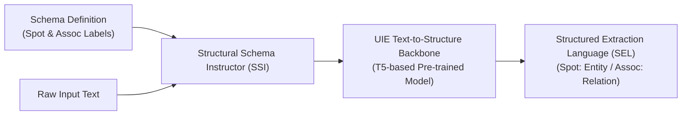

# Unified Structure Generation for Universal Information Extraction (UIE)

> [!ABSTRACT] 一話摘要 (TL;DR)
> 本文提出統一的文字至結構生成框架 **UIE**，透過**結構化模式指導符（Structural Schema Instructor, SSI）**與**結構化提取語言（Structured Extraction Language, SEL）**，實現跨實體（NER）、關係（RE）、事件（EE）與情緒分析的通用端到端結構化抽取，為特定領域 Schema-guided 資訊抽取提供了形式化理論依據。

---

## 一、研究背景與問題定義 (Problem Statement)
- **核心痛點**：傳統資訊抽取（IE）高度碎片化，實體抽取、關係抽取與事件抽取各自依賴獨立架構（如序列標註、分類器、表格填充），難以統一建模。此外，抽取目標多樣且高度依賴特定業務 Schema，不同資料集之間的知識遷移能力極差。
- **研究假設**：若能將異質的抽取結構統一轉化為通用的結構化生成語言，並以可適應的 Schema Prompt 指導模型，則單一預訓練模型即可通用於任意 IE 任務並支援 Zero-shot/Few-shot 快速遷移。

---

## 二、核心方法與技術架構 (Methodology & Architecture)

1. **結構化模式指導符 (SSI)**：在輸入文字前拼接可動態配置的目標 Schema。包含 Spot 名稱（抽取實體類型，如 `[spot] person`）與 Assoc 名稱（抽取關聯類型，如 `[asso] work for`）。
2. **結構化提取語言 (SEL)**：將複雜圖結構線性化為階層括號語法：
   \[
   \text{SEL} = (\text{SpotName}: \text{Span} (\text{AssoName}: \text{Span}))
   \]
3. **預訓練與拒絕機制 (Pre-training & Rejection Mechanism)**：在大規模弱監督語料（Wikidata + Wikipedia）上預訓練三大能力：Text-to-Structure、Structure-to-Text 與 Structure-to-Structure，並引入 Rejection Mechanism 降低未定義 Schema 標籤的幻覺生成。

---

## 三、主要實驗結果與證據 (Empirical Results & Evidence)
- **出處**：Table 2 & Table 3, Page 7.
- **評估基準與數據**：
  - **實體抽取 (NER)**：在 ACE04 上達到 **86.89 F1**，在 ACE05-Ent 上達到 **85.78 F1**，在 CoNLL03 上達到 **92.99 F1**，全面超越各任務專用模型（SOTA）。
  - **關係抽取 (RE)**：在 ACE05-Rel 上 Strict F1 達到 **66.06**，在 CoNLL04 上達到 **75.00 F1**。
  - **低資源場景 (Few-shot)**：在 1-shot 與 5-shot 設定下，UIE 相較於各任務專用微調模型取得 10%~30% 的 F1 提升。

---

## 四、優勢、限制及 Trade-offs (Strengths, Limitations & Trade-offs)
- **優勢**：
  - 首個真正實現四類主流 IE 任務完全統一的 Text-to-Structure 框架；
  - 支援依需求動態注入 Schema，極度適合自定義特定領域本體（Ontology）。
- **限制與代價**：
  - **自回歸生成延遲**：SEL 採自回歸生成，在長文本與密集實體抽取時解碼延遲顯著高於非自回歸的序列標註模型；
  - **長程依賴限制**：T5 主幹架構在超長文檔中仍面臨上下文長度制約。

---

## 五、對本專案研究領域的實際意義 (Implications for Research Domains)
- **提供 Schema-guided 抽取的理論依據**：本專案在 `04 - 研究想法` 中構想之 `F/R/D/A/P/C/T` 企業知識分類法，其底層抽取形式正是基於 UIE 所奠定的 $(\text{Schema}, \text{Text}) \rightarrow \text{Structured Extraction}$ 機制。
- **釐清學術邊界**：UIE 證明了「如何用 Schema 指導抽取」，但它**並未定義 F/R/D/A/P/C/T 七分類**（該分類屬於領域本體貢獻，而非 UIE 論文既有結果）。

---

## 六、原始來源及相關筆記連結 (Sources & Related Notes)
- **本地原始文獻**：[[Papers/04 - Knowledge & Graph RAG/(ACL 2022-05) Unified Structure Generation for Universal Information Extraction.pdf|開啟本地 PDF 檔案]]
- **關聯專題**：[[02 - 研究領域專題 (Research Domains)/Domain 02 - Segmentation & Contextualization|D02 Segmentation & Contextualization]]
- **關聯構想**：[[04 - 研究想法與待驗證提案 (Ideas & Hypotheses)/Idea 01 - Information-Preserving Knowledge Extraction|Idea 01: 保真知識抽取]]
