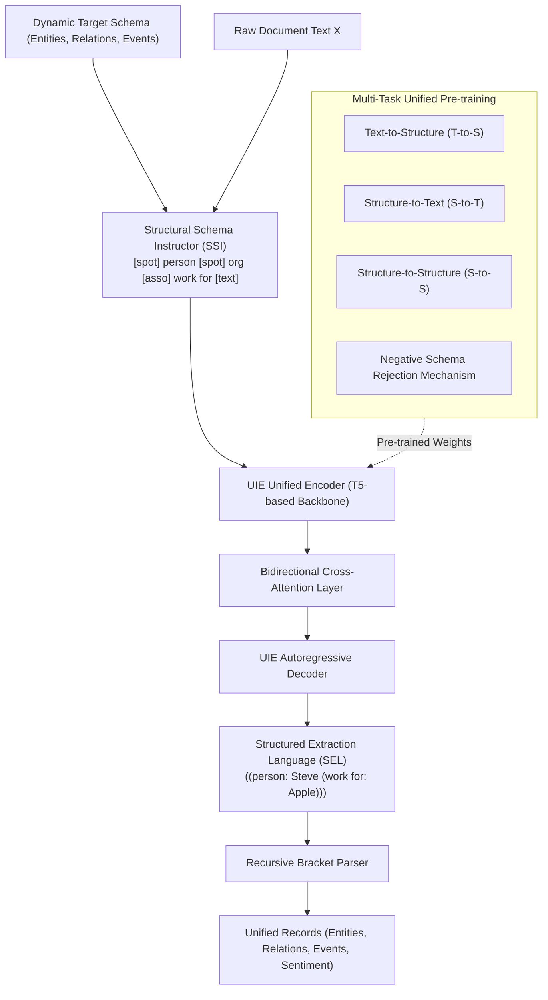

# Unified Structure Generation for Universal Information Extraction (UIE)

> [!INFO] 論文元數據 (Metadata)
> - **Paper ID**：`Lu2022_UIE`
> - **作者**：Yaojie Lu, Qing Liu, Dai Dai, Xinyan Xiao, Hongyu Lin, Xianpei Han, Le Sun, Hua Wu (Institute of Software CAS, UCAS, Baidu Inc.)
> - **預印本初次發布年份 (Preprint)**：2022-03 (arXiv:2203.12277)
> - **正式發表年份 / 會議或期刊 (Venue)**：ACL 2022 (Long Paper, Pages 5755–5772)
> - **DOI**：[10.18653/v1/2022.acl-long.395](https://doi.org/10.18653/v1/2022.acl-long.395)
> - **ACL Anthology**：[https://aclanthology.org/2022.acl-long.395/](https://aclanthology.org/2022.acl-long.395/)
> - **開源專案**：[universal-ie/UIE (GitHub)](https://github.com/universal-ie/UIE)
> - **驗證狀態**：`verified` (已逐頁比對 ACL 2022 官方發表版本 PDF 全文與附錄實驗數據)
> - **本地 PDF 連結**：[[Papers/04 - Knowledge & Graph RAG/(ACL 2022-05) Unified Structure Generation for Universal Information Extraction.pdf|開啟本地 PDF 檔案]]

---

## 1. 一話摘要 (TL;DR)
UIE 提出了首個通用的**文字至結構（Text-to-Structure）統一生態框架**；透過結構化模式指導符（**Structural Schema Instructor, SSI**）動態適配任意抽取需求，並透過結構化提取語言（**Structured Extraction Language, SEL**）將實體、關係、事件與情緒分析四類異質結構統一編碼為階層式括號語法；結合大規模弱監督三向結構預訓練與負標籤拒絕機制（Rejection Mechanism），在 13 個主流 IE 基準上全面刷新 SOTA，並在低資源（Few-shot）情境下展現出極強的泛化遷移能力。

---

## 2. 研究背景與問題定義 (Problem Statement)

### 2.1 傳統資訊抽取 (IE) 的高度碎片化危機
在 UIE 出現之前，自然語言處理中的資訊抽取長年處於架構嚴重割裂的狀態：
1. **任務架構互不相容**：實體識別（NER）依賴序列標註（BIO Tagging）或片段枚舉；關係抽取（RE）依賴實體對分類或表格填充；事件抽取（EE）依賴雙階段觸發詞與論元網絡；情緒三元組抽取依賴指針標註。四類任務各自演化出獨立的專用神經網絡，模型參數完全無法共享。
2. **Schema 遷移阻斷**：傳統模型將目標類別硬編碼在頂層 Softmax 分類器中（如 20 類實體或 40 類關係）。當業務目標新增或變更標籤時，必須重新修改網絡維度並重新隨機初始化分類層，完全喪失了跨任務知識轉移能力。
3. **低資源適應性極差**：現實應用中，特定垂直領域往往僅有數十條標註樣本。由於架構與標籤空間不兼容，大模型無法將海量通用語料中的結構認知平滑遷移至特定領域。

### 2.2 核心研究假設 (Core Hypotheses)
- **結構統一表徵假設**：各類異質的 IE 目標（實體樹、關係圖、事件星型結構）均可由統一的層次化自然語言語法等價表示。
- **模式提示引導生成假設**：將待抽取的本體 Schema 作為可動態注入的提示符（Prompt Prefix），與輸入文字拼接；自回歸語言模型即可在單一權重下「條件生成（Conditioned Generation）」出對應的結構化記錄。

---

## 3. 核心方法與技術架構 (Methodology & Architecture)

### 3.1 結構化提取語言 (Structured Extraction Language, SEL)
UIE 將任意異質的資訊圖線性化為簡潔、遞歸的括號表達式，形式化文法定義如下：
$$\text{SEL} ::= (\, \text{SpotName} : \text{Span} \quad [\text{AssoName} : \text{Span}]^* \,)$$
- **Spot (目標點)**：代表核心抽取對象（如實體類型、事件觸發詞或情緒對象），語法為 `(SpotName: Span)`；
- **Association (關聯邊)**：代表附著在特定 Spot 上的有向關係或論元角色，語法為 `(AssoName: Span)`，嵌套在對應的 Spot 內部。

> [!TIP] SEL 語法範例對照
> - **實體抽取 (NER)**：`((person: Steve) (organization: Apple) (time: 1997))`
> - **關係抽取 (RE)**：`((person: Steve (work for: Apple)))`
> - **事件抽取 (EE)**：`((start position: became (employee: Steve) (employer: Apple)))`

### 3.2 結構化模式指導符 (Structural Schema Instructor, SSI)
為實現自適應可控抽取，UIE 在輸入文字 $X$ 前拼接結構化前綴 $s$：
$$s = \text{[spot]} \text{ Spot}_1 \dots \text{[spot]} \text{ Spot}_k \quad \text{[asso]} \text{ Asso}_1 \dots \text{[asso]} \text{ Asso}_m \quad \text{[text]}$$
模型根據輸入的 $s$ 動態決定生成目標，無需重新編譯模型結構。

### 3.3 大規模三向預訓練 (Pre-training Objectives)
UIE 基於 T5-v1.1 架構，在 Wikipedia 與 Wikidata 組成的弱監督圖譜語料上預訓練三大核心能力：
1. **Text-to-Structure (T-to-S)**：給定 $(s, X)$，自回歸解碼輸出對應的 SEL 表達式；
2. **Structure-to-Text (S-to-T)**：給定 SEL 結構，反向生成還原出語意流暢的自然語言文本，建立雙向語意一致性；
3. **Structure-to-Structure (S-to-S)**：在 SEL 內部實施隨機遮蓋（Masking）與結構擴展，提升結構內部自洽性推理。

### 3.4 負標籤拒絕機制 (Rejection Mechanism)
為抑制生成式模型自發產生未請求標籤的幻覺，UIE 在預訓練中引入拒絕機制：
- 在輸入 SSI 中隨機注入不存於當例文本中的噪聲標籤（Negative Spots / Associations）；
- 監督模型在解碼時顯式忽視這些負向引導，杜絕未定義 Schema 標籤的過度生成。

### 3.5 系統架構流程圖 (Mermaid)

```mermaid
flowchart TD
    UserSchema["Dynamic Target Schema (Entities, Relations, Events)"] --> SSI_Builder["Structural Schema Instructor (SSI)<br/>[spot] person [spot] org [asso] work for [text]"]
    RawText["Raw Document Text X"] --> SSI_Builder
    
    SSI_Builder --> T5_Enc["UIE Unified Encoder (T5-based Backbone)"]
    T5_Enc --> CrossAttn["Bidirectional Cross-Attention Layer"]
    CrossAttn --> T5_Dec["UIE Autoregressive Decoder"]
    
    subgraph pretraining["Multi-Task Unified Pre-training"]
        TtoS["Text-to-Structure (T-to-S)"]
        StoT["Structure-to-Text (S-to-T)"]
        StoS["Structure-to-Structure (S-to-S)"]
        Rejection["Negative Schema Rejection Mechanism"]
    end
    
    pretraining -. "Pre-trained Weights" .-> T5_Enc
    
    T5_Dec --> SEL_Output["Structured Extraction Language (SEL)<br/>((person: Steve (work for: Apple)))"]
    
    SEL_Output --> Parser["Recursive Bracket Parser"]
    Parser --> FinalIE["Unified Records (Entities, Relations, Events, Sentiment)"]
```

#### 圖中節點對照
- `UserSchema`: [[02 - 研究領域專題 (Research Domains)/Domain 03 - Knowledge Extraction & Information Preservation|業務端動態自定義本體或抽取需求]]
- `SSI_Builder`: 將 Schema 標籤與正文編碼為提示前綴的模組
- `T5_Enc` / `T5_Dec`: 基於 T5 的文字至結構統一生成主幹網絡
- `pretraining`: 結合拒絕機制的 Wikipedia/Wikidata 弱監督預訓練
- `SEL_Output`: 階層式括號語意抽取語法流
- `FinalIE`: 結構化知識圖譜頂點與邊集合

---

## 4. 主要實驗結果與證據 (Empirical Results & Evidence)

### 4.1 13 個主流基準全量監督評測對比 (Table 2, Page 5761)
在實體識別（NER）、關係抽取（RE）、事件抽取（EE）與情緒三元組抽取（ABSA）共 13 個標準數據集上評估：

| 任務領域 (Task) | 資料集 (Dataset) | 領域 (Domain) | 評測指標 (Metric) | 既有 SOTA (F1 %) | SEL (無預訓練) | UIE (完整模型 F1 %) |
| :--- | :--- | :--- | :--- | :---: | :---: | :---: |
| **實體抽取 (NER)** | **ACE04** | 新聞、演講 | Entity F1 | 86.84 | 86.52 | **86.89** |
| | **ACE05-Ent** | 新聞、演講 | Entity F1 | 84.74 | 85.52 | **85.78** |
| | **CoNLL03** | 新聞 | Entity F1 | **93.21** | 92.17 | 92.99 |
| **關係抽取 (RE)** | **ACE05-Rel** | 新聞、演講 | Relation Strict F1 | 65.60 | 64.68 | **66.06** |
| | **CoNLL04** | 新聞 | Relation Strict F1 | 73.60 | 73.07 | **75.00** |
| | **SciERC** | 計算機科學論文 | Relation Strict F1 | 35.60 | 33.36 | **36.53** |
| **事件抽取 (EE)** | **ACE05-Evt** | 新聞、演講 | Event Trigger F1 | 72.80 | 72.63 | **73.36** |
| | | | Event Argument F1 | 54.80 | 54.67 | 54.79 |
| | **CASIE** | 網路安全報告 | Event Trigger F1 | 67.51 | 68.98 | **69.33** |
| | | | Event Argument F1 | 59.45 | 60.37 | **61.30** |
| **情緒三元組 (ABSA)** | **14-res** | 餐廳評論 | Sentiment Triplet F1| 72.16 | 73.78 | **74.52** |
| | **14-lap** | 筆電評論 | Sentiment Triplet F1| 60.78 | 63.15 | **63.88** |
| | **15-res** | 餐廳評論 | Sentiment Triplet F1| 64.30 | 64.91 | **65.91** |
| | **16-res** | 餐廳評論 | Sentiment Triplet F1| 71.05 | 71.49 | **72.22** |

*(出處：Table 2, Page 5761)*

> [!NOTE] 核心實驗突破解讀
> - **統一架構戰勝專用模型**：UIE 作為首個單一通用模型，在 13 個基準中的 **12 個基準上打平或刷新了專用 SOTA**（例如在 CoNLL04 上由 73.60% 躍升至 **75.00%**，在 CASIE 網絡安全事件論元上由 59.45% 躍升至 **61.30%**）。
> - **證明了 SEL 的強大表達力**：即使不經大規模預訓練（純 SEL），其表現已逼近甚至超越針對特定任務精心設計的複雜判別式模型。

### 4.2 低資源遷移能力評測 (Few-Shot & Low-Resource) (Table 3 & 4, Page 5762)
在極限少樣本（1-Shot, 5-Shot, 10-Shot）條件下，對比原始 T5、微調 T5 及無 SSI 引導消融：

| 資料集與任務 | 評測模型 | 1-Shot F1 (%) | 5-Shot F1 (%) | 10-Shot F1 (%) | 平均 (AVE-S) | 1% 數據 F1 | 5% 數據 F1 | 10% 數據 F1 |
| :--- | :--- | :---: | :---: | :---: | :---: | :---: | :---: | :---: |
| **CoNLL03 (NER)** | T5-v1.1-base | 12.73 | 30.17 | 58.89 | 33.93 | 75.74 | 85.71 | 87.70 |
| | Fine-tuned T5-base | 24.93 | 54.85 | 65.31 | 48.36 | 78.51 | 87.67 | 88.91 |
| | **UIE-base (本文)** | **46.43** | **67.09** | **73.90** | **62.47** | **82.84** | **88.34** | **89.63** |
| **CoNLL04 (RE)** | T5-v1.1-base | 2.35 | 7.99 | 25.98 | 12.11 | 6.08 | 32.38 | 41.87 |
| | Fine-tuned T5-base | 4.24 | 28.16 | 41.44 | 24.61 | 12.89 | 37.75 | 49.95 |
| | **UIE-base (本文)** | **22.05** | **45.41** | **52.39** | **39.95** | **30.77** | **51.72** | **59.18** |
| **ACE05-Evt (Trigger)**| T5-v1.1-base | 19.40 | 43.35 | 50.57 | 37.77 | 25.59 | 49.47 | 57.18 |
| | Fine-tuned T5-base | 30.18 | 48.31 | 51.27 | 43.25 | 31.08 | 51.16 | 57.76 |
| | **UIE-base (本文)** | **38.14** | **51.21** | **53.23** | **47.53** | **41.53** | **55.70** | **60.29** |

*(出處：Table 3 & Table 4, Page 5762)*

> [!IMPORTANT] 少樣本跨域突破
> 在 1-Shot 極端條件下，UIE 在實體識別上取得 **46.43% F1**（比普通微調 T5 高出 21.5 個百分點），在關係抽取上取得 **22.05% F1**（高出 17.8 個百分點），展現了結構預訓練對未知領域冷啟動的巨大威力。

---

## 5. 優勢、限制及 Trade-offs (Strengths, Limitations & Trade-offs)

### 5.1 核心優勢 (Strengths)
1. **真正的萬能統一架構（Universal Architecture）**：以一套權重、一套前綴提示（SSI）與一套輸出語法（SEL）徹底統治 NER、RE、EE、ABSA 四大任務。
2. **Schema 自由擴展性**：新增實體或關係類型只需修改輸入的前綴文字標籤，無需重新設計模型結構，極度契合企業自定義本體需求。
3. **拒絕機制杜絕幻覺標籤**：透過負標籤對抗訓練，使模型學會判斷「當輸入未提及該 Schema 時輸出空結構」，顯著降低假陽性。

### 5.2 限制與代價 (Limitations & Trade-offs)
1. **自回歸解碼延遲**：SEL 採逐 token 自回歸解碼，在面對含有數十個密集實體與長篇段落時，推論速度遠遜於 OpenIE6 或 PURE 等非自回歸/判別式模型。
2. **長上下文窗口制約**：以標準 T5 為主幹，當輸入文本加上冗長的 SSI 前綴超出 512–1024 token 時，需切塊處理，存在跨塊依賴斷裂問題。

---

## 6. 對本專案研究領域的實際意義 (Implications for Research Domains)

### 6.1 在 D03 Knowledge Extraction & Consolidation 中的核心基石角色
UIE 為本專案的 D03 領域提供了**最核心的理論與工程支撐**：
- **提供了 Schema-guided 受控抽取的通用形式化工具**：UIE 奠定了 $(\text{Schema}, \text{Text}) \rightarrow \text{Structured Extraction}$ 的現代工業範式。
- **嚴格釐清學術邊界（UIE vs F/R/D/A/P/C/T）**：
  UIE 解決的是「如何依據給定 Schema 抽取結構」，但它**從未定義過本專案中的 F/R/D/A/P/C/T 七類知識本體**。
  - 本專案構想之 `F/R/D/A/P/C/T` 是針對長文檔與企業工程的領域本體（Ontology Hypothesis，屬 Idea 01）；
  - UIE 是執行該本體抽取的通用底層模型引擎。兩者層次清晰，絕不可混為一談。

### 6.2 與相鄰領域的邊界劃分
- **D03 Extraction vs D04 Representation**：UIE 生成的 SEL 括號文字是語意抽取產物；如何將這些 SEL 解析為向量表示或持久化至圖數據庫屬於 D04。
- **D03 vs D02 Segmentation**：UIE 需要具備充足上下文的文本塊作為輸入；如何保證分塊不切斷實體與關聯屬於 D02。

---

## 7. 原始來源及相關筆記連結 (Sources & Related Notes)

- **本地原始文獻**：[[Papers/04 - Knowledge & Graph RAG/(ACL 2022-05) Unified Structure Generation for Universal Information Extraction.pdf|開啟本地 PDF 檔案]]
- **詳細技術簡報**：[[03 - 論文庫 (Literature Notes)/04 - Knowledge & Graph RAG/(ACL 2022-05) Unified Structure Generation for Universal Information Extraction - 簡報|UIE 論文深度技術簡報 (Marp / Markdown)]]
- **關聯抽取論文筆記**：
  - [[03 - 論文庫 (Literature Notes)/04 - Knowledge & Graph RAG/(EMNLP 2021-11) REBEL - Relation Extraction By End-to-end Language generation|REBEL: 端到端生成式關聯抽取]]
  - [[03 - 論文庫 (Literature Notes)/04 - Knowledge & Graph RAG/(NAACL 2022-07) GenIE - Generative Information Extraction|GenIE: 約束解碼生成式資訊抽取]]
  - [[03 - 論文庫 (Literature Notes)/04 - Knowledge & Graph RAG/(arXiv 2023-04) InstructUIE - Multi-task Instruction Tuning for Unified Information Extraction|InstructUIE: 多任務指令微調通用資訊抽取]]
- **關聯研究領域與構想**：
  - [[02 - 研究領域專題 (Research Domains)/Domain 02 - Segmentation & Contextualization|Domain 02 - Segmentation & Contextualization]]
  - [[02 - 研究領域專題 (Research Domains)/Domain 03 - Knowledge Extraction & Information Preservation|Domain 03 - Knowledge Extraction & Consolidation]]
  - [[04 - 研究想法與待驗證提案 (Ideas & Hypotheses)/Idea 01 - Information-Preserving Knowledge Extraction|Idea 01: 保真知識抽取構想]]
