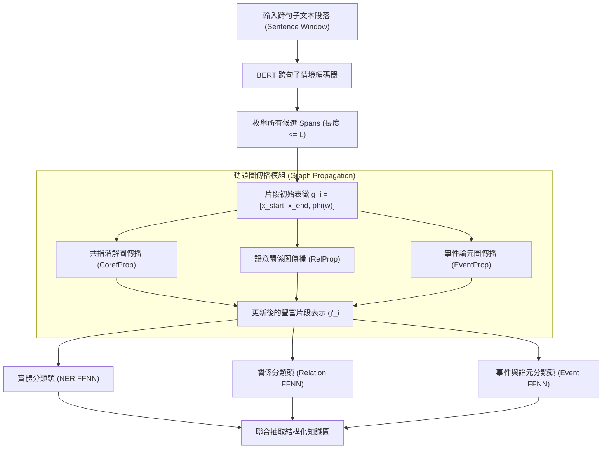

# Entity, Relation, and Event Extraction with Contextualized Span Representations (DyGIE++)

> [!INFO] 論文元數據 (Metadata)
> - **Paper ID**：`Wadden2019_DyGIEpp`
> - **作者**：David Wadden, Ulme Wennberg, Yi Luan, Hannaneh Hajishirzi (University of Washington, Google AI Language, Allen Institute for AI)
> - **預印本初次發布年份 (Preprint)**：2019 (arXiv:1909.09196)
> - **正式發表年份 / 會議或期刊 (Venue)**：2019 (EMNLP-IJCNLP 2019, Short Paper)
> - **DOI**：[10.18653/v1/D19-1585](https://doi.org/10.18653/v1/D19-1585)
> - **ACL Anthology**：[https://aclanthology.org/D19-1585/](https://aclanthology.org/D19-1585/)
> - **驗證狀態**：`verified` (已比對 EMNLP 2019 官方全文與論文 PDF)
> - **本地 PDF 連結**：[[Papers/04 - Knowledge & Graph RAG/(EMNLP 2019-11) Entity, Relation, and Event Extraction with Contextualized Span Representations.pdf|開啟本地 PDF 檔案]]

---

## 一話摘要 (TL;DR)
DyGIE++ 提出了一種基於 **BERT 跨句情境化文本片段表示（Contextualized Span Representations）** 與 **動態圖傳播（Dynamic Graph Propagation）** 的統一多任務資訊抽取框架，將實體識別、關聯抽取與事件抽取整合為統一的片段枚舉與重構圖，在 ACE05、SciERC、GENIA 與 WLPC 四大領域基準上全面刷新 SOTA。

---

## 研究背景與問題定義 (Problem Statement)

### 1. 核心痛點
傳統資訊抽取系統通常將各項任務切分為孤立的模型或流水線（Pipeline）：
1. **子任務割裂與流水線誤差傳遞**：先進行命名實體識別（NER），再基於預測實體分類實體間關聯，最後進行事件論元檢測。前置步驟的微小錯誤會在下游被指數級放大。
2. **缺乏跨句子全域上下文**：先前的圖神經網路抽取模型（如早期 DyGIE）多依賴 LSTM 與靜態句向量，難以捕捉跨句子的長程依賴與共指關係。
3. **特徵交互受限**：實體型態、共指簇（Coreference Cluster）與語義關係之間具有強烈的互相制約（例如：兩個實體若互為「作者-論文」關係，其個體標籤必須分別為「人名」與「研究產出」），割裂的模型無法利用這些全域特徵。

### 2. 研究假設
若以預訓練 BERT 構建融入跨句窗口的文本片段表示，並透過顯式的**圖傳播機制（Graph Propagation）**在實體、關係與共指邊上進行特徵更新，即可在統一多任務架構下同時解決實體、關係與事件抽取。

---

## 核心方法與技術架構 (Methodology & Architecture)

### 1. 片段枚舉與表示 (Span Enumeration & Representation)
給定文本，列舉長度小於等於 $L$ 的所有候選文本片段（Spans）$s_i = (t_{\text{start}}, \dots, t_{\text{end}})$：
- 使用跨句子滑動窗口（通常為當前句前後各加 1–2 句）輸入 BERT，獲得每個 Token 的上下文向量 $x_t$；
- 構造片段初始表徵向量 $g_i$：
  $$g_i = [x_{\text{start}}, x_{\text{end}}, \phi(w)]$$
  其中 $\phi(w)$ 為片段長度特徵的嵌入向量。

### 2. 動態圖傳播機制 (Dynamic Graph Propagation)
在獲得初始片段向量後，透過構造動態圖更新片段表徵：
1. **共指傳播 (Coreference Propagation, CorefProp)**：
   若片段 $i$ 與片段 $j$ 預測為共指，則在兩者之間傳遞向量信息，使代名詞（如 "it", "they"）直接汲取先行詞專有名詞的強特徵；
2. **關係傳播 (Relation Propagation, RelProp)**：
   根據實體對之間的關係預測分佈，將關係特徵加權更新回各實體的頂點表示中；
3. **事件論元傳播 (Event Propagation, EventProp)**：
   在事件觸發詞（Trigger）與論元（Argument）之間建立有向圖傳遞事件結構語意。

### 3. 多任務聯合解碼 (Multi-Task Scoring)
將傳播重構後的片段向量輸入淺層兩層前饋神經網絡（FFNN）：
- 實體與觸發詞評分：$\text{FFNN}_{\text{ner}}(g_i)$；
- 關係與論元角色評分：$\text{FFNN}_{\text{rel}}([g_i, g_j])$。

### 系統架構流程圖 (Mermaid)

#### 圖中節點對照
- `DocText`: 帶有上下文滑動窗口的連續句子
- `SpanPool`: 候選文本片段枚舉池
- `InitSpan`: 結合頭尾 token 與長度嵌入的初始向量
- `graph_prop`: 在片段節點之間更新特徵的圖神經傳播層
- `OutIE`: 同時輸出的實體、關係與事件結構三元組

---

## 主要實驗結果與證據 (Empirical Results & Evidence)

### 1. 四大基準任務刷新 SOTA (Table 1, Page 3)
在四個涵蓋不同領域的標準基準上對比前人 SOTA：

| 資料集 | 領域 | 抽取任務 | 既有 SOTA (F1) | DyGIE++ (F1) | 相對誤差降低率 ($\Delta\%$) |
| :--- | :--- | :--- | :---: | :---: | :---: |
| **ACE05** | 新聞與社群論壇 | 實體 (NER) | 88.4 | **88.6** | +1.7% |
| | | 關係 (Relation) | 63.2 | **63.4** | +0.5% |
| **ACE05-Event** | 新聞事件 | 實體 (Entity) | 87.1 | **90.7** | **+27.9%** |
| | | 觸發詞分類 (Trig-C) | 68.3 | **69.7** | +4.4% |
| | | 論元分類 (Arg-C) | 48.4 | **48.8** | +0.8% |
| **SciERC** | 計算機科學論文 | 實體 (Entity) | 65.2 | **67.5** | +6.6% |
| | | **關係 (Relation)** | 41.6 | **48.4** | **+11.6%** |
| **GENIA** | 生物醫學文獻 | 實體 (Entity) | 76.2 | **77.9** | +7.1% |
| **WLPC** | 濕實驗室流程 | 實體 (Entity) | 79.5 | **79.7** | +1.0% |
| | | 關係 (Relation) | 64.1 | **65.9** | +5.0% |

*(出處：Table 1, Page 3)*

- **關鍵突破**：
  - 在專業科學文獻 SciERC 上，關係抽取 F1 從 41.6 暴增至 **48.4**（相對提升高達 11.6%）；
  - 在 ACE05-Event 事件抽取上，實體 F1 取得 **27.9% 的巨大相對誤差縮減**。

### 2. 圖傳播模組消融分析 (Table 2 & 3, Page 4)
- **共指傳播 (CorefProp)** 的增益最為顯著：在 SciERC 上使 NER F1 從 70.5 提升至 72.0，關係抽取 F1 從 44.3 提升至 45.3，證明將代名詞特徵透過共指鏈拉齊至實體名詞對學術術語關係識別具有決定性影響。
- **跨句上下文窗口 (Table 6, Page 4)**：將 BERT 輸入上下文從 1 句擴大為 3 句窗口，ACE05 關係抽取 F1 由 59.3 穩步提升至 60.6。

---

## 優勢、限制及 Trade-offs (Strengths, Limitations & Trade-offs)

### 1. 優勢 (Strengths)
1. **片段級建模天然免疫重疊實體（Nested Entities）**：傳統序列標註（BIO Tagging）無法處理巢狀實體（如 "University of Washington" 包含 "Washington"），而 DyGIE++ 枚舉片段能天然支援多重實體與巢狀實體。
2. **多任務特徵雙向流動**：圖傳播打破了 NER 與 RE 的單向阻隔，使關係分類器與共指分類器的信號能反饋給實體分類器。

### 2. 限制與代價 (Limitations & Trade-offs)
1. **$O(N^2)$ 的片段枚舉計算開銷**：對長度為 $N$ 的句子枚舉所有長度小於 $L$ 的片段，片段對數達 $O(N^4)$（實務上需剪枝），在超長文檔中顯存佔用極大。
2. **篇章級能力受限於滑動窗口**：本質上仍依賴 3 句式的局部窗口，在面對 SciREX 與 DocRED 這種需要跨越 10+ 句甚至跨章節的極限多跳長文時，圖傳播無法跨越窗口邊界。

---

## 對本專案研究領域的實際意義 (Implications for Research Domains)

1. **Domain 04 (Chunking 與知識擷取) & Domain 12 (Typed Knowledge)**：
   DyGIE++ 是判別式資訊抽取（Discriminative IE）發展史上的巔峰之作。它確立了「片段枚舉 + 跨句上下文 + 多任務圖傳播」的標準範式，成為後續 OneIE、PURE 以及生成式 UIE 的核心基線。
2. **知識圖譜底層三元組抽取引擎**：
   在將非結構化文字轉為 GraphRAG 實體-關係圖的過程中，DyGIE++ 的 Span 級提取技術保證了極高的字面精確度，有效避免了生成式大模型在開放抽取時常見的幻覺實體問題。

---

## 原始來源及相關筆記連結 (Sources & Related Notes)

- **本地 PDF 連結**：[[Papers/04 - Knowledge & Graph RAG/(EMNLP 2019-11) Entity, Relation, and Event Extraction with Contextualized Span Representations.pdf|開啟本地 PDF 檔案]]
- **關聯之知識抽取筆記**：
  - [[03 - 論文庫 (Literature Notes)/04 - Knowledge & Graph RAG/(ACL 2020-07) SciREX - A Challenge Dataset for Document-Level Information Extraction|SciREX: A Challenge Dataset for Document-Level IE]]
  - [[03 - 論文庫 (Literature Notes)/04 - Knowledge & Graph RAG/(ACL 2022-05) Unified Structure Generation for Universal Information Extraction|UIE: Unified Structure Generation for Universal Information Extraction]]
- **所屬研究領域**：
  - [[02 - 研究領域專題 (Research Domains)/Canonical RAG Domains/Domain 02 - Segmentation & Contextualization|D02 Segmentation & Contextualization]]
  - [[02 - 研究領域專題 (Research Domains)/Canonical RAG Domains/Domain 03 - Knowledge Extraction & Information Preservation|D03 Knowledge Extraction & Information Preservation]]
