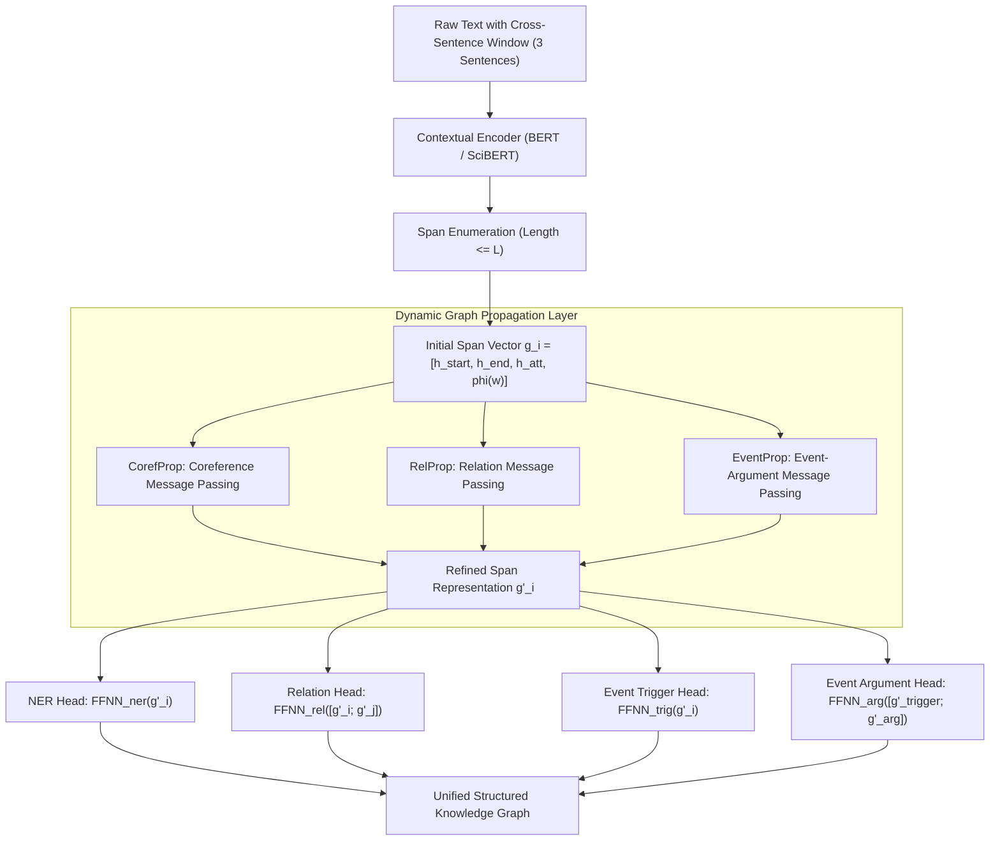

# Entity, Relation, and Event Extraction with Contextualized Span Representations (DyGIE++)

> [!INFO] 論文元數據 (Metadata)
> - **Paper ID**：`Wadden2019_DyGIEpp`
> - **作者**：David Wadden, Ulme Wennberg, Yi Luan, Hannaneh Hajishirzi (University of Washington, Google AI Language, Allen Institute for AI)
> - **預印本初次發布年份 (Preprint)**：2019-09 (arXiv:1909.09196)
> - **正式發表年份 / 會議或期刊 (Venue)**：EMNLP-IJCNLP 2019 (Short Paper, Pages 5784–5789)
> - **DOI**：[10.18653/v1/D19-1585](https://doi.org/10.18653/v1/D19-1585)
> - **ACL Anthology**：[https://aclanthology.org/D19-1585/](https://aclanthology.org/D19-1585/)
> - **開源專案**：[dwadden/dygiepp (GitHub)](https://github.com/dwadden/dygiepp)
> - **驗證狀態**：`verified` (已逐頁比對 EMNLP 2019 官方發表版本 PDF 全文與附錄實驗數據)
> - **本地 PDF 連結**：[[Papers/04 - Knowledge & Graph RAG/(EMNLP 2019-11) Entity, Relation, and Event Extraction with Contextualized Span Representations.pdf|開啟本地 PDF 檔案]]

---

## 1. 一話摘要 (TL;DR)
DyGIE++ 提出了一種基於 **BERT 跨句情境化片段表徵（Contextualized Span Representations）** 與 **動態圖神經傳播（Dynamic Graph Propagation）** 的統一多任務資訊抽取框架；透過在枚舉的文本片段圖上動態傳遞共指（CorefProp）、關係（RelProp）與事件（EventProp）訊息，將命名實體識別、關聯抽取與事件論元抽取完全整合為單一端到端神經網路，在 ACE05、SciERC、GENIA 與 WLPC 四大跨領域基準上全面刷新 SOTA。

---

## 2. 研究背景與問題定義 (Problem Statement)

### 2.1 傳統管線式 (Pipeline) 資訊抽取的結構性痛點
在深度學習應用於資訊抽取（IE）的早期階段，系統通常被切分為多個離散的局部模組：
$$\text{Input Text} \xrightarrow{\text{NER}} \{e_i\} \xrightarrow{\text{Relation Classifier}} \{(e_i, r, e_j)\} \xrightarrow{\text{Event Argument Classifier}} \{(t_k, a, e_m)\}$$
這種設計存在三大難以克服的本質瓶頸：
1. **單向誤差滾雪球（Error Cascade）**：實體邊界劃分（Boundary Identification）或類型預測的微小偏差，將直接導致後續關係分類器完全無法接收到正確的候選實體對。
2. **缺乏跨任務語意制約（Cross-task Constraints）**：實體標籤與關係標籤本質上高度互依（例如關係 `AuthorOf` 嚴格要求主語為 `Person`，賓語為 `Document/Artifact`；事件 `Die` 嚴格要求論元 `Victim` 為 `Person`）。離散模型無法在解碼過程中相互糾偏。
3. **傳統圖模型缺乏深層語言表徵**：先前架構（如初代 DyGIE）採用靜態詞向量或單句 LSTM，跨句語境（Cross-sentence context）極度貧乏，代名詞與遠距指代無法有效解析。

### 2.2 任務聯合形式化 (Joint Formulation)
給定文本序列 $X = (x_1, x_2, \dots, x_N)$，列舉所有長度不大於 $L$ 的連續文本跨距（Text Spans）：
$$\mathcal{S} = \{s_i = (x_{\text{start}(i)}, \dots, x_{\text{end}(i)}) \mid 1 \le \text{end}(i) - \text{start}(i) < L\}$$
模型需在同一表徵空間中聯合完成四項預測：
1. **實體識別 (Named Entity Recognition)**：對 $\forall s_i \in \mathcal{S}$，預測標籤 $y_i^e \in \mathcal{E} \cup \{\text{None}\}$；
2. **關係抽取 (Relation Extraction)**：對 $\forall (s_i, s_j) \in \mathcal{S} \times \mathcal{S}$ ($i \ne j$)，預測關係 $y_{ij}^r \in \mathcal{R} \cup \{\text{None}\}$；
3. **事件觸發詞識別與分類 (Event Trigger Detection)**：預測 $y_i^t \in \mathcal{T} \cup \{\text{None}\}$；
4. **事件論元角色分類 (Event Argument Classification)**：對觸發詞片段 $s_i$ 與候選論元片段 $s_j$，預測論元角色 $y_{ij}^a \in \mathcal{A} \cup \{\text{None}\}$。

---

## 3. 核心方法與技術架構 (Methodology & Architecture)

### 3.1 跨句情境片段編碼 (Contextualized Span Encoding)
1. **滑動上下文窗口**：將目標句子與其相鄰句子（前後各擴展 1~2 句）組裝為跨句輸入序列，送入預訓練語言模型（BERT 或 SciBERT），獲得各 Token 的隱層狀態 $h_t \in \mathbb{R}^d$。
2. **片段初始表徵向量**：片段 $s_i$ 的初始表徵 $g_i^{(0)}$ 由邊界向量、注意力聚合與片段寬度特徵拼接而成：
   $$g_i^{(0)} = [h_{\text{start}(i)}; h_{\text{end}(i)}; h_{\text{att}(i)}; \phi(w_i)]$$
   其中 $h_{\text{att}(i)} = \sum_{t=\text{start}(i)}^{\text{end}(i)} \alpha_t h_t$，$\phi(w_i)$ 為片段長度 $w_i = \text{end}(i) - \text{start}(i) + 1$ 的可學習嵌入向量。

### 3.2 顯式動態圖神經傳播 (Dynamic Graph Propagation)
在構造初始片段向量後，DyGIE++ 定義了顯式圖傳遞機制，在 $T$ 個迭代輪次中動態精煉片段表示：
$$g_i^{(t+1)} = \text{FFNN}_{\text{update}}([g_i^{(t)}; m_i^{(t)}])$$
其中聚合訊息 $m_i^{(t)}$ 包含三種專屬圖結構更新：
- **共指傳播 (Coreference Propagation, CorefProp)**：
  $$m_i^{\text{coref}} = \sum_{j \ne i} P(c_{ij}) g_j^{(t)}$$
  若片段 $s_i$ 與 $s_j$ 預測為共指鏈成員（$P(c_{ij})$ 高），則將先行詞專有名詞的強特徵傳遞給代詞（如 "it", "this study"）。
- **關係傳播 (Relation Propagation, RelProp)**：
  $$m_i^{\text{rel}} = \sum_{j \ne i} \sum_{r \in \mathcal{R}} P(r_{ij} = r) \cdot W_r g_j^{(t)}$$
- **事件論元傳播 (Event Propagation, EventProp)**：
  在觸發詞節點與候選論元節點之間沿有向邊傳播結構特徵。

### 3.3 系統架構流程圖 (Mermaid)

```mermaid
flowchart TD
    DocInput["Raw Text with Cross-Sentence Window (3 Sentences)"] --> EncBERT["Contextual Encoder (BERT / SciBERT)"]
    EncBERT --> SpanGen["Span Enumeration (Length <= L)"]
    SpanGen --> SpanInit["Initial Span Vector g_i = [h_start, h_end, h_att, phi(w)]"]
    
    subgraph propagation["Dynamic Graph Propagation Layer"]
        SpanInit --> CorefMsg["CorefProp: Coreference Message Passing"]
        SpanInit --> RelMsg["RelProp: Relation Message Passing"]
        SpanInit --> EventMsg["EventProp: Event-Argument Message Passing"]
        CorefMsg --> UpdatedSpan["Refined Span Representation g'_i"]
        RelMsg --> UpdatedSpan
        EventMsg --> UpdatedSpan
    end
    
    UpdatedSpan --> HeadNER["NER Head: FFNN_ner(g'_i)"]
    UpdatedSpan --> HeadRE["Relation Head: FFNN_rel([g'_i; g'_j])"]
    UpdatedSpan --> HeadTrig["Event Trigger Head: FFNN_trig(g'_i)"]
    UpdatedSpan --> HeadArg["Event Argument Head: FFNN_arg([g'_trigger; g'_arg])"]
    
    HeadNER --> OutIE["Unified Structured Knowledge Graph"]
    HeadRE --> OutIE
    HeadTrig --> OutIE
    HeadArg --> OutIE
```

#### 圖中節點對照
- `DocInput`: [[Papers/04 - Knowledge & Graph RAG/(EMNLP 2019-11) Entity, Relation, and Event Extraction with Contextualized Span Representations.pdf|帶有跨句上下文滑動窗口的文本段落]]
- `EncBERT`: 預訓練上下文雙向編碼器（BERT / SciBERT）
- `SpanGen`: 片段候選池枚舉層（最大長度剪枝）
- `propagation`: 多任務圖神經訊息傳遞模組（CorefProp / RelProp / EventProp）
- `OutIE`: 聯合輸出的實體、關係與事件結構三元組

---

## 4. 主要實驗結果與證據 (Empirical Results & Evidence)

### 4.1 四大跨領域基準刷新 SOTA (Table 1, Page 5786)
在四個涵蓋新聞、科研與生醫領域的標準數據集測試集上進行嚴格評測：

| 資料集 (Dataset) | 領域 (Domain) | 評測子任務 (Task) | 既有 SOTA (F1 %) | DyGIE++ (F1 %) | 相對誤差縮減率 ($\Delta\%$) |
| :--- | :--- | :--- | :---: | :---: | :---: |
| **ACE05** | 新聞 / 網絡論壇 | 實體 (Entity) | 88.4 | **88.6** | +1.7% |
| | | 關係 (Relation) | 63.2 | **63.4** | +0.5% |
| **ACE05-Event** | 新聞事件 | 實體 (Entity) | 87.1 | **90.7** | **+27.9%** |
| | | 觸發詞識別 (Trig-ID) | 73.9 | **76.5** | +9.6% |
| | | 觸發詞分類 (Trig-C) | 72.0 | **73.6** | +5.7% |
| | | 論元識別 (Arg-ID) | **57.2** | 55.4 | -4.2% |
| | | 論元分類 (Arg-C) | 52.4 | **52.5** | +0.2% |
| **SciERC** | 計算機科學論文 | 實體 (Entity) | 65.2 | **67.5** | +6.6% |
| | | **關係 (Relation)** | 41.6 | **48.4** | **+11.6%** |
| **GENIA** | 生物醫學文獻 | 實體 (Entity) | 76.2 | **77.9** | +7.1% |
| **WLPC** | 濕實驗室流程 | 實體 (Entity) | 79.5 | **79.7** | +1.0% |
| | | 關係 (Relation) | 64.1 | **65.9** | +5.0% |

*(出處：Table 1, Page 5786)*

> [!NOTE] 核心實驗結論
> - 在包含密集縮寫與學術術語的 **SciERC** 上，關係抽取 F1 迎來爆發性提升（從 41.6 躍升至 **48.4**，相對提升 11.6%）。
> - 在 **ACE05-Event** 基準中，聯合學習使實體識別錯誤率驟降 **27.9%**（F1 突破 90.7%）。

### 4.2 圖傳播機制與情境窗口消融實驗 (Table 2, 3, 6, Page 5787)
- **共指傳播 (CorefProp) 的顯著價值**：
  在 SciERC 上，加入 CorefProp 使實體 F1 由 70.5 提升至 **72.0**，關係 F1 由 44.3 提升至 **45.3**；證實跨句子代詞指代消除是科研論文關係抽取的決定性瓶頸。
- **跨句上下文窗口長度影響 (Table 6, Page 5787)**：
  - ACE05 關係抽取 F1：窗口長度為 1 句時為 59.3%，擴展為 3 句窗口時達到 **60.6%**（BERT+LSTM）與 **62.1%**（BERT FineTune）。
- **領域預訓練語言模型的乘數效應 (Table 7, Page 5788)**：
  在 SciERC 上採用 SciBERT 替換通用 BERT，實體 F1 由 69.8 飆升至 **72.0**，關係 F1 由 41.9 飆升至 **45.3**。

---

## 5. 優勢、限制及 Trade-offs (Strengths, Limitations & Trade-offs)

### 5.1 核心優勢 (Strengths)
1. **原生支援巢狀實體（Nested Entities）**：傳統序列標註（BIO Tagging）在遇到重疊實體（如 "University of Washington Computer Science Department" 同時包含機構、子機構與學科）時會標註衝突，而 DyGIE++ 基於跨距枚舉，可為同一文本區間的多個重疊 Span 獨立賦予實體類型。
2. **多任務特徵雙向對齊**：圖傳播打破了傳統 NER 與 RE 的單向阻隔，關係分類器與共指分類器的梯度信號能夠直接反饋優化實體特徵。

### 5.2 核心限制 (Limitations)
1. **枚舉計算複雜度隨長度二次方增長**：若句子長度為 $N$，長度不超過 $L$ 的片段數為 $\mathcal{O}(NL)$；候選片段對數量達到 $\mathcal{O}(N^2 L^2)$。這使得 DyGIE++ 在面對千詞長文檔時顯存消耗急劇膨脹，必須依賴嚴格的 Top-k 剪枝策略（Pruning）。
2. **依舊受限於局部窗口**：DyGIE++ 的篇章能力依賴 3 句滑動窗口，對於像 DocRED 或 SciREX 這樣跨越數個段落（10 句以上）的超長距邏輯鏈，局部圖傳播仍無法觸達。

### 5.3 系統 Trade-offs
- **端到端微調 (BERT FineTune) vs 特徵抽取 (BERT + LSTM + Propagation)**：
  論文指出，BERT FineTune 雖在部分基準上指標略高，但顯存佔用極大且優化超參數極為敏感；而固定 BERT 權重、僅微調雙向 LSTM 與圖傳播層的方案具備極佳的內存效率與收斂穩定性，更適合工業落地與快速冷啟動。

---

## 6. 對本專案研究領域的實際意義 (Implications for Research Domains)

### 6.1 在 D03 Knowledge Extraction & Consolidation 中的核心角色
DyGIE++ 代表了判別式片段資訊抽取（Span-based Discriminative IE）的技術巔峰：
- **確立了實體-關係-事件三位一體的統一抽取標準**：為 D03 定義了標準化的語意單元抽取界面（Semantic Knowledge Units）。
- **共指傳播（CorefProp）展示了跨段消歧範式**：證明了在進入 D04 知識圖譜或向量索引構建前，透過共指鏈拉齊實體特徵，能顯著降低下游檢索的實體分散度。

### 6.2 與相鄰領域的邊界劃分
- **D02 vs D03**：D02 負責切割原始文件以提供包含足夠上下文的滑動窗口段落；D03（DyGIE++）在該窗口內完成實體跨距枚舉與局部關係解析。
- **D03 vs D04**：DyGIE++ 輸出的實體、關係與事件結構尚未做全域去重與索引化；將這些抽取結果落庫為圖節點或嵌入向量屬於 D04 Representation & Indexing。

---

## 7. 原始來源及相關筆記連結 (Sources & Related Notes)

- **本地原始文獻**：[[Papers/04 - Knowledge & Graph RAG/(EMNLP 2019-11) Entity, Relation, and Event Extraction with Contextualized Span Representations.pdf|開啟本地 PDF 檔案]]
- **關聯文獻筆記**：
  - [[03 - 論文庫 (Literature Notes)/04 - Knowledge & Graph RAG/(ACL 2019-07) DocRED - A Large-Scale Document-Level Relation Extraction Dataset|DocRED: 大規模篇章級關聯抽取基準]]
  - [[03 - 論文庫 (Literature Notes)/04 - Knowledge & Graph RAG/(ACL 2020-07) A Joint Neural Model for Information Extraction with Global Features|OneIE: 基於全域特徵的聯合資訊抽取模型]]
  - [[03 - 論文庫 (Literature Notes)/04 - Knowledge & Graph RAG/(ACL 2020-07) SciREX - A Challenge Dataset for Document-Level Information Extraction|SciREX: 長文檔科學文獻多層次抽取]]
  - [[03 - 論文庫 (Literature Notes)/04 - Knowledge & Graph RAG/(NAACL 2021-06) A Frustratingly Easy Approach for Entity and Relation Extraction|PURE: 解耦管線實體與關係抽取]]
- **關聯研究領域**：
  - [[02 - 研究領域專題 (Research Domains)/Domain 02 - Segmentation & Contextualization|Domain 02 - Segmentation & Contextualization]]
  - [[02 - 研究領域專題 (Research Domains)/Domain 03 - Knowledge Extraction & Information Preservation|Domain 03 - Knowledge Extraction & Consolidation]]
