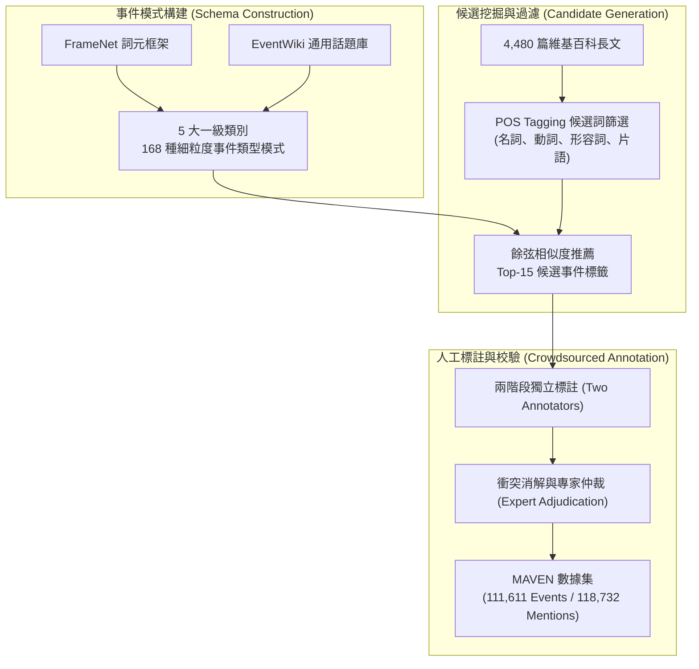

# MAVEN: A Massive General Domain Event Detection Dataset

## 1. 一話摘要 (TL;DR)
MAVEN 構建了規模遠超傳統 ACE 2005 與 TAC KBP 的通用領域事件檢測（Event Detection）基準數據集，包含 4,480 篇文檔、49,873 個句子、168 種細粒度事件類型、111,611 個事件與 118,732 個事件提及（規模為 ACE 2005 的 20 倍以上），徹底解決了既有數據集領域狹窄、類型稀疏及單句多事件模式嚴重不足的根本瓶頸。

---

## 2. 研究背景與問題定義 (Problem Statement)

### 2.1 事件檢測 (Event Detection) 的歷史瓶頸
事件檢測（包含 Trigger 觸發詞識別與事件類型分類）是資訊抽取（IE）與知識圖譜構建的核心基石。然而，過去二十年社群長期受限於早期標註數據集：
1. **數據規模嚴重受限**：廣泛使用的 ACE 2005 僅含 599 篇文檔與 5,349 個事件提及；即使合併所有 Rich ERE 數據集，也僅有約 3.8 萬個提及，難以訓練大規模深度神經網路或大型語言模型。
2. **事件類型極其狹隘**：ACE 2005 僅定義 33 個子類型（如司法審判、軍事衝突、人事變動等），多數日常或科學事件無法被涵蓋，導致模型泛化能力極差。
3. **單句多事件（Multiple Events per Sentence）關聯缺失**：真實複雜文檔中，一個句子往往交織多個因果或共生事件，而在 ACE 2005 中該現象僅佔少數，無法評估模型對複雜事件交互關係的捕捉能力。

### 2.2 核心研究目標
- 基於通用維基百科文章（EventWiki）構建覆蓋全面、具備層級架構（Hierarchical Schema）的通用事件本體。
- 建立具備高度負例（Negative Instances）篩選與嚴格人工品質控制的大規模基準，為圖譜化 RAG 與篇章理解提供堅實評估支撐。

---

## 3. 核心方法與技術架構 (Methodology & Architecture)

MAVEN 採用兩階段人機協同框架構建大規模高質量事件數據庫：

### 圖中節點對照
- `Hierarchy`：定義 5 大頂級事件類別（Actions, Catastrophes, States, Dynamics, Processes），細分為 168 個具體類型。
- `POS / Ranker`：先由 NLTK 與 FrameNet 片語匹配產生觸發詞候選，並自動推薦 Top-15 類型候選供標註者選擇，大幅降低標註認知負擔。
- `MAVEN_DS`：最終數據集劃分為 Train (2,913 docs), Dev (710 docs), Test (857 docs)，負例實例高達 49.7 萬個。

---

## 4. 主要實驗結果與證據 (Empirical Results & Evidence)

MAVEN 原文（Pages 1652–1671）對比了經典事件抽取模型在 ACE 2005 與 MAVEN 上的泛化表現：

### 4.1 數據集規模對比 (Table 2, Page 4)
| 數據集 (Dataset) | 文檔數 (#Docs) | Token 數 (#Tokens) | 句子數 (#Sentences) | 事件類型數 (#Types) | 事件數 (#Events) | 事件提及數 (#Mentions) |
|---|---|---|---|---|---|---|
| **ACE 2005** | 599 | 303k | 15,789 | 33 | 4,090 | 5,349 |
| **TAC KBP (2014–2017 合計)** | 1,047 | 728k | 36,541 | 38 | 24,333 | 32,225 |
| **Rich ERE Total** | 1,272 | 854k | 41,708 | 38 | 29,293 | 38,853 |
| **MAVEN (Ours)** | **4,480** | **1,276k** | **49,873** | **168** | **111,611** | **118,732** |

*註：MAVEN 涵蓋的事件類型數是 ACE 2005 的 5 倍以上，事件提及數是其 22 倍。出處：Table 2, Page 4。*

### 4.2 基準模型評測結果 (Table 5, Page 7)
在統一評估協議下，評估各模型在 ACE 2005 與 MAVEN 上的 Trigger 識別與分類綜合 F1-score：

| 評測模型 (Method) | ACE 2005 Precision | ACE 2005 Recall | ACE 2005 F1 | MAVEN Precision | MAVEN Recall | MAVEN F1 |
|---|---|---|---|---|---|---|
| **DMCNN** (Dynamic Multi-pooling CNN) | 73.7 | 63.3 | 68.0 | 66.3 | 55.9 | 60.6 |
| **BiLSTM** | 71.7 | 82.8 | 76.8 | 59.8 | 67.0 | 62.8 |
| **BiLSTM + CRF** | 77.2 | 74.9 | 75.4 | 63.4 | 64.8 | 64.1 |
| **MOGANED** (Graph Attention) | 70.4 | 73.9 | 72.1 | 63.4 | 64.1 | 63.8 |
| **DMBERT** | 70.2 | 78.9 | 74.3 | 62.7 | 72.3 | 67.1 |
| **BERT + CRF** | 71.3 | 77.1 | 74.1 | 65.0 | 70.9 | **67.8** |

*註：在 ACE 2005 上可達 74–76 F1 的主流模型，在 MAVEN 上全面下跌約 7–14 個百分點（BERT+CRF 僅達 67.8 F1），證明大規模細粒度通用事件檢測具備極高挑戰性。出處：Table 5, Page 7。*

---

## 5. 優勢、限制及 Trade-offs (Strengths, Limitations & Trade-offs)

### 5.1 優勢
1. **規模與多樣性躍遷**：首個超過 10 萬事件實例的通用基準，徹底打破長達 15 年的小樣本瓶頸。
2. **單句多事件挑戰**：句中包含 2 個以上事件提及的比例顯著高於舊數據集，能有效檢驗跨事件依賴建模。
3. **負例標註充沛**：標註了近 50 萬個非事件候選詞，迫使模型具備高度精準的過濾能力，極大減少 False Positive。

### 5.2 限制與 Trade-offs
1. **文體分佈偏向維基百科**：數據主要源於英文維基百科，針對口語對話、社交媒體短文本或醫療臨床記錄等極端異質領域的遷移性仍待驗證。
2. **論元抽取 (Event Argument Extraction) 尚未納入初始版本**：本論文主要聚焦 Trigger 檢測與分類，後續的 MAVEN-ERE 與角色論元標註需依賴後續擴充版本。

---

## 6. 對本專案研究領域的實際意義 (Implications for Research Domains)

1. **D02 (Segmentation & Contextualization)**：為「從非結構化長文本中提取動態事件」提供了最權威的 Gold Standard，是將 RAG 文本塊轉化為事件知識圖譜（Event KG）的基石。
2. **Domain 12 (Typed Knowledge & Dynamic Ontologies)**：證明基於層級模式（Hierarchical Ontology）的事件抽象能有效支撐複雜語義推論，對構建 GraphRAG 中的動態時間節點具有極高參考價值。

---

## 7. 原始來源及相關筆記連結 (Sources & Related Notes)

### 原始文獻
- **ACL Anthology**：[https://aclanthology.org/2020.emnlp-main.129/](https://aclanthology.org/2020.emnlp-main.129/)
- **arXiv ID**：`2004.13590`
- **DOI**：`10.18653/v1/2020.emnlp-main.129`
- **本地 PDF**：`[[Papers/04 - Knowledge & Graph RAG/(EMNLP 2020-11) MAVEN - A Massive General Domain Event Detection Dataset.pdf|開啟本地 PDF 檔案]]`

### 關聯專題與論文筆記
- **專題報告**：
  - `[[02 - 研究領域專題 (Research Domains)/Canonical RAG Domains/Domain 03 - Knowledge Extraction & Information Preservation|D03 Knowledge Extraction & Information Preservation]]`
  - `[[02 - 研究領域專題 (Research Domains)/Canonical RAG Domains/Domain 03 - Knowledge Extraction & Information Preservation|D03 Knowledge Extraction & Information Preservation]]`
- **同領域代表性論文**：
  - `[[03 - 論文庫 (Literature Notes)/04 - Knowledge & Graph RAG/(ACL 2019-07) DocRED - A Large-Scale Document-Level Relation Extraction Dataset|(ACL 2019-07) DocRED]]`
  - `[[03 - 論文庫 (Literature Notes)/04 - Knowledge & Graph RAG/(ACL 2020-07) A Joint Neural Model for Information Extraction with Global Features|(ACL 2020-07) OneIE]]`
  - `[[03 - 論文庫 (Literature Notes)/04 - Knowledge & Graph RAG/(EMNLP 2019-11) Entity, Relation, and Event Extraction with Contextualized Span Representations|(EMNLP 2019-11) DyGIE++]]`
