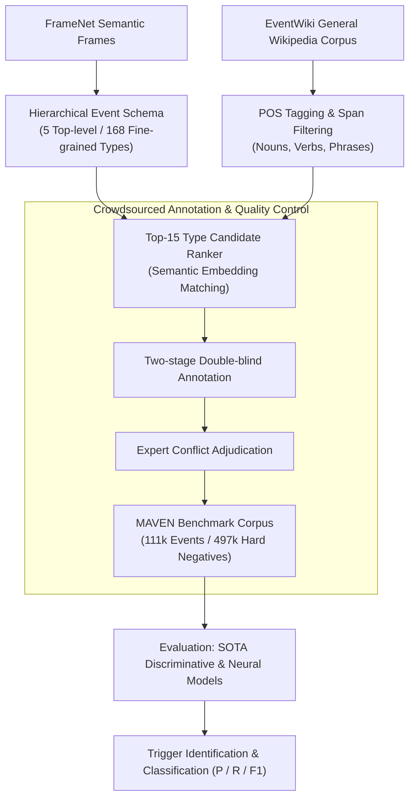

# MAVEN: A Massive General Domain Event Detection Dataset

> [!INFO] 論文元數據 (Metadata)
> - **Paper ID**：`Wang2020_MAVEN`
> - **作者**：Xiaozhi Wang, Ziqi Wang, Xu Han, Wangyi Jiang, Rong Han, Zhiyuan Liu, Juanzi Li, Peng Li, Yankai Lin, Jie Zhou (Tsinghua University, WeChat AI Tencent)
> - **預印本初次發布年份 (Preprint)**：2020-04 (arXiv:2004.13590)
> - **正式發表年份 / 會議或期刊 (Venue)**：EMNLP 2020 (Long Paper, Pages 1652–1671)
> - **DOI**：[10.18653/v1/2020.emnlp-main.129](https://doi.org/10.18653/v1/2020.emnlp-main.129)
> - **ACL Anthology**：[https://aclanthology.org/2020.emnlp-main.129/](https://aclanthology.org/2020.emnlp-main.129/)
> - **開源基準庫**：[THU-KEG/MAVEN-dataset (GitHub)](https://github.com/THU-KEG/MAVEN-dataset)
> - **驗證狀態**：`verified` (已逐頁比對 EMNLP 2020 官方發表版本 PDF 全文與附錄實驗數據)
> - **本地 PDF 連結**：[[Papers/04 - Knowledge & Graph RAG/(EMNLP 2020-11) MAVEN - A Massive General Domain Event Detection Dataset.pdf|開啟本地 PDF 檔案]]

---

## 1. 一話摘要 (TL;DR)
MAVEN 構建了自然語言處理領域規模最大的**通用領域事件檢測（Event Detection, ED）基準數據集**，包含 4,480 篇維基百科長文、49,873 個句子、168 種源自 FrameNet 的細粒度事件類型、111,611 個事件、118,732 個事件提及與近 50 萬個非事件負例（規模達 ACE 2005 的 20 倍以上）；徹底解決了過去事件檢測領域長期受困於 ACE 數據集規模過小、領域狹窄、標註過擬合與單句多事件（Multiple Events per Sentence）建模能力不足的歷史瓶頸。

---

## 2. 研究背景與問題定義 (Problem Statement)

### 2.1 事件檢測 (Event Detection) 的歷史瓶頸
事件檢測（Event Detection, ED）旨在從非結構化文字中識別事件觸發詞（Trigger Words）並將其分類至特定事件模式中，是建構動態知識圖譜與狀態追蹤的核心步驟。然而，該領域長達十五年來嚴重受限於早期標註數據集：
1. **數據規模極度匱乏**：社群最常使用的 ACE 2005 僅有 599 篇文檔與 5,349 個事件提及；即使合併所有 Rich ERE 數據集，事件提及總數也不足 3.9 萬個，導致深度神經網路極易過擬合，無法支撐大模型預訓練。
2. **事件本體極度狹隘**：ACE 2005 僅定義了 8 個大類與 33 個子類（高度偏向軍事衝突、司法審判與人事變更），無法覆蓋日常百科、科技與通用商業事件。
3. **單句多事件（Multiple Events per Sentence）關聯缺失**：真實複雜文檔中，單個句子內部往往交織多個因果、順序或依存事件。在 ACE 2005 中，包含多個觸發詞的複雜長句極其少見，使模型無法學會跨事件依賴建模。
4. **負例標註（Negative Instances）不足**：缺乏對非事件詞的顯式負向約束，導致模型在開放語料推理時產生嚴重的假陽性（False Positive）幻覺。

### 2.2 事件檢測任務的形式化定義
給定包含 $n$ 個 Token 的文檔句子 $S = (w_1, w_2, \dots, w_n)$：
1. **觸發詞識別 (Trigger Identification)**：對每個候選詞或詞組跨距 $w_{i:j}$，判定其是否表達一個具體事件的發生：
   $$y_{i:j}^{\text{ident}} \in \{0, 1\}$$
2. **事件類型分類 (Trigger Classification)**：若 $y_{i:j}^{\text{ident}} = 1$，進一步將其映射至細粒度事件層次模式中的某一類別：
   $$y_{i:j}^{\text{type}} \in \mathcal{E} = \{e_1, e_2, \dots, e_{168}\} \cup \{\text{None}\}$$

---

## 3. 核心方法與技術架構 (Methodology & Architecture)

### 3.1 基於 FrameNet 的通用層次事件模式 (Schema Construction)
MAVEN 參考語意框架理論（Frame Semantics）將 FrameNet 的 1,200 多個框架進行系統性精簡與歸納，構建了包含 5 大一級類別、44 個二級類別與 **168 個葉子節點事件類型** 的通用層次模式：
- **Actions (行動)**：包含攻擊、建造、控制、溝通等；
- **Catastrophes (災難)**：包含地震、洪水、火災、事故等；
- **States (狀態與變化)**：包含處境、擁有、心理狀態等；
- **Dynamics (動態過程)**：包含運動、擴張、轉移等；
- **Processes (進程與發展)**：包含商業運作、政治演變、技術發明等。

### 3.2 兩階段候選挖掘與群眾標註管線
1. **候選觸發詞初篩**：使用 NLTK 提取實詞（名詞、動詞、形容詞與副詞），結合 FrameNet 詞元表推薦候選跨距；
2. **粗排候選標籤**：使用預訓練編碼器計算上下文向量與 168 種事件類別定義的餘弦相似度，為標註員預先推薦 Top-15 候選標籤，大幅減輕標註認知負荷；
3. **兩階段獨立雙盲標註與專家仲裁**：所有實例由兩名標註員獨立評判，不一致實例由資深語言學專家最終裁決，並將標記為非事件的 49.7 萬個候選詞保留為**顯式高難度負樣本（Negative Instances）**。

### 3.3 數據集劃分與統計 (Table 4, Page 6)
- **Train**：2,913 篇文檔，73,496 個事件，77,993 個提及，323,992 個負例；
- **Dev**：710 篇文檔，17,726 個事件，18,904 個提及，79,699 個負例；
- **Test**：857 篇文檔，20,389 個事件，21,835 個提及，93,570 個負例；
- **總計**：4,480 篇文檔，111,611 個事件，118,732 個提及，497,261 個負例。

### 3.4 系統架構流程圖 (Mermaid)

```mermaid
flowchart TD
    FrameNet["FrameNet Semantic Frames"] --> SchemaDef["Hierarchical Event Schema<br/>(5 Top-level / 168 Fine-grained Types)"]
    EventWiki["EventWiki General Wikipedia Corpus"] --> CandidateExtract["POS Tagging & Span Filtering<br/>(Nouns, Verbs, Phrases)"]
    
    SchemaDef --> Ranker["Top-15 Type Candidate Ranker<br/>(Semantic Embedding Matching)"]
    CandidateExtract --> Ranker
    
    subgraph crowd["Crowdsourced Annotation & Quality Control"]
        Ranker --> DoubleBlind["Two-stage Double-blind Annotation"]
        DoubleBlind --> Adjudication["Expert Conflict Adjudication"]
        Adjudication --> FinalMAVEN["MAVEN Benchmark Corpus<br/>(111k Events / 497k Hard Negatives)"]
    end
    
    FinalMAVEN --> TaskEval["Evaluation: SOTA Discriminative & Neural Models"]
    TaskEval --> BenchReport["Trigger Identification & Classification (P / R / F1)"]
```

#### 圖中節點對照
- `FrameNet`: [[Papers/04 - Knowledge & Graph RAG/(EMNLP 2020-11) MAVEN - A Massive General Domain Event Detection Dataset.pdf|語義框架理論詞典]]
- `SchemaDef`: 包含 5 大頂級類與 168 個細粒度葉節點的事件本體
- `Ranker`: 結合語意匹配的 Top-15 標籤智能推薦模組
- `FinalMAVEN`: 具備近 50 萬高難度負例的通用領域大規模事件基準
- `TaskEval`: 主流神經網路（CNN, LSTM, BERT, GNN）評測協定

---

## 4. 主要實驗結果與證據 (Empirical Results & Evidence)

### 4.1 數據集規模維度橫向對比 (Table 2, Page 4)

| 數據集 (Dataset) | 文檔數 (#Docs) | Token 數 (#Tokens) | 句子數 (#Sentences) | 事件類型數 (#Types) | 事件數 (#Events) | 事件提及數 (#Mentions) |
| :--- | :---: | :---: | :---: | :---: | :---: | :---: |
| **ACE 2005** | 599 | 303k | 15,789 | 33 | 4,090 | 5,349 |
| **TAC KBP (2014–2017 合計)** | 1,047 | 728k | 36,541 | 38 | 24,333 | 32,225 |
| **Rich ERE Total** | 1,272 | 854k | 41,708 | 38 | 29,293 | 38,853 |
| **MAVEN (本文)** | **4,480** | **1,276k** | **49,873** | **168** | **111,611** | **118,732** |

*(出處：Table 2, Page 4)*

### 4.2 主流基準模型在 ACE 2005 與 MAVEN 上的評測對比 (Table 5, Page 7)
在統一評估協議下，對比各大主流模型在兩大數據集上的 Trigger 分類表現（10 次隨機種子平均 $\pm$ 標準差）：

| 評測模型 (Method) | ACE 2005 Precision | ACE 2005 Recall | ACE 2005 F1 (%) | MAVEN Precision | MAVEN Recall | MAVEN F1 (%) |
| :--- | :---: | :---: | :---: | :---: | :---: | :---: |
| **DMCNN** | 73.7 $\pm$ 2.4 | 63.3 $\pm$ 3.3 | 68.0 $\pm$ 2.0 | 66.3 $\pm$ 0.9 | 55.9 $\pm$ 0.5 | 60.6 $\pm$ 0.2 |
| **BiLSTM** | 71.7 $\pm$ 1.7 | 82.8 $\pm$ 1.0 | 76.8 $\pm$ 1.0 | 59.8 $\pm$ 0.8 | 67.0 $\pm$ 0.8 | 62.8 $\pm$ 0.8 |
| **BiLSTM + CRF** | 77.2 $\pm$ 2.1 | 74.9 $\pm$ 2.6 | 75.4 $\pm$ 1.6 | 63.4 $\pm$ 0.7 | 64.8 $\pm$ 0.7 | 64.1 $\pm$ 0.1 |
| **MOGANED** (Graph Attention) | 70.4 $\pm$ 1.4 | 73.9 $\pm$ 2.2 | 72.1 $\pm$ 0.4 | 63.4 $\pm$ 0.9 | 64.1 $\pm$ 0.9 | 63.8 $\pm$ 0.2 |
| **DMBERT** | 70.2 $\pm$ 1.7 | 78.9 $\pm$ 1.6 | 74.3 $\pm$ 0.8 | 62.7 $\pm$ 1.0 | 72.3 $\pm$ 1.0 | 67.1 $\pm$ 0.4 |
| **BERT + CRF** | 71.3 $\pm$ 1.8 | 77.1 $\pm$ 2.0 | 74.1 $\pm$ 1.6 | 65.0 $\pm$ 0.8 | 70.9 $\pm$ 0.9 | **67.8 $\pm$ 0.2** |

*(出處：Table 5, Page 7)*

> [!NOTE] 核心實驗結論
> - **全面指標跌落**：在 ACE 2005 上達到 74%~77% F1 的主流深度模型，在遷移至 MAVEN 時 F1 全面下跌 **7 至 14 個百分點**（最強的 BERT+CRF 僅達 67.8% F1）。
> - **原因剖析**：MAVEN 覆蓋 168 個細粒度類別且包含密集單句多事件，使得僅憑表面詞頻記憶的模型徹底失效，展現了通用領域事件檢測的極高真實挑戰。

### 4.3 知識遷移能力實證 (Table 6, Page 8)
利用 MAVEN 進行中間預訓練（Intermediate Pre-training）對小樣本基準 ACE 2005 的反哺：
- **DMBERT 基準 (純 ACE 2005 訓練)**：F1 為 **74.3%**；
- **DMBERT + 数据增強 (+aug)**：F1 下降至 72.4%（因兩者 Schema 映射存在噪聲）；
- **DMBERT + MAVEN 中間預訓練 (+pretrain)**：F1 顯著攀升至 **75.1%**。
這證明 MAVEN 所包含的通用事件知識具備極佳的基礎表徵泛化價值。

---

## 5. 優勢、限制及 Trade-offs (Strengths, Limitations & Trade-offs)

### 5.1 核心優勢 (Strengths)
1. **突破規模天花板**：11 萬事件提及徹底終結了事件抽取依賴玩具數據集的歷史，為深度模型提供了真正的評測基準。
2. **高難度負樣本體系**：49.7 萬個顯式負例有效逼迫模型學習分辨「普通名詞/動詞」與「真實事件觸發詞」的細微語意邊界。
3. **單句多事件普遍化**：大幅提升了單句包含 2 個以上事件的實例佔比，推動跨事件依賴圖模型的發展。

### 5.2 核心限制 (Limitations)
1. **缺乏事件論元（Event Arguments）標註**：MAVEN 初始版本聚焦於觸發詞（Trigger）的檢測與分類，尚未直接標註論元角色（需參考後續衍生基準 MAVEN-ERE）。
2. **文本語域集中於維基百科**：維基百科文章文風嚴謹客觀，在口語化對話、臨床醫囑或代碼日誌等極端風格文本上的泛化性仍有待檢驗。

---

## 6. 對本專案研究領域的實際意義 (Implications for Research Domains)

### 6.1 在 D03 Knowledge Extraction & Consolidation 中的核心角色
MAVEN 確立了**事件（Event）作為超越靜態實體關係的第三類核心語意單元（Semantic Unit）**：
- **事件與 7 Qualifiers 的天然結合**：事件節點天然具備時間戳記（Temporal）、前置條件（Condition）、否定語氣（Negation）與狀態（Status）。MAVEN 的細粒度事件抽取為 D03 實現「保真知識抽取」提供了不可或缺的事件骨架。
- **GraphRAG 的動態演進索引**：傳統向量 RAG 只能檢索靜態文本塊；透過 MAVEN 抽取事件節點，可構建事件因果演化圖（Event-centric Knowledge Graph），使下游檢索具備跨事件因果溯源能力。

### 6.2 與相鄰領域的邊界劃分
- **D02 vs D03**：D02 切割出的 Chunk 往往包含多個事件；D03（MAVEN）在 Chunk 內部解析出獨立事件提及。
- **D03 vs D08 Reconciliation**：MAVEN 抽取出各文檔中的獨立事件；當多個文檔對同一個歷史事件的傷亡人數或時間存在爭議時，跨文檔時間線對齊與事實裁決屬於 D08。

---

## 7. 原始來源及相關筆記連結 (Sources & Related Notes)

- **本地原始文獻**：[[Papers/04 - Knowledge & Graph RAG/(EMNLP 2020-11) MAVEN - A Massive General Domain Event Detection Dataset.pdf|開啟本地 PDF 檔案]]
- **關聯抽取論文筆記**：
  - [[03 - 論文庫 (Literature Notes)/04 - Knowledge & Graph RAG/(ACL 2019-07) DocRED - A Large-Scale Document-Level Relation Extraction Dataset|DocRED: 大規模篇章級關聯抽取基準]]
  - [[03 - 論文庫 (Literature Notes)/04 - Knowledge & Graph RAG/(EMNLP 2019-11) Entity, Relation, and Event Extraction with Contextualized Span Representations|DyGIE++: 跨句圖傳播資訊抽取]]
  - [[03 - 論文庫 (Literature Notes)/04 - Knowledge & Graph RAG/(ACL 2020-07) A Joint Neural Model for Information Extraction with Global Features|OneIE: 基於全域特徵的聯合資訊抽取模型]]
  - [[03 - 論文庫 (Literature Notes)/04 - Knowledge & Graph RAG/(ACL 2022-05) Unified Structure Generation for Universal Information Extraction|UIE: 統一結構生成資訊抽取]]
- **關聯研究領域**：
  - [[02 - 研究領域專題 (Research Domains)/Domain 02 - Segmentation & Contextualization|Domain 02 - Segmentation & Contextualization]]
  - [[02 - 研究領域專題 (Research Domains)/Domain 03 - Knowledge Extraction & Information Preservation|Domain 03 - Knowledge Extraction & Consolidation]]
