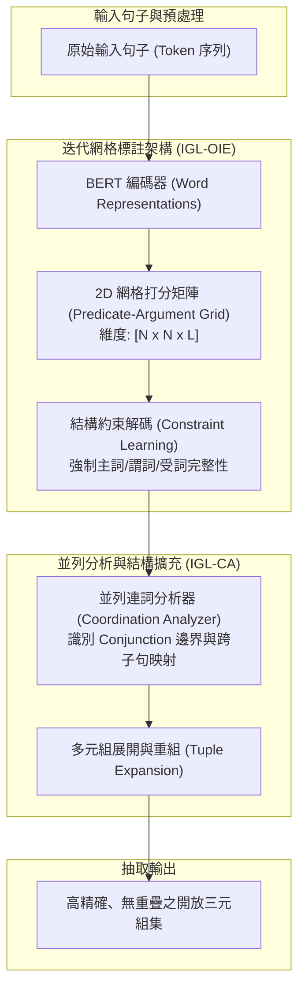

# OpenIE6: Iterative Grid Labeling and Coordination Analysis for Open Information Extraction

## 1. 一話摘要 (TL;DR)
OpenIE6 提出**迭代網格標註（Iterative Grid Labeling, IGL）**與**並列結構分析器（Coordination Analyzer, CA）**，打破傳統開放資訊抽取（OpenIE）在自回歸生成的高運算延遲與序列標註低語意品質之間的權衡難題，達成比前代 SOTA 系統 IMoJIE 快 **60×** 的推論速度，並在 CaRB、OIE2016 與 Wire57 等基準上取得顯著提升。

---

## 2. 研究背景與問題定義 (Problem Statement)

### 開放資訊抽取的核心瓶頸
開放領域資訊抽取（Open Information Extraction, OpenIE）旨在從無結構文字中自動提取多元組（$Subject, Predicate, Object$ 等），且無需預設受限的知識本體 Schema。然而既有方法面臨兩難：
1. **生成式/自回歸序列模型（如 IMoJIE）**：能抽取重疊多元組與複雜語意，但逐詞自回歸解碼極度緩慢（在 GPU 上每秒僅能處理約 2.6 個句子），無法應對大規模文檔庫索引；
2. **序列標註模型（Sequence Labeling, 如 RnnOIE）**：速度快但難以處理多重抽取與連詞並列結構（Coordination），容易遺漏多元組或產生語意殘缺；
3. **並列結構破壞（Coordination Failure）**：例如句中出現「X produces, markets and sells Y」，傳統模型極易忽略複合動詞的論元分配，造成知識圖譜大量斷鏈。

---

## 3. 核心方法與技術架構 (Methodology & Architecture)

OpenIE6 將 OpenIE 轉化為二維網格標註問題，並結合語法約束與專用並列分析器：

### 圖中節點對照
- `RAW`: 輸入之長句子文本
- `BERT`: 共享深層雙向 Transformer 語言模型編碼層
- `GRID`: 將 Token-Token 互動關係與實體標籤映射到 2D 矩陣
- `CONSTR`: 引入拉格朗日鬆弛或規則約束，消除不合法的孤立論元標註
- `COORD`: 專用 IGL-CA 模組，判斷 "and", "or" 牽涉之實體與動作範疇
- `EXPAND`: 依據並列項將單一複合句自動解構為數個獨立的原子多元組
- `TRIPLES`: 最終產出具備明確置信度的 OpenIE 知識元

---

## 4. 主要實驗結果與證據 (Empirical Results & Evidence)

實驗在三大權威 OpenIE 基準上進行（CaRB、OIE2016-C、Wire57-C），硬體基準為單張 V100 GPU + 4-core Intel Xeon CPU：

1. **綜合抽取品質與速度對照（Table 2, Page 7）**：
   - **速度（Speed, Sentences/sec）**：
     - 前代自回歸 SOTA IMoJIE：**2.6 sent/sec**；
     - 基礎 IGL-OIE：**142.0 sent/sec**（速度提升 **54.6× 至 60×**）；
     - 完整版 OpenIE6（CIGL-OIE + IGL-CA）：**31.7 sent/sec**（依然比 IMoJIE 快 **12.2×**）。
   - **抽取 F1 與 AUC 表現**：
     - **CaRB(1-1)**：OpenIE6 達到 **F1 46.4 / AUC 26.8**（顯著超越 IMoJIE 的 41.4 / 22.2 及 OpenIE5 的 42.7 / 20.6）；
     - **OIE16-C**：OpenIE6 達到 **F1 65.6 / AUC 48.4**（超越 IMoJIE 的 56.8 / 39.6 與 ClausIE 的 61.0 / 38.0）；
     - **Wire57-C**：OpenIE6 達到 **F1 40.0**（相比 IMoJIE 36.0 與 OpenIE5 35.4 提升達 4.0 個百分點）。
2. **人工抽樣並列句抽取深度分析（Table 3, Page 7）**：
   - 在 CaRB 基準中隨機選取 100 句包含連詞的複雜並列句：
   - 未加並列分析器的 CIGL-OIE 產出 174 個三元組（Yield = 131，Precision = 77.9%）；
   - **OpenIE6（含 IGL-CA）**產出 291 個三元組（**Yield 大幅提升至 222，Precision 提高到 78.8%**），證明並列分析器成功找回大量被傳統模型遺漏的事實。

---

## 5. 優勢、限制及 Trade-offs (Strengths, Limitations & Trade-offs)

### 優勢
- **吞吐量巨大**：網格並行標註避免了自回歸模型逐 token 生成的計算瓶頸，非常適合海量文檔的離線圖譜構建；
- **語法完整性強**：透過 IGL-CA 顯著解決了英語語法中常見的複合謂詞與複合賓語分配問題。

### 限制與 Trade-offs
- **跨句代詞消解不足**：作為句子級 OpenIE 抽取器，無法自主跨越句號消解代名詞（例如未能將 "he" 替換為上文實體）；
- **開放詞彙泛化代價**：雖然抽取速度快，但抽出的謂詞均為原句字面字串，缺乏向正規本體（Ontology Concept）的歸一化步驟。

---

## 6. 對本專案研究領域的實際意義 (Implications for Research Domains)
在超長文本與 GraphRAG 的第一階段（Chunk-level Extraction）：
- **海量知識圖譜建構效率**：若完全依賴 LLM（如 GPT-4）逐段抽取三元組，API 與計算成本極度高昂。OpenIE6 提供了一種**高精度、超高速（30~140 sent/sec）的密集知識抽取器**，可作為 GraphRAG 初期批量建構本體圖的低成本冷啟動引擎，再由後續模組進行跨塊聚合。

---

## 7. 原始來源及相關筆記連結 (Sources & Related Notes)
- **本地 PDF**：`[[Papers/04 - Knowledge & Graph RAG/(EMNLP 2020-11) OpenIE6 - Iterative Grid Labeling and Coordination Analysis for Open Information Extraction.pdf|開啟本地 PDF 檔案]]`
- **關聯筆記**：
  - [[02 - 研究領域專題 (Research Domains)/Domain 02 - Segmentation & Contextualization|D02 Segmentation & Contextualization]]
  - [[02 - 研究領域專題 (Research Domains)/Domain 03 - Knowledge Extraction & Information Preservation|D03 Knowledge Extraction & Information Preservation]]
  - [[03 - 論文庫 (Literature Notes)/04 - Knowledge & Graph RAG/(EMNLP 2021-11) REBEL - Relation Extraction By End-to-end Language generation|REBEL 生成式抽取筆記]]
