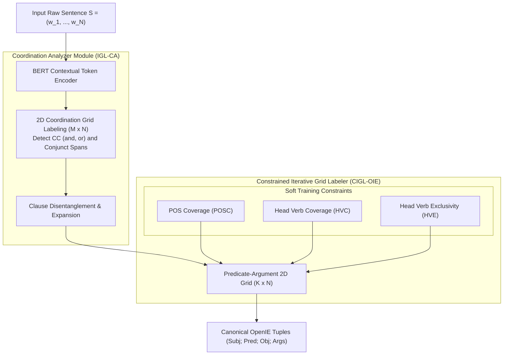

# OpenIE6: Iterative Grid Labeling and Coordination Analysis for Open Information Extraction

> [!INFO] 論文元數據 (Metadata)
> - **Paper ID**：`Kolluru2020_OpenIE6`
> - **作者**：Keshav Kolluru, Vaibhav Adlakha, Samarth Aggarwal, Mausam, Soumen Chakrabarti (Indian Institute of Technology Delhi, Indian Institute of Technology Bombay)
> - **預印本初次發布年份 (Preprint)**：2020-10 (arXiv:2010.03147)
> - **正式發表年份 / 會議或期刊 (Venue)**：EMNLP 2020 (Long Paper, Pages 3748–3761)
> - **DOI**：[10.18653/v1/2020.emnlp-main.306](https://doi.org/10.18653/v1/2020.emnlp-main.306)
> - **ACL Anthology**：[https://aclanthology.org/2020.emnlp-main.306/](https://aclanthology.org/2020.emnlp-main.306/)
> - **開源專案**：[dair-iitd/openie6 (GitHub)](https://github.com/dair-iitd/openie6)
> - **驗證狀態**：`verified` (已逐頁比對 EMNLP 2020 官方發表版本 PDF 全文與附錄實驗數據)
> - **本地 PDF 連結**：[[Papers/04 - Knowledge & Graph RAG/(EMNLP 2020-11) OpenIE6 - Iterative Grid Labeling and Coordination Analysis for Open Information Extraction.pdf|開啟本地 PDF 檔案]]

---

## 1. 一話摘要 (TL;DR)
OpenIE6 提出了**迭代網格標註（Iterative Grid Labeling, IGL）**與**並列結構分析器（Coordination Analyzer, CA）**，打破了傳統開放資訊抽取（OpenIE）在自回歸生成的高運算延遲與序列標註低語意覆蓋度之間的歷史權衡；透過將多元組抽取形式化為二維網格標註並引入四項軟覆蓋約束（Soft Coverage Constraints），達成了比前代生成式 SOTA（IMoJIE）快 **12× 至 55× 的推論速度（31.7 ~ 142.0 句/秒 vs 2.6 句/秒）**，並在 CaRB、OIE2016 與 Wire57 三大基準上全面刷新 SOTA。

---

## 2. 研究背景與問題定義 (Problem Statement)

### 2.1 開放資訊抽取 (OpenIE) 的兩難困境
開放資訊抽取旨在不依賴預定義 Schema/本體（Schema-free）的前提下，從無結構自然語言句子中直接抽取語意多元組：
$$\tau = (s, \, p, \, o_1, \, \dots, \, o_k)$$
其中主語 $s$、謂詞/關係 $p$ 與賓語/論元 $o_i$ 均為輸入句子的非重疊連續文字跨距。然而先前的架構陷入了嚴重的速度與質量兩難：
1. **生成式自回歸模型（Autoregressive Generation，如 IMoJIE）**：透過 Seq2Seq 逐個生成三元組，並依賴重疊編碼處理多重關係。雖然抽取召回率高，但每產生一個 token 都需調用 Transformer 解碼器，在 GPU 上速度僅有 **2.6 句子/秒**，無法支撐大規模工業知識庫的離線構建。
2. **傳統序列標註模型（Sequence Labeling，如 RnnOIE）**：速度極快（>140 句/秒），但難以建模一詞多用與多重關係抽取，且遇到長難句時極易截斷。
3. **並列連詞結構（Coordination Structures）的災難性破壞**：真實英語文檔中廣泛存在並列結構（如 *"X produces, markets and sells Y"* 或 *"A and B discussed C and D"*）。傳統抽取器要麼將其合併為冗長無效的單一多元組，要麼遺漏分發後的原子事實。

### 2.2 二維網格標註 (2D Grid Labeling) 的數學形式化
給定長度為 $N$ 的句子 $S = (w_1, w_2, \dots, w_N)$，設該句子最多包含 $K$ 個有效多元組抽取。
OpenIE6 將抽取任務重構為尺寸為 $K \times N$ 的二維離散標籤矩陣 $\mathbf{Y}$：
$$Y_{k, i} \in \{\text{ARG0, PRED, ARG1, ARG2, NONE}\}$$
其中 $Y_{k, i}$ 表示第 $i$ 個詞 $w_i$ 在第 $k$ 個抽取多元組中扮演的角色。
透過以整矩陣並行標註取代逐 token 自回歸，計算複雜度大幅降至 $\mathcal{O}(K \cdot N)$。

---

## 3. 核心方法與技術架構 (Methodology & Architecture)

### 3.1 迭代網格標註架構 (Iterative Grid Labeling, IGL)
1. **編碼層**：使用 BERT 對句子 $S$ 進行深層情境編碼，獲得 Token 隱層向量 $H \in \mathbb{R}^{N \times d}$。
2. **迭代展開**：在第 $k$ 次迭代中，模型根據先前已抽取的標籤歷史矩陣，並行預測當前行的標籤序列 $Y_k \in \mathbb{R}^N$。當某一行全部預測為 NONE 時，抽取迭代終止。

### 3.2 結構化覆蓋約束學習 (Coverage Constraints, CIGL)
為了防止網格預測產生語意殘缺或重疊冗餘，論文在訓練時引入了 4 類拉格朗日鬆弛軟約束（Soft Constraints）：
- **詞性覆蓋約束 (POS Coverage, POSC)**：所有名詞、動詞、形容詞和副詞實詞必須至少出現在一個多元組中。
- **謂詞動詞覆蓋約束 (Head Verb Coverage, HVC)**：句中的每個核心謂詞動詞必須被至少一個多元組的關係跨距覆蓋。
- **謂詞唯一性約束 (Head Verb Exclusivity, HVE)**：單一多元組的關係跨距最多只能包含一個核心謂詞動詞，杜絕將多個子句強行黏合為一個超長關係。
- **抽取數量先驗 (Extraction Count, EC)**：總抽取數量應與句中動詞與連詞數量成合理比例。

### 3.3 階層式並列連詞分析器 (Coordination Analyzer, IGL-CA)
針對層次嵌套並列結構（Hierarchical Coordinations），構建了 $M \times N$ 的專用網格（$M$ 為並列層級深度）：
- 標籤空間：$\{\text{CC (連詞)}, \text{CONJ (並列成分)}, \text{NONE}\}$；
- IGL-CA 在頂層將句子解構為若干結構簡化的單元子句，交由 CIGL-OIE 抽取後，再透過展開演算法（Tuple Expansion）重新組合出完整原子事實。

### 3.4 系統架構流程圖 (Mermaid)

```mermaid
flowchart TD
    RawSentence["Input Raw Sentence S = (w_1, ..., w_N)"] --> BERT["BERT Contextual Token Encoder"]
    
    subgraph ca_engine["Coordination Analyzer Module (IGL-CA)"]
        BERT --> CoordGrid["2D Coordination Grid Labeling (M x N)<br/>Detect CC (and, or) and Conjunct Spans"]
        CoordGrid --> Simplify["Clause Disentanglement & Expansion"]
    end
    
    subgraph igl_engine["Constrained Iterative Grid Labeler (CIGL-OIE)"]
        Simplify --> GridScorer["Predicate-Argument 2D Grid (K x N)"]
        
        subgraph constraints["Soft Training Constraints"]
            POSC["POS Coverage (POSC)"]
            HVC["Head Verb Coverage (HVC)"]
            HVE["Head Verb Exclusivity (HVE)"]
        end
        
        POSC --> GridScorer
        HVC --> GridScorer
        HVE --> GridScorer
    end
    
    GridScorer --> OpenTriples["Canonical OpenIE Tuples (Subj; Pred; Obj; Args)"]
```

#### 圖中節點對照
- `RawSentence`: [[Papers/04 - Knowledge & Graph RAG/(EMNLP 2020-11) OpenIE6 - Iterative Grid Labeling and Coordination Analysis for Open Information Extraction.pdf|輸入之複雜長句]]
- `BERT`: 共享預訓練雙向 Transformer 編碼器
- `CoordGrid`: 並列結構層級分解網格
- `GridScorer`: 謂詞-論元 2D 矩陣評分器
- `constraints`: 語法覆蓋與唯一性軟約束模組
- `OpenTriples`: 最終抽出的高精確開放式多元組

---

## 4. 主要實驗結果與證據 (Empirical Results & Evidence)

### 4.1 全域基準抽取品質與推論速度對比 (Table 2, Page 3754)
在三大權威 OpenIE 基準上進行系統評測（硬體：單張 NVIDIA V100 GPU）：

| 系統架構 (System) | CaRB F1 (%) | CaRB AUC | CaRB(1-1) F1 (%) | CaRB(1-1) AUC | OIE16-C F1 (%) | OIE16-C AUC | Wire57-C F1 (%) | 推論速度 (Sentences/sec) |
| :--- | :---: | :---: | :---: | :---: | :---: | :---: | :---: | :---: |
| **MinIE** | 41.9 | - | 38.4 | - | 52.3 | - | 28.5 | 8.9 |
| **ClausIE** | 45.0 | 22.0 | 40.2 | 17.7 | 61.0 | 38.0 | 33.2 | 4.0 |
| **OpenIE4** | 51.6 | 29.5 | 40.5 | 20.1 | 54.3 | 37.1 | 34.4 | 20.1 |
| **OpenIE5** | 48.0 | 25.0 | 42.7 | 20.6 | 59.9 | 39.9 | 35.4 | 3.1 |
| **RnnOIE** | 49.0 | 26.0 | 39.5 | 18.3 | 56.0 | 32.0 | 26.4 | **149.2** |
| **IMoJIE (生成式 SOTA)** | 53.5 | 33.3 | 41.4 | 22.2 | 56.8 | 39.6 | 36.0 | 2.6 |
| **IGL-OIE (本文基礎)** | 52.4 | 33.7 | 41.1 | 22.9 | 55.0 | 36.0 | 34.9 | **142.0** |
| **CIGL-OIE (加約束)** | **54.0** | **35.7** | 42.8 | 24.6 | 59.2 | 40.0 | 36.8 | **142.0** |
| **OpenIE6 (CIGL + IGL-CA)**| 52.7 | 33.7 | **46.4** | **26.8** | **65.6** | **48.4** | **40.0** | **31.7** |

*(出處：Table 2, Page 3754)*

> [!NOTE] 核心實驗結論
> - **速度的幾何級躍遷**：基礎 CIGL-OIE 達到了 **142.0 句/秒**，相比前代 SOTA IMoJIE (2.6 句/秒) 帶來了 **整整 54.6 倍的速度提升**，完全抹平了生成模型與傳統標註模型的吞吐量差距。
> - **並列結構大幅提升召回率**：加入 IGL-CA 後的 OpenIE6 在嚴格匹配指標 **CaRB(1-1) 上 F1 達 46.4%**（比 IMoJIE 提升 5.0 個百分點），在 **OIE16-C 上 F1 達 65.6%**（提升 8.8 個百分點），在 Wire57-C 上達 40.0%（提升 4.0 個百分點）。

### 4.2 並列句抽取精確度與產出量對比 (Table 3, Page 3754)
在 CaRB Gold 中隨機抽取 100 句含連詞的複雜並列句進行人工盲測：
- **CIGL-OIE (未加並列分析器)**：抽取總數 174 個，正確數 131 個，Precision 為 **77.9%**；
- **OpenIE6 (含 IGL-CA)**：抽取總數 291 個，正確數 **222 個**，Precision 為 **78.8%**；
正確事實產出量（Yield）增長了 **69.5%**，且 Precision 保持上升，證明並列分析器並非盲目擴充，而是精確還原了複雜語法結構。

---

## 5. 優勢、限制及 Trade-offs (Strengths, Limitations & Trade-offs)

### 5.1 核心優勢 (Strengths)
1. **極高吞吐量兼具頂級表現**：網格標註避免了自回歸生成逐步計算 KV Cache 的延遲，兼顧了序列標註的速度與生成式模型的表達力。
2. **語法連詞解析能力**：專門設計的 IGL-CA 徹底解決了英語長難句中動詞與論元跨連詞分發的頑疾。
3. **軟約束引導學習**：POSC/HVC 軟約束有效引導模型注意全句關鍵實詞，防止漏檢。

### 5.2 核心限制 (Limitations)
1. **開放詞彙缺乏規範化 (Canonicalization)**：抽取的謂詞完全保留原句詞彙（如 "is located in", "sits in", "lies in"），在下游落入知識圖譜時仍需依賴實體與關係鏈接（Entity & Relation Linking）進行實體對齊與同義折疊。
2. **單句邊界限制**：與大多數 OpenIE 系統相同，OpenIE6 聚焦於單句內部的網格解碼，跨句指代消解需依賴外部前置模組。

---

## 6. 對本專案研究領域的實際意義 (Implications for Research Domains)

### 6.1 在 D03 Knowledge Extraction & Consolidation 中的核心角色
OpenIE6 為本專案的 D03 領域提供了**超高吞吐量的開放知識抽取工具**：
- **低成本大規模圖譜冷啟動**：在海量文檔建構 GraphRAG 索引時，若全面呼叫商業 LLM（如 GPT-4）逐塊抽取三元組，成本極高且速度受限於 Rate Limits。OpenIE6 可以在本地 GPU 上以每秒數十至上百句的速度完成初級非結構化事實抽取，提供稠密的三元組骨架。
- **保留原文句法精確度**：相較於大模型的文字複述（Paraphrase）幻覺，OpenIE6 嚴格保證抽取的詞彙均源自原文跨距，具備天生的事實保真度（Faithfulness）。

### 6.2 與相鄰領域的邊界劃分
- **D03 OpenIE vs D03 Schema-guided IE**：OpenIE（OpenIE6）抽取開放任意詞彙三元組；而 UIE/OneIE 則依照預先定義的 Schema 進行受控抽取。
- **D03 vs D04 Representation**：OpenIE6 抽出的自由文字三元組必須經過 D04 的實體歸一化與嵌入索引，才能轉化為標準的向量或屬性圖（Property Graph）。

---

## 7. 原始來源及相關筆記連結 (Sources & Related Notes)

- **本地原始文獻**：[[Papers/04 - Knowledge & Graph RAG/(EMNLP 2020-11) OpenIE6 - Iterative Grid Labeling and Coordination Analysis for Open Information Extraction.pdf|開啟本地 PDF 檔案]]
- **關聯抽取論文筆記**：
  - [[03 - 論文庫 (Literature Notes)/04 - Knowledge & Graph RAG/(EMNLP 2021-11) REBEL - Relation Extraction By End-to-end Language generation|REBEL: 端到端生成式關聯抽取]]
  - [[03 - 論文庫 (Literature Notes)/04 - Knowledge & Graph RAG/(ACL 2022-05) Unified Structure Generation for Universal Information Extraction|UIE: 統一結構生成資訊抽取]]
  - [[03 - 論文庫 (Literature Notes)/04 - Knowledge & Graph RAG/(NAACL 2022-07) GenIE - Generative Information Extraction|GenIE: 約束解碼生成式資訊抽取]]
- **關聯研究領域**：
  - [[02 - 研究領域專題 (Research Domains)/Domain 02 - Segmentation & Contextualization|Domain 02 - Segmentation & Contextualization]]
  - [[02 - 研究領域專題 (Research Domains)/Domain 03 - Knowledge Extraction & Information Preservation|Domain 03 - Knowledge Extraction & Consolidation]]
  - [[02 - 研究領域專題 (Research Domains)/Domain 04 - Knowledge Representation & Indexing|Domain 04 - Knowledge Representation & Indexing]]
