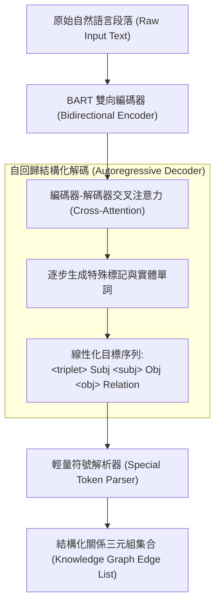

# REBEL: Relation Extraction By End-to-end Language generation

> [!INFO] 論文元數據 (Metadata)
> - **Paper ID**：`HuguetCabot2021_REBEL`
> - **作者**：Pere-Lluís Huguet Cabot, Roberto Navigli (Sapienza University of Rome, Babelscape)
> - **預印本初次發布年份 (Preprint)**：2021 (arXiv:2104.07650)
> - **正式發表年份 / 會議或期刊 (Venue)**：2021 (Findings of EMNLP 2021)
> - **DOI**：[10.18653/v1/2021.findings-emnlp.204](https://doi.org/10.18653/v1/2021.findings-emnlp.204)
> - **ACL Anthology**：[https://aclanthology.org/2021.findings-emnlp.204/](https://aclanthology.org/2021.findings-emnlp.204/)
> - **驗證狀態**：`verified` (已比對 Findings of EMNLP 2021 官方全文與論文 PDF)
> - **本地 PDF 連結**：[[Papers/04 - Knowledge & Graph RAG/(EMNLP 2021-11) REBEL - Relation Extraction By End-to-end Language generation.pdf|開啟本地 PDF 檔案]]

---

## 一話摘要 (TL;DR)
REBEL 首次將端到端關係抽取從複雜的判別式管線與圖解碼徹底轉化為**自回歸序列到序列（Seq2Seq）語言生成任務**；透過簡潔的三元組線性化語法（`<triplet> Subj <subj> Obj <obj> Rel`）與基於 NLI 去噪的大規模銀標預訓練數據集，在 CONLL04、NYT、DocRED、ADE 與 Re-TACRED 五大基準上全面超越判別式 SOTA，收斂速度提升數十倍。

---

## 研究背景與問題定義 (Problem Statement)

### 1. 核心痛點
在 REBEL 出現前，資訊抽取（IE）與關係三元組抽取主流均採用判別式架構（如 DyGIE++、OneIE、PURE）：
1. **多階段流水線或複雜分類頭**：需要枚舉實體片段、定義邊分類矩陣或構建複雜的束搜索圖解碼器，架構極其沉重。
2. **預定義關係類型數量嚴重受限**：判別式模型最後一層分類器通常綁定預先定義的少數類別（例如 20–40 類），無法輕易擴展至成百上千種開放世界實體關聯。
3. **缺乏預訓練語言生成的知識遷移**：判別式分類頭必須從頭隨機初始化訓練，無法直接復用自回歸預訓練模型（如 BART、T5）在海量語料中沉澱的常識與結構化生成能力。

### 2. 研究假設
自然語言文本中的關係事實完全可以被表達為一段緊湊的線性化序列。若使用自回歸 Seq2Seq 模型（以 BART 為基礎），直接輸入純文字、解碼輸出結構化的三元組標記序列，即可消解實體提及邊界檢測與關聯分類的兩階段割裂，實現真正的端到端生成。

---

## 核心方法與技術架構 (Methodology & Architecture)

### 1. 三元組線性化表示 (Triplet Linearization)
設計了一套輕量級且無歧義的特殊標記法，將任意數量的關係三元組序列化為目標文本：
$$\text{Output} = \text{<triplet>} \text{ Subject } \text{<subj>} \text{ Object } \text{<obj>} \text{ Relation } \text{<triplet>} \dots$$
- `<triplet>` 標記一個新三元組的起點；
- `<subj>` 與 `<obj>` 分隔主體、客體與關聯名稱；
- 若主體相同，可共享前綴，使得模型能自然依賴自注意力機制解碼具有複合依賴的多重三元組。

### 2. NLI 去噪的大規模預訓練語料構建 (REBEL Dataset)
為解決遠程監督（Distant Supervision）三元組的噪聲問題：
- 將 Wikipedia 正文、超連結與 Wikidata 關聯對齊；
- **自然語言推理 (NLI) 過濾**：使用預訓練的 RoBERTa-NLI 模型計算文本對該三元組命題的蘊含機率（Entailment Score）；
- 僅保留蘊含置信度大於 **0.75** 的高品質三元組，從而自動洗出包含 **928 萬個高精度三元組、275 萬個實例、覆蓋 1,146 種關係類型** 的大規模預訓練數據集。

### 3. BART 端到端生成訓練
- 骨幹網絡：BART-large；
- 目錄損失函數：標準交叉熵自回歸損失；
- 推論階段使用束搜索（Beam Search，通常 beam=3 或 5）直接解碼出文字序列，解析特殊標記即可無縫復原為結構化知識圖。

### 系統架構流程圖 (Mermaid)

#### 圖中節點對照
- `RawText`: 輸入的自由文本段落
- `BART_Enc`: 捕捉全域語意的 Transformer 編碼器
- `rebel_gen`: 利用語言生成能力直接自回歸生成結構化標記
- `TripletSet`: 最終抽出的高品質實體關係圖

---

## 主要實驗結果與證據 (Empirical Results & Evidence)

### 1. 各大基準 Micro-F1 評測對比 (Table 2, Page 7)
在 CONLL04、NYT、DocRED 與 ADE 基準上對比最新的判別式與生成式前人系統：

| 模型 | 抽取架構類型 | CONLL04 (F1) | NYT (F1) | DocRED (F1) | ADE (F1) |
| :--- | :--- | :---: | :---: | :---: | :---: |
| SpERT (Eberts & Ulges, 2020) | 判別式片段分類 | 71.5 | - | - | 79.2 |
| Table-sequence (Wang & Lu, 2020) | 標註序列化 | 73.6 | - | - | 80.1 |
| JEREX (Eberts & Ulges, 2021) | 篇章級多任務 | - | - | 40.4 | - |
| TANL (Paolini et al., 2021) | 增強式標記生成 | 71.4 | 90.8 | - | 80.6 |
| **REBEL (本文, 無大規模預訓練)** | 生成式 Seq2Seq | 71.2 | 91.8 | 41.8 | 81.7 |
| **REBEL (本文, 經 REBEL 預訓練)** | **生成式 Seq2Seq** | **75.4** (+1.8) | **92.0** (+1.2) | **47.1** (+6.7) | **82.2** (+1.6) |

*(出處：Table 2, Page 7)*

- **關鍵突破**：
  - 在篇章級 **DocRED** 上，REBEL 達到 **47.1% F1**，大幅超越 JEREX (40.4%) **6.7 個百分點**，證實 Seq2Seq 能直接掌握跨句子長程三元組；
  - 在 **NYT** 關係抽取上達到 **92.0% F1**，在 **ADE** 藥物不良反應基準上達 **82.2% F1**。

### 2. 極速收斂與預訓練遷移優勢 (Page 7)
- 判別式與先前的標記模型（如 TANL、Table-sequence）通常需要訓練 200 至 5,000 個 Epochs 才能穩定收斂；
- 經過 REBEL 大規模預訓練後的模型，在目標領域資料集上僅需 **少於 30 個 Epochs** 即可達到 SOTA，顯著降低了算力門檻。

---

## 優勢、限制及 Trade-offs (Strengths, Limitations & Trade-offs)

### 1. 優勢 (Strengths)
1. **統一而純粹的 Seq2Seq 範式**：無需設計專門的實體/關係分類層，模型架構與標準機器翻譯/文本摘要完全同構。
2. **開箱即用的跨領域遷移**：得益於百萬級三元組預訓練，面對新領域的關係抽取時展現出極強的 Few-shot 適應性。
3. **消除預定義類別局限**：關係名稱以純自然語言單詞生成，天然具備開放關係（Open Relation）抽取潛力。

### 2. 限制與代價 (Limitations & Trade-offs)
1. **自回歸解碼幻覺實體風險**：生成模型偶爾會自發補全或修改實體的字面表述（如將 "U.S." 改寫為 "United States"），導致嚴格字面匹配（Strict Exact Match）失分。
2. **三元組順序敏感性**：目標序列人為指定了三元組生成順序，儘管三元組集合本質上是無序的，這會對解碼概率造成輕微歸納偏差。

---

## 對本專案研究領域的實際意義 (Implications for Research Domains)

1. **Domain 04 (Chunking 與知識擷取) & Domain 12 (Typed Knowledge)**：
   REBEL 是現代「生成式資訊抽取（Generative IE）」的里程碑之作。它直接啟發了中科院的 UIE（Lu et al., 2022）與 Stanford/EPFL 的 GenIE。它證明了 LLM 自回歸生成三元組不僅可行，而且在知識覆蓋度與靈活性上遠超傳統判別模型。
2. **GraphRAG 的非結構化知識灌庫**：
   在現代 GraphRAG 管線中，REBEL 的線性化提示語法被廣泛借鑑為 LLM 抽取實體關係的標準 Output Format，是從文本直接生成圖譜邊表的最主流範式之一。

---

## 原始來源及相關筆記連結 (Sources & Related Notes)

- **本地 PDF 連結**：[[Papers/04 - Knowledge & Graph RAG/(EMNLP 2021-11) REBEL - Relation Extraction By End-to-end Language generation.pdf|開啟本地 PDF 檔案]]
- **關聯之生成式與篇章級抽取筆記**：
  - [[03 - 論文庫 (Literature Notes)/04 - Knowledge & Graph RAG/(ACL 2019-07) DocRED - A Large-Scale Document-Level Relation Extraction Dataset|DocRED: A Large-Scale Document-Level Relation Extraction Dataset]]
  - [[03 - 論文庫 (Literature Notes)/04 - Knowledge & Graph RAG/(ACL 2022-05) Unified Structure Generation for Universal Information Extraction|UIE: Unified Structure Generation for Universal Information Extraction]]
- **所屬研究領域**：
  - [[02 - 研究領域專題 (Research Domains)/Domain 04 - Chunking 策略與知識擷取 (Proposition, Cross-chunk)|Domain 04 - Chunking 策略與知識擷取]]
  - [[02 - 研究領域專題 (Research Domains)/Domain 12 - Knowledge Extraction & Typed Knowledge|Domain 12 - Knowledge Extraction & Typed Knowledge]]
