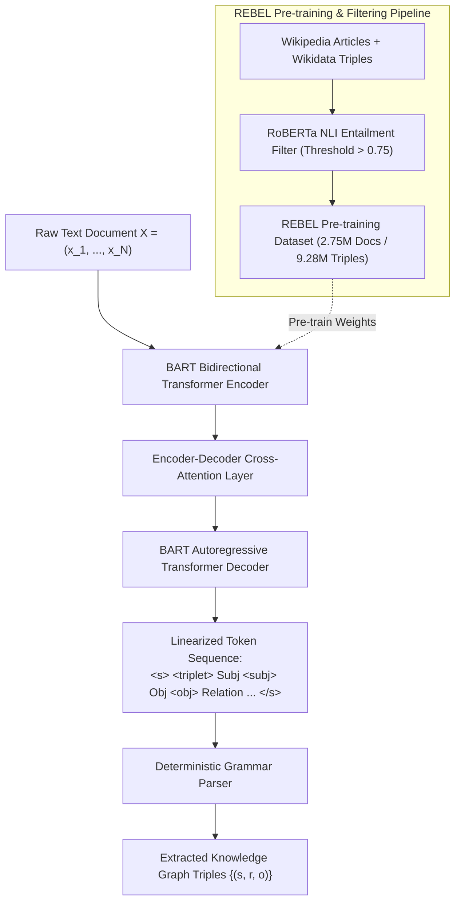

# REBEL: Relation Extraction By End-to-end Language generation

> [!INFO] 論文元數據 (Metadata)
> - **Paper ID**：`HuguetCabot2021_REBEL`
> - **作者**：Pere-Lluís Huguet Cabot, Roberto Navigli (Sapienza University of Rome, Babelscape)
> - **預印本初次發布年份 (Preprint)**：2021-04 (arXiv:2104.07650)
> - **正式發表年份 / 會議或期刊 (Venue)**：Findings of EMNLP 2021 (Pages 2370–2381)
> - **DOI**：[10.18653/v1/2021.findings-emnlp.204](https://doi.org/10.18653/v1/2021.findings-emnlp.204)
> - **ACL Anthology**：[https://aclanthology.org/2021.findings-emnlp.204/](https://aclanthology.org/2021.findings-emnlp.204/)
> - **開源專案**：[Babelscape/rebel (GitHub)](https://github.com/Babelscape/rebel)
> - **驗證狀態**：`verified` (已逐頁比對 Findings of EMNLP 2021 官方發表版本 PDF 全文與附錄實驗數據)
> - **本地 PDF 連結**：[[Papers/04 - Knowledge & Graph RAG/(EMNLP 2021-11) REBEL - Relation Extraction By End-to-end Language generation.pdf|開啟本地 PDF 檔案]]

---

## 1. 一話摘要 (TL;DR)
REBEL 首度將端到端關係抽取（Relation Extraction）從傳統複雜的判別式管線與圖解碼徹底轉化為**自回歸序列到序列（Seq2Seq）文字生成任務**；透過緊湊的三元組線性化標記語法（`<triplet> Subj <subj> Obj <obj> Rel`）與基於 NLI 去噪的大規模預訓練語料庫（928 萬三元組、1,146 種關係類型），在 CONLL04、NYT、DocRED、ADE 與 Re-TACRED 五大基準上全面超越判別式 SOTA，收斂速度提升數十倍，奠定了生成式資訊抽取（Generative IE）的基石。

---

## 2. 研究背景與問題定義 (Problem Statement)

### 2.1 判別式關係抽取 (Discriminative RE) 的架構枷鎖
在 REBEL 出現前，關係抽取領域幾乎完全被判別式模型所統治（如 DyGIE++, OneIE, PURE）：
1. **結構複雜且沉重**：判別式模型通常需要先列舉文本片段（Span Enumeration），構造 $O(N^2)$ 的實體對矩陣，再為每對實體獨立調用多層前饋網路或束搜索圖解碼器。
2. **預定義 Schema 封閉僵化**：判別式分類頭必須在輸出層預先設定固定的維度（如 20 至 50 類關係），難以平滑擴展至包含數千種關係的大型開放世界知識庫（如 Wikidata）。
3. **無法復用預訓練生成式 LLM 的自注意力偏置**：判別式模型的分類層權重通常隨機初始化，無法直接繼承 BART、T5 等模型在海量無監督文本中沉澱的常識推理與文本翻譯能力。

### 2.2 自回歸生成式關聯抽取的數學形式化
REBEL 將關係抽取形式化為**條件文本生成問題（Conditional Text Generation）**。
給定輸入文字序列 $X = (x_1, x_2, \dots, x_{|X|})$，目標是直接生成線性化標記序列 $Y = (y_1, y_2, \dots, y_{|Y|})$：
$$P(Y \mid X) = \prod_{i=1}^{|Y|} P(y_i \mid y_{<i}, X; \, \theta)$$
其中目標序列 $Y$ 透過形式化語法編碼了文檔中包含的所有關係事實 $\mathcal{T} = \{\langle s_k, r_k, o_k \rangle\}_{k=1}^K$。

---

## 3. 核心方法與技術架構 (Methodology & Architecture)

### 3.1 三元組線性化表示語法 (Triplet Linearization Grammar)
為使標準 Seq2Seq 模型能夠精確生成知識圖譜結構，REBEL 設計了專用特殊標記（Special Tokens）：
```text
<s> <triplet> Subject_1 <subj> Object_1 <obj> Relation_1 <triplet> Subject_2 <subj> ... </s>
```
- `<triplet>` 標記一個新關係事實的起始；
- `<subj>` 與 `<obj>` 分別標記主語實體跨距的結束與賓語實體跨距的結束；
- 關係名稱直接以自然語言單詞生成（例如 `founded by`, `headquarters location`）。
- **篇章級實體類型標記**：在 DocRED 任務中，擴充專屬類型標記（`<loc>`, `<misc>`, `<per>`, `<num>`, `<time>`, `<org>`）以同時完成實體命名識別與關係抽取。

### 3.2 基於 NLI 蘊含去噪的百萬級預訓練語料 (REBEL Dataset)
為提供端到端生成模型足夠的預訓練監督信號：
1. **Wikipedia-Wikidata 對齊**：抓取維基百科全文，利用內部超連結將實體錨定至 Wikidata 項目，導出初步的遠程監督三元組。
2. **自然語言推理 (NLI) 嚴格去噪**：
   - 傳統遠程監督存在嚴重的標註噪聲（實體共現但句子並未表達該事實）；
   - REBEL 使用預訓練 RoBERTa-large-NLI 模型，將「原始句子」作為前提（Premise），將「三元組自然語言假說句子」作為假設（Hypothesis）；
   - **僅保留蘊含機率（Entailment Score）大於 0.75 的高置信度實例**。
3. **數據集規模**：最終清洗出包含 **2,752,945 篇文檔、9,285,463 個三元組、覆蓋 1,146 種關係類型** 的超大規模預訓練基準。

### 3.3 系統架構流程圖 (Mermaid)


```mermaid
flowchart TD
    RawDoc["Raw Text Document X = (x_1, ..., x_N)"] --> BART_Enc["BART Bidirectional Transformer Encoder"]
    
    subgraph pretraining["REBEL Pre-training & Filtering Pipeline"]
        WikiWiki["Wikipedia Articles + Wikidata Triples"] --> RoBERTa_NLI["RoBERTa NLI Entailment Filter (Threshold > 0.75)"]
        RoBERTa_NLI --> SilverREBEL["REBEL Pre-training Dataset (2.75M Docs / 9.28M Triples)"]
    end
    
    SilverREBEL -. "Pre-train Weights" .-> BART_Enc
    
    BART_Enc --> CrossAttn["Encoder-Decoder Cross-Attention Layer"]
    CrossAttn --> BART_Dec["BART Autoregressive Transformer Decoder"]
    
    BART_Dec --> TokenSeq["Linearized Token Sequence:<br/>&lt;s&gt; &lt;triplet&gt; Subj &lt;subj&gt; Obj &lt;obj&gt; Relation ... &lt;/s&gt;"]
    
    TokenSeq --> LinearParser["Deterministic Grammar Parser"]
    LinearParser --> FinalTriples["Extracted Knowledge Graph Triples {(s, r, o)}"]
```

#### 圖中節點對照
- `RawDoc`: [[Papers/04 - Knowledge & Graph RAG/(EMNLP 2021-11) REBEL - Relation Extraction By End-to-end Language generation.pdf|輸入之原始文本段落]]
- `SilverREBEL`: 經過 NLI 邏輯蘊含過濾的 928 萬高精確三元組預訓練庫
- `BART_Enc` / `BART_Dec`: 標準 Seq2Seq 預訓練架構
- `TokenSeq`: 包含特殊結構語法分隔符的自回歸輸出流
- `FinalTriples`: 結構化關係三元組集合

---

## 4. 主要實驗結果與證據 (Empirical Results & Evidence)

### 4.1 各大基準 Micro-F1 橫向對比 (Table 2, Page 2376)
在 CONLL04、NYT、DocRED 與 ADE 上對比最新的判別式與生成式前人系統：

| 評測系統 (System) | 抽取架構分類 | CONLL04 (F1 %) | NYT (F1 %) | DocRED (F1 %) | ADE (F1 %) |
| :--- | :--- | :---: | :---: | :---: | :---: |
| **SpERT** (Eberts & Ulges, 2020) | 判別式片段分類 | 71.5 | - | - | 79.2 |
| **Table-sequence** (Wang & Lu, 2020) | 標註序列化 | 73.6 | - | - | 80.1 |
| **JEREX** (Eberts & Ulges, 2021) | 篇章級多任務判別 | - | - | 40.4 | - |
| **TANL** (Paolini et al., 2021) | 標記插入生成 | 71.4 | 90.8 | - | 80.6 |
| **TANL (Multi-dataset)** | 標記插入多任務 | 72.6 | 90.5 | - | 80.0 |
| **REBEL (本文, 無預訓練)** | 生成式 Seq2Seq | 71.2 | 91.8 | 41.8 | 81.7 |
| **REBEL (本文, 經 REBEL 預訓練)** | **生成式 Seq2Seq** | **75.4** | **92.0** | **47.1** | **82.2** |
| *(邊界評估)* **TPLinker** (Wang et al., 2020)| 矩陣握手標註 | - | 91.9 | - | - |
| *(邊界評估)* **REBEL (經預訓練)** | 生成式 Seq2Seq | - | **93.4** | - | - |

*(出處：Table 2, Page 2376)*

> [!NOTE] 核心實驗突破
> - **篇章級長程抽取碾壓判別式模型**：在 **DocRED** 篇章級基準上，經預訓練的 REBEL 達到 **47.1% F1**，相較於專門設計的篇章級判別模型 JEREX (40.4%) **狂勝 6.7 個百分點**，證實自注意力生成解碼具備強大的長距實體關聯捕捉力。
> - **微調收斂極速（Page 2376）**：判別式模型通常需要訓練數百個 Epochs，而 REBEL 在下游目標資料集上微調僅需 **小於 30 個 Epochs** 即可達到收斂，顯著縮減了工程訓練成本。

### 4.2 5 次隨機種子評測穩定性 (Table 3, Page 2376)
在 5 個隨機種子下（ADE 為 10 折交叉驗證）評估 REBEL 預訓練模型：
- **CONLL04**：Precision 75.59 $\pm$ 1.53, Recall 75.12 $\pm$ 0.64, **F1 75.35 $\pm$ 1.01%**；
- **NYT**：Precision 91.71 $\pm$ 0.10, Recall 92.21 $\pm$ 0.14, **F1 91.96 $\pm$ 0.07%**；
- **DocRED**：Precision 45.89 $\pm$ 0.44, Recall 48.37 $\pm$ 0.44, **F1 47.10 $\pm$ 0.19%**；
- **ADE**：Precision 81.45 $\pm$ 1.51, Recall 83.07 $\pm$ 1.25, **F1 82.21 $\pm$ 1.08%**；
- **Re-TACRED**：Precision 89.48 $\pm$ 0.32, Recall 91.25 $\pm$ 0.22, **F1 90.36 $\pm$ 0.23%**。

---

## 5. 優勢、限制及 Trade-offs (Strengths, Limitations & Trade-offs)

### 5.1 核心優勢 (Strengths)
1. **徹底消解管線與複雜 Head**：將實體邊界識別、指代對齊與關係分類全部收斂為自回歸解碼，工程代碼極其簡潔。
2. **開箱即用的跨領域遷移能力**：928 萬三元組的預訓練賦予模型對千種關係的深刻先驗，在新領域資料集上僅需少量微調。
3. **天然支援開放關係**：關係標籤以自然語言字串直接生成，打破了固定標籤分類器的限制。

### 5.2 限制與代價 (Limitations & Trade-offs)
1. **自回歸解碼的幻覺實體改寫**：生成模型有時會自發對實體進行語法標準化（如將原文中的 "NY" 改寫為 "New York"），這在傳統嚴格字符匹配（Strict Match）評估下會被扣分。
2. **解碼順序依賴性**：三元組本質上是無序集合，但自回歸模型必須強制按照某種順序逐個輸出，順序偏差會對解碼概率造成一定干擾。

---

## 6. 對本專案研究領域的實際意義 (Implications for Research Domains)

### 6.1 在 D03 Knowledge Extraction & Consolidation 中的核心角色
REBEL 代表了資訊抽取範式從「判別式分類」向「生成式轉錄」的歷史性轉折：
- **為現代大模型圖譜抽取提供了直接語法標準**：目前 GraphRAG 系統中廣泛使用的「提示 LLM 輸出特定三元組格式」的 Prompt 模式，其語意組織格式與 REBEL 的線性化設計完全一致。
- **證明了 NLI 去噪的決定性價值**：在知識庫構建中，弱監督數據往往包含大量假關係。REBEL 採用的 RoBERTa-NLI 閾值過濾法（$\tau > 0.75$）是保證圖譜入庫數據質量的高效手段。

### 6.2 與相鄰領域的邊界劃分
- **D03 Extraction vs D04 Representation**：REBEL 生成文字形式的三元組序列；將這些三元組存儲為圖數據庫節點或向量索引屬於 D04。
- **D03 vs D09 Grounded Generation**：REBEL 使用 Seq2Seq 抽取已有事實；而在問答時基於檢索到的事實合成最終回答則屬於 D09。

---

## 7. 原始來源及相關筆記連結 (Sources & Related Notes)

- **本地原始文獻**：[[Papers/04 - Knowledge & Graph RAG/(EMNLP 2021-11) REBEL - Relation Extraction By End-to-end Language generation.pdf|開啟本地 PDF 檔案]]
- **關聯抽取論文筆記**：
  - [[03 - 論文庫 (Literature Notes)/04 - Knowledge & Graph RAG/(ACL 2019-07) DocRED - A Large-Scale Document-Level Relation Extraction Dataset|DocRED: 大規模篇章級關聯抽取基準]]
  - [[03 - 論文庫 (Literature Notes)/04 - Knowledge & Graph RAG/(NAACL 2021-06) A Frustratingly Easy Approach for Entity and Relation Extraction|PURE: 解耦管線實體與關係抽取]]
  - [[03 - 論文庫 (Literature Notes)/04 - Knowledge & Graph RAG/(ACL 2022-05) Unified Structure Generation for Universal Information Extraction|UIE: 統一結構生成資訊抽取]]
  - [[03 - 論文庫 (Literature Notes)/04 - Knowledge & Graph RAG/(NAACL 2022-07) GenIE - Generative Information Extraction|GenIE: 約束解碼生成式資訊抽取]]
- **關聯研究領域**：
  - [[02 - 研究領域專題 (Research Domains)/Domain 02 - Segmentation & Contextualization|Domain 02 - Segmentation & Contextualization]]
  - [[02 - 研究領域專題 (Research Domains)/Domain 03 - Knowledge Extraction & Information Preservation|Domain 03 - Knowledge Extraction & Consolidation]]
  - [[02 - 研究領域專題 (Research Domains)/Domain 04 - Knowledge Representation & Indexing|Domain 04 - Knowledge Representation & Indexing]]
