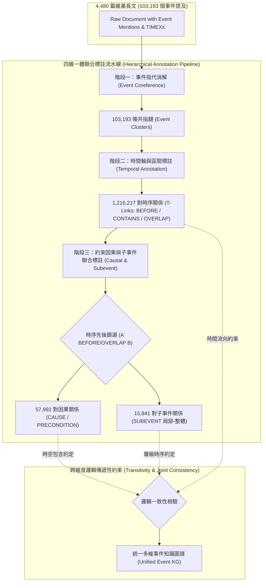

# MAVEN-ERE: A Unified Large-scale Dataset for Event Coreference, Temporal, Causal, and Subevent Relation Extraction

> [!INFO] 論文元數據 (Metadata)
> - **Paper ID**：`Wang2022_MAVENERE`
> - **作者**：Xiaozhi Wang, Yulin Chen, Ning Ding, Hao Peng, Zimu Wang, Yankai Lin, Xu Han, Lei Hou, Juanzi Li, Zhiyuan Liu, Peng Li, Jie Zhou (Tsinghua University, Xi'an Jiaotong-Liverpool University, Renmin University of China, WeChat AI)
> - **預印本初次發布年份 (Preprint)**：2022
> - **正式發表年份 / 會議或期刊 (Venue)**：EMNLP 2022 Main Conference (Pages 926–941)
> - **DOI**：10.18653/v1/2022.emnlp-main.60
> - **arXiv**：[2211.07342](https://arxiv.org/abs/2211.07342)
> - **代碼與資料庫**：[THU-KEG/MAVEN-ERE](https://github.com/THU-KEG/MAVEN-ERE)
> - **驗證狀態**：`verified` (基於原始論文 PDF 全文核實)
> - **本地 PDF 連結**：[[Papers/04 - Knowledge & Graph RAG/(EMNLP 2022-12) MAVEN-ERE - A Unified Large-scale Dataset for Event Coreference, Temporal, Causal, and Subevent Relation Extraction.pdf|開啟本地 PDF 檔案]]

---

## 一話摘要 (TL;DR)
**MAVEN-ERE 構建了自然語言處理領域首個達到百萬級規模的統一事件關係抽取（ERE）基準資料集，在 4,480 篇維基百科文檔上同時標註跨事件指代（Coreference）、時序關係（Temporal）、因果關係（Causal）與子事件層級（Subevent）四大關係維度，揭示了跨維度邏輯傳遞性約束對複雜事件圖譜構建與長程推理的關鍵作用。**

---

## 研究背景與問題定義 (Problem Statement)

理解現實世界中事件與事件之間的複雜關聯，是自然語言理解、因果推斷與長文本知識抽取的基石。然而，過去的事件關係抽取（Event Relation Extraction, ERE）研究長期受到兩大嚴峻瓶頸的桎梏：
1. **資料規模極小（Small Scale）**：
   - 由於標註事件間關係需要閱讀整篇長文並對成對事件進行多維判斷，人工成本極其昂貴。先前的時序（如 MATRES、TCR）或因果資料集（如 Causal-TB、EventStoryLine）僅包含數十至數百篇文檔，關係實例數通常在幾百到數千對之間，極易導致神經網路過擬合。
2. **關係孤立分割標註（Isolated Task Annotation）**：
   - 先前研究通常將事件指代、時序排序、因果關係和子事件階層完全割裂為獨立任務分別標註在不同語料上。然而在物理真實世界中，這些關係存在本質的內在耦合與時空傳遞性約束（例如：若事件 $A$ 是事件 $B$ 的因，則 $A$ 在時間上必須先於或重疊於 $B$；若 $B$ 是 $A$ 的子事件，則 $A$ 在時空區間上必然包含 $B$）。割裂的資料集使得模型無法學習跨維度聯合推理能力。

---

## 核心方法與技術架構 (Methodology & Architecture)

### 1. 四大統一事件關係維度 (Section 2, Page 3-5)
基於通用事件檢測基準 MAVEN 的 4,480 篇英文維基百科文章與 103,193 個事件提及（Event Mentions），MAVEN-ERE 統一建立了四類核心關係標註：
1. **事件指代關係（Event Coreference）**：
   - 識別篇章內不同句子中指向現實同一物理事件的觸發詞提及，產出完整的事件共指鏈（Coreference Chains）。
2. **時序關係（Temporal Relations, T-Links）**：
   - 同時考慮事件與時間表達式（TIMEXs），標註四類嚴謹時序：`BEFORE`、`CONTAINS`、`OVERLAP`、`SIMULTANEOUS`。為降低標註量，引入基於時間軸的區間邊界標註法。
3. **因果關係（Causal Relations, C-Links）**：
   - 標註具備明確因果鏈條的關係，分為：`CAUSE`（直接導致）與 `PRECONDITION`（必要先決條件）。
4. **子事件關係（Subevent Relations）**：
   - 識別事件之間的整體與局部組成關係（`A SUBEVENT B`），表示事件 $A$ 是複雜宏觀事件 $B$ 的組成部分，且時空上受 $B$ 包含。

### 2. 關係傳遞性推理與層級標註流水線 (Section 2, Page 2-5)
為了使標註代價可控，作者設計了嚴謹的多階段層級標註流程，充分利用物理世界的**傳遞性邏輯規則（Transitivity Rules）**自動推導關係：
- **階段一：事件指代消解**：將共指事件聚合成 Cluster，後續關係標註直接在 Event Cluster 層級進行，避免組合爆炸。
- **階段二：時間軸標註與時序傳遞**：利用時間錨點標註時序，88.8% 的長距離時序關係由傳遞閉包（Transitivity Closure）自動推導。
- **階段三：因果與子事件聯合標註**：
  - 限制因果標註必須在時序上滿足 $A \text{ BEFORE/OVERLAP } B$。
  - 利用子事件與因果的傳遞性補全關係（例如：若 $A \text{ CAUSES } B$ 且 $C \text{ SUBEVENT } B$，則推導 $A \text{ CAUSES } C$ 的候選）。

#### 圖中節點對照 (Node Reference Table)
| 節點代號 | 模組名稱 | 關鍵作用與運算機制 |
| :--- | :--- | :--- |
| `DOC` | 標註原始文件 | 4,480 篇涵蓋歷史、軍事、政治等多領域長文 |
| `STAGE1` | 事件指代消解 | 聚合篇章內不同同義觸發詞為單一事件實體 |
| `STAGE2` | 時間軸標註 | 結合 TIMEX 時間表達式建立事件區間並傳遞推導 |
| `STAGE3` | 因果與子事件標註 | 在嚴格時序約束下判別因果推進與局部細節 |
| `TRANS` | 邏輯一致性檢驗 | 消除違反物理因果與時間倒流的矛盾關係邊 |
| `KG` | 多維事件圖譜 | 供 RAG 與因果推理系統調用的結構化事件網路 |

---

## 主要實驗結果與證據 (Empirical Results & Evidence)

### 1. 資料集規模全面超越既有基準 (Table 1~5, Page 3-5)
- **文檔規模**：4,480 篇文檔，平均每篇包含 23.0 個事件提及。
- **事件指代（Table 2）**：103,193 條事件指代鏈（超過 KBP 的 14 倍）。
- **時序關係（Table 3）**：**1,216,217** 對時序關係（相比 MATRES 的 13k 對，擴大近 **90 倍**，且每百詞包含 95.3 對時序關係）。
- **因果關係（Table 4）**：**57,992** 對因果關係（相比 Causal-TB 的 318 對擴大 **180 倍**，相比 EventStoryLine 的 4,370 對擴大 **13 倍**）。
- **子事件關係（Table 5）**：**15,841** 對子事件關係（相比 HiEve 的 3,745 對擴大 **4.2 倍**）。

### 2. 基準模型預測表現（RoBERTa-base, Table 7 & Table 8, Page 7）
在標準劃分（Train / Dev / Test）上使用預訓練語言模型 RoBERTa-base 進行實證評估：
- **事件共指消解（Table 7, Page 7）**：
  - MUC F1: 82.5%
  - $B^3$ F1: 85.1%
  - $\text{CEAF}_e$ F1: 79.4%
  - BLANC F1: 76.8%
  - 平均得分（Avg F1）：**80.95%**
- **時序、因果與子事件關係抽取 F1（Table 8, Page 7）**：
  - **時序關係（Temporal）**：Precision = 58.74%, Recall = 54.49%, **F1 = 56.54%**
  - **因果關係（Causal）**：Precision = 31.84%, Recall = 30.63%, **F1 = 31.22%**
  - **子事件關係（Subevent）**：Precision = 28.52%, Recall = 26.96%, **F1 = 27.72%**
- **實驗分析（Page 7-8）**：
  - 即使資料集規模擴大百倍，因果關係（31.2% F1）與子事件關係（27.7% F1）的抽取難度依然極高，模型主要錯誤在於無法區分弱關聯與直接因果，顯示現有語言模型在深層因果常識推理上的顯著局限。

### 3. 模型預測錯誤類型分佈 (Table 10, Page 8)
- **時序關係**：False Positive 佔 38.78%，類型判定錯誤佔 53.75%。
- **因果關係**：False Positive 佔 37.73%，類型判定錯誤佔 **59.88%**（主要混淆了 CAUSE 與 PRECONDITION）。
- **子事件關係**：False Positive 佔 48.64%，方向性/層級判斷錯誤佔 51.36%。

---

## 優勢、限制及 Trade-offs (Strengths, Limitations & Trade-offs)

### 1. 技術優勢
- **首個百萬級四合一事件關係語料**：徹底打破了以往 ERE 領域資料規模過小無法訓練深層神經網路的歷史僵局。
- **嚴謹的跨維度物理約束**：透過引入時序過濾與傳遞性閉包，保證了事件圖譜中因果與層級關係的高度邏輯一致性。
- **覆蓋長距離篇章級關係**：包含大量跨段落、跨數百詞的遠程時序與因果鏈，非常貼近真實長文本處理場景。

### 2. 限制與代價 (Limitations & Trade-offs)
- **領域集中於維基百科**：文章以百科敘事風格為主，在新聞快訊、法律合約或口語對話場景中的遷移效果仍需驗證。
- **因果判定主觀性較高**：儘管定義了嚴格規範，隱式因果（Implicit Causality）的標註者間一致性仍低於實體或時序標註。

---

## 對本專案研究領域的實際意義 (Implications for Research Domains)

1. **對 D03 (Knowledge Extraction & Consolidation) 的核心支撐**：
   - 標誌著知識抽取從「靜態實體-關係三元組（Entity-Relation Triplets）」全面躍遷至「**動態事件時空與因果網路（Event Spatiotemporal & Causal Networks）**」。
   - 為跨塊整合（Cross-chunk Consolidation）提供了現成的標準化關係字典（Temporal, Causal, Subevent, Coreference），是消除碎片化孤立事件的關鍵骨幹。
2. **對 D08 (Evidence Reconciliation) 與時序衝突的價值**：
   - 提供了精準的 `BEFORE` / `CONTAINS` 時序與時間表達式錨點，使 RAG 系統在面對時序演進事實時具備底層推斷能力，防止將不同年份的事件錯誤混淆為邏輯矛盾。
3. **對 GraphRAG 與長程多跳問答的啟發**：
   - 傳統 GraphRAG 只建立實體共現或無類型邊；MAVEN-ERE 證明將圖節點定義為 Event、圖邊定義為 Causal/Subevent/Temporal，可大幅增強複雜多跳因果問答的推理能力。

---

## 原始來源及相關筆記連結 (Sources & Related Notes)

- **本地文獻**：[[Papers/04 - Knowledge & Graph RAG/(EMNLP 2022-12) MAVEN-ERE - A Unified Large-scale Dataset for Event Coreference, Temporal, Causal, and Subevent Relation Extraction.pdf|開啟本地 PDF 檔案]]
- **相關理論專題**：
  - [[02 - 研究領域專題 (Research Domains)/Domain 03 - Knowledge Extraction & Information Preservation|D03 Knowledge Extraction & Consolidation]]
  - [[02 - 研究領域專題 (Research Domains)/Domain 08 - Evidence Reconciliation & Conflict Resolution|D08 Evidence Reconciliation]]
  - [[02 - 研究領域專題 (Research Domains)/Domain 13 - RAG Evaluation & Failure Attribution|D13 RAG Evaluation & Failure Attribution]]
- **同系列相關論文**：
  - [[03 - 論文庫 (Literature Notes)/04 - Knowledge & Graph RAG/(EMNLP 2020-11) MAVEN - A Massive General Domain Event Detection Dataset|MAVEN]] (大規模通用領域事件檢測前身基準)
  - [[03 - 論文庫 (Literature Notes)/04 - Knowledge & Graph RAG/(EMNLP 2019-11) Entity, Relation, and Event Extraction with Contextualized Span Representations|DyGIE++]] (跨句圖傳播多任務抽取)
  - [[03 - 論文庫 (Literature Notes)/04 - Knowledge & Graph RAG/(ACL 2020-07) A Joint Neural Model for Information Extraction with Global Features|OneIE]] (全局特徵導向端到端圖抽取)
