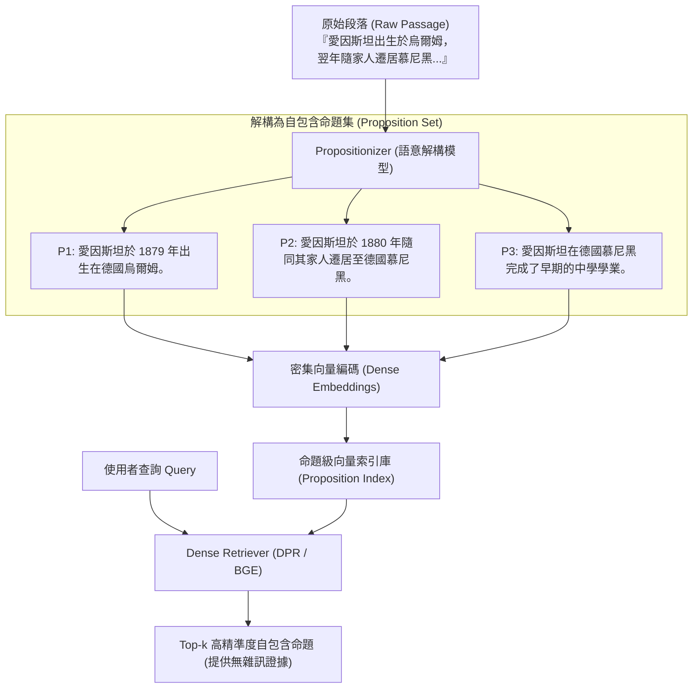

# Dense X Retrieval: What Retrieval Granularity Should We Use?

> [!INFO] 論文元數據 (Metadata)
> - **Paper ID**：`Chen2024_DenseX`
> - **作者**：Tong Chen, Hongwei Wang, Sihao Chen, Wenhao Yu, Kaixin Ma, Xinran Zhao, Hongming Zhang, Dong Yu
> - **預印本初次發布年份 (Preprint)**：2023
> - **正式發表年份 / 會議或期刊 (Venue)**：2024 (EMNLP 2024)
> - **DOI**：10.18653/v1/2024.emnlp-main.845
> - **arXiv**：[2312.06648](https://arxiv.org/abs/2312.06648)
> - **驗證狀態**：`verified` (已比對原始文獻與 PDF 全文)
> - **本地 PDF 連結**：[[Papers/04 - Knowledge & Graph RAG/(EMNLP 2024-11) Dense X - Exploring the Limit of Proposition Retrieval for Open-Domain QA.pdf|開啟本地 PDF 檔案]]
---

## 一話摘要 (TL;DR)
**系統比較 document / passage / sentence / proposition 等 retrieval granularity，並提出以自包含 proposition 作為細粒度 retrieval unit；實驗顯示在其測試設定下可改善 retrieval 與 downstream QA。**

---

## 研究背景與問題定義 (Problem Statement)
傳統以固定字數或段落邊界為檢索單元（Retrieval Unit）存在本質缺陷：大 Chunk 包含大量與查詢無關的干擾雜訊；小 Chunk 則抽離了所屬語境，導致代詞指代不明、條件遺失。

---

## 核心方法與技術架構 (Methodology & Architecture)
提出將檢索粒度下沉至**命題（Proposition）**層級：
1. **命題定義（Three Axiomatic Properties）**：
   - **原子性（Atomic Fact）**：表達一個單一不可再分的事實；
   - **語意自足性（Self-Contained）**：以簡潔自然語言表達單一 distinct factoid，使 proposition 可獨立作為 retrieval unit。
2. **Propositionizer 模型**：
   - 透過兩步驟提示（Prompting）與微調的開源模型，將維基百科段落轉換為命題集合；
3. **密集檢索評估（Dense X）**：
   - 使用不同的神經檢索器（Dense Retriever，如 DPR、Contriever、BGE）對命題索引進行檢索比對。

---

## 主要實驗結果與證據 (Empirical Results & Evidence)
> [!NOTE] 關鍵實證數據與評估條件
> **出處與評估條件**：Table 2 (Page 6): 在 5 個開放領域問答基準（Natural Questions, TriviaQA, WebQuestions, SQuAD, EntityQuestions）上，命題級檢索在多種 Retriever 下全面超越 100-word 與 200-word 傳統固定切塊；檢索到的無關噪聲大幅降低，下游生成模型的 QA 準確率提升達 1.5%~2.5%。

---

## 優勢、限制及 Trade-offs (Strengths, Limitations & Trade-offs)
- **優勢**：在論文測試條件下，細粒度 proposition indexing 可提升 retrieval 與部分 downstream QA；較短且自包含的 unit 也可降低 passage 內無關資訊。
- **限制**：每個段落拆解出多個命題，導致向量資料庫索引規模膨脹 5–10 倍；抽離了宏觀因果論證與段落層次結構；離線處理計算成本顯著高於純字數切塊。

---

## 在長文件處理任務中的角色與啟發 (Implications for Long-Doc Processing)
此工作直接研究 retrieval granularity，說明 proposition 可以是 passage / sentence 之外的另一種 retrieval unit；它不代表 proposition 必然取代其他 chunking 或 representation 方法。

---

## 原始來源及相關筆記連結 (Sources & Related Notes)
- **所屬研究領域**：
  - [[02 - 研究領域專題 (Research Domains)/Domain 02 - Segmentation & Contextualization|D02 Segmentation & Contextualization]]
  - [[02 - 研究領域專題 (Research Domains)/Domain 03 - Knowledge Extraction & Information Preservation|D03 Knowledge Extraction & Information Preservation]]
  - [[02 - 研究領域專題 (Research Domains)/Domain 04 - Knowledge Representation & Indexing|D04 Knowledge Representation & Indexing]]
- **回主目錄**：[[00 - 導覽與心智圖 (Navigation & MOC)/Home (主目錄與知識庫導覽)|主目錄與知識庫導覽]]
- **全景心智圖**：[[00 - 導覽與心智圖 (Navigation & MOC)/RAG System Maps|RAG System Maps]]
