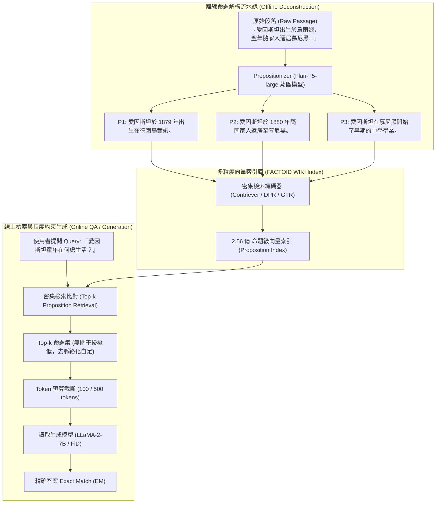

# Dense X Retrieval: What Retrieval Granularity Should We Use?

> [!INFO] 論文元數據 (Metadata)
> - **Paper ID**：`Chen2024_DenseX`
> - **作者**：Tong Chen, Hongwei Wang, Sihao Chen, Wenhao Yu, Kaixin Ma, Xinran Zhao, Hongming Zhang, Dong Yu (University of Washington, Tencent AI Lab, UPenn, CMU)
> - **預印本初次發布年份 (Preprint)**：2023
> - **正式發表年份 / 會議或期刊 (Venue)**：EMNLP 2024 Main Conference (Pages 15000–15018)
> - **DOI**：10.18653/v1/2024.emnlp-main.845
> - **arXiv**：[2312.06648](https://arxiv.org/abs/2312.06648)
> - **驗證狀態**：`verified` (基於原始論文 PDF 全文核實)
> - **本地 PDF 連結**：[[Papers/04 - Knowledge & Graph RAG/(EMNLP 2024-11) Dense X - Exploring the Limit of Proposition Retrieval for Open-Domain QA.pdf|開啟本地 PDF 檔案]]

---

## 一話摘要 (TL;DR)
**Dense X 系統性探討密集檢索單元粒度對 Open-Domain QA 與檢索泛化性的深層影響，提出「自包含命題（Proposition）」作為兼具最小語義完整性與去脈絡化自足性的檢索單位，並建構包含 2.5 億命題的 FACTOID WIKI，在無監督密集檢索下展現超越傳統 100-word Passage 的顯著檢索回確率與問答準確度。**

---

## 研究背景與問題定義 (Problem Statement)

在開放領域問答（Open-Domain QA）與 RAG 系統中，檢索索引的切塊粒度（Retrieval Granularity）長期由工程慣例（如 DPR 的固定 100-word Passage 或以換行分段）主導，缺乏系統性的理論與實證探討：
1. **Passage 粒度的雜訊冗餘**：傳統 100-word 或長段落包含大量與特定事實問題無關的上下文，導致檢索器注意力分散，且在有限 Context 預算（如 100~500 tokens）下浪費寶貴的輸入空間。
2. **Sentence 粒度的語義破碎與代名詞指代失真**：雖然單句長度短，但自然語言中的句子高度依賴篇章上下文（例如大量「他」、「此事件」、「該組織」等代名詞與隱含條件），若直接以 Sentence 作為檢索單元，會導致嚴重的代詞脫落（Lack of Coreference）與條件遺失。
3. **語意知識單元與檢索單元的對齊矛盾**：如何定義一種既像「句子」一樣精練無雜訊，又具備「段落」層級自足上下文（Self-contained Context）的語意檢索單元？

---

## 核心方法與技術架構 (Methodology & Architecture)

### 1. 命題（Proposition）的三大公理化定義 (Three Axiomatic Principles)
Dense X 借鑑認知語言學與事實驗證文獻，將命題定義為文字語義的最小原子表達（Atomic Expression of Meaning），必須嚴格滿足三大原則（Section 2, Page 3）：
- **語意覆蓋完備性（Representing Semantics）**：每個命題表達一個獨立的意義片斷，所有命題的集合能夠完整重構原始段落的完整語意。
- **不可再分極小性（Minimal）**：命題本身不可再被拆分為多個彼此獨立的子命題。
- **語意自足與去脈絡化（Contextualized and Self-Contained）**：命題必須補全所有必要的上下文資訊（特別是指代消解 Coreference Resolution 與實體全稱替換），即使脫離原始文章亦能被獨立解讀且無歧義。

### 2. 命題抽取流水線與 Propositionizer 蒸餾 (Section 3, Page 3)
為了克服逐篇調用前沿大模型成本高昂的瓶頸，作者採用兩階段蒸餾法構建輕量級命題抽取器 **Propositionizer**：
1. **教師模型冷啟動標註**：
   - 使用 GPT-4 配合精心設計的 1-shot Demonstration 與命題定義 Prompt，對 42,000 個 Wikipedia 段落進行命題解構，產出高品質的 (Passage $\to$ Propositions) 種子對齊資料。
2. **學生模型微調（Student Distillation）**：
   - 以該 42k 種子集合對 `Flan-T5-large` 進行序列到序列微調，產出可高吞吐離線運行的 **Propositionizer** 模型。
3. **全量 FACTOID WIKI 語料庫構建**：
   - 將整個英文維基百科拆解並索引為三種不同粒度：Passage、Sentence 與 Proposition（Table 1, Page 3）：
     - **Passages**：41,393,528 個（平均長度 58.5 words）
     - **Sentences**：114,219,127 個（平均長度 21.0 words）
     - **Propositions**：256,885,003 個（平均長度 11.2 words）

```mermaid
flowchart TD
    subgraph offline_decomp["離線命題解構流水線 (Offline Deconstruction)"]
        RAW["原始段落 (Raw Passage)<br/>『愛因斯坦出生於烏爾姆，翌年隨家人遷居慕尼黑...』"]
        PROP["Propositionizer (Flan-T5-large 蒸餾模型)"]
        RAW --> PROP
        PROP --> P1["P1: 愛因斯坦於 1879 年出生在德國烏爾姆。"]
        PROP --> P2["P2: 愛因斯坦於 1880 年隨同家人遷居至慕尼黑。"]
        PROP --> P3["P3: 愛因斯坦在慕尼黑開始了早期的中學學業。"]
    end

    subgraph indexing_stage["多粒度向量索引庫 (FACTOID WIKI Index)"]
        P1 --> DENSE_ENC["密集檢索編碼器 (Contriever / DPR / GTR)"]
        P2 --> DENSE_ENC
        P3 --> DENSE_ENC
        DENSE_ENC --> P_IDX["2.56 億 命題級向量索引 (Proposition Index)"]
    end

    subgraph online_retrieval["線上檢索與長度約束生成 (Online QA / Generation)"]
        QUERY["使用者提問 Query: 『愛因斯坦童年在何處生活？』"]
        QUERY --> RET["密集檢索比對 (Top-k Proposition Retrieval)"]
        P_IDX --> RET
        RET --> TOPP["Top-k 命題集 (無關干擾極低，去脈絡化自足)"]
        TOPP --> BUD["Token 預算截斷 (100 / 500 tokens)"]
        BUD --> LLM["讀取生成模型 (LLaMA-2-7B / FiD)"]
        LLM --> ANS["精確答案 Exact Match (EM)"]
    end
```

#### 圖中節點對照 (Node Reference Table)
| 節點代號 | 模組名稱 | 關鍵作用與運算機制 |
| :--- | :--- | :--- |
| `RAW` | 原始非結構化段落 | 未經清洗與指代處理的自然段落（平均 58.5 詞） |
| `PROP` | Propositionizer | 經 GPT-4 標註 42k 樣本蒸餾的 Flan-T5-large 抽取器 |
| `P1` ~ `P3` | 自包含原子命題 | 經指代還原、去除冗餘副詞的自足命題（平均 11.2 詞） |
| `P_IDX` | FACTOID WIKI 命題庫 | 包含 256,885,003 條命題的大規模向量索引 |
| `RET` | 密集檢索器 | 支持無監督（Contriever, SimCSE）與監督式（DPR, GTR） |
| `BUD` | 計算預算約束器 | 嚴格控制 Top-k 命題注入 Prompt 的總 Token 預算 |
| `LLM` | 下游讀取與生成器 | 測試 FiD 與 LLaMA-2-7B 4-shot In-Context Learning |

---

## 主要實驗結果與證據 (Empirical Results & Evidence)

### 1. 命題生成品質人工評估 (Table 2, Page 4)
隨機抽取 50 個段落進行人工抽檢，檢驗生成命題的失真與錯誤率：
- **不忠實（Not Faithful）**：GPT-4 為 0.7% (3/408)，Propositionizer 為 1.3% (6/445)。
- **非極小原子（Not Minimal）**：GPT-4 為 2.9% (12/408)，Propositionizer 為 2.0% (9/445)。
- **非獨立自足（Not Stand-alone）**：GPT-4 為 4.9% (20/408)，Propositionizer 為 3.1% (14/445)。
- **結論**：小模型經過蒸餾後，在自足性與原子性上甚至超越 GPT-4，忠實度極高。

### 2. 檢索效能（Passage Retrieval Recall@k, Table 3, Page 5）
在 5 個開放領域問答資料集（NQ, TriviaQA, WebQ, SQuAD, EntityQuestions）上評測不同粒度的檢索表現（若命題命中正確答案所屬段落即計為命中）：
- **無監督檢索器（Contriever）**：
  - **Passage**：平均 Recall@5 = 43.0%，Recall@20 = 62.8%
  - **Sentence**：平均 Recall@5 = 47.3%，Recall@20 = 66.1%
  - **Proposition**：平均 Recall@5 = **52.7%**，Recall@20 = **70.5%**
  - **提升幅度**：命題檢索相較於 Passage 檢索在 Recall@5 上取得 **+9.7% 絕對提升**（相對提升高達 22.5%）。
- **無監督檢索器（SimCSE）**：
  - **Passage**：平均 Recall@5 = 34.3%
  - **Proposition**：平均 Recall@5 = **46.3%**（**+12.0% 絕對提升**）。
- **監督式檢索器（DPR & GTR）**：
  - **DPR**：Passage 平均 Recall@5 = 57.3% $\to$ Proposition = **59.9%**。
  - **GTR**：Passage 平均 Recall@5 = 65.2% $\to$ Proposition = **68.0%**。
  - **分析**：即使監督模型主要在 Passage 粒度上預訓練，命題檢索仍能一致取得 2.6%~2.8% 的 Recall 提升；在非分布（OOD）與實體密集（EntityQuestions）任務上提升尤為顯著（EQ 上 GTR Recall@5 從 71.7% 躍升至 74.9%）。

### 3. 下游 Open-Domain QA 問答效果 (Table 4, Page 6 & Table 5, Page 8)
在相同輸入 Token 長度預算限制下（EM@100 tokens 與 EM@500 tokens），利用 LLaMA-2-7B 與 FiD 生成答案：
- **LLaMA-2-7B 在 Contriever 檢索設定下（Table 5, Page 8）**：
  - **100 tokens 預算（NQ 資料集）**：Passage EM = 16.9 $\to$ Sentence EM = 20.3 $\to$ Proposition EM = **22.5**（**+5.6% 顯著增長**）。
  - **100 tokens 預算（TQA 資料集）**：Passage EM = 42.0 $\to$ Sentence EM = 48.7 $\to$ Proposition EM = **51.8**（**+9.8% 顯著增長**）。
  - **結論**：在給定極有限上下文預算下，命題因為資訊密度極高且去除了段落雜訊，讓生成模型能閱讀到更多樣化、高精準度的外部實體證據。

---

## 優勢、限制及 Trade-offs (Strengths, Limitations & Trade-offs)

### 1. 技術優勢
- **極致的語意去脈絡化**：將主語全稱與時空條件融入命題中，徹底消除了段落截斷導致的代詞指代模糊問題。
- **大幅縮小檢索無關雜訊**：在固定輸入長度下，檢索器注入 LLM 上下文的「單位 Token 資訊純度」大幅提高。
- **對無監督檢索模型極度友好**：無監督檢索器（如 Contriever、SimCSE）通常難以在長段落中聚焦關鍵事實，細粒度命題極大地降低了語義匹配難度。

### 2. 限制與工程代價 (Engineering Trade-offs)
- **向量資料庫索引規模膨脹（5~6 倍）**：維基百科從 4,100 萬段落激增至 2.56 億條命題，儲存成本、記憶體消耗與 ANN 檢索延遲顯著增加。
- **整體論證邏輯與長程結構丟失**：命題抽取將文本「粉碎」為獨立事實，喪失了原作者的修辭結構、論證推導順序以及跨句因果推導脈絡。
- **離線抽取開銷高昂**：對大規模長文件進行 Propositionizer 處理需要大量的 GPU 離線推論資源。

---

## 對本專案研究領域的實際意義 (Implications for Research Domains)

1. **D02 (Segmentation & Retrieval Granularity) 的里程碑**：
   - 確證了「檢索單元粒度」是除模型架構外影響 RAG 表現最深遠的變量之一。證明了在 Factoid QA 與事實密集檢索場景中，Proposition 顯著優於固定 Token/Sentence 切塊。
2. **D03 (Knowledge Extraction & Semantic Units) 的關鍵延伸**：
   - 突破了傳統抽取「必須對齊特定 Schema / 實體分類」的枷鎖。Propositionizer 提供了一種**非限制性、自然語言形式的語意抽取單元**，完美兼顧了信息保真（Information Preservation）與指代還原。
3. **在長文件與圖譜構建中的串聯角色**：
   - 命題可作為構建超大規模知識圖譜（GraphRAG）、命題路徑搜尋（PropRAG）或原子事實核驗（FActScore）的理想前端結構。

---

## 原始來源及相關筆記連結 (Sources & Related Notes)

- **本地文獻**：[[Papers/04 - Knowledge & Graph RAG/(EMNLP 2024-11) Dense X - Exploring the Limit of Proposition Retrieval for Open-Domain QA.pdf|開啟本地 PDF 檔案]]
- **相關理論專題**：
  - [[02 - 研究領域專題 (Research Domains)/Domain 02 - Segmentation & Contextualization|D02 Segmentation & Contextualization]]
  - [[02 - 研究領域專題 (Research Domains)/Domain 03 - Knowledge Extraction & Information Preservation|D03 Knowledge Extraction & Consolidation]]
  - [[02 - 研究領域專題 (Research Domains)/Domain 05 - Query Understanding & Retrieval|D05 Query Understanding & Retrieval]]
- **同系列相關論文**：
  - [[03 - 論文庫 (Literature Notes)/06 - Benchmarks & Evaluation/(EMNLP 2023-12) FActScore - Fine-grained Atomic Evaluation of Factual Precision in Long Form Text Generation|FActScore]] (原子事實解構與長文本事實精準度評估)
  - [[03 - 論文庫 (Literature Notes)/04 - Knowledge & Graph RAG/(EMNLP 2025-11) PropRAG - Guiding Retrieval with Beam Search over Proposition Paths|PropRAG]] (基於命題路徑束搜尋的檢索增強生成)
