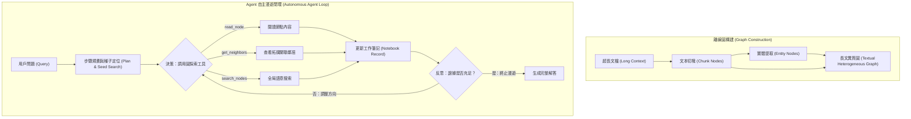

# GraphReader: Building Graph-based Agent to Enhance Long-Context Abilities of Large Language Models

## 一話摘要 (TL;DR)
GraphReader 提出將超長文本結構化為包含區塊節點、關鍵實體與章節導航的圖結構，並由自主 Agent 透過一套預定義工具函數（讀取節點、探索鄰居、反思筆記）在圖上執行「由粗到細（Coarse-to-Fine）」的自主漫遊探索，僅需 4k 甚至更小的上下文視窗即可在 LongBench 與 LV-Eval 基準上全面超越具備 128k 超長上下文的原生 LLM。

---

## 研究背景與問題定義 (Problem Statement)
現有處理超長文本（Long Context）的兩大主流技術各有顯著侷限：
1. **長上下文 LLM（Native Long-Context LLMs）的注意力稀釋**：雖然視窗可擴展至 128k 或 1M tokens，但面對分散在不同段落的多跳關聯時，依然存在「迷失在中間（Lost-in-the-Middle）」與關鍵事實檢索失敗的缺陷，且單次推論的 KV Cache 顯存開銷與延遲隨長度平方級或線性激增。
2. **被動式檢索（Passive RAG）的盲目檢索**：傳統 RAG 一次性撈取 Top-$k$ 片段，無法根據中間閱讀獲得的新線索動態調整搜尋目標，面對複雜多跳推理時往往缺乏完整證據鏈。
3. **缺乏反思與漫遊機制**：缺乏如同人類閱讀長篇專著時「查看目錄 $\rightarrow$ 翻閱章節 $\rightarrow$ 記錄筆記 $\rightarrow$ 順藤摸瓜跳轉關聯段落」的主動認知架構。

---

## 核心方法與技術架構 (Methodology & Architecture)

GraphReader 構建了**圖拓撲構建（Graph Construction）** 與 **自主 Agent 漫遊推理（Autonomous Agent Exploration）** 的兩大核心機制：
1. **長文圖構建（Long-Context Graph Construction）**：
   - 將長文劃分為文本區塊節點（Chunk Nodes）；
   - 提取關鍵實體節點（Entity Nodes），並建立「文本塊包含實體」、「實體間關係」及「相鄰文本塊時間序」邊；
   - 構建章節目錄樹狀導航邊。
2. **Agent 預定義圖探索函數（Predefined Exploration Functions）**：
   - `read_node(node_id)`：閱讀指定節點的完整文字內容；
   - `get_neighbors(node_id)`：探索該節點相連的實體與區塊清單；
   - `search_nodes(query)`：在全局圖節點中進行語意搜索定位種子；
3. **由粗到細的漫遊與反思工作流（Coarse-to-Fine Exploration Workflow）**：
   - **規劃階段（Planning）**：分析問題，制定初步探索計畫；
   - **探索與記錄階段（Exploration & Notebook）**：Agent 調用工具讀取節點，將關鍵線索記錄至工作記憶筆記（Notebook）；
   - **自我反思階段（Reflection）**：根據當前收集到的事實評估是否足以回答問題；若不足則基於新線索生成下一步探索指令，直至完成多跳鏈路閉環。

### 圖中節點對照
- `GRAPH`：結合結構目錄、實體邊與時序邊的長文異質圖。
- `ACT`：Agent 根據目前筆記動態調用的圖操作工具集。
- `NOTE`：記錄探索過程獲取之原子事實的外部暫存區。
- `REFLECT`：判斷資訊是否自足的認知評估單元。

---

## 主要實驗結果與證據 (Empirical Results & Evidence)

論文在長文本標準基準 LongBench（包含 HotpotQA, 2WikiMultiHopQA, MuSiQue, NarrativeQA）以及極限長度基準 LV-Eval（長度達 16k–256k）上進行了廣泛評測。

### 1. LongBench 評測結果 (Table 2, Page 6)
在固定 4k 輸入視窗下，GraphReader 展現出跨越長度限制的強大推理能力：
- **HotpotQA**：Exact Match (EM) 達到 **55.0%**，F1 達到 **70.0%**（LR-1: 84.3%, LR-2: 89.7%）。
- **2WikiMultiHopQA**：EM 達到 **59.3%**，F1 達到 **70.1%**。
- **MuSiQue**：EM 達到 **38.0%**，F1 達到 **47.4%**。
- **NarrativeQA**：EM 達到 **15.5%**，F1 達到 **29.8%**（LR-1: 65.0%, LR-2: 80.0%）。
- **對比原生長上下文模型**：GraphReader 顯著超越直接輸入全篇長文的 GPT-4-128k、Llama-3-70B-Gradient-1048k，並以更低成本擊敗了同為 Agent 架構的 ReadAgent。

### 2. LV-Eval 極限長度基準 (Table 3, Page 6)
在 16k 至 256k 的極端長文本中（使用優化指標 F1*）：
- 16k 長度：F1* 達到 **38.2%**；
- 32k 長度：F1* 達到 **36.4%**；
- 64k 長度：F1* 達到 **32.9%**；
- 128k 長度：F1* 達到 **30.6%**；
- 256k 長度：F1* 達到 **33.0%**。
- 證明 GraphReader 在上下文長度從 16k 激增至 256k 時，表現曲線保持極度平穩，未出現傳統長文本模型的嚴重性能崩塌。

---

## 優勢、限制及 Trade-offs (Strengths, Limitations & Trade-offs)

### 優勢
1. **擺脫超大視窗與巨額硬體綁定**：僅需 4k 上下文視窗的常規推理引擎即可處理 256k+ 的超長專著與多篇章檔案，推理硬體門檻大幅降低。
2. **長上下文設定下維持一定效能**：論文在 256k 長度設定報告 F1* 33.0%，顯示 graph-based agent traversal 在該 benchmark 下能緩解部分長上下文處理限制；不能解讀為已普遍解決長序列位置或注意力衰減問題。
3. **推導過程完全可審計**：Agent 的每次 tool call、漫遊節點軌跡與工作筆記均完整保留，提供了白盒化的推論鏈條。

### 限制與 Trade-offs
1. **多輪互動累積的延遲**：Agent 需要進行 3–8 輪思考、工具調用與反思，整體問答延遲高於單次前向傳播的 Naive RAG。
2. **對 Agent 推理規劃能力的要求高**：若底層 Agent 決策模型較弱（如小尺寸模型），可能陷入無效循環調用或過早終止探索。

---

## 對本專案研究領域的實際意義 (Implications for Research Domains)
1. **對 D04/D05 (Hierarchical Representation & Retrieval) 與 D12 (Agentic RAG & Orchestration) 的融合啟示**：證明了「圖結構化存儲 + Agent 主動探索」是超越純向量檢索與純長文本窗口的最具擴展性範式。
2. **對企業長篇調查報告產生的指引**：在分析數百頁的企業年報、訴訟判決或招標規格書時，GraphReader 提供了主動收集散落證據、邊讀邊記筆記並最終彙總的標準工業落地參考。

---

## 原始來源及相關筆記連結 (Sources & Related Notes)
- 原始論文 PDF：[[Papers/04 - Knowledge & Graph RAG/(EMNLP 2024-11) GraphReader - Building Graph-based Agent to Enhance Long-Context Abilities of Large Language Models.pdf|開啟本地 PDF]]
- arXiv 永久連結：[arXiv:2406.14550](https://arxiv.org/abs/2406.14550)
- 關聯專題領域：[[02 - 研究領域專題 (Research Domains)/Domain 04 - Knowledge Representation & Indexing|D04 Knowledge Representation & Indexing]]、[[02 - 研究領域專題 (Research Domains)/Domain 04 - Knowledge Representation & Indexing|D04 Knowledge Representation & Indexing]]、[[02 - 研究領域專題 (Research Domains)/Domain 12 - Agentic RAG & Orchestration|D12 Agentic RAG & Orchestration]]
