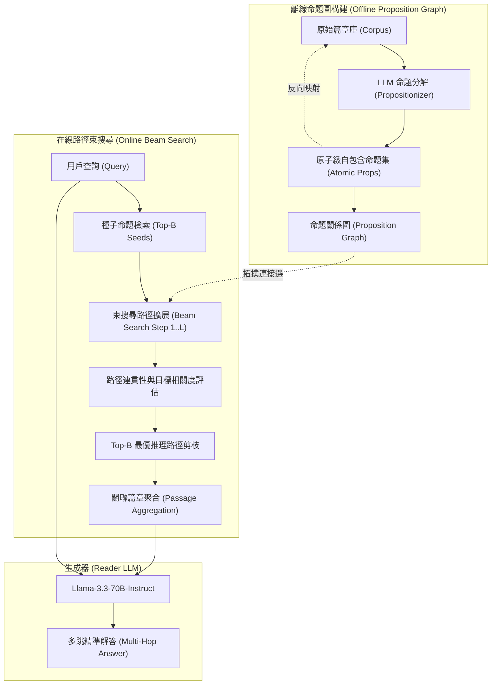

# PropRAG: Guiding Retrieval with Beam Search over Proposition Paths

## 一話摘要 (TL;DR)
PropRAG 將長文本解構為原子級命題（Propositions）並建立命題關聯圖，透過在命題路徑上執行束搜尋（Beam Search），成功取代傳統難以精確控制跳轉方向的向量擴散與純圖遊走，在 MuSiQue 與 2WikiMultiHopQA 上將端到端問答 F1 分別推升至 53.4% 與 74.9%，平均 F1 達 64.4%，超越 HippoRAG 2 成為多跳檢索新 SOTA。

---

## 研究背景與問題定義 (Problem Statement)
現有多跳檢索與結構化 RAG 存在兩大瓶頸：
1. **切塊粒度過粗與語意雜訊**：傳統以 Passage 或 Chunk（如 300–500 字）為檢索單元，內部混雜大量與查詢不相關的修飾句與次要事實，阻礙了精確的多步推理跳轉。
2. **三元組知識圖譜的資訊丟失**：OpenIE 或標準 KG 僅保留 `(Head, Relation, Tail)`，丟失了大量關鍵語境、前提條件、時態與否定詞（Contextual & Modality Loss）。
3. **多跳檢索中的盲目擴散**：圖神經網路或 PageRank 擴散機制在經過 2–3 跳後容易迷失於高頻中心節點（Hub Nodes），缺乏針對目標問題連貫推理鏈的約束導航能力。

---

## 核心方法與技術架構 (Methodology & Architecture)

PropRAG 提出以「命題（Proposition）」作為基本語意單位，並將多跳檢索建模為**在命題路徑圖上的束搜尋（Beam Search over Proposition Paths）**：
1. **原子命題抽取（Proposition Decomposition）**：利用 LLM 將每篇文檔分解為自包含、不可再分的獨立命題集 $\mathcal{P}$（借鑑 Dense X 思想）。
2. **命題關聯圖構建（Proposition Graph Construction）**：
   - 透過實體共現、語意共指以及向量相似度，在命題之間建立帶權邊；
   - 命題同時保留所屬來源文本段（Passage）的反向索引。
3. **引導式束搜尋檢索（Guided Beam Search Retrieval）**：
   - 初始階段：由查詢向量檢索最相關的前 $B$ 個起點命題作為種子；
   - 擴展階段：以步長 $L$ 進行路徑前向擴展，路徑打分由「路徑累積語意相關性」與「邏輯轉移置信度」共同決定；
   - 剪枝階段：在每一步保留 Top-$B$ 候選路徑，直到達到最大搜尋深度 $L_{max}$；
   - 聚合階段：將最優路徑所涉及的底層 Passages 聚合送入 Reader。

### 圖中節點對照
- `PROPS`：語意自足的最小事實命題節點。
- `GRAPH`：命題與實體交織的語意拓撲網絡。
- `BEAM`：維護大小為 $B$ 的候選路徑束搜尋器。
- `AGG`：由最優命題路徑映射回原始長篇章的上下文重組器。

---

## 主要實驗結果與證據 (Empirical Results & Evidence)

論文在多跳問答權威基準（MuSiQue, 2WikiMultiHopQA, HotpotQA）與單跳基準（NaturalQuestions, PopQA）上進行了全方位對比，Reader 統一使用 Llama-3.3-70B-Instruct。

### 1. 篇章檢索召回表現 (Table 1, Page 7)
在 Passage Recall@5 上，PropRAG（設 $L_{max}=2$）全面超越 HippoRAG 2：
- **MuSiQue**：達到 **77.6%**（HippoRAG 2 為 74.7%，前代 HippoRAG 為 53.2%）。
- **2WikiMultiHopQA**：達到 **93.4%**（HippoRAG 2 為 90.4%）。
- **HotpotQA**：達到 **97.2%**（HippoRAG 2 為 96.3%）。
- **NaturalQuestions**：78.1%（單跳場景亦保持極高水準）。
- **PopQA**：56.1%（超越 HippoRAG 2 的 51.7%）。

### 2. 端到端問答表現 (Table 2, Page 7)
以 Llama-3.3-70B-Instruct 生成答案的 F1 分數：
- **MuSiQue**：F1 達到 **53.4%**（HippoRAG 2 為 48.6%，提升 **+4.8%**）。
- **2WikiMultiHopQA**：F1 達到 **74.9%**（HippoRAG 2 為 71.0%，提升 **+3.9%**）。
- **HotpotQA**：F1 達到 **76.0%**（HippoRAG 2 為 75.5%）。
- **全基準平均 F1**：達到 **64.4%**（HippoRAG 2 為 62.9%，初代 HippoRAG 為 56.3%）。

---

## 優勢、限制及 Trade-offs (Strengths, Limitations & Trade-offs)

### 優勢
1. **精準克服語意稀釋**：以 Proposition 作為路徑節點，避免了 Chunk 內部無關細節對多跳檢索相關性計算的干擾。
2. **路徑可解釋性極高**：束搜尋輸出的最優路徑即為完整的邏輯推理鏈，為下游生成提供了明確的證據可溯源鏈條。
3. **靈活的深度控制**：可根據問題複雜度動態調整 $L_{max}$（單跳問題 $L=1$，多跳問題 $L=2\sim 3$），避免計算浪費。

### 限制與 Trade-offs
1. **命題切分前期開銷**：需利用 LLM 預先對全語料庫進行命題解構，索引構建成本高於單純字數切塊。
2. **束搜尋延遲**：相比單次矩陣乘法的向量檢索，在線進行多步 Beam Search 增加了一定的檢索端計算時間（約 50–120ms）。

---

## 對本專案研究領域的實際意義 (Implications for Research Domains)
1. **對 Domain 04 (Chunking & Proposition) 的直接驗證**：實證證明了「原子命題（Proposition）+ 路徑導航」在多跳任務中大幅優於「粗切塊（Chunk）+ 向量檢索」，為本專案知識單元解構提供了堅實的理論與數據支撐。
2. **對 Domain 05 & 07 的融合啟示**：架構了命題層與樹狀/圖狀階層檢索的橋樑，說明推理鏈路不一定非要依賴昂貴的全圖構建，以命題束搜尋同樣能達到超群的多跳推導能力。

---

## 原始來源及相關筆記連結 (Sources & Related Notes)
- 原始論文 PDF：[[Papers/04 - Knowledge & Graph RAG/(EMNLP 2025-11) PropRAG - Guiding Retrieval with Beam Search over Proposition Paths.pdf|開啟本地 PDF]]
- arXiv 永久連結：[arXiv:2504.18070](https://arxiv.org/abs/2504.18070)
- 關聯前驅筆記：[[03 - 論文庫 (Literature Notes)/04 - Knowledge & Graph RAG/(EMNLP 2024-11) Dense X - Exploring the Limit of Proposition Retrieval for Open-Domain QA|Dense X]]
- 關聯專題領域：[[02 - 研究領域專題 (Research Domains)/Canonical RAG Domains/Domain 02 - Segmentation & Contextualization|D02 Segmentation & Contextualization]]、[[02 - 研究領域專題 (Research Domains)/Canonical RAG Domains/Domain 04 - Knowledge Representation & Indexing|D04 Knowledge Representation & Indexing]]
