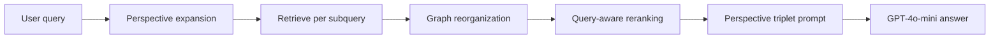

# ReGraphRAG: Reorganizing Fragmented Knowledge Graphs for Multi-Perspective Retrieval-Augmented Generation

> **已讀官方 PDF 文字抽取；本地 PDF／圖像附錄待核：** 透過 alphaXiv PDF reader 讀取 ACL Anthology 正式 18 頁 PDF 的可抽取正文，已核方法 §§3–4、實驗 §§5.1–5.5、Table 1–4、Limitations 與主要附錄文字。ACL PDF 本體在本地環境下載逾時，因此尚無本地副本；Appendix A 的 prompt 頁及 Appendix F 的 case study 頁以圖像呈現，文字抽取未提供其圖內內容，仍需視覺核對。故 `verification_status` 保持 `pending_verification`，不將圖像頁或本地 PDF 狀態說成已驗。

## 一話摘要 (TL;DR)
ReGraphRAG 先以多視角子查詢擴展檢索，再連接檢索到的碎裂子圖並按原查詢重排三元組；在 Ultradomain 的 LLM 成對評審中，對四個基線的平均 Diversity win rate 為 84.9%–93.4%（Table 1），這是相對偏好勝率，不是 accuracy。

## 研究背景與問題定義 (Problem Statement)
論文將系統中的知識圖譜視為從文件以 LLM 抽取實體與關係後形成的多個子圖；缺失實體／關係錯誤可能使其碎裂。檢索時取出的 nodes/edges 也可能分散而無法組成連貫的多跳推理路徑。Figure 1 以 LightRAG 與 ReGraphRAG 對照說明此問題（正式 PDF pp. 5426–5429）。作者研究範圍聚焦在 query-time 對檢索 granularities 的重組，沒有提出重新抽取／修補整個底層知識圖譜的 KGC 方法。[ACL 官方全文，§§1–3、Figure 1]

## 核心方法與技術架構 (Methodology & Architecture)
正式方法章節的順序為 Perspective Expansion → Graph Reorganization → Query-aware Reranking → graph-oriented prompt：

1. **Perspective Expansion（§4.1）**：LLM 將 query 分解為 m 個語義視角，每個視角以 chain-of-thought exemplars 生成 n 個 subqueries；retriever 依各 subquery 找相關 nodes／subgraphs，並去除重複子圖。主要設定為 m=4、n=3、每個 subquery 取 top 30 nodes。
2. **Graph Reorganization（§4.2、Algorithm 1）**：先對檢索子圖兩兩檢查原圖上是否有路徑，以 Dijkstra 找最短路徑，按路徑長度排序後合併尚未連通的子圖，並納入路徑上的中介 nodes/edges。仍無原圖路徑的部分，計算不同未連通子圖間 node embeddings 的 cosine similarity，迭代選取最相似 node pair，建立新 edge；edge 描述由兩端 node 的文字描述串接，直到所有子圖合併成連通圖。這一步建立的 edge 是語義相似性連線，作者未在所讀文字中描述以來源文本驗證該新關係。
3. **Query-aware Reranking（§4.3）**：將結果拆成 `(node_i, edge_ij, node_j)` 三元組，以 edge embedding 與原 query representation 的 cosine similarity 排序，將較相關資訊放在 prompt 較有利的位置。
4. **Graph-oriented prompt（§4.4）**：按視角將三元組格式化為 `[Perspective]: <Node_i> is connected to <Node_j> with {Edge Description} relation.`；跨視角重複的 triplet 去重後列在 `[Across all]`，用較精簡文字保留拓樸與語境。

所有 RAG 系統使用 GPT-4o-mini 生成、text-embedding-3-small embeddings、chunk size 1200；LightRAG 與 ReGraphRAG 共用同一份知識圖譜。附錄 prompt 頁以圖像呈現，尚未讀取圖內 prompt 原文。[ACL 官方全文，§§4–5.1、Algorithm 1，pp. 5428–5431]

## 主要實驗結果與證據 (Empirical Results & Evidence)
資料／benchmark：Ultradomain 由大學教科書與 QA 集構成，作者取 Agriculture、Computer Science、Legal、Mix 四組；Table 3（p. 5441）列出文件數依序為 12、10、94、61，總 token 數為 1,923,151、2,039,189、4,719,432、602,560。比較對象為 NaïveRAG、HyDE、GraphRAG、LightRAG。LLM-as-a-judge 對回答作 pairwise comparison，評 Comprehensiveness、Diversity、Empowerment、Overall；win rate 是被偏好回答比例。表中的平均欄為跨四領域平均。

**Table 1（p. 5431）平均 ReGraphRAG win rate：**

| Baseline | Comprehensiveness | Diversity | Empowerment | Overall |
|---|---:|---:|---:|---:|
| NaïveRAG | 75.3% | 93.4% | 80.1% | 79.9% |
| HyDE | 68.5% | 87.4% | 73.1% | 73.1% |
| GraphRAG | 69.3% | 84.9% | 68.8% | 70.5% |
| LightRAG | 74.9% | 92.4% | 77.9% | 78.9% |

**Table 2（p. 5432）ablation：** 完整 ReGraphRAG 對移除 Perspective Expansion 的平均 win rate 為 58.8/67.8/62.6/62.0%（四維依上表順序）；對移除 Graph Reorganization 為 51.9/51.8/55.5/54.0%；對移除 Query-aware Reranking 則為 47.8/45.4/45.8/46.0%，即此設定下無 reranking 的 ablation 多數面向反而勝過完整模型。

Table 1–2 均是同篇論文、同一 LLM judge 協議下的相對偏好；不與其他論文的 QA accuracy／retrieval metrics 直接比較。Appendix D 未在文字中指出 pairwise judge 的具體模型名稱或各領域 query 樣本數；Appendix A.4 評審 prompt 頁是圖像，待視覺核對。[ACL 官方全文，§5.1–5.3、Tables 1–3、Appendices C–D，pp. 5431–5432、5441]

## 優勢、限制及 Trade-offs (Strengths, Limitations & Trade-offs)
作者明確指出 reranking ablation 有時更好，表示 edge embedding/query cosine similarity 可能沒有充分捕捉圖結構的多跳推理；query perspective/subquery expansion 增加 retrieval 與 inference 時間，可能不適合即時或資源受限情境。Table 4（p. 5442）報告近似時間與 token 成本：NaïveRAG 0.8 秒／3,800 tokens、GraphRAG 8.4 秒／360,000、LightRAG 7.2 秒／29,000、ReGraphRAG 無 expansion 4.8 秒／3,700、完整 ReGraphRAG 19.8 秒／18,000。作者說完整模型的 19.8 秒來自 sequential setup；平行化可能降至 4–5 秒是作者推測，非表格實測值。文中未在所讀段落報 GPU／硬體規格或 API 費用。另須注意，Graph Reorganization 在無原圖路徑時會依 embedding 相似度補新邊；將此視為語義關係仍須防止錯誤連線，這是由設計推得的風險，不是作者量測結論。[ACL 官方全文，§5.4、Limitations、Appendix E／Table 4，pp. 5432–5433、5442]

## 對本專案研究領域的實際意義 (Implications for Research Domains)
依已讀方法章節，建議 primary_domain = D05：所有 graph reorganization 都在 query time 對已檢索子圖執行，輸出服務於當次回答；D04 作為 graph representation／結構化 context 的 secondary domain，D07 對應整理成 triplet prompt 並控制 context。D03 不列入，因論文沒有做持久化圖譜抽取／consolidation 更新。此為依 repo lifecycle boundary 所做的分類，不是作者標籤。

## 原始來源及相關筆記連結 (Sources & Related Notes)
- [ACL Anthology 官方 entry／metadata／摘要](https://aclanthology.org/2025.findings-emnlp.290/)，DOI [10.18653/v1/2025.findings-emnlp.290](https://doi.org/10.18653/v1/2025.findings-emnlp.290)。
- [ACL 官方 PDF](https://aclanthology.org/2025.findings-emnlp.290.pdf)（全文文字透過 alphaXiv PDF reader 讀取；ACL 本體在本地仍下載逾時，尚無本地副本或 prompt／case-study 頁截圖）。
- [Hanyang ScholarWorks 機構典藏記錄](https://hanyang.scholarworks.kr/item/a81fc59c-c9f6-4dce-bb69-f32f035fb991)（核對作者、DOI、venue、發表年月與頁碼；僅提供摘要）。
- [作者公開程式庫](https://github.com/ToBeSuperior/ReGraphRAG)（程式碼可用性來源，不作為實驗結果的替代證據）。
- 相關筆記：[[03 - 論文庫 (Literature Notes)/04 - Knowledge & Graph RAG/(Findings NAACL 2025-04) GRAG - Graph Retrieval-Augmented Generation|GRAG]]、[[03 - 論文庫 (Literature Notes)/04 - Knowledge & Graph RAG/(EMNLP 2025-11) PropRAG - Guiding Retrieval with Beam Search over Proposition Paths|PropRAG]]。
