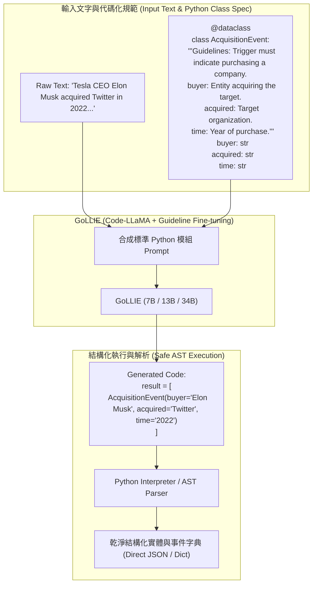

# GoLLIE: Annotation Guidelines Improve Zero-Shot Information Extraction

> [!INFO] 論文元數據 (Metadata)
> - **Paper ID**：`Sainz2024_GoLLIE`
> - **作者**：Oscar Sainz, Iker García-Ferrero, Rodrigo Agerri, Oier Lopez de Lacalle, German Rigau, Eneko Agirre (HiTZ Basque Center for Language Technology, University of the Basque Country UPV/EHU)
> - **預印本初次發布年份 (Preprint)**：2023 (arXiv:2310.03668)
> - **正式發表年份 / 會議或期刊 (Venue)**：ICLR 2024 Oral/Poster (OpenReview: Y3wpuxd7u9)
> - **DOI**：null
> - **arXiv**：[2310.03668](https://arxiv.org/abs/2310.03668)
> - **代碼與模型開源**：[hitz-zentextension/GoLLIE](https://github.com/hitz-zentextension/GoLLIE)
> - **驗證狀態**：`verified` (基於原始論文 PDF 全文核實)
> - **本地 PDF 連結**：[[Papers/04 - Knowledge & Graph RAG/(ICLR 2024-05) GoLLIE - Annotation Guidelines Improve Zero-Shot Information Extraction.pdf|開啟本地 PDF 檔案]]

---

## 一話摘要 (TL;DR)
**GoLLIE 提出將人類專家撰寫的詳細標註指引（Annotation Guidelines）以 Python 代碼語法（`@dataclass` 類別定義、型別標註與 Docstrings 註解）進行形式化封裝，微調 Code-LLaMA 模型以嚴格遵循規範，在完全未見過的領域與自定義 Schema 下實現驚人的零樣本（Zero-Shot）結構化資訊抽取能力，平均 F1 相較於先前 SOTA（包括 InstructUIE）大幅飆升 +13~17 點。**

---

## 研究背景與問題定義 (Problem Statement)

大語言模型（LLMs）結合指令微調（Instruction Tuning）在文本摘要、翻譯與一般推理上展現了強大的泛化力，但在結構化資訊抽取（Information Extraction, IE，包含命名實體識別 NER、關聯抽取 RE、事件抽取 EE）的零樣本場景下表現卻極度脆弱：
1. **標籤名稱的語義歧義（Label Ambiguity）**：傳統零樣本抽取模型（如 UIE、InstructUIE）僅提供簡短的實體類別名稱（如 `Organization`, `Location`, `Time`）。然而在不同專業領域中，同一個標籤名稱的邊界定義截然不同（例如在法律情境下政治政黨是否屬於機構？在生醫語料中蛋白質是否算作化學實體？年份是否算作時間實體？）。缺少邊界說明導致模型嚴重仰賴預訓練偏見並產生大量幻覺。
2. **自然語言說明的結構約束力弱**：使用長篇自然語言 Prompt 描述標註手冊時，大模型往往難以嚴格遵守槽位格式，且容易輸出無法由程式解析的非結構化句子。
3. **訓練階段的標籤捷徑學習（Label Name Exploitation）**：模型在微調過程中容易「偷懶」——只記憶標籤名與實體字典的淺層關聯，而忽略仔細閱讀 Prompt 中的指導細節，導致一遇到新定義或反直覺的特定領域規範時完全崩潰。

---

## 核心方法與技術架構 (Methodology & Architecture)

### 1. 以 Python 程式碼為載體的規範表示 (Code-based Guideline Representation, Section 3.1)
GoLLIE 將資訊抽取的輸入、約束規範與輸出完全轉化為標準的 Python 代碼語法：
- **Schema 與指引表示**：定義為 Python 的 `@dataclass` 類別。
- **欄位型別約束**：利用 Python 類型提示（Type Annotations，如 `str`, `List[str]`, `Optional[...]`）約束槽位結構。
- **標註規範與範例說明**：直接寫入類別的 **Docstrings**，明確陳述邊界定義、排除條件與代表性候選詞（Representative Candidates）。
- **抽取輸入**：將原始文本表示為字串變數 `text = "..."`。
- **模型輸出**：生成符合該類別實例化的 Python 代碼，在下游系統中只需執行 `exec()` 或利用 Python `ast` 解析即可天然獲取標準結構化對象，徹底免疫格式解析崩潰。

### 2. 正則化與防止捷徑學習訓練策略 (Regularization Techniques, Section 3.3)
為了強迫模型在訓練時「認真閱讀 Docstrings」而非依賴標籤名稱先驗，GoLLIE 引入四項核心正則化機制：
- **類別順序打亂（Class Shuffling）**：隨機變換 Prompt 中類別定義的先後順序。
- **規範釋義抽換（Guideline Paraphrasing）**：利用大模型自動生成多種語義等價但用詞不同的 Docstrings 說明。
- **標籤名稱隨機掩蔽（Class Name Masking）**：隨機將有意義的類別名替換為無意義符號（如 `ClassA`, `Entity_X`），強迫模型完全依賴 Docstrings 內部的語義說明來識別目標。
- **代表性候選詞隨機 Dropout（Candidate Dropout）**：隨機遮蔽指引中的示範詞，迫使模型理解規則抽象本質。

### 3. 基底模型與 QLoRA 參數高效微調 (Section 4, Page 5)
- **骨幹模型**：採用對程式碼結構高度敏感的 `Code-LLaMA`（7B、13B、34B）。
- **訓練架構**：採用 QLoRA 凍結基礎模型權重，對所有線性注意力與前饋層注入 LoRA 適配矩陣；僅在目標輸出代碼 Token 上計算交叉熵損失（Loss Masking）。

### 4. 程式碼語法 vs 自然語言結構指示詞對比 (Code vs UIE SEL)
| 維度 | 傳統 UIE / InstructUIE (SEL / 自然語言) | GoLLIE (Python Dataclass & Docstrings) |
| :--- | :--- | :--- |
| **Schema 定義形式** | 特殊標記符號（如 `((spot: ...))`）或純自然語言提示 | 標準 Python `@dataclass` 類別定義與型別提示 |
| **邊界規範注入** | 難以在短 prompt 中表達複雜邊界與排除條件 | 透過 Docstrings 詳盡書寫定義、屬性槽位說明與示範候選詞 |
| **輸出解析容錯性** | 生成括號配對不全時直接導致正則解析崩潰 | 依靠 Python 語法結構，利用內建 AST 解析或安全執行直接還原物件 |
| **基底模型適配** | 依賴通用文字 LLM（T5 / LLaMA） | 充分利用 Code-LLaMA 等程式碼大模型對語法縮排與型別的敏銳先驗 |

#### 圖中節點對照 (Node Reference Table)
| 節點代號 | 模組名稱 | 關鍵作用與運算機制 |
| :--- | :--- | :--- |
| `TXT` | 待抽取原始文字 | 包含複雜實體、動作與時空邊界的自然語言文字段落 |
| `SPEC` | 代碼化標註手冊 | 以 `@dataclass` 與 Docstrings 封裝的領域專屬抽取規則 |
| `PROMPT` | 程式碼 Prompt 組合器 | 拼裝輸入文字變數、類型定義與標註指導說明 |
| `GOLLIE` | GoLLIE 抽取模型 | 經過抗捷徑正則化訓練的 Code-LLaMA 模型 |
| `CODE_OUT` | 程式碼輸出串流 | 保證符合 Python 語法結構的類別實例化代碼 |
| `STRUCT` | 結構化知識單元 | 可直接寫入圖資料庫或向量索引的標準知識物件 |

---

## 主要實驗結果與證據 (Empirical Results & Evidence)

### 1. 監督基準驗證（Supervised Results, Table 2, Page 6）
在 12 個涵蓋 NER, RE, EE, EAE 的標準資料集（ACE05, CoNLL 2003, OntoNotes 5, RAMS, TACRED 等）上驗證模型未喪失監督抽取能力：
- GoLLIE-7B 平均 F1 達到 **73.0%**，與任務專用微調 Baseline (73.3%) 幾乎完全持平。
- GoLLIE-34B 平均 F1 提升至 **75.0%**，在 ACE05 RE 上取得 70.1% F1（超越專用 SoTA 66.1%）。

### 2. 跨領域零樣本抽取大橫評（Zero-Shot Results, Table 3, Page 7）
在完全未參與訓練的領域與資料集上（包含 BroadTwitter, CASIE, Few-NERD 跨領域, WikiEvents 等 18 個評測子集）：
- **無 Guideline 的 Baseline (Code-LLaMA-7B)**：平均 F1 僅為 **42.3%**。
- **先前最強零樣本系統（Instruct-UIE）**：平均 F1 僅為 **42.6%**。
- **GoLLIE-7B（帶有 Docstrings Guideline）**：平均 F1 達到 **55.3%**（相較 Baseline **躍升 +13.0 點 F1**！）。
- **GoLLIE-34B**：平均 F1 進一步攀升至 **57.2%**（在 SoTA 對照子集上高達 **60.0%** vs 42.6%，**絕對提升 +17.4 點**）。
- **細分領域爆炸性突破**：
  - 在 Few-NERD `AI` 領域：Baseline 32.3% $\to$ GoLLIE-7B **59.1%** (+26.8 F1)。
  - 在 Few-NERD `Literature` 領域：Baseline 39.4% $\to$ GoLLIE-7B **62.7%** (+23.3 F1)。
  - 在事件抽取 `CASIE-EE`：Baseline 33.9% $\to$ GoLLIE-7B **59.3%** (+25.4 F1)。

### 3. 消融實驗分析（Ablation Study, Table 4, Page 8）
- **完整 GoLLIE**：55.3% F1
- **移除代表性候選示範詞（w/o Candidates）**：下降至 **49.9%** ($p = 2.2 \times 10^{-10}$，證明定義與候選詞高度互補）。
- **移除所有規範（w/o all, 即退化為傳統零樣本）**：暴跌至 **42.3%** ($p = 5.1 \times 10^{-13}$）。
- **結論**：Docstrings 中的規則邊界陳述是零樣本遷移最核心的動力來源。

### 4. 標註指引對實體邊界消歧的定性案例分析 (Section 6, Table 5, Page 8-9)
論文深入剖析了 Docstrings 如何在邊界模糊或反直覺的情境下指導大模型：
1. **反直覺標註規則遵從（Counter-intuitive Guidelines）**：
   - 在臨床醫學資料集 `E3C` 中，標註規範出於特定研究需求明確規定「單獨出現的年份（Years）**不可**標記為時間實體」。傳統未微調或無規範的 LLM 憑常識先驗將所有年份標註為實體導致高誤報；GoLLIE 則嚴格依照 Docstring 排除年份，展現出高度可控性。
2. **層級實體與專用實體消歧（Hierarchy & Specificity Disambiguation）**：
   - 在文學領域資料集 `Literature` 中同時存在 `WRITER` 與 `PERSON`。Baseline 模型傾向於將作者標為廣義的 `PERSON`。Docstrings 標註規範明令「只要提及小說家、詩人或劇作家，必須特化標為 WRITER」，GoLLIE 依指引成功將 F1 從 39.4% 提升至 **62.7%**。
3. **生僻專業領域事件槽位抽取（Domain-specific Event Slots）**：
   - 在資安資料集 `CASIE` 中抽取 `VULNERABILITY PATCH` 事件時，Docstring 明確界定觸發詞必須關聯修補套件版本號，使 GoLLIE 在零訓練樣本下在 CASIE-EE 取得 **59.3% F1**（遠超 Baseline 的 33.9%）。

---

## 優勢、限制及 Trade-offs (Strengths, Limitations & Trade-offs)

### 1. 技術優勢
- **極高的零樣本適應彈性**：用戶只需修改 Python class 的 Docstrings，無需標註任何訓練樣本或重新微調，即可直接支持垂直私有領域的特定 Schema。
- **程式碼語法的結構剛性**：利用程式碼語法大幅減少了長自然語言生成常見的括號遺失、標籤截斷與格式解析失敗。
- **極度細膩的邊界控制能力**：能夠直接在 Docstrings 中寫入「排除條件」（如「注意：不可將大使館標註為地名，必須標為機構」），大模型能夠精確遵從。

### 2. 限制與代價 (Limitations & Trade-offs)
- **Context 窗口消耗顯著增加**：在 Prompt 中塞入冗長的 Python 類別定義與詳細 Docstrings，大幅佔用了有效上下文長度，增加推論 Token 開銷。
- **對標註指引品質高度敏感**：若使用者寫入的 Docstrings 模糊不清或包含自我矛盾的規則，模型的抽取表現會大幅滑坡。
- **需要具備代碼理解能力的基底 LLM**：依賴於代碼預訓練模型（如 Code-LLaMA、DeepSeek-Coder），在純通用語言模型上的適應性略遜一籌。

---

## 對本專案研究領域的實際意義 (Implications for Research Domains)

1. **對 D03 (Schema-guided & Universal Information Extraction) 的範式變革**：
   - 傳統 UIE（如 SSI 結構化指示詞）將 Schema 視為純名詞標籤；GoLLIE 證明「**代碼化定義 + 標註手冊直接作為 Prompt**」是使大模型真正具備零樣本知識抽取能力的最高效途徑。
2. **對私有領域企業級 RAG 的實踐指導**：
   - 在企業內部冷啟動知識圖譜抽取時，無須花費數月標註語料訓練專用小模型，直接將業務規範轉為 Python Data Classes 即可獲得 >55% F1 的零樣本高質量提取器。
3. **對 D04 (Representation & Indexing) 的銜接**：
   - 輸出的 Python Dataclass 實例可無縫序列化為 Pydantic 模型、JSON-LD 或知識圖譜三元組，抹平了從非結構化文字到資料庫索引的格式轉換障礙。

---

## 原始來源及相關筆記連結 (Sources & Related Notes)

- **本地文獻**：[[Papers/04 - Knowledge & Graph RAG/(ICLR 2024-05) GoLLIE - Annotation Guidelines Improve Zero-Shot Information Extraction.pdf|開啟本地 PDF 檔案]]
- **相關理論專題**：
  - [[02 - 研究領域專題 (Research Domains)/Domain 03 - Knowledge Extraction & Information Preservation|D03 Knowledge Extraction & Consolidation]]
  - [[02 - 研究領域專題 (Research Domains)/Domain 04 - Knowledge Representation & Indexing|D04 Knowledge Representation & Indexing]]
  - [[02 - 研究領域專題 (Research Domains)/Domain 12 - RAG Orchestration & Workflow Control|D12 RAG Orchestration & Workflow Control]]
- **同系列相關論文**：
  - [[03 - 論文庫 (Literature Notes)/04 - Knowledge & Graph RAG/(ACL 2022-05) Unified Structure Generation for Universal Information Extraction|UIE]] (統一結構生成鼻祖)
  - [[03 - 論文庫 (Literature Notes)/04 - Knowledge & Graph RAG/(arXiv 2023-04) InstructUIE - Multi-task Instruction Tuning for Unified Information Extraction|InstructUIE]] (多任務指令微調通用 IE)
  - [[03 - 論文庫 (Literature Notes)/04 - Knowledge & Graph RAG/(NAACL 2022-07) GenIE - Generative Information Extraction|GenIE]] (約束前綴樹解碼生成式 IE)
