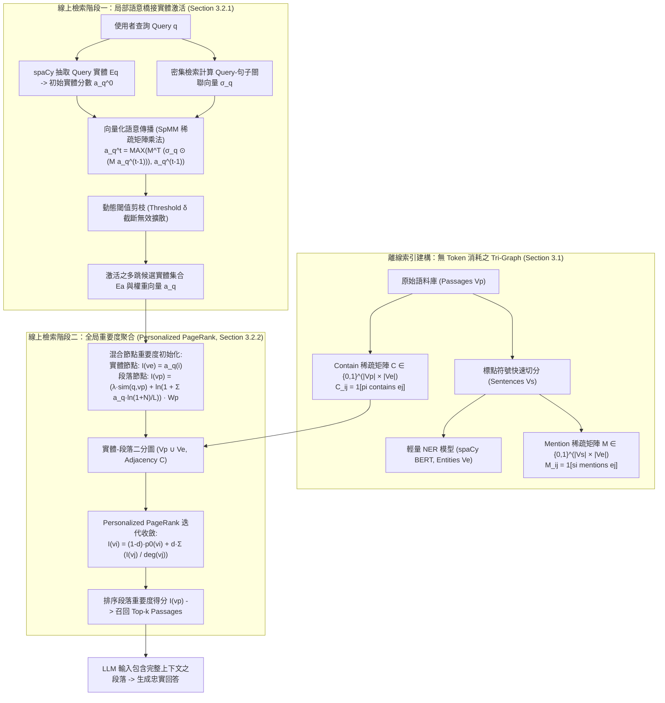

# LinearRAG: Linear Graph Retrieval Augmented Generation on Large-scale Corpora

## 一話摘要 (TL;DR)
**LinearRAG 徹底顛覆了傳統 GraphRAG 依賴高昂且易錯之 LLM 關係抽取（Relation Extraction）的沉重範式，提出了一種無關係的階層式 Tri-Graph 索引（段落-句子-實體）與兩階段線性檢索演算法（局部語意橋接 + 全局 PPR 重要度聚合），在索引建構期達成 0 額外 LLM Token 消耗與 $O(N)$ 線性複雜度（索引速度提升 77% 以上），並在 HotpotQA、2Wiki、MuSiQue 與 Medical 評測中全面超越 LightRAG、HippoRAG2 等 SOTA 圖檢索方法。**

---

## 研究背景與問題定義 (Problem Statement)

GraphRAG（如 Microsoft GraphRAG、LightRAG、HippoRAG 等）近年被廣泛用於緩解 LLM 長文本檢索中的語意斷裂與多跳推理（Multi-hop Reasoning）瓶頸。然而，作者在 GraphRAG-Bench 等實證研究中發現，**現有 GraphRAG 在真實場景中的表現經常劣於樸素的 Vanilla RAG**（Section 2.1, Page 3）。例如在醫療與複雜問答中，LightRAG 與 HippoRAG 的檢索上下文相關度（Context Relevance）僅落於 36.86% 至 54.61%，遠低於 Vanilla RAG 的 62.87%。

經深入的圖品質與失效歸因分析（Section 2.2, Page 3），作者指出傳統 GraphRAG 的兩大核心死穴：
1. **局部失真（Local Inaccuracies）**：
   - 傳統關係抽取模型（RE/OpenIE）極度脆弱，經常顛倒語意或遺失關鍵限定詞（Qualifiers）。
   - 典型案例：原文句子「*Einstein did not win the Nobel Prize for his theory of relativity*」（愛因斯坦並未因相對論獲諾貝爾獎），常被 LLM 抽取成三元組 `(Einstein, won Nobel Prize for, theory of relativity)`，完全丟失否定詞（Negation），導致事實性反轉。
   - 自然語言中的模態、條件、情感與時序（如「*Rachel reluctantly agreed to go running with Phoebe*」）無法無損壓縮成原子三元組。
2. **全局不一致（Global Inconsistencies）**：
   - 關係抽取通常在個別段落內局部進行，缺乏全局結構約束與對齊機制，產生大量矛盾、同義不同字或缺乏層級結構的孤島邊。
3. **巨大的 Token 與時間成本（Severe Computational Overhead）**：
   - 使用 LLM 對整個語料庫進行實體與關係抽取，帶來極其驚人的 Token 開銷與離線建構延遲（如 LightRAG 在 2Wiki 索引花費近 5,000 秒與 86M tokens）。

### 作者的核心論點 (Central Claims, Section 2.3, Page 4)
- **Claim 1**：對齊的實體（Aligned Entities）而非脆弱的關係標籤，才是跨段落連接異質資訊的真正可靠錨點。
- **Claim 2**：複雜的語意關係應完整保留在原始段落（Passages）全文中，由下游生成 LLM 在具備完整上下文時自主解讀，根本無需進行顯式關係抽取。

---

## 核心方法與技術架構 (Methodology & Architecture)

LinearRAG 將複雜的關係知識圖譜簡化為具有線性可擴展性的 **Tri-Graph 階層圖**，並設計了由局部到全局的兩階段無檢索盲區導航演算法。

### 1. 離線無 Token 消耗之 Tri-Graph 建構 (Section 3.1, Page 5)
語料庫 $\mathcal{P}$ 切分為句子集合 $\mathcal{S}$，並透過輕量 NER（spaCy）抽取出實體集合 $\mathcal{E}$。圖中包含三種節點：段落節點 $V_p$、句子節點 $V_s$、實體節點 $V_e$。

建立兩個二分關聯稀疏矩陣：
1. **Contain 矩陣 $C \in \{0, 1\}^{|V_p| \times |V_e|}$**：
   $$C_{ij} = \mathbb{I}\{p_i \text{ contains } e_j\}$$
2. **Mention 矩陣 $M \in \{0, 1\}^{|V_s| \times |V_e|}$**：
   $$M_{ij} = \mathbb{I}\{s_i \text{ mentions } e_j\}$$

- **複雜度與優勢**：無需調用任何 LLM API，僅耗費本機 CPU/GPU 的 NER 推理開銷；增量更新時僅需處理新增段落，全流程具備嚴格的 $O(N)$ 線性時間與空間複雜度。

### 2. 第一階段：局部語意橋接實體激活 (Section 3.2.1, Page 5-6)
為了在不依賴顯式圖譜關係邊的前提下挖掘潛在的中間跳轉實體（Intermediate Entities）：
1. **初始實體激活**：提取 Query 中的實體 $E_q$，並透過向量餘弦相似度初始化實體激活向量 $\mathbf{a}_q^0$。
2. **查詢-句子關聯向量**：以密集向量計算查詢 $q$ 與庫中所有句子 $s_i \in \mathcal{S}$ 的相似度向量 $\mathbf{\sigma}_q \in \mathbb{R}^{|V_s|}$。
3. **向量化語意傳播（Semantic Propagation）**：
   $$\mathbf{a}_q^t = \text{MAX}\Big(M^T \big(\mathbf{\sigma}_q \odot (M \mathbf{a}_q^{t-1})\big), \mathbf{a}_q^{t-1}\Big)$$
   - $M \mathbf{a}_q^{t-1}$：將實體激活權重投影到提及該實體的句子；
   - $\mathbf{\sigma}_q \odot (\dots)$：透過查詢與句子的語意關聯度進行逐元素加權過濾；
   - $M^T (\dots)$：將句子的相關度重新回傳給在這些相關句子中共同出現（Co-occurring）的其他實體；
   - 僅需進行 $n$ 次矩陣迭代（通常 $n \le 4$），每次包含三步矩陣乘法與一次元素取最大值，全流程支援高度並行的稀疏矩陣乘法（SpMM）。
4. **動態剪枝（Dynamic Pruning）**：設定動態閾值 $\delta$，每輪僅保留激活值高於 $\delta$ 的實體，防止搜尋空間組合爆炸與語意漂移。

### 3. 第二階段：全局重要度聚合段落檢索 (Section 3.2.2, Page 6)
利用第一階段激活的實體集合 $E_a$ 作為先驗，在實體-段落二分圖上執行個人化 PageRank（Personalized PageRank, PPR）：
- **混合初始化重要度（Hybrid Initialization）**：
  - 實體節點 $v_i \in V_e$：$I(v_i) = \mathbf{a}_q^{(i)}$；
  - 段落節點 $v \in V_p$：
    $$I(v \mid v \in V_p) = \left( \lambda \cdot \text{sim}(q, v) + \ln \left( 1 + \sum_{e_i \in E_a} \frac{\mathbf{a}_q^{(i)} \cdot \ln(1 + N_{e_i})}{L_{e_i}} \right) \right) \cdot W_p$$
    其中 $\text{sim}(q,v)$ 為密集檢索基準分數，$N_{e_i}$ 為實體在段落中的出現頻率，$L_{e_i}$ 為層級權重，$W_p$ 為段落權重係數，$\lambda$ 為平衡參數。
- **PPR 迭代更新**：
  $$I(v_i) = (1 - d) p_0(v_i) + d \sum_{v_j \in B(v_i)} \frac{I(v_j)}{\text{deg}(v_j)}$$
  取阻尼係數 $d = 0.85$。最終根據段落節點的收斂分數 $I(v \mid v \in V_p)$ 排序，選取 Top-$k$ 段落輸入生成器。

---

## 主要實驗結果與證據 (Empirical Results & Evidence)

論文在 4 個基準評測集上進行了全面評估：HotpotQA、2WikiMultiHopQA、MuSiQue，以及 GraphRAG-Bench 的 Medical 資料集。所有方法採用相同的 Embedding 模型（`all-mpnet-base-v2`）與相同的 LLM 生成評估器（GPT-4o-mini），設定 Top-$k=5$。

### 1. 端到端問答生成準確度對比 (Table 1, Page 7)
評測指標包含 Contain-Match Accuracy (Contain-Acc. %) 與 GPT-Evaluation Accuracy (GPT-Acc. %)。

| 方法類型 | 方法名稱 | HotpotQA (Contain / GPT) | 2Wiki (Contain / GPT) | MuSiQue (Contain / GPT) | Medical (GPT-Acc.) |
|---|---|:---:|:---:|:---:|:---:|
| **Zero-shot LLM** | LLaMA3-8B | 31.10 / 27.30 | 33.60 / 16.20 | 7.40 / 8.10 | 27.31 |
| | GPT-4o-mini | 38.90 / 40.20 | 36.30 / 31.40 | 13.60 / 15.80 | 42.10 |
| **Vanilla RAG** | Top-1 | 46.30 / 49.10 | 36.60 / 31.70 | 17.80 / 21.10 | 48.01 |
| | Top-3 | 53.00 / 56.00 | 44.90 / 39.70 | 25.10 / 27.50 | 59.07 |
| | Top-5 | 55.70 / 58.60 | 48.60 / 43.00 | 26.10 / 29.60 | 61.68 |
| **Graph-based RAG** | G-Retriever | 42.20 / 40.60 | 46.60 / 27.10 | 14.40 / 15.50 | 50.36 |
| | RAPTOR | 55.90 / 58.30 | 50.10 / 42.10 | 23.30 / 27.40 | 55.75 |
| | E2GraphRAG | 61.00 / 63.90 | 54.30 / 38.10 | 23.80 / 26.20 | 58.00 |
| | LightRAG | 60.30 / 59.50 | 55.20 / 39.00 | 27.40 / 28.60 | 54.36 |
| | HippoRAG | 57.00 / 59.30 | 66.10 / 59.90 | 29.30 / 24.10 | 55.04 |
| | GFM-RAG | 62.70 / 65.60 | 66.80 / 59.60 | 29.90 / 34.60 | 56.07 |
| | HippoRAG2 | 62.90 / 64.30 | 62.70 / 55.00 | 31.00 / 35.00 | 60.77 |
| **Ours** | **LinearRAG** | **64.30 / 66.50** | **70.20 / 63.70** | **33.90 / 37.00** | **63.72** |

- **關鍵突破**：在所有 4 個資料集上，LinearRAG 全面斬獲第一名（SOTA）。特別在 2Wiki 上，GPT-Acc 達到 63.70%，比次優基準高出 **3.80%** 絕對值；Contain-Acc 更突破 **70.20%**。

### 2. 效率與 Token 消耗對比 (Table 2, Page 9)
在 2WikiMultiHopQA 數據集上評估離線索引時間、在線檢索時間與 LLM Token 開銷：

| 方法名稱 | Indexing 時間 (s) | 檢索延遲 (s/query) | Prompt Tokens ($\times 10^6$) | Completion Tokens ($\times 10^6$) | 平均準確率 (%) |
|---|:---:|:---:|:---:|:---:|:---:|
| **LightRAG** | 4933.22 | 10.963 | 35.52 | 51.16 | 47.10 |
| **G-Retriever** | 2745.94 | 11.487 | 6.05 | 2.26 | 36.85 |
| **HippoRAG2** | 1147.01 | 1.694 | 4.98 | 1.22 | 58.85 |
| **HippoRAG** | 936.00 | 1.461 | 3.05 | 0.98 | 63.00 |
| **LinearRAG (Ours)** | **249.78** | **0.093** | **0** | **0** | **66.95** |

- **零 Token 開銷**：LinearRAG 索引期間完全不使用 LLM，Prompt 與 Completion Tokens 均為 **0**。
- **建構加速比**：比 HippoRAG 快 **73.3%**，比 HippoRAG2 快 **78.2%**，比 LightRAG 快 **94.9%**。
- **線上檢索極速**：得益於 SpMM 與稀疏 PPR，單次檢索耗時僅 **0.093 秒**，較 HippoRAG2 加速 18 倍，較 LightRAG 加速 117 倍。

### 3. 模組消融實驗 (Figure 4, Page 9)
評估平均準確率（Contain-Acc 與 GPT-Acc 均值）：
- **HotpotQA**：Full (65.40%) $\to$ w/o Entity Activation (63.15%) $\to$ w/o PPR (63.35%)。
- **2Wiki**：Full (66.95%) $\to$ w/o Entity Activation (64.40%) $\to$ w/o PPR (64.20%)。
- **MuSiQue**：Full (35.45%) $\to$ w/o Entity Activation (31.65%) $\to$ w/o PPR (32.05%)。
- **Medical**：Full (63.72%) $\to$ w/o Entity Activation (61.69%) $\to$ w/o PPR (61.73%)。
- **結論**：兩階段設計（局部語意傳播激活中間實體 + 全局 PPR 段落排名）缺一不可，彼此形成強互補。

---

## 優勢、限制及 Trade-offs (Strengths, Limitations & Trade-offs)

### 優勢 (Strengths)
1. **擺脫關係抽取幻覺**：徹底避免了傳統 OpenIE / LLM 抽取三元組時丟失否定、條件與時序的系統性偏差。
2. **真正的線性複雜度與零 Token 成本**：使百萬至千萬篇級別的企業海量語料庫進行圖增強檢索成為現實可行方案。
3. **優異的多跳捕捉能力**：透過句子-實體共現傳播，即使沒有標註顯式邊，也能精確連通 $n$-hop 隱含實體。

### 限制與潛在失效情境 (Limitations & Failure Modes)
1. **Query-Gated 截斷與實體依賴**：第一階段高度依賴 spaCy 從 Query 中識別出的初始實體種子；若使用者問題高度抽象且完全不包含顯式命名實體（例如「為什麼某機制會導致系統癱瘓？」），語意傳播容易受阻。
2. **偽實體共現雜訊（Spurious Co-occurrence）**：若兩個完全不相關的實體恰好出現在同一個過長句子中，可能透過二分矩陣傳播引發局部雜訊激活（此缺陷促使了後續 NexusRAG 的誕生）。
3. **不適合全域巨觀摘要（Global Summarization）**：相較於 Microsoft GraphRAG 的 Leiden 社群多層次層級摘要，LinearRAG 專注於多跳事實型問答（Multi-hop Factoid QA），在「請總結整部小說的主題衝突」這類整體宏觀任務上缺乏預生成的社群報告結構。

---

## 對本專案研究領域的實際意義 (Implications for Research Domains)

1. **對 D03 (Knowledge Extraction) 的深刻啟示**：
   - 強力支撐了專案的 **Idea 01 (Information-Preserving Knowledge Extraction)**：結構化圖譜抽取若丟失了 Negation / Modality / Condition，對檢索反而是負向損害。
   - 證實了「抽取實體（Entity Extraction）比抽取關係（Relation Extraction）更穩健、更經濟」，為知識工程劃定了合理的抽取粒度邊界。
2. **對 D04 (Representation & Indexing) 的範式突破**：
   - 建立了經典的 **Relation-Free Tri-Graph 索引範式**，證明了稀疏二分關聯矩陣（$C$ 與 $M$）可以作為傳統三元組圖（Knowledge Graph）的高效替代方案。
3. **對 D05 (Query Understanding & Retrieval) 的算法借鑑**：
   - 示範了如何透過向量化 SpMM 矩陣運算，將多跳圖遍歷轉化為 GPU 高度並行化的張量乘法，大幅壓低了 PPR 圖檢索的線上延遲。

---

## 原始來源及相關筆記連結 (Sources & Related Notes)

- **本地 PDF 原文**：[[Papers/04 - Knowledge & Graph RAG/(ICLR 2026-05) LinearRAG - Linear Graph Retrieval Augmented Generation on Large-scale Corpora.pdf|開啟本地 PDF 檔案]]
- **官方開源代碼**：[GitHub - DEEP-PolyU/LinearRAG](https://github.com/DEEP-PolyU/LinearRAG)
- **同類與前驅/後繼文獻**：
  - [[03 - 論文庫 (Literature Notes)/04 - Knowledge & Graph RAG/(NeurIPS 2024-12) HippoRAG - Neurobiologically Inspired Long-Term Memory for Large Language Models|HippoRAG]] (前驅 PPR 圖檢索基礎)
  - [[03 - 論文庫 (Literature Notes)/04 - Knowledge & Graph RAG/(arXiv 2024-10) LightRAG - Simple and Fast Retrieval-Augmented Generation|LightRAG]] (雙層圖結構基線)
  - [[03 - 論文庫 (Literature Notes)/04 - Knowledge & Graph RAG/(arXiv 2024-04) From Local to Global - A Graph RAG Approach to Query-Focused Summarization|Microsoft GraphRAG]] (社群摘要重度抽取範式)
  - [[04 - 研究想法與待驗證提案 (Ideas & Hypotheses)/Idea 01 - Information-Preserving Knowledge Extraction|Idea 01]] (資訊保真抽取假說)
- **專題頁面跳轉**：
  - [[02 - 研究領域專題 (Research Domains)/Domain 04 - Knowledge Representation & Indexing|D04 Representation & Indexing]]
  - [[02 - 研究領域專題 (Research Domains)/Domain 03 - Knowledge Extraction & Information Preservation|D03 Knowledge Extraction]]
  - [[02 - 研究領域專題 (Research Domains)/Domain 05 - Query Understanding & Retrieval|D05 Query Understanding & Retrieval]]
