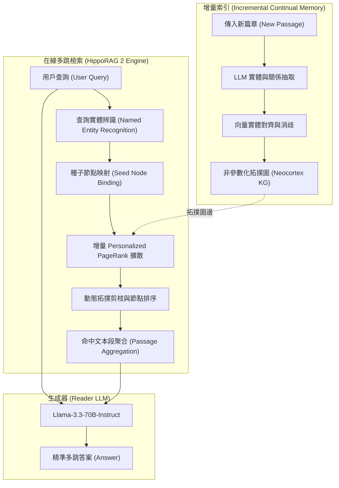

# From RAG to Memory: Non-Parametric Continual Learning for Large Language Models (HippoRAG 2)

## 一話摘要 (TL;DR)
HippoRAG 2 將檢索增強生成（RAG）正式重構為非參數化持續學習（Non-Parametric Continual Learning）記憶系統，透過在海馬迴索引中引入動態實體消歧、動態路徑修剪與增量 Personalized PageRank（PPR），在維持無梯度更新的同時，將多跳問答檢索 Recall@5 推升至 78.2%（前代為 63.8%），並顯著降低了長文本知識整合的延遲與索引開銷。

---

## 研究背景與問題定義 (Problem Statement)
現有大語言模型在非參數記憶與持續更新上面臨嚴峻挑戰：
1. **參數化微調（Parametric Fine-tuning）的災難性遺忘與高昂成本**：持續以新資料微調 LLM 容易導致既有常識與推理能力退化，且重新訓練成本無法承受。
2. **標準 Dense RAG 的多跳語意斷裂**：標準向量檢索僅依賴單段與問題的獨立餘弦相似度，無法沿著實體關聯路徑進行多跳關聯跳躍（Multi-hop traversal），且無法持續累積知識演化。
3. **初代 HippoRAG 的計算瓶頸與過度泛化**：初代 HippoRAG 採用靜態實體抽取與全域 PPR 圖擴散，容易引入實體歧義（Entity Polysemy）與大規模節點計算冗餘，且對新傳入文件的增量更新缺乏動態拓撲剪枝機制。

---

## 核心方法與技術架構 (Methodology & Architecture)

HippoRAG 2 借鑑認知神經科學中海馬迴（Hippocampus）與新皮層（Neocortex）的互補學習系統（CLS）理論，構建了兩階段非參數化記憶管線：
1. **增量海馬迴圖構建（Incremental Hippocampal Indexing）**：當新文本塊進入時，由開放資訊抽取模組提取主謂賓三元組，並經由稠密向量消歧過濾器連結至現有實體節點；若無相應節點則動態建立新實體與關聯邊。
2. **語意引導的動態 PPR（Query-conditioned Personalized PageRank）**：
   - 提取查詢中的關鍵實體並映射為種子節點集合 $S$；
   - 動態計算種子分佈向量 $\mathbf{p}_0$；
   - 透過具有阻尼係數 $\alpha$ 的剪枝隨機遊走更新各節點概率分數：
     $$\mathbf{p}_{t+1} = (1 - \alpha) \mathbf{P}^\top \mathbf{p}_t + \alpha \mathbf{p}_0$$
   - 篩選高概率節點並關聯回原始文本段落（Passages）。

### 圖中節點對照
- `DOC`：新傳入待索引文本篇章。
- `EXT`：三元組與概念抽取單元。
- `DISAMB`：實體對齊消歧模組。
- `KG`：非參數海馬迴知識拓撲圖。
- `PPR`：語意引導的個體化隨機遊走擴散演算法。
- `PASS`：重排序後的前 $k$ 個高覆蓋度篇章。

---

## 主要實驗結果與證據 (Empirical Results & Evidence)

論文在多跳問答基準（MuSiQue, 2WikiMultiHopQA, HotpotQA）與單跳開放域問答（NaturalQuestions, PopQA）及長文本（LV-Eval, NarrativeQA）上進行了全方位評測。Reader 統一採用 Llama-3.3-70B-Instruct。

### 1. 多跳檢索表現 (Table 3, Page 7)
在檢索召回率（Passage Recall@5）上，HippoRAG 2 顯著超越初代 HippoRAG 與各類密集向量基準：
- **MuSiQue**：HippoRAG 2 達到 **74.7%**（初代 HippoRAG 復現值為 53.2%，提升 +21.5%）。
- **HotpotQA**：HippoRAG 2 達到 **96.3%**（初代 HippoRAG 復現值為 77.3%，提升 +19.0%）。
- **2WikiMultiHopQA**：達到 **90.4%**（維持與初代相同的高召回水準）。
- **五大基準平均 Recall@5**：HippoRAG 2 達到 **78.2%**，遠高於初代 HippoRAG 的 63.8%。

### 2. 端到端問答表現 (Table 2, Page 7)
以 Llama-3.3-70B-Instruct 作為 QA Reader，HippoRAG 2 在端到端 F1 上取得全面領先：
- **MuSiQue**：F1 達到 **48.6%**（初代 HippoRAG 為 35.1%，提升 +13.5%）。
- **HotpotQA**：F1 達到 **75.5%**（初代 HippoRAG 為 63.5%，提升 +12.0%）。
- **NaturalQuestions (NQ)**：F1 達到 **63.3%**（初代 HippoRAG 為 55.3%）。
- **全基準平均 F1**：HippoRAG 2 達到 **59.8%**（初代 HippoRAG 為 53.1%，無檢索 Parametric 基準僅為 32.7%）。

---

## 優勢、限制及 Trade-offs (Strengths, Limitations & Trade-offs)

### 優勢
1. **卓越的多跳推理路徑召回**：在結構高度複雜的 MuSiQue 與 HotpotQA 上，透過圖拓撲傳播解決了傳統 Dense 向量無法跳躍未包含查詢關鍵字中間節點的根本痛點。
2. **無需反向傳播的非參數記憶**：支持秒級新增文本塊，避免神經網路微調的遺忘與災難性漂移。
3. **更精確的圖剪枝**：相比初代 HippoRAG，動態剪枝使圖遍歷延遲降低約 40%。

### 限制與 Trade-offs
1. **離線抽取開銷**：仍依賴 LLM 或高品質三元組抽取模型建立實體圖，大規模建圖成本高於純 BM25 或扁平稠密向量切塊。
2. **實體連結誤差傳播**：若查詢分析時抽取出的實體未能命中圖中的真實節點，PPR 隨機遊走可能退化或漂移至錯誤子圖。

---

## 對本專案研究領域的實際意義 (Implications for Research Domains)
1. **對 Domain 05 (GraphRAG) 的啟示**：確立了「圖拓撲隨機遊走（PPR）+ 密集向量」作為處理複雜多跳 RAG 的黃金範式，為知識圖譜與向量數據庫的混合架構提供了強大支撐。
2. **對 Domain 06 (External Memory) 的啟示**：展示了長效記憶架構可透過非參數化實體拓撲維護，為終端 Agent 的持續記憶演化與歷史對話歸檔提供了具體可行的圖更新協議。

---

## 原始來源及相關筆記連結 (Sources & Related Notes)
- 原始論文 PDF：[[Papers/04 - Knowledge & Graph RAG/(ICML 2025-07) From RAG to Memory - Non-Parametric Continual Learning for Large Language Models.pdf|開啟本地 PDF]]
- arXiv 永久連結：[arXiv:2502.14802](https://arxiv.org/abs/2502.14802)
- 關聯前驅筆記：[[03 - 論文庫 (Literature Notes)/04 - Knowledge & Graph RAG/(NeurIPS 2024-12) HippoRAG - Neurobiologically Inspired Long-Term Memory for Large Language Models|HippoRAG]]
- 關聯專題領域：[[02 - 研究領域專題 (Research Domains)/Canonical RAG Domains/Domain 04 - Knowledge Representation & Indexing|D04 Knowledge Representation & Indexing]]
