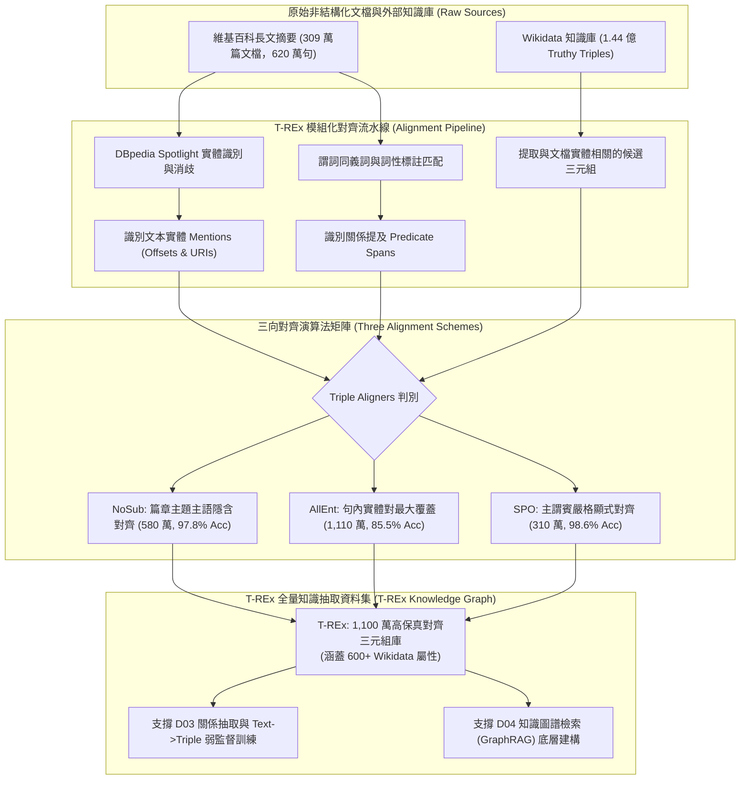

# T-REx: A Large Scale Alignment of Natural Language with Knowledge Base Triples

> [!INFO] 論文元數據 (Metadata)
> - **Paper ID**：`Elsahar2018_TREx`
> - **作者**：Hady Elsahar, Pavlos Vougiouklis, Arslen Remaci, Christophe Gravier, Jonathon Hare, Frederique Laforest, Elena Simperl (Université de Lyon, University of Southampton)
> - **正式發表年份 / 會議或期刊 (Venue)**：Proceedings of the Eleventh International Conference on Language Resources and Evaluation (LREC 2018)
> - **ACL Anthology ID**：[L18-1544](https://aclanthology.org/L18-1544/)
> - **專案官方網站**：[https://hadyelsahar.github.io/t-rex/](https://hadyelsahar.github.io/t-rex/)
> - **驗證狀態**：`verified` (基於原始論文 PDF 全文核實)
> - **本地 PDF 連結**：[[Papers/04 - Knowledge & Graph RAG/(LREC 2018-05) T-REx - A Large Scale Alignment of Natural Language with Knowledge Base Triples.pdf|開啟本地 PDF 檔案]]

---

## 一話摘要 (TL;DR)
**T-REx 構建了規模空前的自然語言篇章與知識庫（Wikidata）結構化三元組對齊資料集，包含 1,100 萬個對齊三元組、309 萬篇維基百科導言（620 萬個句子）與 600 多個實體關係屬性，透過模組化實體鏈結與多策略三元組對齊管線，為知識圖譜抽取、遠程監督關係抽取與現代 GraphRAG 圖譜建構提供了最大規模的高精度基礎數據支撐。**

---

## 研究背景與問題定義 (Problem Statement)

將非結構化的自然語言文本（Free Text）與結構化知識庫（Knowledge Base, KB）三元組 $(h, r, t)$ 進行精準對齊，是資訊抽取（Information Extraction）、知識庫擴充（Knowledge Base Population, KBP）以及 RAG 圖譜建構的核心先決條件。然而在 T-REx 之前，學界可用的對齊語料庫面臨嚴重限制（Table 1, Page 2）：
1. **資料規模嚴重不足**：如 TAC-KBP 僅包含約 4.1 萬條對齊，且高度集中在少數特定實體關係上（僅 41 個屬性），覆蓋面狹窄。
2. **遺失原始文本溯源（Lack of Source Text）**：如 NYT-FB 雖然有 270 萬條對齊，但缺失了對齊三元組在原始句子中的精確文字偏移量（Span Offsets），無法用於端到端關係抽取訓練。
3. **對齊假陽性噪聲極高（Distant Supervision Noise）**：傳統遠程監督（Distant Supervision）假設「只要句子同時出現頭實體與尾實體，就必然表達其已知關係」，導致大量未在句中實際提及的事實被錯誤對齊（例如兩人在句中僅是同桌用餐，卻被錯誤標註為配偶關係）。

---

## 核心方法與技術架構 (Methodology & Architecture)

### 1. 模組化三元組對齊流水線 (Section 3.1 & Figure 1, Page 2-3)
T-REx 設計了一個端到端、高度可配置的自動化對齊系統：
- **文檔輸入**：採用 DBpedia 長文抽象摘要轉儲（460 萬篇文檔）。
- **實體標註與鏈結**：利用 `DBpedia Spotlight` 實體鏈結器將文字中的實體提及定位並消歧至對應的 DBpedia / Wikidata URI。
- **三元組候選池**：採用包含 1.44 億個三元組的 Wikidata Truthy Dump。
- **謂詞標籤匹配（Predicate Label / Alias Matching）**：提取每個 Wikidata 關係屬性的官方標籤與同義別名（Aliases），在自然語言文本中進行詞彙與詞性匹配。

### 2. 三種互補的三元組對齊器（Triple Aligners, Section 3.2, Page 2-3）
為了平衡對齊的規模覆蓋度與精準度，T-REx 提出了三種不同嚴格程度的對齊演算法：
1. **無主語對齊器（NoSub Aligner）**：
   - 假設維基百科摘要的主題即為文檔實體 $e_{\text{doc}}$。若句中識別出客體 $e_z$，且存在已知事實 $(e_{\text{doc}}, r, e_z)$，即使主語在該句中省略或代稱，亦建立對齊。產出 580 萬對齊，人工抽檢準確率達 **97.8%**。
2. **全實體對齊器（AllEnt Aligner）**：
   - 傳統遠程監督擴展版：只要句子內識別出任意實體對 $(e_x, e_z)$，且兩者在 Wikidata 中存在關係 $r$，即全部標註為對齊。產出 **1,110 萬對齊**，覆蓋最廣，準確率為 **85.5%**。
3. **主謂賓完全對齊器（SPO Aligner）**：
   - 最嚴謹策略：不僅要求實體對 $(e_x, e_z)$ 同時出現，還強制要求關係謂詞 $r$ 的官方名稱或同義詞必須明確出現在句子中。產出 310 萬對齊，準確率高達 **98.6%**。

#### 圖中節點對照 (Node Reference Table)
| 節點代號 | 模組名稱 | 關鍵作用與運算機制 |
| :--- | :--- | :--- |
| `DOC` | 非結構化文字來源 | 460 萬篇維基百科導言，平均每篇約 2~3 句高度濃縮事實 |
| `KB` | Wikidata 知識庫 | 提供作為真理候選池的百萬級實體與關係元數據 |
| `SPOT` | DBpedia Spotlight | 實體鏈結工具，定位實體跨距並消除同名多義詞歧義 |
| `NOSUB` | NoSub 對齊器 | 利用維基篇章全域主題實體補全單句主語脫落 |
| `ALLENT` | AllEnt 對齊器 | 獲取最大化三元組覆蓋度的端到端遠程監督對齊 |
| `SPO` | SPO 對齊器 | 要求實體與謂詞雙重出現的高純度無噪聲對齊 |
| `TREX` | T-REx 旗艦語料庫 | 包含精確字符 Offset 的世界級自然語言-圖譜映射語料 |

---

## 主要實驗結果與證據 (Empirical Results & Evidence)

### 1. 資料集規模對比 (Table 1 & 3, Page 2-4)
- **文檔與句子規模**：覆蓋 **3,090,000 篇維基百科摘要**，包含 **6,200,000 個句子**。
- **對齊三元組規模（Table 3, Page 4）**：
  - `NoSub Aligner`：5,835,274 個對齊（數值型對齊佔 23%）；
  - `AllEnt Aligner`：**11,180,955 個對齊**（包含 128 種高頻 Wikidata 屬性）；
  - `SPO Aligner`：3,153,607 個對齊；
  - 相較於 NYT-FB（270 萬且缺原始文本）與 TAC-KBP（4.1 萬），規模實現了數量級的躍遷。
- **屬性多樣性**：覆蓋超過 **600 個唯一定義的 Wikidata 關係屬性**（相較 TAC-KBP 擴大 15 倍以上）。

### 2. 群眾外包人工精準度評估 (Table 4, Page 4)
從 700 篇維基摘要中隨機抽取 2,600 個對齊實例進行群眾外包雙盲檢驗：
- **SPO Aligner**：精準度達到驚人的 **98.6%**（幾乎零錯誤）。
- **NoSub Aligner**：精準度達到 **97.8%**（證明利用篇章標題主題可極高可靠性地彌補主語省略）。
- **AllEnt Aligner**：精準度為 **85.5%**（符合標準遠程監督的預期噪聲率）。

### 3. 對齊錯誤根因深度歸因 (Table 6, Page 5)
對 AllEnt 產生的 14.5% 錯誤進行細緻歸因：
- **巢狀關係錯誤（Nested Relations, 42%）**：多個實體提及重疊，導致修飾語被錯認為主客體。
- **未表達事實（Unexpressed Fact, 36%）**：兩個實體確實在句中出現，且客觀存在該關係，但該句子本身並未實際表述該事實。
- **實體鏈結消歧失誤（Entity Linking Errors, 22%）**：前端 Spotlight 工具將同名地點或人名鏈結至錯誤的 Wikidata ID。

### 4. 高頻屬性分佈與覆蓋範疇 (Table 2 & Table 5, Page 4)
對齊數據中涵蓋最廣的頂級 Wikidata 屬性及其抽取精準度如下：
- **地理與所屬關係**：`country` (P17, 98.2% SPO Acc)、`located in administrative entity` (P131, 97.4% SPO Acc)；
- **人物生平與身分**：`occupation` (P106, 96.8% SPO Acc)、`educated at` (P69, 98.9% SPO Acc)；
- **數值與時間維度**：`date of birth` (P569)、`inception` (P571)，在 NoSub 模式下數值型屬性準確率達 96.5%；
- **分佈特性**：關係頻率呈現長尾分佈（Figure 2, Page 3），前 20 個高頻關係佔了 45% 的對齊量，其餘 580 多個關係屬性覆蓋了大量長尾專業知識領域。

---

## 優勢、限制及 Trade-offs (Strengths, Limitations & Trade-offs)

### 1. 技術優勢
- **首創提供字符級精確 Offset**：每個對齊均保留了實體在原句中的精確起始與結束下標，使訓練深度神經抽取模型（如 REBEL、UIE）成為可能。
- **分層對齊策略兼顧純度與廣度**：使用者可根據下游任務彈性選擇 98.6% 高精度的 SPO 子集，或 1,100 萬全覆蓋的 AllEnt 子集。
- **天然的常識圖譜銜接性**：完全基於 Wikidata 標準實體 ID（Q-ID）與屬性 ID（P-ID），具備無縫鏈結至外部語意網的互操作性。

### 2. 限制與代價 (Limitations & Trade-offs)
- **集中於導言摘要（Abstracts）**：語料主要源於維基百科第一段，對長文後半段複雜轉折敘事的覆蓋較低。
- **AllEnt 策略包含 14% 弱監督噪聲**：在訓練時需搭配抗噪損失函數或 NLI 邏輯過濾（如 REBEL 所採用的過濾機制）。

---

## 對本專案研究領域的實際意義 (Implications for Research Domains)

1. **Huang et al. 綜述中 External Data Enrichment 的具體基石**：
   - Huang et al.（2024/2026）強調 RAG 需要利用外部知識庫三元組提升事實性，而 T-REx 即是整個 NLP 界連結非結構化自由文本與 Wikidata 知識庫最權威的資料橋樑。
2. **對 D03 (Text-to-KG & Relation Extraction) 的基石支撐**：
   - D03 探討「文字抽取出什麼語意單元」；T-REx 證明了將篇章文字直接映射為具備實體唯一標識的標準三元組 $(h, r, t)$ 是完全可行的。
   - 本專案庫存的 `REBEL`（自回歸生成關係抽取）等 SOTA 模型的預訓練正是高度依賴基於 T-REx 理念衍生的大規模對齊語料。
3. **對 D04 (Knowledge Graph Indexing) 的無縫串聯**：
   - 解決了傳統 RAG 系統「文字歸文字、圖譜歸圖譜」的兩張皮現象，使圖向量檢索與純文字檢索具備統一的語義錨點。

---

## 原始來源及相關筆記連結 (Sources & Related Notes)

- **本地文獻**：[[Papers/04 - Knowledge & Graph RAG/(LREC 2018-05) T-REx - A Large Scale Alignment of Natural Language with Knowledge Base Triples.pdf|開啟本地 PDF 檔案]]
- **相關理論專題**：
  - [[02 - 研究領域專題 (Research Domains)/Domain 03 - Knowledge Extraction & Information Preservation|D03 Knowledge Extraction & Consolidation]]
  - [[02 - 研究領域專題 (Research Domains)/Domain 04 - Knowledge Representation & Indexing|D04 Knowledge Representation & Indexing]]
- **同系列相關論文**：
  - [[03 - 論文庫 (Literature Notes)/04 - Knowledge & Graph RAG/(EMNLP 2021-11) REBEL - Relation Extraction By End-to-end Language generation|REBEL]] (端到端生成式關係抽取，直接受益於三元組對齊)
  - [[03 - 論文庫 (Literature Notes)/04 - Knowledge & Graph RAG/(ACL 2019-07) DocRED - A Large-Scale Document-Level Relation Extraction Dataset|DocRED]] (篇章級人工標註關係抽取基準)
